<div align="center">
  
  <h1>Seeker Agent Connect</h1>
  <p><strong>A mobile inbox for your agents, services, and communities.</strong></p>
  <p>
    An open-source Android app for your Solana Seeker: receive requests and signals, review each one,
    and decide what happens.
    When an action needs a signature, Seed Vault Wallet signs it. SAC never holds your wallet's keys.
  </p>
</div>

<p align="center">
  <a href="LICENSE"></a>
  <a href="https://github.com/SeekerAgentConnect/sac/actions/workflows/ci.yml"></a>
  <a href="https://www.npmjs.com/package/@seekeragentconnect/mcp-server"></a>
  <a href="https://www.npmjs.com/package/@seekeragentconnect/server-sdk"></a>
  <a href="https://github.com/SeekerAgentConnect/sac/releases/latest"></a>
  <a href="https://github.com/SeekerAgentConnect/sac/stargazers"></a>
</p>

<p align="center">
  
  
  
  
  
</p>

<p align="center">
  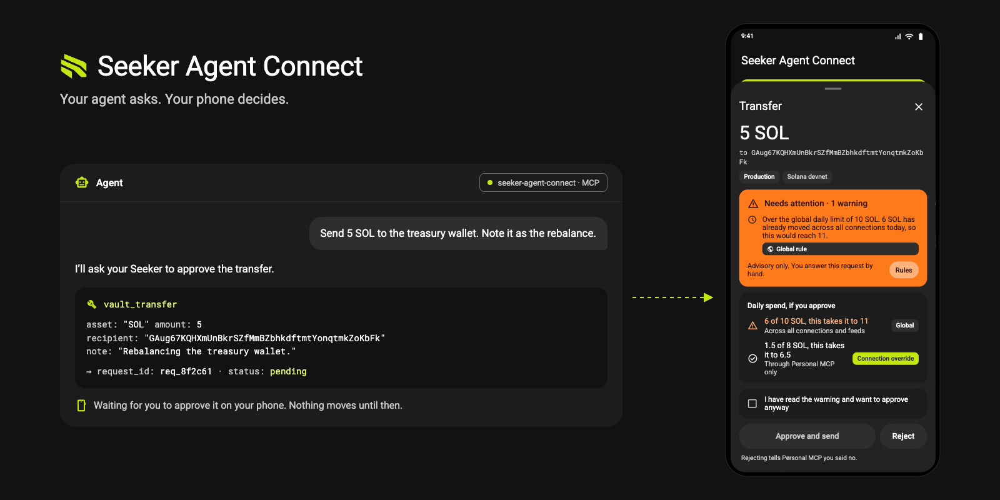
</p>

<p align="center">
  <a href="https://seekeragentconnect.github.io/landing/">Website</a> ·
  <a href="https://seekeragentconnect.github.io/docs/getting-started">Documentation</a> ·
  <a href="https://github.com/SeekerAgentConnect/sac/releases/latest">Get the app</a>
</p>

## Table of contents

- [⚡️ Highlights](#️-highlights)
- [✨ Features](#-features)
  - [📥 Unified inbox](#-unified-inbox)
  - [🔗 Connections and pairing](#-connections-and-pairing)
  - [📈 Feeds, swaps and predictions](#-feeds-swaps-and-predictions)
  - [🤖 Agents and SKR staking](#-agents-and-skr-staking)
  - [🔔 Live updates and notifications](#-live-updates-and-notifications)
- [🧩 How it works](#-how-it-works)
- [🚀 Getting started](#-getting-started)
- [📦 Components](#-components)
- [🛠️ Development](#️-development)
- [🔐 Security](#-security)
- [📚 Documentation](#-documentation)
- [🙌 Contributing](#-contributing)
- [📄 License](#-license)

## ⚡️ Highlights

- 🙋 **You stay in control.** Every request or signal waits for your decision on the phone.
  Actions that need a signature also require wallet confirmation. Nothing is signed automatically.
- 🔍 **The phone checks the transaction.** SAC decodes and checks supported transactions on-device
  before opening the wallet; server descriptions do not replace those checks.
- 🤖 **Bring your agents and services.** Connect an MCP client such as Hermes, OpenClaw or Claude,
  or build a direct server with the shared protocol and TypeScript Server SDK.
- 📡 **Direct requests, Public and Restricted feeds.** Pair a server for private requests and
  results, or follow signals from a publisher. Restricted feeds admit only approved subscribers.
- 🧱 **Build on an existing mobile app.** Developers provide the service; SAC provides the inbox,
  review, notifications and wallet interaction. The SAC team operates the feed gateway and push relay.
- 📏 **Rules you set.** Global and per-connection rules flag requests outside your preferences.
  They never approve or sign for you.

## ✨ Features

### 📥 Unified inbox

Everything your agents and feeds ask for lands in one queue. Open a request to see what it does,
who sent it and whether it matches your rules.

<p align="center">
  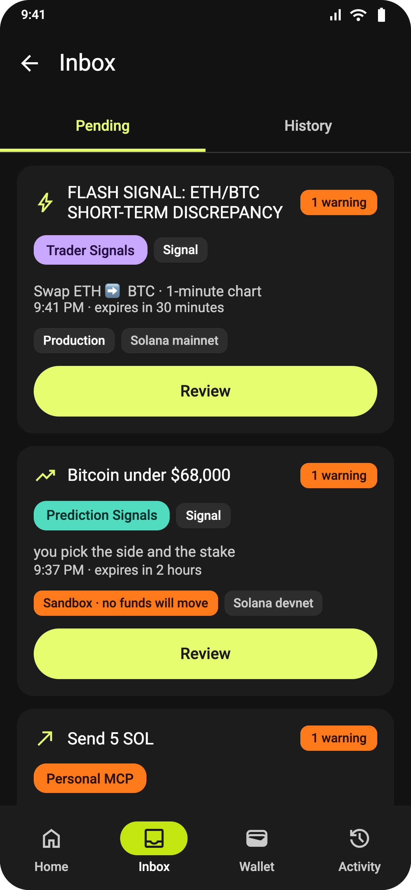
  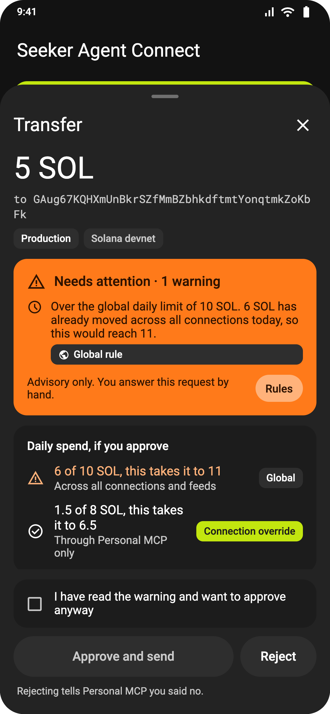
  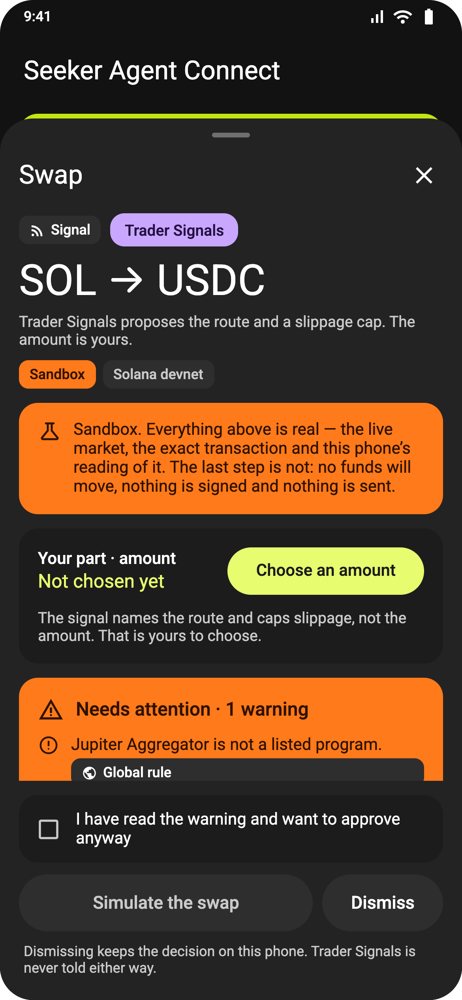
</p>

### 🔗 Connections and pairing

Pair a direct server using its one-use link or QR code, or add a feed link from its publisher.
Feeds can be **Public** or **Restricted**. For a Restricted feed, prove wallet ownership by signing
an access message and wait for the publisher to approve your device. Each connection has its own
status, history, rules and wallet: save several wallet profiles (different accounts, wallet apps, or
the same address on Mainnet, Devnet or Testnet) and choose one per connection from those on a
network its server supports.

<p align="center">
  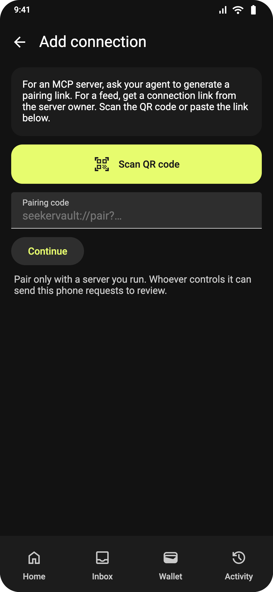
  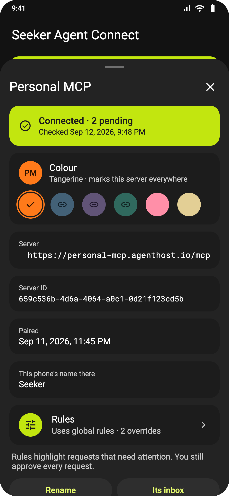
  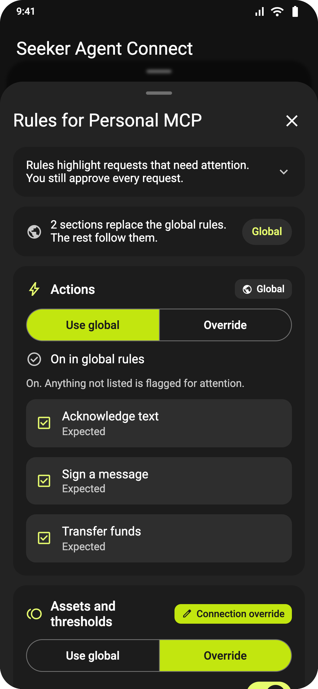
</p>

### 📈 Feeds, swaps and predictions

Built-in Jupiter plugins turn a feed signal into a swap or a prediction-market order with your own
amount and side. The app reads the route and the transaction before handing it to the wallet.

Feeds may offer **Sandbox** or **Production** environments. Sandbox lets you review and simulate
without signing or sending; it is not a Solana test network. Production opens the wallet after
approval. Publishers can use Restricted feeds for paid or private communities; billing and
membership decisions stay in their own systems.

<p align="center">
  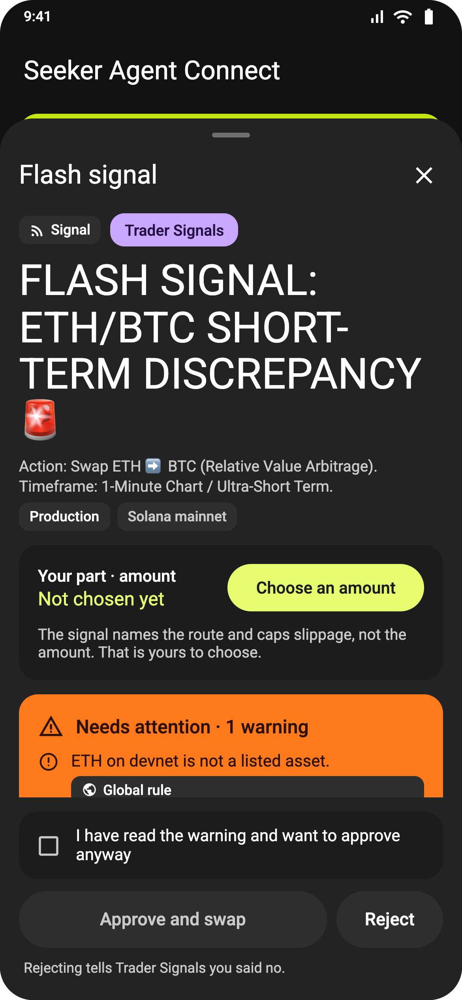
  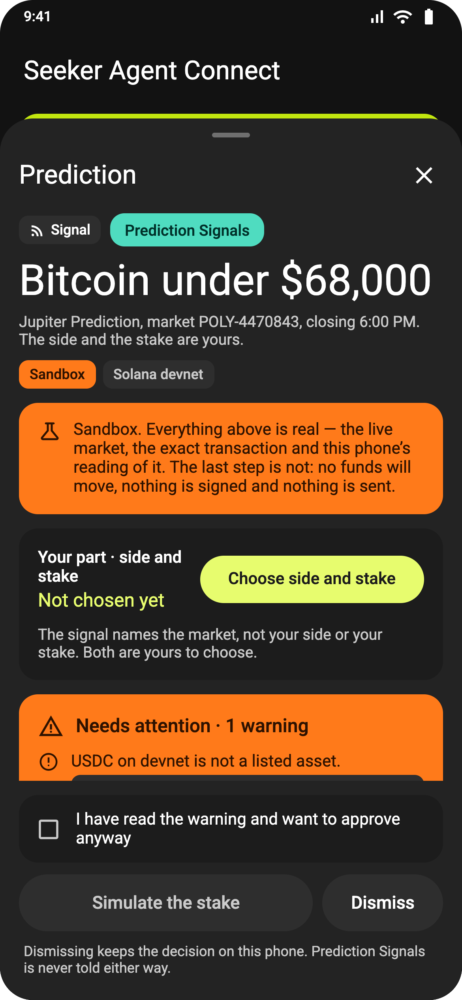
  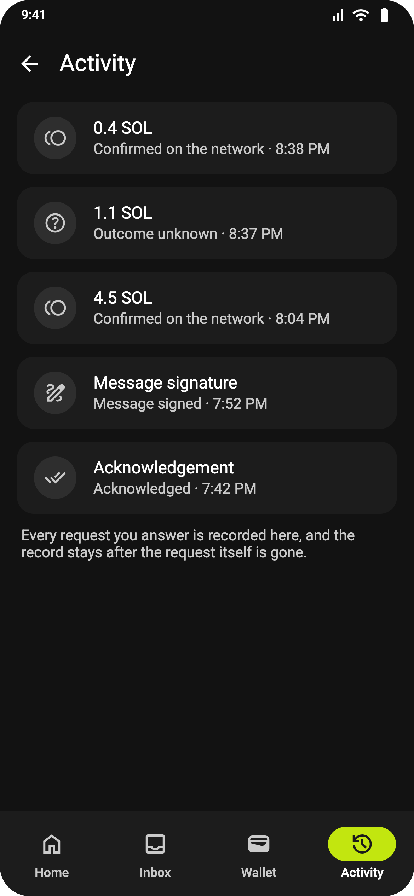
</p>

### 🤖 Agents and SKR staking

The general MCP server supports acknowledgements, message signing and SOL/SPL-token transfers.
Your agent creates a request with tools such as `vault_transfer` or `vault_sign_message`, then
reads its outcome with `vault_get_request`. Read-only tools such as `vault_get_address` do not
create approval requests.

The separate **SKR Staking MCP server** reads staking positions and prepares stake, unstake,
cancel-unstake and withdrawal requests on mainnet. You review each operation in SAC and confirm
it in the wallet. Swaps and prediction orders are provided through feeds.

<p align="center">
  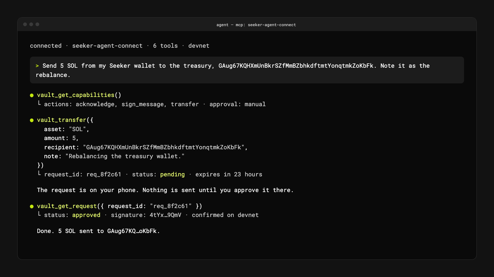
</p>

### 🔔 Live updates and notifications

While SAC is open, supported direct servers and the gateway stream new requests, signals and
status changes into the app. In-app banners take you to the relevant item. When SAC is in the
background, configured push delivery sends a wake-up so the app can fetch current state.
Opening a notification never approves anything.

See [Notifications and live updates](https://seekeragentconnect.github.io/docs/notifications)
for requirements and fallback behavior.

## 🧩 How it works

<p align="center">
  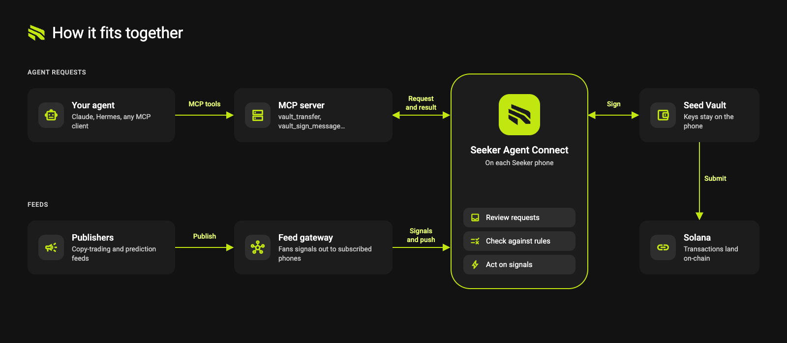
</p>

There are two connection modes:

| Mode | Path | Results |
| --- | --- | --- |
| **Direct** | Agent or service → your direct server ↔ SAC | Requests and results travel directly between the server and its paired phone |
| **Feed** | Publisher → SAC gateway → subscribers | Each subscriber's choices, amounts and results stay on their phone |

**Public** and **Restricted** are feed access policies, not additional connection modes. A
Restricted publisher decides who may read; the gateway enforces access for approved devices.
Both policies use the same publication and delivery path.

A direct server needs no gateway to pair or serve requests. It can optionally use the SAC push
relay for content-free wake-ups; private request content and results still travel directly.
When a reviewed action needs a signature, SAC opens the wallet app of the connection's own wallet
profile, such as Seed Vault Wallet, through Mobile Wallet Adapter. Acknowledgements and Sandbox simulations finish without signing.

Read [How it works](https://seekeragentconnect.github.io/docs/how-it-works) for the architecture
and data boundaries, or [Build your own server](https://seekeragentconnect.github.io/docs/direct-or-feed)
to choose an integration path.

## 🚀 Getting started

| I want to… | Start here |
| --- | --- |
| Use SAC on my phone | [Get the app](https://github.com/SeekerAgentConnect/sac/releases/latest), then [connect a wallet](https://seekeragentconnect.github.io/docs/wallet-setup) |
| Connect my AI agent | [General MCP server](https://seekeragentconnect.github.io/docs/mcp-quickstart) and [agent configuration](https://seekeragentconnect.github.io/docs/connect-your-agent) |
| Manage SKR staking | [SKR Staking MCP server](https://seekeragentconnect.github.io/docs/skr-staking-server) |
| Build my own direct server | [Direct Server SDK](https://seekeragentconnect.github.io/docs/server-sdk) |
| Publish signals to an audience | [Publish your first feed](https://seekeragentconnect.github.io/docs/publish-your-first-feed) |
| Restrict access to a feed | [Restricted feeds](https://seekeragentconnect.github.io/docs/restricted-feeds) and [subscriber access](https://seekeragentconnect.github.io/docs/manage-subscriber-access) |

The MCP servers are standalone HTTP services available through npm, Docker or a source checkout.
[docs/guides/installation.md](docs/guides/installation.md) lists the published npm packages, the
`ghcr.io/seekeragentconnect` images and the signed APK. Follow the matching guide for
configuration, credentials, pairing and a phone-reachable endpoint; running an MCP command alone is
not a complete setup.

The **Direct Server SDK** implements direct connections. Feed publishers use the gateway's
publisher API from any backend; the Go publisher library in this repository powers the examples.

For feeds or optional direct-server push, follow
[Connect to the SAC gateway](https://seekeragentconnect.github.io/docs/connect-to-gateway).
The SAC team operates the gateway; integration does not require deploying or administering it.

## 📦 Components

| Component | Path | Description |
| --- | --- | --- |
| 📱 `android` | [`apps/android`](apps/android) | Kotlin/Compose app: connections, review and wallet flows, policies, history |
| 🌐 `gateway` | [`services/gateway`](services/gateway) | SAC-operated feed delivery, Public/Restricted access enforcement and optional direct-server push relay |
| 📜 `protocol` | [`packages/protocol`](packages/protocol) | Shared Protobuf/Buf contracts with generated Kotlin, TypeScript and Go bindings |
| 🧰 `server-sdk` | [`packages/server-sdk`](packages/server-sdk) | TypeScript SDK for direct servers: pairing, durable requests, phone APIs |
| 🧩 `publisher-support` | [`packages/publisher-support`](packages/publisher-support) | Go library for feed publication and Restricted subscriber access |
| 🤖 `mcp-server` | [`servers/mcp-server`](servers/mcp-server) | Self-hosted MCP server that connects an agent to the phone |
| 🥩 `mcp-skr-staking` | [`servers/mcp-skr-staking`](servers/mcp-skr-staking) | MCP server for SKR staking; builds unsigned transactions only |
| 📊 `demo-signals` | [`examples/demo-signals`](examples/demo-signals) | Restricted feed example: copy-trading signals and subscriber access management |
| 🔮 `demo-prediction` | [`examples/demo-prediction`](examples/demo-prediction) | Example feed: prediction markets |
| 🧪 `test-agent` | [`tools/test-agent`](tools/test-agent) | Minimal MCP client for trying things without an LLM |
| 🏋️ `loadtest` | [`tools/loadtest`](tools/loadtest) | Load, isolation and failover harness for the gateway |

## 🛠️ Development

For Node development, use Node.js 24.21.0 (`.nvmrc`) and pnpm 12.3.4
(`package.json`). Go components require the version in their `go.mod`; Android development uses
SDK Platform 37, Build-Tools 36.0.0 and a Gradle daemon pinned to Temurin 21.
See the [toolchain guide](docs/development/toolchain.md) for setup and exact pins.

```bash
nvm install && corepack enable pnpm
pnpm install --frozen-lockfile

pnpm check              # formatting, lint, type checks, TypeScript tests
pnpm check:android      # Kotlin formatting, unit tests, lint, debug APKs
pnpm check:gateway      # feed gateway (Go)
pnpm check:demos        # example feeds (Go)
pnpm build              # SDK, MCP server and test agent
```

Run the general MCP server locally:

```bash
cp .env.example .env
# Generate two different tokens and set MCP_TOKEN and PHONE_TOKEN in .env.
openssl rand -hex 32    # run once for each token
pnpm build:server-sdk
pnpm dev:mcp-server     # leave running: /mcp, the phone API and /healthz
```

In another terminal, after installing the app and making the server reachable from the phone:

```bash
pnpm pair              # open or scan the one-use pairing link in SAC
pnpm agent ack "Hi" --wait  # acknowledge on the phone; no wallet signature needed
```

For the complete device setup, including USB forwarding for local development, follow the
[MacBook + Seeker quickstart](docs/guides/macbook-seeker-quickstart.md). A remote phone needs a
reachable HTTPS endpoint; direct live updates require HTTP/2 end to end.

More commands (`pnpm generate`, `pnpm test:integration`, `pnpm test:load`, `pnpm agent …`) are in
`package.json` and [`docs/development/`](docs/development).

## 🔐 Security

- SAC and its servers never hold your wallet's private keys. Wallet signing follows your explicit
  approval; connecting a source grants no spending authority.
- Supported transactions are decoded and checked on the phone before the wallet opens. Rules
  provide warnings, not automatic approval.
- Direct servers store their own requests and returned results. Feed subscribers' decisions,
  amounts and outcomes stay on their phones.
- The gateway retains feed publications for delivery and catch-up, plus the access and push-routing
  data needed for Restricted feeds and optional wake-ups. Restricted publishers verify wallet
  ownership and manage eligibility; the gateway uses opaque access references.
- Push carries a wake-up, not private request content or approval. It requires configuration and
  Android notification permission.

Read the full model in [`docs/security.md`](docs/security.md). Please report vulnerabilities
privately through [GitHub security advisories](https://github.com/SeekerAgentConnect/sac/security/advisories/new)
rather than public issues.

## 📚 Documentation

| | |
| --- | --- |
| 🌐 [Public documentation](https://seekeragentconnect.github.io/docs/getting-started) | App setup, MCP servers, direct integrations, Public/Restricted feeds and recipes |
| 📖 [Repository guides](docs/guides) | Source-level setup, development and operational reference |
| 🔌 [Integrations](docs/integrations) | Hermes, Claude, Jupiter and other external services |
| 🧠 [Wiki](docs/wiki) | How each feature works |
| 📡 [Protocol](docs/protocol.md) | The wire contract between servers and the app |
| 🧑‍💻 [Development](docs/development) | Toolchain, testing, releases |
| 📝 [Changelog](docs/changelog) | What changed, day by day |

## 🙌 Contributing

Issues and pull requests are welcome. Before opening a PR, run `pnpm check` and the checks for
the components you changed (`pnpm check:android`, `pnpm check:gateway` or `pnpm check:demos`).
The [CI workflow](.github/workflows/ci.yml) defines Node, Go, Android and emulator checks;
it currently runs through manual dispatch.

## 📄 License

[MIT](LICENSE) © Renat Berezovsky
