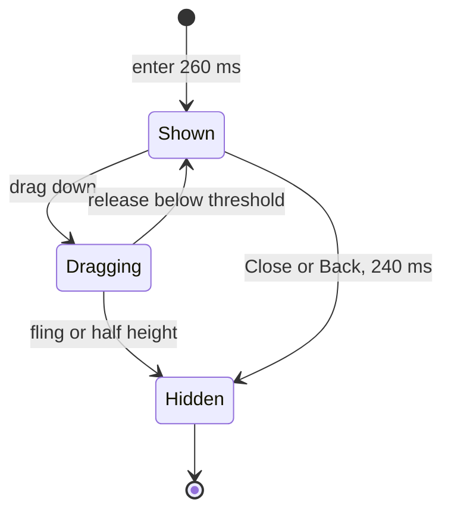

# Sheet motion

This is the runtime contract for how every graph-owned bottom sheet moves and sizes. Destinations
and stacks stay in [`navigation.md`](./navigation.md). Static screen captures do not specify
timing, wrap height, or gesture dismissal.

The host is `SeekerSheet` in `:app`. Library compositions (`SheetScaffold`, review, connection,
rules, asset, address, wallet hand-off) size to their content inside that host. They must not
force `fillMaxSize` / `fillMaxHeight`.

## Height

The sheet hugs its content. The maximum is the viewport minus **150 dp from the top** of the
screen (and any stack recess on the bottom). Short content stays short. Content taller than the
max scrolls inside the sheet; the grabber, title, and pinned actions stay put.

The 150 dp inset is the padded host, not extra padding on the sheet surface. A wrap-content sheet
sits on the bottom of that host.

## Enter, exit, and stack

| Motion | Duration | Easing |
| --- | --- | --- |
| Enter (slide up) | 260 ms | cubic-bezier(0.2, 0, 0, 1) |
| Exit (slide down) | 240 ms | cubic-bezier(0.3, 0, 0.8, 0.15) |
| Stack promote / backplate | 300 ms | enter easing |

The animated layer is the sheet itself. Its travel distance is the sheet's own height, not the
screen height. Animating a full-screen overlay with the sheet pinned to the bottom makes a short
sheet appear only at the end of the 260 ms.

When a sheet is stacked over another, the active sheet's top inset eases from 136 dp (150 − 14)
to 150 dp and its bottom recess from 12 dp to 0. Each backplate is inset 14 dp less from the top
per depth (floor 30 dp) and recessed 12 dp × depth from the bottom. Tapping a backplate still
pops every sheet above it.

## Dismiss

Close and Android Back run the 240 ms exit, then pop the top sheet.

A downward swipe on the open sheet follows the finger. Nested scroll applies: a scrolling body
at its top yields further downward drag to the sheet; dragging up while the sheet is pulled down
returns the sheet first. Direct drag on the grabber or non-scrolling chrome also moves the sheet.

On release:

- settle to dismissed if downward velocity is at least 125 dp/s, or if the sheet has moved at
  least half its height without an upward fling;
- otherwise snap back to shown, using the 240 ms exit easing.

A completed swipe uses the same close path as Back. It does not invent a second navigation stack.

## Implementers

- Cap height with the host's 150 dp top padding. Do not stretch the sheet surface to that cap.
- Measure and animate the sheet, not a `fillMaxSize` wrapper.
- Keep sheet content `fillMaxWidth` with `weight(1f, fill = false)` on a scrolling body so overflow
  scrolls and short content wraps.
- Do not add a translucent scrim. The gap above the sheet is the destination underneath.
