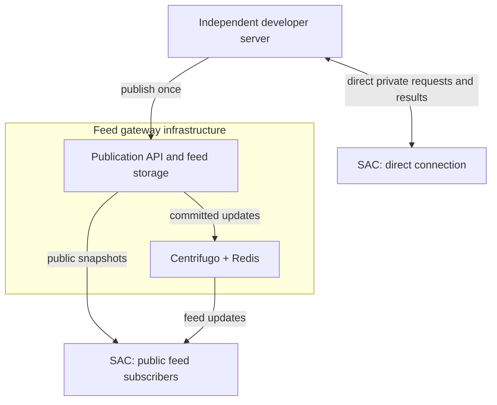

# Architecture

Seeker Agent Connect (SAC) is an Android application for reviewing requests from independent servers and authorizing supported actions through an external wallet. The protocol is server-agnostic; AI and MCP are optional integrations.

## Architecture decision and implementation status

The agreed architecture has **two connection modes: direct private connections and public feeds through a shared gateway**. Gateway-private routing is being removed: it duplicates the private direct path and adds unnecessary device bindings, request storage and result routing to the feed gateway.

This document defines the target boundaries. This documentation change does **not** remove the existing implementation. Until the cleanup is complete, the repository still contains `gateway_private`, gateway invitations, private device APIs and historical directory names. Their presence is migration work, not a third supported architectural direction. Linked detailed documents may still describe that implementation and must be reconciled during cleanup.

## Product and service boundaries

| Component | Responsibility | Runs where |
| --- | --- | --- |
| SAC Android app | Connections, Inbox, owner inputs, inspection, rules, manual approval, wallet invocation and local history | User's phone |
| Shared protocol | Request identity, lifecycle, action capabilities, manifests and transport contracts | Implemented by compatible clients and servers |
| Server SDK | Help developers implement the supported direct or feed integration; expose only capabilities actually implemented | Developer's backend |
| Independent server | Business logic and request creation; private results for direct connections, or common publications for public feeds | Developer/user-operated host |
| Feed gateway | Accept a publication once; store and distribute it to subscribers | Shared infrastructure |
| Bundled client plugins | Prepare and inspect supported actions, such as Jupiter operations | Compiled into SAC |
| External wallet | Hold signing keys and sign/submit explicitly approved operations | Separate wallet application |
| External providers | Jupiter execution data, Solana RPC reads and optional Firebase wake-ups | Provider infrastructure |

An independent server is a role, not an extra service that every developer must install beside their backend. The existing MCP server is one implementation of that role. The historical name `sidecar` does not imply another required component.

The Go Server SDK currently lives in `publisher/sdk/`; its private-gateway APIs are part of the removal work. Do not describe a replacement direct SDK API as already implemented. The Android build currently has `:app` and `:designsystem`; a separately packaged Android SDK remains future work.

## Two connection modes

The phone boxes represent connection roles. One physical phone can hold direct connections and public subscriptions together. The diagram shows the two architectural options; an individual implementation or manifest need not serve both.

| | Direct | Public feed |
| --- | --- | --- |
| Purpose | Private requests to a paired device | One publication delivered to many subscribers |
| Phone communicates with | Independent server | Feed gateway and its streaming endpoint |
| Device binding | Managed by the independent server | No per-subscriber binding to the publisher |
| Source data | Device-addressed requests | Identical public content for subscribers |
| Owner inputs and decisions | Reviewed locally; declared results return to the originating server | Stay on the device |
| Gateway required | No | Yes |
| Typical implementation here | User's MCP server | CopyTrading and Prediction demo servers |

### Direct private connection

The independent server owns pairing, authenticated request access, durable request state and returned results. SAC connects to that server directly. The server must expose a compatible endpoint reachable by the phone.

An AI agent calls the MCP adapter of the user's server. That adapter asks the server's request core to create/read/cancel requests; the phone reviews those requests and returns outcomes to the same server. MCP is not part of the phone-to-server contract and does not grant approval authority.

Pairing links and QR codes belong to direct onboarding. A server can hand the connection information to its user through a website, bot or CLI. A hosted invitation page is not a reason to relay all subsequent private traffic through the feed gateway. Cleanup must preserve working direct pairing and explicitly address any link/QR usability gap without restoring private gateway routing.

The existing direct implementation's supported device count must be documented accurately. Removing gateway-private bindings must not silently claim that direct multi-device support already exists.

### Public feed through the gateway

The developer's server publishes a public request or signal once. The gateway retains the authoritative publication and distributes updates to many phones, so the developer's backend does not manage subscriber connections.

Phones read snapshots and stream updates from the gateway. They do not pair with or contact the publishing server. The public feed has no per-device invitation, user mapping, private device credential or result-upload channel. Each phone keeps its subscriptions, parameters, decisions and outcomes locally.

The publisher can revise or withdraw its source publication. An owner's dismissal or execution does not change it for other subscribers. Publication identity and revisions make duplicate delivery safe.

The gateway owns publication validation, publisher authentication, durable feed state, snapshots, streaming tickets and optional feed push delivery. Centrifugo and Redis provide fan-out and bounded recovery; their cache is not the authoritative database. FCM is a best-effort wake-up to fetch current state.

Public-feed anonymity here means no application-level subscriber binding or returned owner outcome at the publisher. It is not a claim that network providers or infrastructure cannot observe transport metadata.

## The three example servers

| Server | Connection mode | Role |
| --- | --- | --- |
| CopyTrading demo | Public feed | Publishes swap signals |
| Prediction demo | Public feed | Discovers and publishes prediction markets |
| User's MCP server | Direct | Accepts agent requests and returns the owner's results |

These are three independent request sources, not three required SAC backend services. CopyTrading and Prediction are optional reference applications maintained in this repository. The MCP server is the user's direct server; there is no additional mandatory “sidecar” between it and the app.

Jupiter client plugins and demo servers are different components. The demos publish opportunities; the bundled plugins prepare and inspect execution data on the phone. Jupiter itself is an external provider.

## Inside the Android application

The app owns connections and encrypted credentials, wallet selection and authorization, owner inputs, policy assessment, review, explicit approval and durable local outcomes. Its composition root currently registers `JupiterSwapPlugin` and `JupiterPredictionPlugin`.

Plugins declare parameters, obtain execution data and inspect bytes as typed facts. Core retains policy evaluation, approval, persistence and wallet invocation. Plugins are compiled into the application; connecting a server never downloads executable code. Missing or incompatible plugins make an operation unsupported.

Acknowledgement, message signing and direct transfers retain their core execution paths. A plugin being present does not mean every connection mode supports every action.

Sandbox and Production are execution environments, separate from the Solana network. Sandbox uses review and simulation without signing or submitting. The shipped feed demos use sandbox; this is not a Jupiter devnet deployment. Direct requests expecting actual signatures must not receive simulated success.

See [client plugins](wiki/client-plugins.md), [policy](policy.md) and [environments](wiki/environments.md) for the detailed boundaries.

## Approval, signing and results

- The app and servers hold no wallet signing keys. An external MWA-compatible wallet signs and submits.
- Policy assessments never replace explicit owner approval.
- Review binds the source identity/revision, owner choices, selected wallet/network and exact prepared bytes. Changed content requires a new review.
- Direct transfers retain the server-accepted preparation/approval sequence before wallet invocation. Public-feed execution has no server approval acknowledgement or result upload.
- One wallet interaction is serialized with other wallet operations. Its outcome is persisted before any result delivery retry.
- Retrying delivery, restarting the app or receiving duplicate updates never re-signs or re-submits a transaction.
- An uncertain submission remains unresolved; it is not retried as a failure. Submission and on-chain confirmation are distinct, and confirmation claims must identify the checked network result.

The direct server owns private request lifecycle and received results. The phone owns its local execution record. The feed gateway and public publisher own only the source publication, never the subscriber's decision.

See [protocol](protocol.md), [security](security.md) and [wallet lifecycle](testing/wallet-lifecycle.md).

## Updates and notifications

Direct foreground updates use the server's authenticated update service; app resume, manual refresh and background synchronization reconcile the same durable state. The current direct implementation uses bidirectional gRPC plus unary Sync.

Public feeds use gateway snapshots and Centrifugo streaming with revision checks and snapshot recovery when replay continuity is lost. Feed delivery is at-least-once, so applying the same revision twice must not repeat an action.

Optional FCM wake-ups initiate authoritative reads; they do not contain an approval or authorize execution. No foreground stream, background worker, notification or retry may open a wallet or approve a request.

See [Firebase](guides/firebase.md) and [broadcast gateway](wiki/broadcast-gateway.md). Private-gateway portions of existing supporting documents are pending removal.

## Repository naming and deployment cleanup

Current directory names describe historical implementation choices and are not the desired product vocabulary:

| Current path | What it actually contains | Cleanup direction |
| --- | --- | --- |
| `android/` | SAC app and design system | Keep the application boundary clear |
| `proto/` | Shared contracts, including the unwanted private-gateway additions | Keep direct/feed contracts; retire private-gateway fields/services safely |
| `sidecar/` | The user's direct request server with an optional MCP adapter | Use a clear direct/MCP server name; do not present it as an extra mandatory service |
| `gateway/` | Deployment assets and reverse proxy for the direct server, including TLS/OAuth configuration | Move/name as direct-server deployment infrastructure |
| `broadcast/` | Shared Go feed gateway, currently also containing unwanted private routing | Establish one canonical feed-gateway name and remove private routing |
| `publisher/` | Demo server implementations plus reusable Go Server SDK | Clearly separate SDK code from examples in layout and documentation |
| `deploy/server/` | Shared infrastructure, optional demo overlay and optional direct-server overlay | Preserve independent deployment with consistent names |
| `test-agent/` | Developer MCP client | Keep as a test/development tool |

**There is one shared feed gateway in the target architecture.** Today's `gateway/` folder is not a duplicate implementation of `broadcast/`: it contains reverse-proxy/deployment configuration for the direct server. Resolve the confusing naming by relocating or renaming those assets, not by deleting TLS/OAuth support or merging private direct traffic into the feed gateway.

The cleanup task must settle and apply the final directory names consistently across code imports, generated code, build commands, Docker images, Compose, CI, scripts, examples and documentation. Directory renaming alone is not architectural cleanup.

The base shared deployment must run without either demo or the direct server. Both feed demos can run independently. The direct MCP server must run without the shared feed gateway, Centrifugo or Redis. Renaming deployment services must preserve existing direct pairing data, credentials, databases and volumes through an explicit migration.

## Removing the third mode

The implementation cleanup removes gateway-private invitations, redemption, private device bindings and credentials, private request/result routing and associated SDK/client/server APIs. Remove their configuration, UI routes, generated bindings, examples and tests or replace tests with meaningful assertions of the two-mode boundary.

Do not remove public publisher credentials, feed references, stream tickets, publication storage or direct pairing. For stored gateway-private connections, define an explicit retirement path: explain that a fresh direct pairing is required and prevent further execution. Never silently convert credentials or connections between modes. Preserve local history and unaffected direct/feed data.

The architecture PR changes this document only. Runtime cleanup, supporting documentation and migration verification belong to [SEE-128](https://linear.app/seekeragentwallet/issue/SEE-128/simplify-architecture-to-direct-public-feed-remove-private-gateway).
