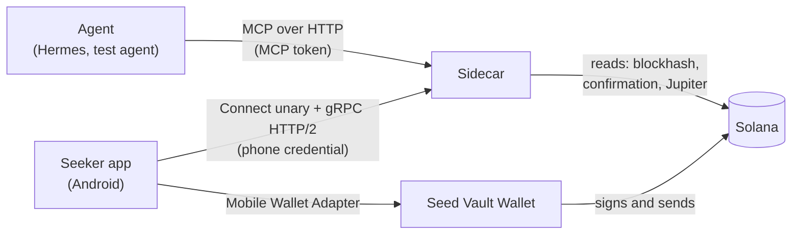
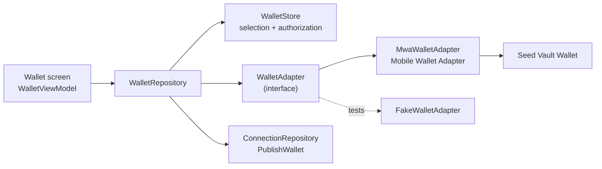
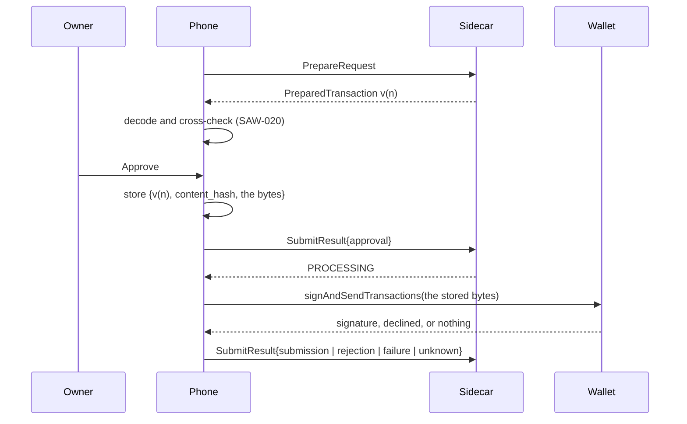
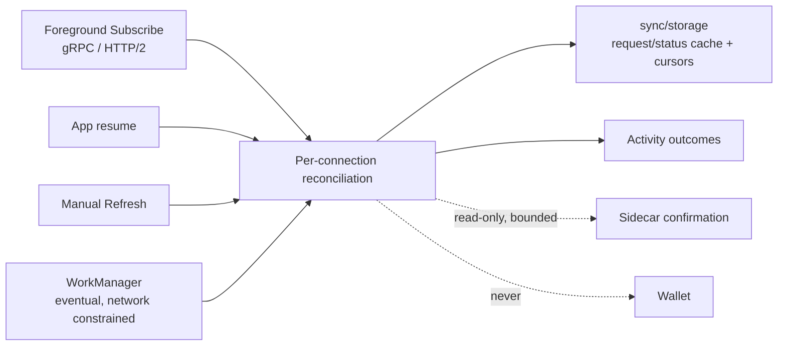
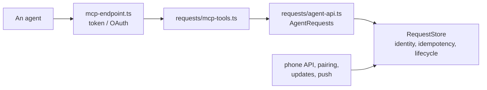
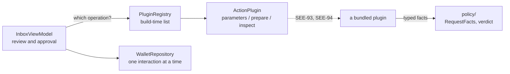

# Architecture

Seeker Agent Connect has four parts: the agent, the sidecar, the Android app, and the wallet. This page covers what each part owns, how they talk, and which safety rules hold across them. The wire contract is in [`protocol.md`](protocol.md), and the plan in [`RFC.md`](../RFC.md).

## Components

| Component | Owns | Never does |
| --- | --- | --- |
| **Agent** | Proposing actions and reading their results | Approve, sign, or see the phone's policy |
| **Sidecar** (`sidecar/`) | The MCP and phone endpoints. From SAW-010 and SAW-011 on, it also holds requests and their states, prepared transactions, results, idempotency records, and pairing; Stage 5.2 adds durable update revisions/cursors and bounded snapshots. | Hold keys, sign, decide for the user, or execute anything on its own after a restart |
| **Android app** (`android/`) | Connections and their credentials, policies and their assessments, the user's decision, invoking the wallet, results the sidecar hasn't acknowledged yet, and Stage 5.2's minimal server-state cache/sync metadata | Sign without the user's approval, or trust the agent's description over the transaction's contents |
| **Seed Vault Wallet** | Keys, signing, and sending | Know anything about Seeker Agent Connect |

### The wallet adapter boundary

From SAW-015 the app reaches the wallet through one interface, `wallet/WalletAdapter.kt`, and nothing else in the app talks to a wallet library.

- **`WalletAdapter` has four operations,** `connect(network, authToken)`, `disconnect(authToken)`, `signMessage(message, wallet, authToken)` (SAW-016), and `signAndSendTransaction(transaction, wallet, authToken)` (SAW-021). Each answers with one of a small set of outcomes: connected, signed, or sent; no wallet, declined, the authorization expired, the network isn't served, or a failure. Sending has one more, `Unknown`, because a transaction can reach the network and a message can't: see [Approval binding](#approval-binding). Signing answers with a `SigningAnswer`, which carries the authorization the wallet reported alongside the outcome, since a wallet may replace this app's while it signs. The tests drive a `FakeWalletAdapter`, so no wallet app and no activity are needed to cover every outcome.
- **`MwaWalletAdapter` is the only file that imports the Mobile Wallet Adapter client.** It runs the wallet from the activity's `ActivityResultSender`, which `MainActivity` registers in `onCreate` and clears in `onDestroy`. There is no dedicated wallet activity and no foreground service. A rotation destroys one activity and creates another, so the adapter waits briefly for the next screen's sender rather than failing a call the owner just started, and only the activity that registered a sender clears it (SAW-017).
- **The app never creates a wallet or holds a key.** It learns a public address and a wallet authorization token. The address goes to each paired sidecar; the authorization stays on the phone, encrypted under the Keystore key, and never reaches a sidecar, a log, or a backup.
- **The binding is explicit.** The owner picks the network, and the app publishes exactly the address and network the wallet returned. A sidecar with no binding answers `vault_get_address` with `WALLET_NOT_CONNECTED`; it never generates an address.
- **Signing is reached only through the owner's tap (SAW-016).** The inbox stores the approval, sends it, and only then calls `WalletRepository.sign`, which asks the wallet for the selection the owner reviewed and refuses anything else. The signature comes back through the same boundary, and the sidecar verifies it against the request's wallet; see [`protocol.md`](protocol.md#message-results).
- **One wallet call per request, and delivery is separate from it (SAW-017).** `InboxViewModel.approve` and `InboxViewModel.approveTransfer` are the only callers of `sign` and `signAndSend`; a transfer takes that lock through `WalletRepository.withWallet` before it commits its approval, so the wait for another wallet interaction happens before anything is approved and the blockhash window is re-checked on the wallet's side of it; what the wallet did is stored before it's sent, and `ConnectionRepository.deliver`, which every retry goes through, reaches a sidecar and never a wallet. An answer that never arrived is recorded as unresolved; see [`testing/wallet-lifecycle.md`](testing/wallet-lifecycle.md).
- **One wallet interaction at a time.** Every operation takes `WalletRepository`'s lock, so a signature asked for while a transaction is in front of the owner waits its turn rather than opening a second wallet screen.

### Approval binding

A transfer reaches the wallet only through the owner's explicit approval of the preparation this phone inspected and showed them (SAW-021). Four things are bound together, and all four are checked before anything happens.

- **The request**, by connection and request ID.
- **The preparation**, by `version` and `content_hash`. The sidecar refuses an approval that doesn't name the latest version, that carries another hash, or whose blockhash window has almost run out, with `STALE_PREPARATION`. The phone then reads the request again and the owner reviews the new version; an approval is never carried over to a transaction they didn't see.
- **The wallet and network**, checked against the selection the screen showed and the one the phone holds now. Either having changed stops the approval.
- **The bytes**, stored on the phone before the wallet is opened. `signAndSendTransactions` is handed those bytes, never bytes fetched again, so a sidecar that rebuilt the transaction in between can't substitute one.

**The sidecar is the commit point.** `ConnectionRepository.approveTransfer` returns only once the sidecar has accepted the approval and moved the request to PROCESSING. An approval it didn't accept is deleted rather than kept: nothing was approved anywhere, no wallet was opened, the request is still the sidecar's, and the owner reviews a fresh preparation. That is why an approved transfer with no wallet answer can only mean one thing — the wallet had it — which is what makes reporting UNKNOWN honest.

**Nothing unverified reaches the wallet.** Only a preparation whose inspection came back `Verified` is offered for approval at all, and `InboxViewModel.approveTransfer` checks it again before sending anything. This is input validation, not a policy verdict, and the two are judged in that order: validation decides what is executable, and a policy can only add reasons to read ([`policy.md`](policy.md#precedence)). Stage 5 defines, evaluates, edits, reviews, and exercises the rules in SAW-025 to SAW-029. Stage 5.1 adds global defaults, explicit connection overrides, two daily scopes, sourced review, and the combined acceptance path in SAW-043 to SAW-047 — always under the facts and never in place of them ([`security.md`](security.md#verification-versus-advisory-rules)).

### The update convergence boundary

SAW-048 defines one production update service, separate from the Stage 1 diagnostic, and SAW-049 backs it with the sidecar's durable mutation sequence and frozen snapshots. The foreground stream, app resume, manual Refresh, and later WorkManager runs all converge through the same reconciliation operation instead of maintaining four versions of request state.

- **One authenticated logical stream per usable connection, owned by app foreground state.** It is not tied to a screen, so navigation and rotation do not make competing subscriptions. Background transition, deletion, revocation, and caller cancellation close it; only a later lifecycle owner can reconnect.
- **The stream is notification plus an ordered mutation log, not the source of truth.** A retained cursor replays; restart, history loss, overflow, or an unknown message forces unary `Sync`. Sync freezes a paginated snapshot behind the already-registered stream barrier, so a mutation is in the snapshot or after its cursor on the stream, never between them ([protocol details](protocol.md#stream-start-resume-and-the-snapshot-barrier)).
- **State is connection-scoped and monotonic.** Every wire message repeats the authenticated connection ID; events carry per-request revisions; stale/duplicate events and an older stream generation cannot roll state back. One offline connection cannot stop another.
- **Background means eventual observation only.** WorkManager may run late or not at all, and Force stop suppresses it until the owner opens the app. It performs unary Sync with stored credentials and no Activity. There is no foreground service and no FCM in Stage 5.2.
- **No update path can act.** It can refresh pending requests, reconcile nonterminal Activity records, run a bounded read-only confirmation for an already submitted/unknown transfer, and retry delivery of a result already stored by the phone. It cannot prepare, approve, sign, open a wallet, send, re-execute, or apply a policy verdict.
- **Compatibility is explicit.** Pairing remains version 1 and advertises a versioned gRPC origin. Existing connections discover it with their phone credential. An old sidecar is “upgrade required,” not “offline,” and manual Refresh over the existing unary API remains available.

SAW-053 validates this boundary as a joined system rather than only as isolated units. `Stage52AcceptanceTest` starts real sidecar processes, creates requests through a real MCP client, and drives the production Android repository, lifecycle owner, persistent cache, and headless sync across the real h2c development listener. `GrpcBidiInteropTest` covers cross-runtime bidirectional interleaving and cancellation on that HTTP/2 transport; the sidecar listener tests separately cover TLS/ALPN HTTP/2, frozen pagination, ordering faults, revocation, cleanup, and bounded read-only confirmation. The suite is `pnpm test:updates`; the physical timing and lifecycle cases are in the [Seeker checklist](testing/stage-5-2.md#physical-seeker-checklist-saw-053).

That validation does not turn periodic work into exact notification delivery. In background there is no open stream, and Stage 5.2 has no request-created wake-up. [SEE-73](https://linear.app/seekeragentwallet/issue/SEE-73) adds optional FCM separately; even it is best-effort and cannot bypass Force stop.

SAW-054 opens that stage without adding a new runtime path. The Android Firebase client has an
operator-supplied project configuration or remains dormant; the sidecar constructs a Firebase Admin
sender only for an explicit project ID and Application Default Credentials. SAW-055 adds one
application-scoped registration owner: while any usable connection exists it asks current FCM to
register, then sends each registration/rotation to every sidecar through that connection's own
phone credential. The phone stores no target. Each sidecar stores one private target with the
connection, and revocation deletes it. No request mutation calls the sender and the app still has no
message-receipt, notification, tap, or runtime-permission path in that child.

SAW-056 joins only committed request events to that sender. The app-visible payload is the fixed
pair `kind=request_invalidation`, `version=1`; even connection and request IDs stay out. Same-turn
changes coalesce, undelivered messages share one collapse key and a five-minute TTL, and only a new
PENDING request uses high priority. Android rejects every other payload shape and persists only an
empty-input, unique WorkManager request. That worker calls the bounded synchronization repository
and obtains each sidecar URL and credential from phone storage, not from FCM. It cannot answer a request or
reach a wallet. Consequently the Stage 5.2 convergence authority above remains unchanged when a
push is delayed, dropped, throttled, or disabled. The [Firebase guide](guides/firebase.md) defines
the deployment and off/unavailable cases.

SAW-057 makes the handoff explicit. `FirebaseMessagingService` does only exact-map validation and
the quick WorkManager enqueue; it performs no disk-backed reconciliation or sidecar call inside the
callback budget. FCM collapse and unique work coalesce duplicate hints. At execution time, push and
periodic recovery exclude connections whose foreground stream is already Live, then pass the rest
to the same four-sidecar-bounded repository. That repository still serializes one snapshot per
connection and buffers live events across it, so stream, Refresh, periodic, and push delivery
converge rather than becoming independent writers. Dropping the push path removes only an early
signal: foreground reconciliation and the persisted periodic schedule still read durable state.

SAW-058 derives presentation only after that authoritative worker fetch. It compares the complete
pending-key set before and after Sync, cancels alerts for keys that left PENDING, and posts one
generic private alert for each newly discovered key. The notification contains neither request
content nor a credential; its immutable explicit intent carries only the connection/request IDs
needed for an internal route. That route validates both IDs and performs another authenticated
fetch from the named paired connection before exposing review controls. A current pending request
opens normally, a result this phone already recorded opens with that result, and absent, removed,
revoked, or unreachable state gets a non-authorizing explanation. The permission decision governs
presentation only and is not an input to registration, foreground streams, Sync, or either worker.

### The server adapter boundary

From SEE-87 the sidecar's MCP interface is one optional adapter over the request core rather than
the core itself. [`wiki/mcp-adapter.md`](wiki/mcp-adapter.md) is the full account, including the
distinction that makes Stage 7.1 work: the Node sidecar is the owner's **private** server, and the
Go publisher templates are a developer's **broadcast** servers that speak no MCP at all.

- **`AgentRequests` is the whole of what an adapter may ask for:** store a request, read one,
  withdraw one, answer a retry, read the wallet binding, and — only with a chain endpoint
  configured — check an asset and read what became of a submitted transaction.
- **It forwards and decides nothing.** Idempotency, validation, the lifecycle, the pending limit
  and result handling stay in the core, so the agent-facing error codes are the same whichever
  adapter is asking.
- **It authenticates nobody.** A credential belongs to the adapter that accepts it; the phone's
  credential still reaches `RequestService` and nothing else.
- **`MCP_ENABLED=false` serves no `/mcp`,** needs no MCP setting, and changes nothing about pairing,
  the phone API, updates, push, stored request identity, or the rule that the wallet is asked only
  after the owner approves.

### The client plugin boundary

From SEE-86 the app has one place a bundled *client plugin* can be registered, so an action it doesn't carry out itself — a Jupiter swap (SEE-93), a Jupiter prediction submission (SEE-94) — can be written without touching a transport, a policy, the wallet, or storage. [`wiki/client-plugins.md`](wiki/client-plugins.md) is the full account, including what a later SDK extraction would still have to do.

- **A plugin owns three things:** what parameters the operation leaves to the owner, where the execution data comes from and the exact bytes that would be signed, and what those bytes establish when read back. It owns no presentation, no approval, and no wallet.
- **What it is handed is exhaustive:** the connection ID, the operation, the environment, the structured request, and the wallet the owner selected — a public address and a network. No credential, no wallet authorization token, no transport handle, and nothing that can approve or send. `StageBoundaryTest` reads the package's imports against an exact list.
- **Operations are named at the protocol's own level.** Core says `swap`; a plugin claims `swap`. No provider's name appears in `connections/`, `sync/`, `live/`, `push/`, `policy/`, `transactions/` or `activity/`, and a check fails if one does.
- **An unserved operation establishes nothing.** No plugin, no preparation, or unreadable bytes all produce unread facts: value moves, nothing is verified, and the verdict can never be `ALLOWED`. Rules written for one thing are never inherited by an operation they were never applied to.
- **The bundled list is empty at SEE-86.** The boundary lands before anything is written against it, so a swap resolves to "no plugin" and behaves exactly as it did before.

## Trust boundaries

- **Separate credentials, separate roles.** The agent's MCP token can create, read, and cancel requests. Only the paired phone's credential can prepare them and submit results. The phone gets that credential by pairing with a one-use code (SAW-011), and the sidecar keeps only its hash. Neither works on the other's endpoints, and the Stage 1 `PHONE_TOKEN` opens only the live diagnostic. [`security.md`](security.md) has the details, and [`protocol.md`](protocol.md#roles) the role matrix.
- **The agent is untrusted input.** Its parameters are validated before they're stored. Its note is shown apart from the verified parameters, and the phone checks the actual transaction, not the agent's description of it.
- **The sidecar is trusted to relay, not to sign.** The phone parses each prepared transaction itself, and the approval names that transaction's exact hash. A sidecar that swapped the transaction after the review couldn't get it approved.
- **An adapter gets no authority of its own (SEE-87).** MCP is one optional way an agent reaches the sidecar. The adapter asks the request core through one named boundary that decides nothing, holds nothing, and authenticates nobody, so it cannot reach around idempotency, validation or the lifecycle; and a deployment can serve no `/mcp` at all without changing pairing, the phone's permissions or the wallet-signing rules ([`wiki/mcp-adapter.md`](wiki/mcp-adapter.md)).
- **A plugin gets no wallet authority (SEE-86).** A bundled client plugin prepares bytes and reads them back; it never receives a credential or the wallet's authorization token, never reaches a sidecar, and cannot approve or send. The owner's approval and the one wallet interaction stay in core, and a stage-boundary check fails if that changes ([`wiki/client-plugins.md`](wiki/client-plugins.md)).
- **Policies stay on the phone.** The sidecar never receives the policy or its assessment, so an agent can't learn or change the rules through it. One global document supplies defaults and one optional override document records where each connection differs; a connection never reads another connection's overrides ([`policy.md`](policy.md)).
- **A policy advises; it never decides.** Input validation settles what is executable, and it is judged before any policy is consulted. A policy can only add reasons for the owner to read: there is no `BLOCKED`, and no rule can make a preparation the phone couldn't read whole approvable (SAW-025). The editor offers no setting that would change that, because there is none to offer (SAW-027), and the review screen shows the two apart, in their own words, with no tick that crosses between them (SAW-028).
- **A verdict is read, never acted on.** Nothing stores one. The rules and the records are read again at the moment the owner answers, and an answer whose assessment changed while it was on screen stops instead of going ahead on what they read (SAW-028).
- **An assessment is made of facts the phone read itself.** The asset, the amount, the recipient and the programs come out of the transaction's own bytes, and the chain from the wallet the owner connected. Nothing an agent wrote is an input, and a transaction the phone couldn't account for whole is never `ALLOWED` however well the rest matched (SAW-026).
- **A counter is what this app did, not what the wallet holds.** Connection totals group retained Activity by connection, wallet, asset and chain; global totals omit only the connection dimension and therefore include removed connections whose Activity remains. They see nothing done in the wallet directly or by another app, nothing before installation or after Activity is cleared, and no network or priority fee. They enforce nothing on chain, and what the chain confirmed is never mixed with what it hasn't ([`policy.md`](policy.md#counters)).

## Where state lives

| State | Where | Since |
| --- | --- | --- |
| The live command | Sidecar memory: one in-flight command, and nothing else | SAW-003 |
| Requests, prepared versions, results, and idempotency records | The sidecar's local SQLite database | SAW-010 |
| Pairing: the server ID, pairing tokens, and the hashes of phone credentials | The sidecar's SQLite database | SAW-011 |
| Connections and phone credentials | The phone, with credentials in platform-backed secure storage | SAW-012 |
| Results not yet acknowledged | The phone, until the sidecar acknowledges them | SAW-013 |
| The owner's wallet selection, and the wallet's authorization token | The phone: the selection in `filesDir`, the authorization encrypted in `noBackupFilesDir` | SAW-015 |
| The wallet binding each sidecar publishes to agents | The sidecar's SQLite database, on its connection | SAW-015 |
| The rules the owner set for a connection | The phone, one file per connection in `filesDir`, written on the Rules screen | SAW-025, SAW-027 |
| The assessment the owner read when they answered | The phone, as codes on the Activity record; never the rules themselves, and never sent anywhere | SAW-028 |
| Assessments | Nowhere — computed on demand from the rules and the records, never stored | SAW-026 |
| Daily counters | The phone, derived from the Activity records in `filesDir` | SAW-026 |
| Update revisions, cursors, retained replay, and frozen snapshots | The sidecar's SQLite database, through `src/storage/` | SAW-048 contract; SAW-049 implementation |
| One private current FCM target per active connection | The sidecar's SQLite database, through `src/storage/`; no phone copy and no read API | SAW-055 |
| FCM invalidation payload | Nowhere; two fixed strings are validated and discarded before empty-input Sync work is enqueued | SAW-056 |
| Minimal request/status cache and sync metadata | The phone in `filesDir`, through `sync/storage/`; never backed up | SAW-048 contract; SAW-050 implementation |
| Keys | Seed Vault Wallet | Stage 3 |

## Two workflows, three transports

- **The live diagnostic (Stage 1)** proves the transport. An agent's call waits while the text shows on the open live-test screen, and the user's OK comes back as the tool's result. It's in memory and foreground-only, and it stays as a diagnostic.
- **The durable workflow (Stage 2 on)** carries the product. The sidecar stores an agent's request and answers with its ID at once. The phone fetches it later, and the agent reads the result when it's ready.
- **The production update transport (Stage 5.2)** observes the durable workflow: the sidecar serves bidirectional gRPC and unary Sync, while Android foreground streams, manual Refresh, and headless callers converge through one persistent revisioned cache. The app process owns the foreground streams, not any screen. Eventual background scheduling arrives in SAW-052. It creates no third kind of request and makes no decision.

The two workflows share the sidecar process and the text rules, and nothing else; the production update transport belongs only to durable requests. See [Compatibility with Stage 1](protocol.md#compatibility-with-stage-1).

## Invariants

These hold across the components, and every stage keeps them:

1. **Manual approval, every time.** An `ALLOWED` assessment still waits for the user.
2. **Approval binds to content.** The user approves a prepared version and its SHA-256, never just a request ID. The phone invokes the wallet only after the sidecar has accepted that approval.
3. **One creation per idempotency key.** A retry returns the original request, and changed parameters are refused.
4. **Uncertain means UNKNOWN.** When an outcome isn't known, the request says so, and nobody retries as if it had failed. A wallet's submission isn't a confirmation: a transfer succeeds only once the chain says so, checked against the exact bytes the owner approved (SAW-022).
5. **No automatic re-execution.** A restart never rebuilds or resends a transaction.
6. **Identity is scoped.** Requests are addressed by connection and request ID together. One connection can't see or answer another's requests.
7. **Exact values.** Amounts are integer base-unit strings, and messages are signed as the exact bytes sent.
8. **The wallet is the owner's, and explicit.** The app and the sidecar never create a wallet or hold a key. A wallet action is stored only for the wallet and network the owner selected, and an agent that asks for an address when none is connected gets `WALLET_NOT_CONNECTED`.
9. **The wallet is asked only after the owner approves.** No wallet call happens while a request is PENDING, and a signature is accepted only if it verifies against the request's wallet over the request's own bytes.
10. **Only the chain settles a transaction, and only one endpoint says so.** A sent transaction is CONFIRMED or FAILED because a configured Solana RPC endpoint was asked and its answer was checked against the approved bytes; who was asked is recorded and disclosed. The agent, the owner's Check status, and Stage 5.2's bounded Sync confirmation are only read triggers: a check that settles nothing changes nothing, and no failure anywhere produces a replacement transaction (SAW-022, SAW-048).
11. **One interaction, one reported outcome.** The wallet is asked once per request; what it did is stored on the phone before it's sent; sending it again never reaches the wallet; and a repeated result returns the same terminal request. An answer the phone never received is reported as unresolved, never as a success (SAW-017). For a message that means FAILED, because nothing could have been broadcast. For a transfer it means UNKNOWN, because the wallet may have sent it, and the phone never asks a second time (SAW-021).

## Stages

| Stage | Adds |
| --- | --- |
| 1 | The live diagnostic flow: the MCP endpoint, the Android live-test screen, and the test agent |
| 2 | The durable contract (SAW-009), storage and the async MCP tools (SAW-010), pairing (SAW-011), multiple connections (SAW-012), and the pending inbox (SAW-013) |
| 3 | Mobile Wallet Adapter and the wallet binding (SAW-015), manual message signing (SAW-016), and the wallet lifecycle with reliable result delivery (SAW-017) |
| 4 | Transfer requests and fresh preparation (SAW-019), the phone's own inspection of the bytes (SAW-020), manual approval through the wallet (SAW-021), and on-chain confirmation (SAW-022) |
| 5 | The policy model through end-to-end scenarios (SAW-025–029), then global defaults, connection overrides, two daily scopes, sourced review, and combined acceptance (Stage 5.1, SAW-043–047) |
| 5.2 | Authenticated foreground bidirectional updates, shared reconciliation, a minimal phone cache, and eventual WorkManager sync (SAW-048–053; FCM excluded) |
| 5.3 | Optional FCM wake-up and request notifications over the same authoritative Sync path; SAW-054 adds deployment plumbing, SAW-055 per-connection registration/rotation, SAW-056 content-free invalidations, SAW-057 bounded service handoff plus cross-source sync coalescing, and SAW-058 a private notification channel, isolated runtime permission, and read-only tap-to-current-state route |
| 6 | Jupiter swaps |
| 7 | Docker, TLS, and the OAuth gateway |
| 7.1 | A client-plugin boundary in the existing core (SEE-86), MCP as an optional server adapter (SEE-87), server manifests and connection modes, shared proposals with device-local decisions, the Go broadcast gateway, and the two Jupiter plugins with their server templates |
| 8 | Release checks |
