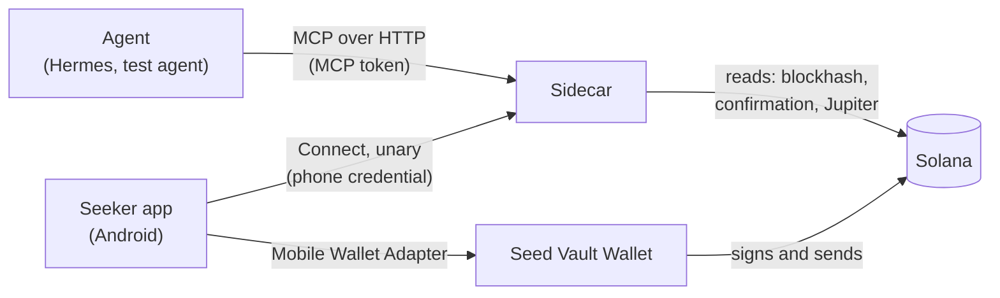
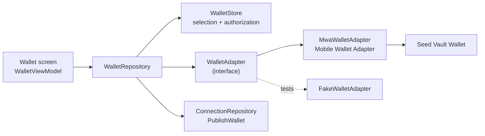
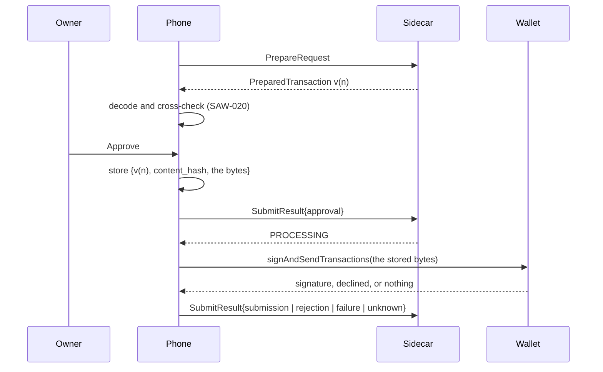

# Architecture

seeker-vault has four parts: the agent, the sidecar, the Android app, and the wallet. This page covers what each part owns, how they talk, and which safety rules hold across them. The wire contract is in [`protocol.md`](protocol.md), and the plan in [`RFC.md`](../RFC.md).

## Components

| Component | Owns | Never does |
| --- | --- | --- |
| **Agent** | Proposing actions and reading their results | Approve, sign, or see the phone's policy |
| **Sidecar** (`sidecar/`) | The MCP and Connect endpoints. From SAW-010 and SAW-011 on, it also holds requests and their states, prepared transactions, results, idempotency records, and pairing. | Hold keys, sign, decide for the user, or execute anything on its own after a restart |
| **Android app** (`android/`) | Connections and their credentials, policies and their assessments, the user's decision, invoking the wallet, and results the sidecar hasn't acknowledged yet | Sign without the user's approval, or trust the agent's description over the transaction's contents |
| **Seed Vault Wallet** | Keys, signing, and sending | Know anything about seeker-vault |

### The wallet adapter boundary

From SAW-015 the app reaches the wallet through one interface, `wallet/WalletAdapter.kt`, and nothing else in the app talks to a wallet library.

- **`WalletAdapter` has four operations,** `connect(network, authToken)`, `disconnect(authToken)`, `signMessage(message, wallet, authToken)` (SAW-016), and `signAndSendTransaction(transaction, wallet, authToken)` (SAW-021). Each answers with one of a small set of outcomes: connected, signed, or sent; no wallet, declined, the authorization expired, the network isn't served, or a failure. Sending has one more, `Unknown`, because a transaction can reach the network and a message can't: see [Approval binding](#approval-binding). The tests drive a `FakeWalletAdapter`, so no wallet app and no activity are needed to cover every outcome.
- **`MwaWalletAdapter` is the only file that imports the Mobile Wallet Adapter client.** It runs the wallet from the activity's `ActivityResultSender`, which `MainActivity` registers in `onCreate` and clears in `onDestroy`. There is no dedicated wallet activity and no foreground service. A rotation destroys one activity and creates another, so the adapter waits briefly for the next screen's sender rather than failing a call the owner just started, and only the activity that registered a sender clears it (SAW-017).
- **The app never creates a wallet or holds a key.** It learns a public address and a wallet authorization token. The address goes to each paired sidecar; the authorization stays on the phone, encrypted under the Keystore key, and never reaches a sidecar, a log, or a backup.
- **The binding is explicit.** The owner picks the network, and the app publishes exactly the address and network the wallet returned. A sidecar with no binding answers `vault_get_address` with `WALLET_NOT_CONNECTED`; it never generates an address.
- **Signing is reached only through the owner's tap (SAW-016).** The inbox stores the approval, sends it, and only then calls `WalletRepository.sign`, which asks the wallet for the selection the owner reviewed and refuses anything else. The signature comes back through the same boundary, and the sidecar verifies it against the request's wallet; see [`protocol.md`](protocol.md#message-results).
- **One wallet call per request, and delivery is separate from it (SAW-017).** `InboxViewModel.approve` and `InboxViewModel.approveTransfer` are the only callers of `sign` and `signAndSend`; what the wallet did is stored before it's sent, and `ConnectionRepository.deliver`, which every retry goes through, reaches a sidecar and never a wallet. An answer that never arrived is recorded as unresolved; see [`testing/wallet-lifecycle.md`](testing/wallet-lifecycle.md).
- **One wallet interaction at a time.** Every operation takes `WalletRepository`'s lock, so a signature asked for while a transaction is in front of the owner waits its turn rather than opening a second wallet screen.

### Approval binding

A transfer reaches the wallet only through the owner's explicit approval of the preparation this phone inspected and showed them (SAW-021). Four things are bound together, and all four are checked before anything happens.

- **The request**, by connection and request ID.
- **The preparation**, by `version` and `content_hash`. The sidecar refuses an approval that doesn't name the latest version, that carries another hash, or whose blockhash window has almost run out, with `STALE_PREPARATION`. The phone then reads the request again and the owner reviews the new version; an approval is never carried over to a transaction they didn't see.
- **The wallet and network**, checked against the selection the screen showed and the one the phone holds now. Either having changed stops the approval.
- **The bytes**, stored on the phone before the wallet is opened. `signAndSendTransactions` is handed those bytes, never bytes fetched again, so a sidecar that rebuilt the transaction in between can't substitute one.

**The sidecar is the commit point.** `ConnectionRepository.approveTransfer` returns only once the sidecar has accepted the approval and moved the request to PROCESSING. An approval it didn't accept is deleted rather than kept: nothing was approved anywhere, no wallet was opened, the request is still the sidecar's, and the owner reviews a fresh preparation. That is why an approved transfer with no wallet answer can only mean one thing — the wallet had it — which is what makes reporting UNKNOWN honest.

**Nothing unverified reaches the wallet.** Only a preparation whose inspection came back `Verified` is offered for approval at all, and `InboxViewModel.approveTransfer` checks it again before sending anything. This is input validation, not a policy verdict: policies are Stage 5, and until they exist the review screen says "Not evaluated" rather than ALLOWED.

## Trust boundaries

- **Separate credentials, separate roles.** The agent's MCP token can create, read, and cancel requests. Only the paired phone's credential can prepare them and submit results. The phone gets that credential by pairing with a one-use code (SAW-011), and the sidecar keeps only its hash. Neither works on the other's endpoints, and the Stage 1 `PHONE_TOKEN` opens only the live diagnostic. [`security.md`](security.md) has the details, and [`protocol.md`](protocol.md#roles) the role matrix.
- **The agent is untrusted input.** Its parameters are validated before they're stored. Its note is shown apart from the verified parameters, and the phone checks the actual transaction, not the agent's description of it.
- **The sidecar is trusted to relay, not to sign.** The phone parses each prepared transaction itself, and the approval names that transaction's exact hash. A sidecar that swapped the transaction after the review couldn't get it approved.
- **Policies stay on the phone.** The sidecar never receives the policy or its assessment, so an agent can't learn or change the rules through it.

## Where state lives

| State | Where | Since |
| --- | --- | --- |
| The live command | Sidecar memory: one in-flight command, and nothing else | SAW-003 |
| Requests, prepared versions, results, and idempotency records | The sidecar's local SQLite database | SAW-010 |
| Pairing: the server ID, pairing tokens, and the hashes of phone credentials | The sidecar's SQLite database | SAW-011 |
| Connections and phone credentials | The phone, with credentials in platform-backed secure storage | SAW-012 |
| Results not yet acknowledged | The phone, until the sidecar acknowledges them | SAW-013 |
| The owner's wallet selection, and the wallet's authorization token | The phone: the selection in `filesDir`, the authorization encrypted in `noBackupFilesDir` | SAW-015 |
| The wallet binding each sidecar publishes to agents | The sidecar's SQLite database, on its connection | SAW-015 |
| Policies, assessments, and daily counters | The phone | Stage 5 |
| Keys | Seed Vault Wallet | Stage 3 |

## Two flows

- **The live diagnostic (Stage 1)** proves the transport. An agent's call waits while the text shows on the open live-test screen, and the user's OK comes back as the tool's result. It's in memory and foreground-only, and it stays as a diagnostic.
- **The durable workflow (Stage 2 on)** carries the product. The sidecar stores an agent's request and answers with its ID at once. The phone fetches it later, and the agent reads the result when it's ready.

The two flows share the sidecar process and the text rules, and nothing else; see [Compatibility with Stage 1](protocol.md#compatibility-with-stage-1).

## Invariants

These hold across the components, and every stage keeps them:

1. **Manual approval, every time.** An `ALLOWED` assessment still waits for the user.
2. **Approval binds to content.** The user approves a prepared version and its SHA-256, never just a request ID. The phone invokes the wallet only after the sidecar has accepted that approval.
3. **One creation per idempotency key.** A retry returns the original request, and changed parameters are refused.
4. **Uncertain means UNKNOWN.** When an outcome isn't known, the request says so, and nobody retries as if it had failed. A wallet's submission isn't a confirmation.
5. **No automatic re-execution.** A restart never rebuilds or resends a transaction.
6. **Identity is scoped.** Requests are addressed by connection and request ID together. One connection can't see or answer another's requests.
7. **Exact values.** Amounts are integer base-unit strings, and messages are signed as the exact bytes sent.
8. **The wallet is the owner's, and explicit.** The app and the sidecar never create a wallet or hold a key. A wallet action is stored only for the wallet and network the owner selected, and an agent that asks for an address when none is connected gets `WALLET_NOT_CONNECTED`.
9. **The wallet is asked only after the owner approves.** No wallet call happens while a request is PENDING, and a signature is accepted only if it verifies against the request's wallet over the request's own bytes.
10. **One interaction, one reported outcome.** The wallet is asked once per request; what it did is stored on the phone before it's sent; sending it again never reaches the wallet; and a repeated result returns the same terminal request. An answer the phone never received is reported as unresolved, never as a success (SAW-017). For a message that means FAILED, because nothing could have been broadcast. For a transfer it means UNKNOWN, because the wallet may have sent it, and the phone never asks a second time (SAW-021).

## Stages

| Stage | Adds |
| --- | --- |
| 1 | The live diagnostic flow: the MCP endpoint, the Android live-test screen, and the test agent |
| 2 | The durable contract (SAW-009), storage and the async MCP tools (SAW-010), pairing (SAW-011), multiple connections (SAW-012), and the pending inbox (SAW-013) |
| 3 | Mobile Wallet Adapter and the wallet binding (SAW-015), manual message signing (SAW-016), and the wallet lifecycle with reliable result delivery (SAW-017) |
| 4 | Transfer requests and fresh preparation (SAW-019), the phone's own inspection of the bytes (SAW-020), manual approval through the wallet (SAW-021), and on-chain confirmation (SAW-022) |
| 5 | Policies |
| 6 | Jupiter swaps |
| 7 | Docker, TLS, and the OAuth gateway |
| 8 | Release checks |
