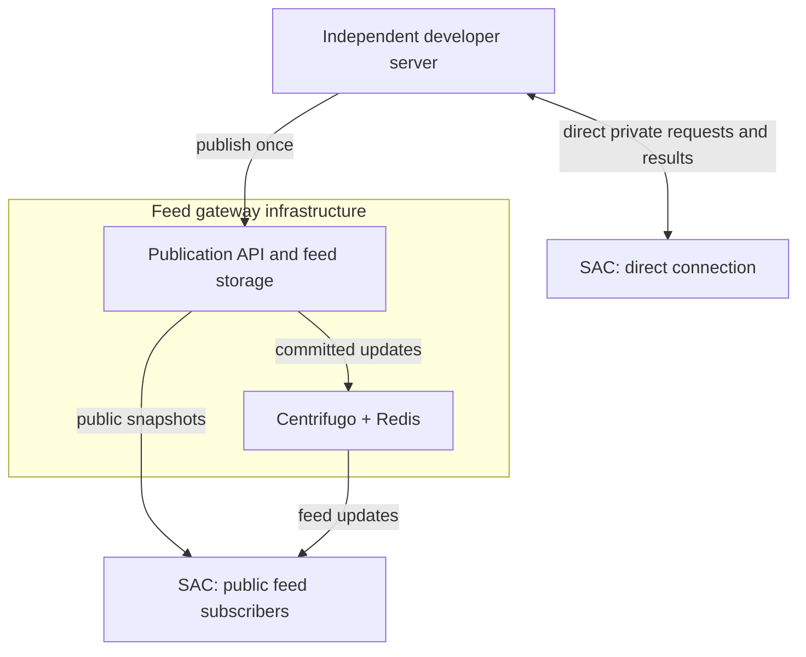

# Architecture

Seeker Agent Connect (SAC) is an Android application for reviewing requests from independent servers and authorizing supported actions through an external wallet. The protocol is server-agnostic; AI and MCP are optional integrations.

## Architecture decision and implementation status

The implemented architecture has **two connection modes: direct private connections and public feeds through a shared gateway**. Gateway-private routing was removed in SEE-130 because it duplicated the private direct path and added unnecessary device bindings, request storage and result routing to the feed gateway.

Compatibility reservations and one-way migration readers may still name the retired mode, but no active API, listener, route, manifest, or Android connection mode implements it.

## Product and service boundaries

| Component | Responsibility | Runs where |
| --- | --- | --- |
| SAC Android app | Connections, Inbox, owner inputs, inspection, rules, manual approval, wallet invocation and local history | User's phone |
| Shared protocol | Request identity, lifecycle, action capabilities, manifests and transport contracts | Implemented by compatible clients and servers |
| Direct Server SDK | Embed the supported private direct-server lifecycle, persistence and phone services in a TypeScript backend | Developer's backend |
| Independent server | Business logic and request creation; private results for direct connections, or common publications for public feeds | Developer/user-operated host |
| Feed gateway | Accept a publication once; store and distribute it to subscribers | Shared infrastructure |
| Bundled client plugins | Prepare and inspect supported actions, such as Jupiter operations | Compiled into SAC |
| External wallet | Hold signing keys and sign/submit explicitly approved operations | Separate wallet application |
| External providers | Jupiter execution data, Solana RPC reads and optional Firebase wake-ups | Provider infrastructure |

An independent server is a role, not an extra service that every developer must install beside their backend. The existing MCP server is one implementation of that role. The historical name `sidecar` does not imply another required component.

The CopyTrading demo's API client remains in `examples/demo-signals/sdk/`. The publication engine both
feed demos use is `packages/publisher-support/`, a source library with no command, image or deployment of
its own. The reusable TypeScript direct-server engine lives in `packages/server-sdk/`; the independently
packaged `servers/mcp-server/` application consumes only its public exports. Feed publishers use the
gateway's ordinary publication API rather than this Direct Server SDK. The Android build currently
has `:app` and `:designsystem`; a separately packaged Android SDK remains future work.

## Two connection modes

The phone boxes represent connection roles. One physical phone can hold direct connections and public subscriptions together. The diagram shows the two architectural options; an individual implementation or manifest need not serve both.

| | Direct | Public feed |
| --- | --- | --- |
| Purpose | Private requests to a paired device | One publication delivered to many subscribers |
| Phone communicates with | Independent server | Feed gateway and its streaming endpoint |
| Device binding | Managed by the independent server | No per-subscriber binding to the publisher |
| Source data | Device-addressed requests | Identical public content for subscribers |
| Owner inputs and decisions | Reviewed locally; declared results return to the originating server | Stay on the device |
| Gateway required | No | Yes |
| Typical implementation here | User's MCP server | CopyTrading and Prediction demo servers |

### Direct private connection

The independent server owns pairing, authenticated request access, durable request state and returned results. SAC connects to that server directly. The server must expose a compatible endpoint reachable by the phone.

An AI agent calls the MCP adapter of the user's server. That adapter asks the server's request core to create/read/cancel requests; the phone reviews those requests and returns outcomes to the same server. MCP is not part of the phone-to-server contract and does not grant approval authority.

Pairing links and QR codes belong to direct onboarding. A server can hand the connection information to its user through a website, bot or CLI. Android handles `seekervault://pair` links directly, and the existing `pnpm pair` command prints both the URI and QR.

The existing direct implementation's supported device count must be documented accurately. Removing gateway-private bindings must not silently claim that direct multi-device support already exists.

### Public feed through the gateway

The developer's server publishes a public request or signal once. The gateway retains the authoritative publication and distributes updates to many phones, so the developer's backend does not manage subscriber connections.

Phones read snapshots and stream updates from the gateway. They do not pair with or contact the publishing server. The public feed has no per-device invitation, user mapping, private device credential or result-upload channel. Each phone keeps its subscriptions, parameters, decisions and outcomes locally.

The publisher can revise or withdraw its source publication. An owner's dismissal or execution does not change it for other subscribers. Publication identity and revisions make duplicate delivery safe.

The gateway owns publication validation, publisher authentication, durable feed state, snapshots, streaming tickets and optional feed push delivery. Centrifugo and Redis provide fan-out and bounded recovery; their cache is not the authoritative database. FCM is a best-effort wake-up to fetch current state.

Public-feed anonymity here means no application-level subscriber binding or returned owner outcome at the publisher. It is not a claim that network providers or infrastructure cannot observe transport metadata.

## The three example servers

| Server | Connection mode | Role |
| --- | --- | --- |
| CopyTrading demo | Public feed | Publishes swap signals |
| Prediction demo | Public feed | Discovers and publishes prediction markets |
| User's MCP server | Direct | Accepts agent requests and returns the owner's results |

These are three independent request sources, not three required SAC backend services. CopyTrading and Prediction are optional reference applications maintained in this repository. The MCP server is the user's direct server; there is no additional mandatory “sidecar” between it and the app.

Jupiter client plugins and demo servers are different components. The demos publish opportunities; the bundled plugins prepare and inspect execution data on the phone. Jupiter itself is an external provider.

## Inside the Android application

The app owns connections and encrypted credentials, saved wallet profiles and their authorizations, each connection's choice of wallet profile, owner inputs, policy assessment, review, explicit approval and durable local outcomes. Its composition root currently registers `JupiterSwapPlugin` and `JupiterPredictionPlugin`.

Plugins declare parameters, obtain execution data and inspect bytes as typed facts. Core retains policy evaluation, approval, persistence and wallet invocation. Plugins are compiled into the application; connecting a server never downloads executable code. Missing or incompatible plugins make an operation unsupported.

Acknowledgement, message signing and direct transfers retain their core execution paths. A plugin being present does not mean every connection mode supports every action.

Sandbox and Production are execution environments, separate from the Solana network. Sandbox uses review and simulation without signing or submitting. The shipped feed demos use sandbox; this is not a Jupiter devnet deployment. Direct requests expecting actual signatures must not receive simulated success.

See [client plugins](wiki/client-plugins.md), [policy](policy.md) and [environments](wiki/environments.md) for the detailed boundaries.

## Approval, signing and results

- The app and servers hold no wallet signing keys. An external MWA-compatible wallet signs and submits.
- Policy assessments never replace explicit owner approval.
- Review binds the source identity/revision, owner choices, the connection's own wallet profile (address, network, wallet app) and exact prepared bytes. Changed content, or a changed wallet binding, requires a new review.
- There is no global wallet. Each connection names one saved wallet profile, chosen by the owner; a direct server is told only its own connection's address and network, a feed is told nothing, and nothing signs for a connection whose server declares no Solana network or whose profile isn't on one it declares ([wallet profiles](wiki/wallet-profiles.md), [supported networks](wiki/server-manifests.md#supported-networks)).
- Direct transfers retain the server-accepted preparation/approval sequence before wallet invocation. Public-feed execution has no server approval acknowledgement or result upload.
- One wallet interaction is serialized with other wallet operations, however many profiles are saved. Its outcome is persisted before any result delivery retry.
- Retrying delivery, restarting the app or receiving duplicate updates never re-signs or re-submits a transaction.
- An uncertain submission remains unresolved; it is not retried as a failure. Submission and on-chain confirmation are distinct, and confirmation claims must identify the checked network result.

The direct server owns private request lifecycle and received results. The phone owns its local execution record. The feed gateway and public publisher own only the source publication, never the subscriber's decision.

See [protocol](protocol.md), [security](security.md) and [wallet lifecycle](testing/wallet-lifecycle.md).

## Updates and notifications

Direct foreground updates use the server's authenticated update service; app resume, manual refresh and background synchronization reconcile the same durable state. The current direct implementation uses bidirectional gRPC plus unary Sync.

Public feeds use gateway snapshots and Centrifugo streaming with revision checks and snapshot recovery when replay continuity is lost. Feed delivery is at-least-once, so applying the same revision twice must not repeat an action.

Optional FCM wake-ups initiate authoritative reads; they do not contain an approval or authorize execution. No foreground stream, background worker, notification or retry may open a wallet or approve a request.

See [Firebase](guides/firebase.md) and [feed gateway](wiki/feed-gateway.md).

## Final repository and deployment layout

These are the canonical post-refactor boundaries:

| Path | Responsibility | Boundary |
| --- | --- | --- |
| `apps/android/` | SAC app and design system | No server implementation |
| `packages/protocol/proto/` | Shared direct/feed contracts plus compatibility reservations | Retired private-gateway identifiers stay reserved |
| `packages/server-sdk/` | Reusable TypeScript direct-server engine, phone services and persistence | Embeddable library; no MCP/product configuration |
| `servers/mcp-server/` | Self-hosted MCP host, executable CLI, providers and standalone Docker/npm packaging | Consumes only the Direct Server SDK's public API; the npm artifact and image vendor the SDK runtime and record its version |
| `services/gateway/` | Shared Go feed gateway with public-read and publisher listeners, storage contract and local SQLite implementation | The only shared public-feed service |
| `packages/publisher-support/` | Go source library shared by both feed demos: publication bindings, document rules, manifest, store, gateway client, API and operator CLI | No command, image or deployment of its own |
| `examples/demo-signals/` | CopyTrading application: commands, admin UI, SDK and image | Independent preset in `compose/copytrading/` in `do-deploy` |
| `examples/demo-prediction/` | Prediction application: command, provider client, discovery cycle and image | Independent preset in `compose/prediction/` in `do-deploy` |
| [`do-deploy`](https://github.com/SeekerAgentConnect/do-deploy/tree/main/compose) `compose/` (separate repository) | Portable feed/MCP/demo presets on published images, including `compose/mcp/` with its separately managed `compose/ingress/direct/` TLS/OAuth ingress, other separate ingress and isolated operator examples | Canonical orchestration with explicit volume identities; application and ingress have independent lifecycles |
| `tools/test-agent/` | Developer MCP client | Development and verification only |

**There is one shared feed gateway.** Direct MCP traffic stays out of it; optional direct and feed
ingress projects are separate from their applications and from each other.

The base shared deployment must run without either demo or the direct server. Both feed demos can run independently. The direct MCP server must run without the shared feed gateway, Centrifugo or Redis. Renaming deployment services must preserve existing direct pairing data, credentials, databases and volumes through an explicit migration.

## Removed third mode

SEE-130 removed gateway-private invitations, redemption, private device bindings and credentials,
private request/result routing and associated SDK/client/server APIs, together with their
configuration, UI routes, generated bindings and examples. Boundary tests now hold the two-mode
surface and permanently deny-list the removed descriptors and routes.

Public publisher credentials, feed references, stream tickets, publication storage and direct
pairing remain. Stored gateway-private connections become explicit inert retirement records and
require a fresh direct pairing; no credential, origin or identity is converted. Local Activity
history and unaffected Direct/Feed data remain.

SEE-130 completed the runtime removal and migration described here. SEE-131 through SEE-135 then
packaged the Direct Server SDK and MCP application, isolated the gateway and demos, and established
the canonical deployment boundaries. The final joined verification and its explicitly unavailable
live checks are recorded in [`docs/testing/see-136.md`](testing/see-136.md).
