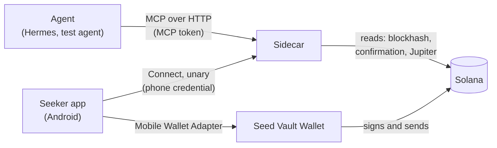

# Architecture

seeker-vault has four parts: the agent, the sidecar, the Android app, and the wallet. This page covers what each part owns, how they talk, and which safety rules hold across them. The wire contract is in [`protocol.md`](protocol.md), and the plan in [`RFC.md`](../RFC.md).

## Components

| Component | Owns | Never does |
| --- | --- | --- |
| **Agent** | Proposing actions and reading their results | Approve, sign, or see the phone's policy |
| **Sidecar** (`sidecar/`) | The MCP and Connect endpoints. From SAW-010 and SAW-011 on, it also holds requests and their states, prepared transactions, results, idempotency records, and pairing. | Hold keys, sign, decide for the user, or execute anything on its own after a restart |
| **Android app** (`android/`) | Connections and their credentials, policies and their assessments, the user's decision, invoking the wallet, and results the sidecar hasn't acknowledged yet | Sign without the user's approval, or trust the agent's description over the transaction's contents |
| **Seed Vault Wallet** | Keys, signing, and sending | Know anything about seeker-vault |

## Trust boundaries

- **Separate credentials, separate roles.** The agent's MCP token can create, read, and cancel requests. Only the paired phone's credential can prepare them and submit results. The phone gets that credential by pairing with a one-use code (SAW-011), and the sidecar keeps only its hash. Neither works on the other's endpoints, and the Stage 1 `PHONE_TOKEN` opens only the live diagnostic. [`security.md`](security.md) has the details, and [`protocol.md`](protocol.md#roles) the role matrix.
- **The agent is untrusted input.** Its parameters are validated before they're stored. Its note is shown apart from the verified parameters, and the phone checks the actual transaction, not the agent's description of it.
- **The sidecar is trusted to relay, not to sign.** The phone parses each prepared transaction itself, and the approval names that transaction's exact hash. A sidecar that swapped the transaction after the review couldn't get it approved.
- **Policies stay on the phone.** The sidecar never receives the policy or its assessment, so an agent can't learn or change the rules through it.

## Where state lives

| State | Where | Since |
| --- | --- | --- |
| The live command | Sidecar memory: one in-flight command, and nothing else | SAW-003 |
| Requests, prepared versions, results, and idempotency records | The sidecar's local SQLite database | SAW-010 |
| Pairing: the server ID, pairing tokens, and the hashes of phone credentials | The sidecar's SQLite database | SAW-011 |
| Connections and phone credentials | The phone, with credentials in platform-backed secure storage | SAW-012 |
| Results not yet acknowledged | The phone, until the sidecar acknowledges them | SAW-013 |
| Policies, assessments, and daily counters | The phone | Stage 5 |
| Keys | Seed Vault Wallet | Stage 3 |

## Two flows

- **The live diagnostic (Stage 1)** proves the transport. An agent's call waits while the text shows on the open live-test screen, and the user's OK comes back as the tool's result. It's in memory and foreground-only, and it stays as a diagnostic.
- **The durable workflow (Stage 2 on)** carries the product. The sidecar stores an agent's request and answers with its ID at once. The phone fetches it later, and the agent reads the result when it's ready.

The two flows share the sidecar process and the text rules, and nothing else; see [Compatibility with Stage 1](protocol.md#compatibility-with-stage-1).

## Invariants

These hold across the components, and every stage keeps them:

1. **Manual approval, every time.** An `ALLOWED` assessment still waits for the user.
2. **Approval binds to content.** The user approves a prepared version and its SHA-256, never just a request ID. The phone invokes the wallet only after the sidecar has accepted that approval.
3. **One creation per idempotency key.** A retry returns the original request, and changed parameters are refused.
4. **Uncertain means UNKNOWN.** When an outcome isn't known, the request says so, and nobody retries as if it had failed. A wallet's submission isn't a confirmation.
5. **No automatic re-execution.** A restart never rebuilds or resends a transaction.
6. **Identity is scoped.** Requests are addressed by connection and request ID together. One connection can't see or answer another's requests.
7. **Exact values.** Amounts are integer base-unit strings, and messages are signed as the exact bytes sent.

## Stages

| Stage | Adds |
| --- | --- |
| 1 | The live diagnostic flow: the MCP endpoint, the Android live-test screen, and the test agent |
| 2 | The durable contract (SAW-009), storage and the async MCP tools (SAW-010), pairing (SAW-011), multiple connections (SAW-012), and the pending inbox (SAW-013) |
| 3 | Mobile Wallet Adapter and message signing |
| 4 | Transfers, on-phone transaction parsing, and on-chain confirmation |
| 5 | Policies |
| 6 | Jupiter swaps |
| 7 | Docker, TLS, and the OAuth gateway |
| 8 | Release checks |
