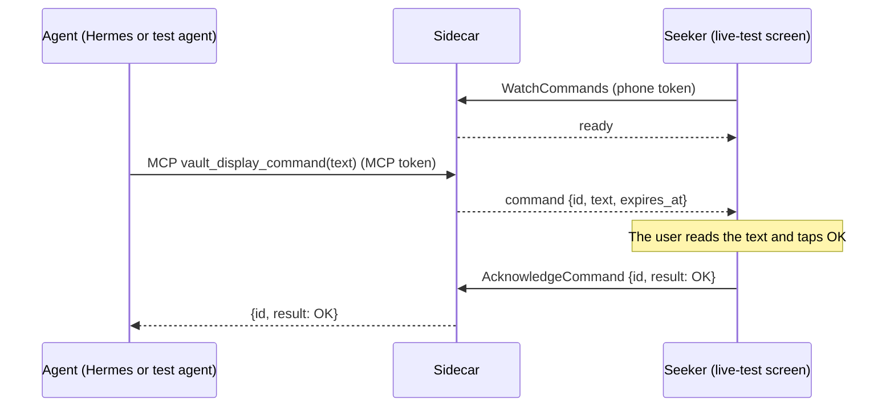

# Protocol

The phone–sidecar contract lives in [`proto/`](../proto) and is the single source of truth for both runtimes. This page covers the Stage 1 live diagnostic flow: its messages, rules, errors, and how the generated code is kept in sync.

## Stage 1: the live diagnostic flow

The live diagnostic flow is a display-only round trip that proves the transport before any wallet work. An agent's text appears on the Seeker, and the user's OK goes back to the agent.

The contract is `LiveCommandService` in [`proto/seekervault/live/v1/live.proto`](../proto/seekervault/live/v1/live.proto). The sidecar serves the MCP tool `vault_display_command` and the Connect service; see [`docs/development/sidecar.md`](development/sidecar.md). SAW-004 implements the Android screen.

| RPC | Kind | Purpose |
| --- | --- | --- |
| `WatchCommands` | Server stream | The live-test screen's subscription. The first message is `ready`; each later one carries a `LiveCommand`. |
| `AcknowledgeCommand` | Unary | Sends the user's `CommandAcknowledgement` for a delivered command. |

| Type | Contents |
| --- | --- |
| `LiveCommand` | `id` (a UUID assigned by the sidecar), `text` (display-only), `expires_at` (the deadline) |
| `CommandAcknowledgement` | `id` (the command's), `result` (`ACKNOWLEDGEMENT_RESULT_OK`) |
| `LiveCommandError` | Why a command did not complete (see [Errors](#errors)) |

## Rules

- **Text is display-only.** The phone shows `text` verbatim as plain text. It is never code, markup, a link to follow, or an instruction for the phone to execute.
- **Text must be valid.** It has to be well-formed Unicode, not empty or whitespace-only, and at most 4096 UTF-8 bytes. The limit counts bytes, not characters: `€` counts as 3 and `😀` as 4. Anything else fails with `INVALID_TEXT`.
- **There is one watcher.** The phone watches only while the live-test screen is in the foreground. A new `WatchCommands` call replaces the current watcher: the older stream ends with `canceled`, and its in-flight command is cancelled.
- **There is one in-flight command per sidecar.** While a command waits for its acknowledgement, a second one is refused with `BUSY`. There is no queue.
- **Every command has a deadline.** `expires_at` is the send time plus `LIVE_COMMAND_TIMEOUT_SECONDS`, which can be 1 to 3600 and is 60 in `.env.example`.
  - The command is live strictly before `expires_at` and timed out from that instant on, so an acknowledgement at exactly `expires_at` gets `TIMEOUT`.
  - The sidecar sets deadlines to the millisecond. Both runtimes compare them to the nanosecond.
- **Acknowledgements are checked against two things only:** the in-flight command, and the outcome of the most recently finished one.
  - For the in-flight command before its deadline, the acknowledgement is accepted, and the MCP call returns `{id, result: OK}`.
  - For the in-flight command at or after its deadline, the result is `TIMEOUT`.
  - For the most recently finished command, a repeated acknowledgement succeeds with no second effect if that command was acknowledged. Otherwise it gets that command's `TIMEOUT` or `CANCELLED`.
  - For any other ID, the result is `UNKNOWN_COMMAND`.
- **Nothing is durable.** There is no backlog, replay, persistence, or pending-request API. A sidecar restart loses the in-flight command, and a reconnecting phone never receives a command sent before it connected.

The rules are implemented without I/O in [`sidecar/src/live/command.ts`](../sidecar/src/live/command.ts) as `invalidTextReason`, `isExpired`, and `LiveCommandSlot`. [`sidecar/src/live/bridge.ts`](../sidecar/src/live/bridge.ts) adds the in-memory waiter around them: deadline timers, the watcher, and cancellation. On Android, the deadline check is `LiveCommand.isExpiredAt` in [`LiveCommandDeadline.kt`](../android/app/src/main/java/io/github/brrenat/seekervault/live/LiveCommandDeadline.kt).

## Errors

| `LiveCommandError` | When | What the agent sees (MCP) | What the phone sees (Connect code) |
| --- | --- | --- | --- |
| `OFFLINE` | No phone is watching when the agent sends. The command fails at once and is not stored. | Tool error `OFFLINE` | Nothing |
| `BUSY` | Another command is already in flight. | Tool error `BUSY` | Nothing |
| `TIMEOUT` | No acknowledgement arrived before `expires_at`. | Tool error `TIMEOUT` | `deadline_exceeded` on a late `AcknowledgeCommand` |
| `CANCELLED` | The agent cancelled the call, the phone disconnected or was replaced, or the sidecar shut down. | Tool error `CANCELLED` | `canceled`: the replaced stream ends, and a late `AcknowledgeCommand` fails |
| `UNAUTHENTICATED` | The token for the endpoint is missing or wrong. The MCP token is refused on the phone RPCs, and the phone token on `/mcp`. | HTTP 401 on `/mcp` | `unauthenticated` |
| `UNKNOWN_COMMAND` | An acknowledgement names an ID the sidecar isn't tracking. | Nothing | `not_found` |
| `INVALID_TEXT` | The text breaks the text rules. | Tool error `INVALID_TEXT` | Nothing |

The transport itself can also produce `deadline_exceeded`, `canceled`, and `unavailable`: for example, a client-side deadline, a cancellation, or an unreachable sidecar. The phone treats `unavailable` and a failed stream as disconnected.

On the wire:

- **MCP success:** the tool result carries `structuredContent: {"id", "result": "OK"}`.
- **MCP failure:** the result has `isError: true`, and its text is `"<CODE>: <message>"`, for example `BUSY: another live command is in flight`. It carries no `structuredContent`, because MCP clients validate that field against the success schema.
- **A replaced phone stream** ends with `canceled`.
- **A sidecar shutdown** ends the stream with `unavailable`.

## Authentication

Stage 1 uses two separate development bearer tokens from `.env`:

- `MCP_TOKEN` for the agent-facing `/mcp` endpoint
- `PHONE_TOKEN` for `LiveCommandService`

Each is sent as `Authorization: Bearer <token>`, never in a URL, and never logged. The sidecar listens on loopback only, compares tokens in constant time, and checks the Host and Origin headers on `/mcp`; see [`docs/development/sidecar.md`](development/sidecar.md#endpoints).

## Why a stream, and what Stage 2 changes

`WatchCommands` is a diagnostic stream that exists only while the live-test screen is open. It is not a background service, a persistent session, or a bidirectional channel.

Stage 2 introduces a separate, durable request workflow over unary RPCs: `ListPending`, `GetRequest`, `SubmitResult`, and the rest listed in `RFC.md`. Its requests are stored, fetched when the app opens, and survive restarts. That workflow doesn't depend on this stream, and the stream doesn't become mandatory product infrastructure.

## Generated code

| Runtime | Output | Generators | Runtime libraries |
| --- | --- | --- | --- |
| TypeScript (sidecar) | `sidecar/src/gen`, as `.js` plus `.d.ts` | `protoc-gen-es` 2.14.1 | `@bufbuild/protobuf` 2.14.1 |
| Kotlin (Android) | `android/app/src/main/generated/java` and `android/app/src/main/generated/kotlin` | `protocolbuffers/java` and `protocolbuffers/kotlin` v36.1 (lite), `connectrpc/kotlin` v0.9.0 | `protobuf-kotlin-lite` 4.36.1, `connect-kotlin` 0.9.0 |

- **`pnpm generate`** regenerates the code and the binary fixtures. Commit the result, and never edit generated files by hand.
- **`pnpm check:generated`** generates into a temporary directory and fails if any committed file differs. CI runs it, and running generation twice produces no diff.
- **`pnpm check`** includes `buf format` and `buf lint` with the STANDARD rules.
- **Buf managed mode** sets the Java and Kotlin package to `io.github.brrenat.seekervault.live.v1`.
- **Both generation commands need network access,** because the Kotlin plugins run remotely on the Buf Schema Registry.

## Cross-runtime fixtures

Each fixture case is a Protobuf JSON file at `proto/fixtures/seekervault/live/v1/<Message>/<case>.json`. `pnpm generate` writes the matching `.binpb` with `buf convert`, so a third implementation, Buf's Go runtime, produces the reference bytes.

- **The sidecar test** decodes the JSON with protobuf-es, and requires both the encoding and the decoding to match the `.binpb` byte for byte.
- **The Android unit test** builds the same message in Kotlin, and requires both parsing and serialization to match the same bytes.

The cases cover:

- ASCII text
- Unicode text: a combining mark, an emoji with a skin-tone modifier, a ZWJ sequence, CJK, Arabic, and a newline
- a 4096-byte text
- nanosecond and maximum deadlines
- an empty message
- the `ready` event and a command event
- acknowledgements

To add a case, add the JSON file, run `pnpm generate`, and assert the case in both `sidecar/src/live/fixtures.test.ts` and `LiveProtocolFixturesTest.kt`.

## Verification record: SAW-002

Run on 2026-09-11 on macOS 26.5.2 (Apple silicon), with the versions in [`docs/development/toolchain.md`](development/toolchain.md).

| Check | Result |
| --- | --- |
| `pnpm check` | PASS: Prettier, `buf format`, ESLint, `buf lint`, `tsc`, 38/38 sidecar tests (configuration, protocol rules, fixtures) |
| `pnpm check:android` | PASS. Kotlin compiles the generated messages and `LiveCommandServiceClient`. 10 fixture tests and 3 deadline tests pass, lint reports no issues, and the debug APK builds. |
| `pnpm build` | PASS: `sidecar/dist` includes the generated JavaScript, and the built `LiveCommandSlot` runs |
| Running generation twice | PASS: two more `pnpm generate` runs left all 46 generated files and fixtures byte-identical, and `pnpm check:generated` passes |
| `pnpm check:generated` catches drift | Each of these failed it: a hand-edited generated file, a fixture JSON changed without regenerating, a stray file in a generated directory |
| Fixture tests catch disagreement | Flipping one byte of `LiveCommand/unicode.binpb` failed both the TypeScript fixture test and `LiveProtocolFixturesTest.liveCommandUnicode` |
| Protocol checks | A camelCase field failed `buf lint`, and a misformatted message failed `buf format`; each made `pnpm check` fail |
| Physical device | NOT RUN: SAW-002 has no device behavior. SAW-004 through SAW-008 verify the live round trip. |
