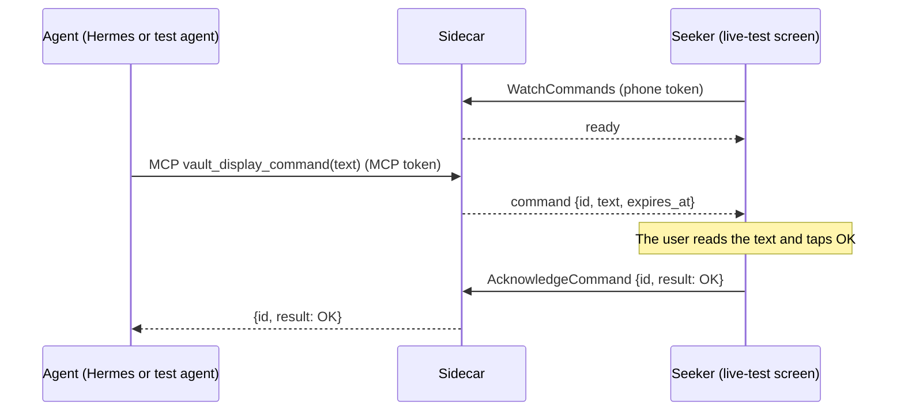
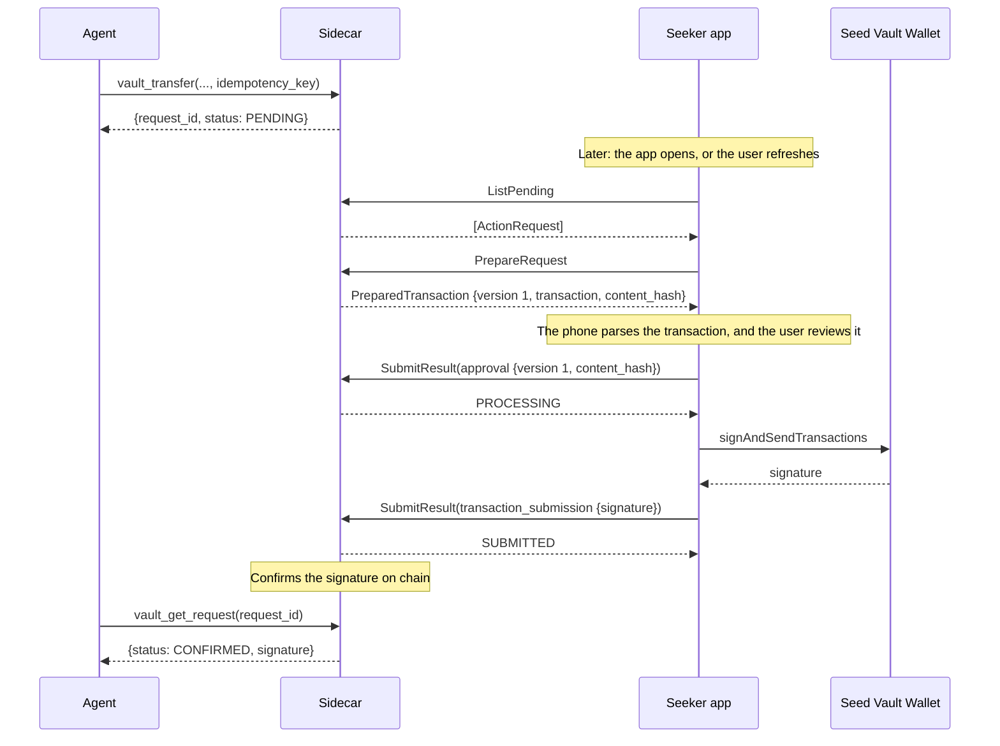
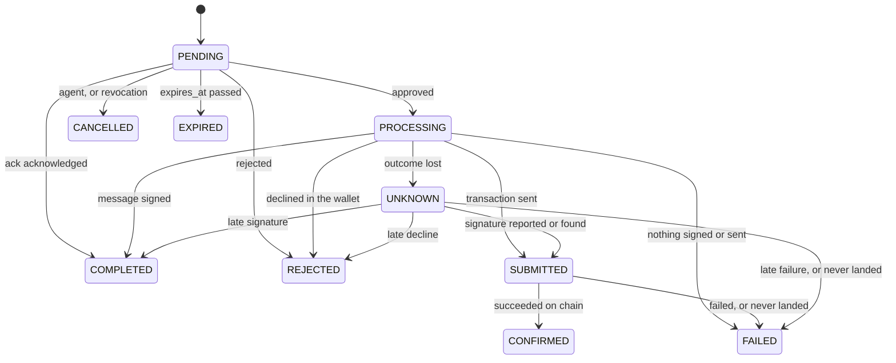

# Protocol

The phone–sidecar contract lives in [`proto/`](../proto) and is the single source of truth for both runtimes. This page covers the Stage 1 live diagnostic flow and the durable request workflow that starts in Stage 2: their messages, rules, and errors, the agent's MCP tools, and how the generated code is kept in sync. How the parts fit together is in [`architecture.md`](architecture.md).

## Stage 1: the live diagnostic flow

The live diagnostic flow is a display-only round trip that proves the transport before any wallet work. An agent's text appears on the Seeker, and the user's OK goes back to the agent.



The contract is `LiveCommandService` in [`proto/seekervault/live/v1/live.proto`](../proto/seekervault/live/v1/live.proto). The sidecar serves the MCP tool `vault_display_command` and the Connect service; see [`docs/development/sidecar.md`](development/sidecar.md). The Android app's live-test screen is the phone side; see [`docs/development/android.md`](development/android.md).

| RPC | Kind | Purpose |
| --- | --- | --- |
| `WatchCommands` | Server stream | The live-test screen's subscription. The first message is `ready`; each later one carries a `LiveCommand`. |
| `AcknowledgeCommand` | Unary | Sends the user's `CommandAcknowledgement` for a delivered command. |

| Type | Contents |
| --- | --- |
| `LiveCommand` | `id` (a UUID assigned by the sidecar), `text` (display-only), `expires_at` (the deadline) |
| `CommandAcknowledgement` | `id` (the command's), `result` (`ACKNOWLEDGEMENT_RESULT_OK`) |
| `LiveCommandError` | Why a command did not complete (see [Errors](#errors)) |

## Rules

- **Text is display-only.** The phone shows `text` verbatim as plain text. It is never code, markup, a link to follow, or an instruction for the phone to execute.
- **Text must be valid.** It has to be well-formed Unicode, not empty or whitespace-only, and at most 4096 UTF-8 bytes. The limit counts bytes, not characters: `€` counts as 3 and `😀` as 4. Anything else fails with `INVALID_TEXT`.
- **There is one watcher.** The phone watches only while the live-test screen is in the foreground. A new `WatchCommands` call replaces the current watcher: the older stream ends with `canceled`, and its in-flight command is cancelled.
- **There is one in-flight command per sidecar.** While a command waits for its acknowledgement, a second one is refused with `BUSY`. There is no queue.
- **Every command has a deadline.** `expires_at` is the send time plus `LIVE_COMMAND_TIMEOUT_SECONDS`, which can be 1 to 3600 and is 60 in `.env.example`.
  - The command is live strictly before `expires_at` and timed out from that instant on, so an acknowledgement at exactly `expires_at` gets `TIMEOUT`.
  - The sidecar sets deadlines to the millisecond. Both runtimes compare them to the nanosecond.
- **Acknowledgements are checked against two things only:** the in-flight command, and the outcome of the most recently finished one.
  - For the in-flight command before its deadline, the acknowledgement is accepted, and the MCP call returns `{id, result: OK}`.
  - For the in-flight command at or after its deadline, the result is `TIMEOUT`.
  - For the most recently finished command, a repeated acknowledgement succeeds with no second effect if that command was acknowledged. Otherwise it gets that command's `TIMEOUT` or `CANCELLED`.
  - For any other ID, the result is `UNKNOWN_COMMAND`.
- **Nothing is durable.** There is no backlog, replay, persistence, or pending-request API. A sidecar restart loses the in-flight command, and a reconnecting phone never receives a command sent before it connected.

The rules are implemented without I/O in [`sidecar/src/live/command.ts`](../sidecar/src/live/command.ts) as `invalidTextReason`, `isExpired`, and `LiveCommandSlot`. [`sidecar/src/live/bridge.ts`](../sidecar/src/live/bridge.ts) adds the in-memory waiter around them: deadline timers, the watcher, and cancellation. On Android, the deadline check is `LiveCommand.isExpiredAt` in [`LiveCommandDeadline.kt`](../android/app/src/main/java/io/github/brrenat/seekervault/live/LiveCommandDeadline.kt).

## Errors

| `LiveCommandError` | When | What the agent sees (MCP) | What the phone sees (Connect code) |
| --- | --- | --- | --- |
| `OFFLINE` | No phone is watching when the agent sends. The command fails at once and is not stored. | Tool error `OFFLINE` | Nothing |
| `BUSY` | Another command is already in flight. | Tool error `BUSY` | Nothing |
| `TIMEOUT` | No acknowledgement arrived before `expires_at`. | Tool error `TIMEOUT` | `deadline_exceeded` on a late `AcknowledgeCommand` |
| `CANCELLED` | The agent cancelled the call, the phone disconnected or was replaced, or the sidecar shut down. | Tool error `CANCELLED` | `canceled`: the replaced stream ends, and a late `AcknowledgeCommand` fails |
| `UNAUTHENTICATED` | The token for the endpoint is missing or wrong. The MCP token is refused on the phone RPCs, and the phone token on `/mcp`. | HTTP 401 on `/mcp` | `unauthenticated` |
| `UNKNOWN_COMMAND` | An acknowledgement names an ID the sidecar isn't tracking. | Nothing | `not_found` |
| `INVALID_TEXT` | The text breaks the text rules. | Tool error `INVALID_TEXT` | Nothing |

The transport itself can also produce `deadline_exceeded`, `canceled`, and `unavailable`: for example, a client-side deadline, a cancellation, or an unreachable sidecar. The phone treats `unavailable` and a failed stream as disconnected.

On the wire:

- **MCP success:** the tool result carries `structuredContent: {"id", "result": "OK"}`.
- **MCP failure:** the result has `isError: true`, and its text is `"<CODE>: <message>"`, for example `BUSY: another live command is in flight`. It carries no `structuredContent`, because MCP clients validate that field against the success schema.
- **A replaced phone stream** ends with `canceled`.
- **A sidecar shutdown** ends the stream with `unavailable`.

## Authentication

Stage 1 uses two separate development bearer tokens from `.env`:

- `MCP_TOKEN` for the agent-facing `/mcp` endpoint
- `PHONE_TOKEN` for `LiveCommandService`

Each is sent as `Authorization: Bearer <token>`, never in a URL, and never logged. The sidecar listens on loopback only, compares tokens in constant time, and checks the Host and Origin headers on `/mcp`; see [`docs/development/sidecar.md`](development/sidecar.md#endpoints).

`PHONE_TOKEN` stays with the live diagnostic. From SAW-011 on, the durable workflow authenticates the phone with the credential it gets from [pairing](#pairing), and `MCP_TOKEN` opens `/mcp` only; see [roles](#roles).

## Why a stream, and what Stage 2 changes

`WatchCommands` is a diagnostic stream that exists only while the live-test screen is open. It is not a background service, a persistent session, or a bidirectional channel.

Stage 2 introduces a separate, durable request workflow over unary RPCs; see [Stage 2: durable requests](#stage-2-durable-requests). Its requests are stored, fetched when the app opens, and survive restarts. That workflow doesn't depend on this stream, and the stream doesn't become mandatory product infrastructure.

## Stage 2: durable requests

From Stage 2 on, agents propose actions that are stored and decided later. SAW-009 defines the contract:

- the phone's side in [`proto/seekervault/request/v1`](../proto/seekervault/request/v1)
- the agent's side as the [MCP tools](#agent-api-mcp) below
- the rules as pure code in [`sidecar/src/requests/`](../sidecar/src/requests)

SAW-010 serves the workflow:

- **Storage:** the sidecar stores requests in SQLite; see [storage and lifecycle](development/sidecar.md#storage-and-lifecycle).
- **Endpoints:** it serves `vault_get_request`, `vault_cancel_request`, and `RequestService`, and the demo tool `vault_request_ack` when `MCP_DEMO_TOOLS=true` (SAW-014).

SAW-011 adds [pairing](#pairing) and [separate roles](#roles). The operator shows the phone a one-use pairing code, and the phone exchanges it for a connection and a credential. Only that credential opens `RequestService`. [`docs/security.md`](security.md) explains the model.

SAW-013 adds the phone's inbox, and SAW-014 validates the workflow end to end ([`docs/testing/stage-2.md`](testing/stage-2.md)).

SAW-015 opens Stage 3 with [the wallet binding](#the-wallet-binding): the phone publishes the wallet the owner selected, and agents read it with `vault_get_address`. Creating a wallet action now checks it: `WALLET_NOT_CONNECTED` when the owner has connected none, and `WALLET_MISMATCH` when the action names another wallet or network.

SAW-016 adds the first wallet action, `sign_message`: `vault_sign_message` creates the request, the owner approves it by hand on the phone, the wallet signs, and the sidecar verifies the signature before it accepts it ([message results](#message-results); [`docs/guides/message-signing.md`](guides/message-signing.md)). `vault_get_capabilities` says what a sidecar actually serves. The tools for transfers and swaps, and `PrepareRequest`, still arrive with Stages 4 and 6.



The queued acknowledgement (`ack`) takes a short path: `ListPending`, then `SubmitResult(acknowledgement)`, which completes it. There is no preparation and no wallet.

| Module | Rules |
| --- | --- |
| [`action.ts`](../sidecar/src/requests/action.ts) | `invalidActionReason` (every kind's required fields and formats), `parseBaseUnits`, `isAddress`, `messageBytes`, `invalidNoteReason` |
| [`identity.ts`](../sidecar/src/requests/identity.ts) | `checkRef` (connection scope), `invalidIdempotencyKeyReason`, `actionFingerprint`, `resolveIdempotency` |
| [`lifecycle.ts`](../sidecar/src/requests/lifecycle.ts) | `TRANSITIONS`, `canTransition`, `isTerminal`, `successState`, `resultTarget`, `decideResult` (results and approval binding), `isOverdue` |

### Connections and request identity

- **A connection is one phone paired with one sidecar.** The sidecar assigns its `connection_id` at pairing (`PairingService.Pair`). A sidecar has one active phone connection at a time (SAW-011), and a phone can have connections to several sidecars.
- **A request belongs to one connection for good.** The sidecar binds a new request to the active connection when it stores it. With no phone paired, creation fails with `NOT_PAIRED`, and nothing is stored.
- **A request ID is unique only within its connection,** and two sidecars can issue the same one. So every `RequestRef` carries both IDs:
  - The phone keys its records by both.
  - Every phone RPC names both. The sidecar answers a reference to another connection with `NOT_FOUND`, the same as for a request that doesn't exist.
- **Both IDs are lowercase UUIDs,** assigned by the sidecar.
- **Revoking a connection stops its phone credential at once, and cancels its PENDING requests.** The phone revokes with `RevokeConnection`, and the operator with `pnpm pair revoke`. Pairing a new phone revokes the previous one. Requests already approved are still resolved from the chain, and agents can still read every request. A new pairing is a new connection: it can't see or report the old connection's requests.

### Actions

| Kind (`Action.kind`, MCP `action`) | Stage | Parameters | Bound to | Succeeds as |
| --- | --- | --- | --- | --- |
| `ack` | Development and demo only (SAW-010, SAW-014) | `text`, display-only, under the Stage 1 text rules | Nothing | `COMPLETED` |
| `sign_message` | 3 | `wallet`, and the message as `text` or `data`, 1 to 4096 bytes | The wallet | `COMPLETED`, with the signature |
| `transfer` | 4 | `wallet`, `network`, `recipient`, `asset`, `amount` | The wallet and network | `CONFIRMED` |
| `swap` | 6 | `wallet`, `network`, `input_asset`, `output_asset` (a different asset), `input_amount`, `slippage_bps` (1 to 10000) | The wallet and network | `CONFIRMED` |

Every listed field is required, and `invalidActionReason` names the first one that's missing or malformed. A request's action never changes after it's stored.

- **Amounts are integer base-unit strings:** lamports for SOL, and a mint's smallest unit for a token. They're decimal digits from `1` to `18446744073709551615` (the u64 maximum), with no sign, decimal point, exponent, whitespace, or leading zeros. They stay strings everywhere, because a JSON number loses precision above 2^53 and Kotlin reads uint64 as a signed `Long`.
- **Addresses** (`wallet`, `recipient`, a token mint) are base58 strings that decode to exactly 32 bytes.
- **An asset is `native_sol` or a `token_mint`, and never implied.** A transfer without an asset is invalid, not treated as SOL.
- **A message is signed exactly as sent.** Text is never trimmed, normalized, or re-encoded, and the wallet signs its UTF-8 bytes; data is signed as it is. Whitespace-only text is allowed, so the phone must show whitespace and invisible characters as they are (Stage 3).
- **The wallet and network are part of the action.** An agent reads them with `vault_get_address` and names them in every wallet request. Creation fails with `WALLET_NOT_CONNECTED` when no wallet is connected, and with `WALLET_MISMATCH` when the action names another one; see [the wallet binding](#the-wallet-binding). The phone signs only with the request's wallet on the request's network; otherwise it can only reject.
- **The agent's note** (`agent_note`, MCP `note`) is optional display text, at most 1024 UTF-8 bytes. It's unverified, so the phone shows it apart from the verified parameters.

### The wallet binding

The sidecar holds no keys and makes no wallet. The owner connects the wallet they already have, in the app, and the phone tells each sidecar which one it is (SAW-015; [`docs/guides/wallet-setup.md`](guides/wallet-setup.md)).

- **`WalletBinding` is a public address and a network:** `wallet` (base58), `network`, and `bound_at`. It carries no key and no wallet authorization token; the authorization stays on the phone.
- **The phone publishes it with `RequestService.PublishWallet`,** for its own connection. An absent `binding` means no wallet is connected, which is what disconnecting publishes.
- **The sidecar stamps `bound_at` with its own clock** and ignores a value the phone sends, as it does for every other timestamp.
- **A connection has at most one binding,** and publishing replaces it. Publishing the same wallet and network again changes nothing.
- **A new binding cancels the PENDING requests it no longer fits.** Those are the wallet actions whose `wallet`, or whose `network` for a transfer or swap, isn't the new one; the response lists them, and the phone takes them off its inbox. `ack` requests are never affected. A `sign_message` request names no network, so changing only the network leaves it.
- **Each connection's binding is its own.** Pairing again makes a new connection, which starts with no wallet until the phone publishes one.
- **Agents read it with `vault_get_address`,** which fails with `WALLET_NOT_CONNECTED` rather than inventing an address.

### Idempotency

Every creation call carries an `idempotency_key`: 1 to 128 characters from `A-Z`, `a-z`, `0-9`, `.`, `_`, `:`, and `-`. A key names one attempt at creating one request.

- **A new key** creates a request.
- **The same key with the same parameters** returns the original request as it is now, whatever its state, and creates nothing. That's how a retry after a lost response avoids a second payment.
- **The same key with different parameters** fails with `IDEMPOTENCY_CONFLICT`, naming the original request, and creates nothing. A key is never silently reused.

"The same parameters" means the same fingerprint: the SHA-256 of the action's deterministic Protobuf encoding (`actionFingerprint`). Every field of the action counts, down to each byte of a message and each digit of an amount. The note and `expires_in_seconds` aren't parameters, so a retry that rewords the note gets the original request.

Keys belong to the agent, which means the whole sidecar rather than one connection, so a retry after the phone re-paired still finds the original request. The sidecar keeps a key as long as it keeps the key's request (SAW-010).

### Lifecycle

`RequestState` is the execution state and nothing else. The phone's policy assessment (`PolicyEvaluation`, Stage 5) is a separate message: it never moves a request, and it never reaches the sidecar.

| State | Terminal | Meaning |
| --- | --- | --- |
| `PENDING` | No | Stored, and waiting for the user's decision until `expires_at` |
| `PROCESSING` | No | The user approved, and the phone is getting the wallet to sign (and, for a transaction, send). Wallet actions only. |
| `SUBMITTED` | No | The wallet sent the transaction, and the sidecar is waiting for on-chain confirmation. Transfers and swaps only. |
| `CONFIRMED` | Yes | The transaction succeeded on chain: success for transfers and swaps |
| `COMPLETED` | Yes | Success without a transaction: the user acknowledged an `ack`, or the wallet signed a message. Never used for transfers and swaps. |
| `REJECTED` | Yes | The user rejected the request in the app or declined in the wallet. Nothing was signed. |
| `CANCELLED` | Yes | Withdrawn before approval: the agent cancelled it, or its connection was revoked |
| `EXPIRED` | Yes | `expires_at` passed while the request was PENDING. Nothing was signed. |
| `FAILED` | Yes | It didn't succeed: the wallet failed before signing or sending, the transaction failed on chain, or it never landed before its blockhash expired |
| `UNKNOWN` | No | Whether the wallet signed or sent isn't known yet. The sidecar keeps resolving it, and a late report can settle it. Agents must not treat it as a failure and retry. |



These are all the allowed transitions. Anything else is refused.

| From | To | Who | When | Kinds |
| --- | --- | --- | --- | --- |
| PENDING | COMPLETED | Phone | The user acknowledged | ack |
| PENDING | PROCESSING | Phone | The user approved, and the phone is about to invoke the wallet | sign_message, transfer, swap |
| PENDING | REJECTED | Phone | The user rejected it in the app | All |
| PENDING | CANCELLED | Agent | `vault_cancel_request` | All |
| PENDING | CANCELLED | Sidecar | The connection was revoked | All |
| PENDING | EXPIRED | Sidecar | `expires_at` passed | All |
| PROCESSING | COMPLETED | Phone | The wallet signed the message | sign_message |
| PROCESSING | SUBMITTED | Phone | The wallet sent the transaction | transfer, swap |
| PROCESSING | SUBMITTED | Sidecar | It found the approved transaction on chain | transfer, swap |
| PROCESSING | REJECTED | Phone | The user declined in the wallet | sign_message, transfer, swap |
| PROCESSING | FAILED | Phone | The wallet failed before signing or sending | sign_message, transfer, swap |
| PROCESSING | FAILED | Sidecar | The approved transaction's blockhash expired, and it never landed | transfer, swap |
| PROCESSING | UNKNOWN | Phone | The phone lost track of the wallet | sign_message, transfer, swap |
| PROCESSING | UNKNOWN | Sidecar | No report arrived in time, and the chain doesn't settle it | sign_message, transfer, swap |
| SUBMITTED | CONFIRMED | Sidecar | The transaction succeeded on chain | transfer, swap |
| SUBMITTED | FAILED | Sidecar | The transaction failed on chain, or its blockhash expired before it landed | transfer, swap |
| UNKNOWN | COMPLETED | Phone | A late report delivered the signature | sign_message |
| UNKNOWN | SUBMITTED | Phone | A late report delivered the transaction's signature | transfer, swap |
| UNKNOWN | SUBMITTED | Sidecar | It found the approved transaction on chain | transfer, swap |
| UNKNOWN | REJECTED | Phone | A late report says the user declined in the wallet | sign_message, transfer, swap |
| UNKNOWN | FAILED | Phone | A late report says the wallet failed before signing or sending | sign_message, transfer, swap |
| UNKNOWN | FAILED | Sidecar | The approved transaction's blockhash expired, and it never landed | transfer, swap |

The rules behind the table:

- **No state moves backward, and nothing leaves a terminal state.** A request never returns to PENDING. Another attempt is a new request, with a new idempotency key.
- **Approval is the commit point.** The phone reports its approval, which moves the request to PROCESSING, before it invokes the wallet. It invokes the wallet only if the sidecar accepted that approval. The sidecar applies one change to a request at a time, so when the agent's cancellation and the user's approval race, exactly one wins: a cancelled request refuses the approval, and a PROCESSING request can't be cancelled.
- **Success depends on the kind.** An `ack` or a message succeeds as COMPLETED, because nothing goes on chain. A transfer or swap succeeds only as CONFIRMED: the wallet's submission is SUBMITTED, not success.
- **UNKNOWN isn't terminal.** It means the wallet may have signed or sent, and the sidecar keeps resolving it. SUBMITTED never becomes UNKNOWN, because by then the sidecar knows the signature and can always check the chain.
- **Expiry comes first.** At or after `expires_at`, the sidecar moves a PENDING request to EXPIRED before it applies any other operation, so a late approval gets `INVALID_STATE` with the request as EXPIRED. The boundary is Stage 1's: a request is PENDING strictly before `expires_at`.
- **The sidecar never re-executes on its own.** After a restart it neither rebuilds nor resubmits anything (SAW-010).

The table is `TRANSITIONS` in `lifecycle.ts`, and its tests spell out each kind's table independently.

### Two expiries

| | `ActionRequest.expires_at` | `PreparedTransaction.last_valid_block_height` |
| --- | --- | --- |
| **Bounds** | The user's decision | Whether a signed transaction can still land |
| **Measured in** | Clock time | The network's block height, set by the transaction's recent blockhash: roughly a minute or two |
| **Set by** | The sidecar at creation, from the agent's `expires_in_seconds` (60 to 604800) or the sidecar's default | The sidecar at each preparation |
| **Applies** | Only while the request is PENDING | From preparation until the transaction lands or can't |
| **When it passes** | The request becomes EXPIRED | That version can no longer be approved: the phone prepares again, and the request stays PENDING. After an approval, it decides between FAILED and UNKNOWN. |

`PreparedTransaction.estimated_expiry` is the sidecar's clock-time estimate of when the block height passes, for display only.

### Prepared transactions and approval

- **`PrepareRequest` builds a fresh unsigned transaction** for a PENDING transfer or swap. The transaction is built at review time rather than at creation, because its blockhash expires. Each call returns a new version, numbered from 1.
- **The phone parses the transaction itself** and checks it against the request, rather than trusting the sidecar's description. Stage 4 adds the parsing, and Stage 5 the policy check.
- **An approval names exactly what the wallet will sign:** the version, and the SHA-256 `content_hash` of the transaction's bytes. The sidecar accepts it only for the latest version, with the matching hash, before that version's blockhash expires. Otherwise it answers `STALE_PREPARATION`, and the phone prepares again and shows the user the new version.
- **A message approval** has `prepared_version` 0 and the SHA-256 of the message's exact bytes.
- **An `ack` or `sign_message` request has nothing to prepare,** and `PrepareRequest` answers it with `INVALID_PARAMETERS`.

### Phone API

| Service | RPC | Credential | Purpose |
| --- | --- | --- | --- |
| `PairingService` | `Pair` | Pairing token | Exchange a one-use pairing token for a new connection and its phone credential |
| `PairingService` | `RevokeConnection` | Phone credential | End the caller's connection |
| `RequestService` | `ListPending` | Phone credential | The connection's PENDING requests, oldest first (by `created_at`, then `request_id`). Pages hold 50 by default, up to 100. Paging never repeats a request, and never skips one that stays PENDING. |
| `RequestService` | `GetRequest` | Phone credential | One request, in any state |
| `RequestService` | `PrepareRequest` | Phone credential | A new version of a PENDING transfer's or swap's transaction |
| `RequestService` | `SubmitResult` | Phone credential | A decision or a wallet result. It returns the request as it is afterwards. |
| `RequestService` | `PublishWallet` | Phone credential | The wallet the owner selected, or none. It returns the stored binding and the requests it cancelled (SAW-015). |

Every RPC is unary. The phone fetches when the app opens or comes back to the foreground, when the user selects a connection, or when the user refreshes. Nothing is pushed, and the Stage 1 stream isn't needed. Credentials travel only in `Authorization: Bearer <token>`. [Pairing](#pairing) and [roles](#roles) define them, and [`docs/security.md`](security.md#transport-security) covers TLS.

A `SubmitResult` carries one result:

| Result | Applies in | Moves to | Kinds |
| --- | --- | --- | --- |
| `acknowledgement` | PENDING | COMPLETED | ack |
| `rejection` | PENDING, PROCESSING, UNKNOWN | REJECTED | All. After PENDING, it means the user declined in the wallet. |
| `approval {prepared_version, content_hash}` | PENDING | PROCESSING | sign_message, transfer, swap |
| `message_signature {signature}` | PROCESSING, UNKNOWN | COMPLETED | sign_message |
| `transaction_submission {signature}` | PROCESSING, UNKNOWN | SUBMITTED | transfer, swap |
| `execution_failure {detail}` | PROCESSING, UNKNOWN | FAILED | sign_message, transfer, swap |
| `unknown_outcome {detail}` | PROCESSING | UNKNOWN | sign_message, transfer, swap |

- **Signatures are 64 bytes, and hashes 32.** From SAW-016 on, the sidecar verifies a `message_signature` against the request's wallet and its exact bytes before it accepts it; see [message results](#message-results).
- **Repeating an accepted result has no further effect.** The sidecar returns the request as it is, so the phone can retry after a lost response. The phone stores each result before it sends it, and sends it again on each refresh until the sidecar answers (SAW-013; [`docs/guides/pending-requests.md`](guides/pending-requests.md)).
- **Any other result for a request that has moved on** gets `INVALID_STATE`, with the request as it is now.

`decideResult` implements this table and the approval binding. SAW-010 adds storage, duplicate detection, and transactions around it.

### Message results

A `sign_message` request is the one wallet action with no transaction: it produces a signature, and nothing reaches the network (SAW-016).

- **The signed bytes are the request's own.** `messageBytes` is the text's UTF-8 encoding, or the `data` as it is. Nothing is trimmed, normalized, or re-encoded anywhere along the way, so the agent's bytes, the bytes the phone shows, the bytes the wallet signs, and the bytes the sidecar verifies against are all one and the same.
- **The approval binds to them.** The phone sends `approval {prepared_version: 0, content_hash: SHA-256(message bytes)}` before it invokes the wallet, and the sidecar refuses any other hash with `INVALID_PARAMETERS`. A different message is a different request, and a changed wallet cancels the request it no longer fits, so an approval can never carry over to something else.
- **The sidecar verifies the signature.** `message_signature.signature` must be the request's `wallet`'s Ed25519 signature over exactly those bytes (`requests/signature.ts`), or the submission is refused with `INVALID_PARAMETERS` and the request stays where it was. The sidecar holds no key and signs nothing itself: a Solana address is an Ed25519 public key, which is all verifying needs.
- **What the agent gets back** is `signature` (base58), `wallet`, and `signed_message_base64`, the exact bytes. An agent verifies the signature against those bytes rather than re-deriving the encoding.
- **A message signing is never UNKNOWN.** Nothing is broadcast, so a signature the phone never received doesn't exist anywhere: the phone reports `execution_failure`, and the request is FAILED. The `PROCESSING → UNKNOWN` transition stays in the table for transfers and swaps, which can be in doubt.
- **A signature is not a transfer.** It moves nothing and settles nothing; the phone says so on the review screen, and `vault_sign_message` says so to the agent.

### Agent API (MCP)

| Tool | Stage | Input | Result |
| --- | --- | --- | --- |
| `vault_request_ack` | SAW-010; development and demo only, served with `MCP_DEMO_TOOLS=true` (SAW-014) | `text`, `idempotency_key`, `note?`, `expires_in_seconds?` | The request, PENDING |
| `vault_sign_message` | SAW-016 | `wallet`, `message` (text) or `message_base64` (bytes), `idempotency_key`, `note?`, `expires_in_seconds?` | The request, PENDING |
| `vault_transfer` | 4 | `wallet`, `network`, `recipient`, `asset`, `amount`, `idempotency_key`, `note?`, `expires_in_seconds?` | The request, PENDING |
| `vault_swap` | 6 | `wallet`, `network`, `input_asset`, `output_asset`, `input_amount`, `slippage_bps`, `idempotency_key`, `note?`, `expires_in_seconds?` | The request, PENDING |
| `vault_get_address` | SAW-015 | Nothing | The owner's wallet: `wallet`, `network`, `bound_at` |
| `vault_get_capabilities` | SAW-016 | Nothing | What this sidecar serves: `approval`, `signing`, `operations`, `wallet_connected`, and the limits |
| `vault_get_request` | SAW-010 | `request_id` | The request as it is now |
| `vault_cancel_request` | SAW-010 | `request_id` | The request, CANCELLED |

- **A creation tool answers at once,** with the request ID and PENDING. Unlike `vault_display_command`, it never waits for the user. A stored request isn't an approved one.
- **`vault_request_ack` is served only with `MCP_DEMO_TOOLS=true`.** Without it, `tools/list` leaves it out, a call to it fails as an unknown tool, and the server's instructions don't mention it. The other tools are always served.
- **`vault_sign_message` takes the message one way or the other,** as `message` (text, whose UTF-8 encoding is signed) or `message_base64` (bytes, signed as they are), never both and never neither. 1 to 4096 bytes. It creates the request and nothing more: no wallet is contacted until the owner approves it on their phone, and the result carries `signed_message_base64` ([message results](#message-results)).
- **`vault_get_capabilities` is read-only, always served, and never fails.** It says `approval: "manual"` — the owner decides every request, and no agent can ask for anything else — and `signing: "wallet"`, since the owner's own wallet signs and the sidecar holds no key. `operations` lists only what this sidecar serves now, so an agent treats anything missing from it as unavailable rather than trying it.
- **`vault_get_address` is read-only and always served.** It fails with `NOT_PAIRED` when no phone is paired, and `WALLET_NOT_CONNECTED` when the owner has connected no wallet. There is no fallback address: the sidecar never makes one. The owner can change or disconnect the wallet at any time, so agents read it again rather than caching it. Its result is `{"wallet": "...", "network": "devnet", "bound_at": "2026-09-12T09:30:00.000Z"}`.
- **`network`** is `"mainnet"`, `"devnet"`, or `"testnet"`.
- **`asset`, `input_asset`, and `output_asset`** are `"SOL"` or a token's mint address.
- **Amounts are strings.**
- **`expires_in_seconds` is optional, from 60 to 604800.** Without it, the sidecar's `REQUEST_TTL_SECONDS` applies, which is a day unless configured.
- **Sizes are bounded:**
  - An ack's text follows the Stage 1 text rules, and a note is at most 1024 UTF-8 bytes.
  - A whole `/mcp` body is at most 64 KiB; a larger one gets 413.
  - Each phone API message is at most 64 KiB; a larger one gets `resource_exhausted`.
- **An agent polls `vault_get_request` until `terminal` is true.** An UNKNOWN request isn't finished, and the agent must not create a replacement for it.

Every tool returns the same view in `structuredContent`:

```json
{
  "request_id": "f7e6d5c4-b3a2-4918-8a7f-6e5d4c3b2a19",
  "action": "transfer",
  "status": "SUBMITTED",
  "terminal": false,
  "created_at": "2026-09-11T12:00:00.000Z",
  "expires_at": "2026-09-11T13:00:00.000Z",
  "updated_at": "2026-09-11T12:03:02.000Z",
  "signature": "52o3UtBit8GxCDSyYWg7HGUqyaczbx293TAEWEsEm27PwawRaPSLR2jaewh5GUpjprTeC58K3xyBA8zpAKSqz1Tg"
}
```

- **`wallet`** is the address a wallet action is bound to.
- **`signature`** (base58) appears once there is one.
- **`signed_message_base64`** carries a signed message's exact bytes, so the agent verifies the signature against them.
- **`detail`** is display text that explains a REJECTED, CANCELLED, EXPIRED, FAILED, or UNKNOWN request.
- **Timestamps** are RFC 3339 in UTC, with milliseconds.
- **Errors keep the Stage 1 format:** `isError: true`, text `"<CODE>: <message>"`, and no `structuredContent`.

For example, calling `vault_request_ack` twice with the same key and the same text returns the same `request_id` both times. A retry that changes the text fails instead:

```text
IDEMPOTENCY_CONFLICT: idempotency_key "deploy-2026-09-11" was already used for request 3f2a1b0c-9d8e-4f7a-8b6c-5d4e3f2a1b0c with different parameters
```

### Request errors

`RequestError` in `request.proto` gives both sides one set of names:

| `RequestError` | When | Agent (MCP) | Phone (Connect code) |
| --- | --- | --- | --- |
| `INVALID_PARAMETERS` | A field is missing, malformed, or out of range, or a signature doesn't verify | Tool error | `invalid_argument` |
| `IDEMPOTENCY_CONFLICT` | The key was already used with different parameters | Tool error | Not used |
| `NOT_FOUND` | No such request for the caller, including another connection's | Tool error | `not_found` |
| `NOT_PAIRED` | No phone is paired to bind a new request to | Tool error | Not used |
| `WALLET_MISMATCH` | The wallet or network isn't the connection's current one | Tool error | Not used |
| `WALLET_NOT_CONNECTED` | The owner has no wallet connected on their phone (SAW-015) | Tool error | Not used |
| `PENDING_LIMIT` | The connection already has the most PENDING requests allowed (SAW-010) | Tool error | Not used |
| `INVALID_STATE` | The state doesn't allow the operation: for example, cancelling a PROCESSING request, or approving a CANCELLED one | Tool error | `failed_precondition` |
| `STALE_PREPARATION` | The approval isn't for the latest version, its hash differs, or the version's blockhash has expired | Not used | `failed_precondition` |
| `UNAUTHENTICATED` | The token is missing, wrong, revoked, or for the other role; or the pairing token is unknown, expired, or used | HTTP 401 | `unauthenticated` |

Every Connect error from `PairingService` and `RequestService` carries a `RequestErrorDetail`, which connect-es reads with `findDetails` and connect-kotlin with `unpackedDetails`. It holds the error and, for `INVALID_STATE` and `STALE_PREPARATION`, the request as it is now. The phone can then show what happened, rather than guess from the Connect code.

### Pairing

The operator shows the phone a pairing code, and the phone exchanges the code's token for a connection (SAW-011). [`docs/security.md`](security.md#pairing) explains the model. This section is the format.

**The pairing code** is a URI. `pnpm pair` shows it as a QR code and as text:

```text
seekervault://pair?v=1&url=https%3A%2F%2Fmac.tailnet.ts.net&server=9fda5035-f3b4-4ec3-a68a-5e6caa02397a&token=Lq3v7Yk2Qm9XwTzR4bN8cJ1dH6fG0sA5eP-uV_iKoLw
```

| Parameter | Meaning | Rules |
| --- | --- | --- |
| `v` | The code's version | `1`. The phone refuses any other version. |
| `url` | The server URL: where the phone pairs, and then calls | `https://`, or `http://` on `127.0.0.1`, `localhost`, or `[::1]` for development. No user name, password, query, or fragment, and a port, if given, from 1 to 65535. It's compared after normalization: a lowercase host, no default port, and no trailing slash. |
| `server` | The sidecar's lasting ID | A lowercase UUID. It survives restarts and pairings. |
| `token` | The one-use pairing token | 43 base64url characters (32 random bytes) |

The phone reads the code by the same rules as `parsePairingUri` in [`sidecar/src/pairing/uri.ts`](../sidecar/src/pairing/uri.ts), and refuses a code that breaks one.

**`Pair`** takes the pairing token as its bearer credential:

| Field | Meaning |
| --- | --- |
| `PairRequest.server_url` | The code's `url`. It must match the URL the token was issued for. |
| `PairRequest.device_name` | Optional. A name for the phone, which `pnpm pair status` shows. At most 128 UTF-8 bytes. |
| `PairResponse.connection_id` | The new connection's ID |
| `PairResponse.phone_token` | The phone's credential for this connection. The sidecar returns it this once, and keeps only its hash. |
| `PairResponse.server_id` | The sidecar's lasting ID, the same as the code's `server` |

- **An unknown, expired, already used, or missing pairing token gets `UNAUTHENTICATED`,** with the same message in each case.
- **A `server_url` that isn't the code's URL, or a device name that's too long, gets `INVALID_PARAMETERS`,** and the token stays usable.
- **A successful `Pair` always creates a new connection,** and revokes the sidecar's previous one, since one phone is active at a time.
- **The phone never changes an existing connection because of a code.** Every code is a new pairing, even when its `server` ID is one the phone knows. The phone sends each credential only to the URL it paired with.

**`RevokeConnection`** takes the phone's credential, and its `connection_id` must be the caller's own; another ID gets `NOT_FOUND`. It revokes the connection at once, and cancels the connection's PENDING requests; see [connections](#connections-and-request-identity).

### Roles

Each credential opens one role:

| Operation | `MCP_TOKEN` | Pairing token | Phone credential | `PHONE_TOKEN` | None, wrong, or revoked |
| --- | --- | --- | --- | --- | --- |
| `/mcp`: every method and tool | Yes | 401 | 401 | 401 | 401 |
| `PairingService.Pair` | `unauthenticated` | Yes, once | `unauthenticated` | `unauthenticated` | `unauthenticated` |
| `PairingService.RevokeConnection` | `unauthenticated` | `unauthenticated` | Yes, for its own connection | `unauthenticated` | `unauthenticated` |
| `RequestService`: `ListPending`, `GetRequest`, `PrepareRequest`, `SubmitResult`, `PublishWallet` | `unauthenticated` | `unauthenticated` | Yes, for its own connection | `unauthenticated` | `unauthenticated` |
| `LiveCommandService`: `WatchCommands`, `AcknowledgeCommand` (Stage 1) | `unauthenticated` | `unauthenticated` | `unauthenticated` | Yes | `unauthenticated` |

- **Only the paired phone can prepare, review, or answer a request, or publish a wallet,** and only for its own connection. No MCP tool pairs, prepares, approves, submits a result, revokes, or changes the wallet, so an agent can't act as the phone. `vault_sign_message` only stores a request for the owner to decide; `vault_get_address` and `vault_get_capabilities` only read.
- **`PHONE_TOKEN` is the Stage 1 development credential.** It opens the live diagnostic and nothing else.
- **`GET /healthz` needs no credential.**
- `sidecar/src/pairing/roles.test.ts` checks every cell, and every new RPC or tool joins that test.

### Compatibility with Stage 1

The durable contract leaves the live diagnostic as it was.

| | Live diagnostic (`seekervault.live.v1`) | Durable requests (`seekervault.request.v1`) |
| --- | --- | --- |
| **The agent's call** | `vault_display_command` waits for the user's OK, up to its deadline | Creation returns PENDING at once, and the agent polls `vault_get_request` |
| **The phone** | A server stream while the live-test screen is open | Unary RPCs whenever the app fetches |
| **Storage** | None: one in-flight command, and nothing replayed | Stored, and survives restarts (SAW-010) |
| **Errors** | `LiveCommandError` | `RequestError` |
| **Credentials** | `MCP_TOKEN` and `PHONE_TOKEN` from `.env` | `MCP_TOKEN`, and the phone credential from [pairing](#pairing) (SAW-011) |

- **Neither package imports the other,** and the live service keeps its two RPCs. `sidecar/src/requests/live-compat.test.ts` checks both.
- **`buf breaking` against the previous commit passes,** so no live message or field changed.
- **`vault_display_command` and its tests are unchanged.**
- **The durable rules reuse two live rules without changing them:** an `ack`'s text follows `invalidTextReason`, and `expires_at` has `isExpired`'s boundary.

## Generated code

| Runtime | Output | Generators | Runtime libraries |
| --- | --- | --- | --- |
| TypeScript (sidecar) | `sidecar/src/gen`, as `.js` plus `.d.ts` | `protoc-gen-es` 2.14.1 | `@bufbuild/protobuf` 2.14.1 |
| Kotlin (Android) | `android/app/src/main/generated/java` and `android/app/src/main/generated/kotlin` | `protocolbuffers/java` and `protocolbuffers/kotlin` v36.1 (lite), `connectrpc/kotlin` v0.9.0 | `protobuf-kotlin-lite` 4.36.1, `connect-kotlin` 0.9.0 |

- **`pnpm generate`** regenerates the code and the binary fixtures. Commit the result, and never edit generated files by hand.
- **`pnpm check:generated`** generates into a temporary directory and fails if any committed file differs. CI runs it, and running generation twice produces no diff.
- **`pnpm check`** includes `buf format` and `buf lint` with the STANDARD rules.
- **Buf managed mode** sets the Java and Kotlin package to `io.github.brrenat.<proto package>`: `io.github.brrenat.seekervault.live.v1` and `io.github.brrenat.seekervault.request.v1`.
- **Kotlin reads uint32 and uint64 as a signed `Int` and `Long`.** Convert with `toUInt()` and `toULong()` before showing or comparing values such as `PreparedTransaction.last_valid_block_height`.
- **Both generation commands need network access,** because the Kotlin plugins run remotely on the Buf Schema Registry.

## Cross-runtime fixtures

Each fixture case is a Protobuf JSON file at `proto/fixtures/<package path>/<Message>/<case>.json`. `pnpm generate` writes the matching `.binpb` with `buf convert`, so a third implementation, Buf's Go runtime, produces the reference bytes.

- **The sidecar tests** decode the JSON with protobuf-es, and require both the encoding and the decoding to match the `.binpb` byte for byte.
- **The Android unit tests** build the same message in Kotlin, and require both parsing and serialization to match the same bytes.

| Package | Sidecar test | Android test | Cases |
| --- | --- | --- | --- |
| `seekervault/live/v1` | `sidecar/src/live/fixtures.test.ts` | `LiveProtocolFixturesTest` | ASCII text; Unicode text (a combining mark, an emoji with a skin-tone modifier, a ZWJ sequence, CJK, Arabic, and a newline); a 4096-byte text; nanosecond and maximum deadlines; an empty message; the `ready` event and a command event; acknowledgements |
| `seekervault/request/v1` | `sidecar/src/requests/fixtures.test.ts` | `RequestProtocolFixturesTest` | A pending ack, and the same request ID under another connection; a transfer of the u64 maximum; a confirmed token transfer with its approval and signature; message text with CRLF, a decomposed and a precomposed accent, and a ZWJ emoji; message bytes with 0x00 and 0xFF; a swap above 2^53; an empty request; a prepared transaction whose hash is the SHA-256 of its bytes, and the uint32 and uint64 maximums; an approval, an empty rejection, and a transaction submission; a page of pending requests; an error detail; a wallet binding, and publishing a wallet and clearing one |

To add a case, add the JSON file, run `pnpm generate`, and assert the case in both of its package's tests. The request tests fail when a fixture in their package isn't listed.

## Verification record: SAW-002

Run on 2026-09-11 on macOS 26.5.2 (Apple silicon), with the versions in [`docs/development/toolchain.md`](development/toolchain.md).

| Check | Result |
| --- | --- |
| `pnpm check` | PASS: Prettier, `buf format`, ESLint, `buf lint`, `tsc`, 38/38 sidecar tests (configuration, protocol rules, fixtures) |
| `pnpm check:android` | PASS. Kotlin compiles the generated messages and `LiveCommandServiceClient`. 10 fixture tests and 3 deadline tests pass, lint reports no issues, and the debug APK builds. |
| `pnpm build` | PASS: `sidecar/dist` includes the generated JavaScript, and the built `LiveCommandSlot` runs |
| Running generation twice | PASS: two more `pnpm generate` runs left all 46 generated files and fixtures byte-identical, and `pnpm check:generated` passes |
| `pnpm check:generated` catches drift | Each of these failed it: a hand-edited generated file, a fixture JSON changed without regenerating, a stray file in a generated directory |
| Fixture tests catch disagreement | Flipping one byte of `LiveCommand/unicode.binpb` failed both the TypeScript fixture test and `LiveProtocolFixturesTest.liveCommandUnicode` |
| Protocol checks | A camelCase field failed `buf lint`, and a misformatted message failed `buf format`; each made `pnpm check` fail |
| Physical device | NOT RUN: SAW-002 has no device behavior. SAW-004 through SAW-008 verify the live round trip. |

## Verification record: SAW-009

Run on 2026-09-11 on macOS 26.5.2 (Apple silicon), with Node 24.21.0, pnpm 12.3.4, buf 1.72.0, and the other versions in [`docs/development/toolchain.md`](development/toolchain.md).

| Check | Result |
| --- | --- |
| `pnpm check` | PASS: Prettier, `buf format`, ESLint, `buf lint`, and `tsc`. 147/147 sidecar tests pass, 74 of them new: transitions, results, approval binding, validation, identity, idempotency, fixtures, and live compatibility. The test agent's 15/15 pass too. |
| `pnpm check:android` | PASS: Spotless, 61/61 unit tests (16 new, in `RequestProtocolFixturesTest`), lint with no issues, and the debug and instrumentation APKs. Kotlin compiles the generated `request/v1` messages, `PairingServiceClient`, and `RequestServiceClient`. |
| `pnpm check:generated` | PASS, before and after the deliberate breaks |
| `buf breaking --against '.git#ref=HEAD'` | PASS: nothing in `seekervault.live.v1` changed |
| `pnpm test:hello` | PASS: the 9/9 Stage 1 acceptance cases on a simulated device, unchanged |
| `pnpm build` | PASS: `sidecar/dist` includes `requests/` and the generated `request/v1` code, and the built `TRANSITIONS` loads |
| Deliberate breaks | Each break failed the matching tests, and each file was restored byte for byte afterwards:<ul><li>A transition that lets the agent cancel a PROCESSING request failed the four per-kind tables and the actor rule.</li><li>A fingerprint of the action kind alone failed the idempotency conflict tests.</li><li>Accepting amounts above u64 failed the amount tests.</li><li>A `checkRef` that ignores the connection failed the scope and fixture tests.</li><li>One flipped digit in `ActionRequest/transfer_max_amount.binpb` failed the TypeScript fixture tests and `RequestProtocolFixturesTest.transferMaxAmount`.</li></ul> |
| Physical device | NOT RUN: SAW-009 has no device behavior |
