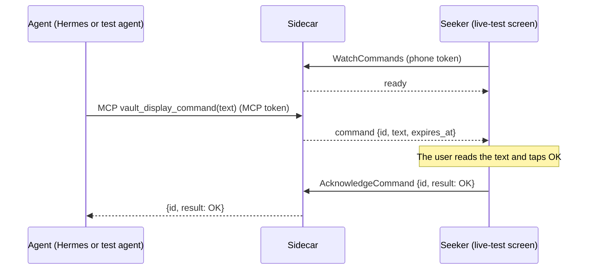
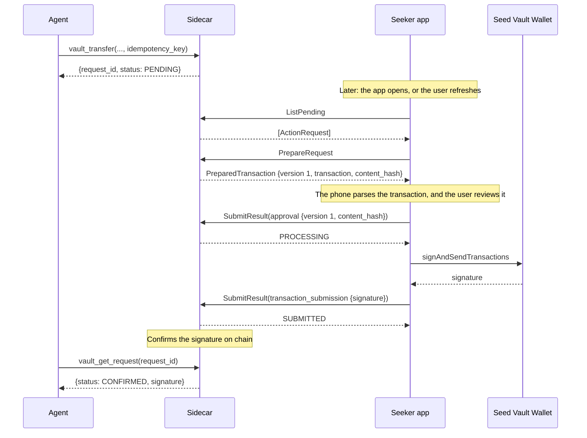
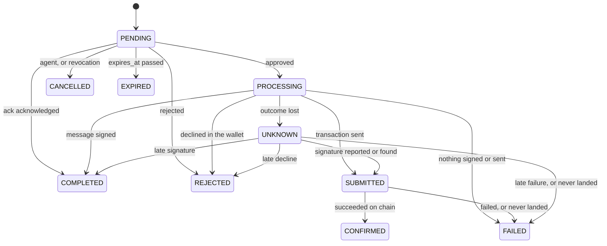

# Protocol

The phone–sidecar contract lives in [`packages/protocol/proto/`](../packages/protocol/proto) and is the single source of truth for both runtimes. This page covers the Stage 1 live diagnostic flow and the durable request workflow that starts in Stage 2: their messages, rules, and errors, the agent's MCP tools, and how the generated code is kept in sync. How the parts fit together is in [`architecture.md`](architecture.md).

## Stage 1: the live diagnostic flow

The live diagnostic flow is a display-only round trip that proves the transport before any wallet work. An agent's text appears on the Seeker, and the user's OK goes back to the agent.



The contract is `LiveCommandService` in [`packages/protocol/proto/seekervault/live/v1/live.proto`](../packages/protocol/proto/seekervault/live/v1/live.proto). The sidecar serves the MCP tool `vault_display_command` and the Connect service; see [`docs/development/mcp-server.md`](development/mcp-server.md). The Android app's live-test screen is the phone side; see [`docs/development/android.md`](development/android.md).

| RPC | Kind | Purpose |
| --- | --- | --- |
| `WatchCommands` | Server stream | The live-test screen's subscription. The first message is `ready`; each later one carries a `LiveCommand`. |
| `AcknowledgeCommand` | Unary | Sends the user's `CommandAcknowledgement` for a delivered command. |

| Type | Contents |
| --- | --- |
| `LiveCommand` | `id` (a UUID assigned by the sidecar), `text` (display-only), `expires_at` (the deadline) |
| `CommandAcknowledgement` | `id` (the command's), `result` (`ACKNOWLEDGEMENT_RESULT_OK`) |
| `LiveCommandError` | Why a command did not complete (see [Errors](#errors)) |

## Rules

- **Text is display-only.** The phone shows `text` verbatim as plain text. It is never code, markup, a link to follow, or an instruction for the phone to execute.
- **Text must be valid.** It has to be well-formed Unicode, not empty or whitespace-only, and at most 4096 UTF-8 bytes. The limit counts bytes, not characters: `€` counts as 3 and `😀` as 4. Anything else fails with `INVALID_TEXT`.
- **There is one watcher.** The phone watches only while the live-test screen is in the foreground. A new `WatchCommands` call replaces the current watcher: the older stream ends with `canceled`, and its in-flight command is cancelled.
- **There is one in-flight command per sidecar.** While a command waits for its acknowledgement, a second one is refused with `BUSY`. There is no queue.
- **Every command has a deadline.** `expires_at` is the send time plus `LIVE_COMMAND_TIMEOUT_SECONDS`, which can be 1 to 3600 and is 60 in `.env.example`.
  - The command is live strictly before `expires_at` and timed out from that instant on, so an acknowledgement at exactly `expires_at` gets `TIMEOUT`.
  - The sidecar sets deadlines to the millisecond. Both runtimes compare them to the nanosecond.
- **Acknowledgements are checked against two things only:** the in-flight command, and the outcome of the most recently finished one.
  - For the in-flight command before its deadline, the acknowledgement is accepted, and the MCP call returns `{id, result: OK}`.
  - For the in-flight command at or after its deadline, the result is `TIMEOUT`.
  - For the most recently finished command, a repeated acknowledgement succeeds with no second effect if that command was acknowledged. Otherwise it gets that command's `TIMEOUT` or `CANCELLED`.
  - For any other ID, the result is `UNKNOWN_COMMAND`.
- **Nothing is durable.** There is no backlog, replay, persistence, or pending-request API. A sidecar restart loses the in-flight command, and a reconnecting phone never receives a command sent before it connected.

The rules are implemented without I/O in [`packages/server-sdk/src/live/command.ts`](../packages/server-sdk/src/live/command.ts) as `invalidTextReason`, `isExpired`, and `LiveCommandSlot`. [`packages/server-sdk/src/live/bridge.ts`](../packages/server-sdk/src/live/bridge.ts) adds the in-memory waiter around them: deadline timers, the watcher, and cancellation. On Android, the deadline check is `LiveCommand.isExpiredAt` in [`LiveCommandDeadline.kt`](../apps/android/app/src/main/java/io/github/brrenat/seekervault/live/LiveCommandDeadline.kt).

## Errors

| `LiveCommandError` | When | What the agent sees (MCP) | What the phone sees (Connect code) |
| --- | --- | --- | --- |
| `OFFLINE` | No phone is watching when the agent sends. The command fails at once and is not stored. | Tool error `OFFLINE` | Nothing |
| `BUSY` | Another command is already in flight. | Tool error `BUSY` | Nothing |
| `TIMEOUT` | No acknowledgement arrived before `expires_at`. | Tool error `TIMEOUT` | `deadline_exceeded` on a late `AcknowledgeCommand` |
| `CANCELLED` | The agent cancelled the call, the phone disconnected or was replaced, or the sidecar shut down. | Tool error `CANCELLED` | `canceled`: the replaced stream ends, and a late `AcknowledgeCommand` fails |
| `UNAUTHENTICATED` | The token for the endpoint is missing or wrong. The MCP token is refused on the phone RPCs, and the phone token on `/mcp`. | HTTP 401 on `/mcp` | `unauthenticated` |
| `UNKNOWN_COMMAND` | An acknowledgement names an ID the sidecar isn't tracking. | Nothing | `not_found` |
| `INVALID_TEXT` | The text breaks the text rules. | Tool error `INVALID_TEXT` | Nothing |

The transport itself can also produce `deadline_exceeded`, `canceled`, and `unavailable`: for example, a client-side deadline, a cancellation, or an unreachable sidecar. The phone treats `unavailable` and a failed stream as disconnected.

On the wire:

- **MCP success:** the tool result carries `structuredContent: {"id", "result": "OK"}`.
- **MCP failure:** the result has `isError: true`, and its text is `"<CODE>: <message>"`, for example `BUSY: another live command is in flight`. It carries no `structuredContent`, because MCP clients validate that field against the success schema.
- **A replaced phone stream** ends with `canceled`.
- **A sidecar shutdown** ends the stream with `unavailable`.

## Authentication

Stage 1 uses two separate development bearer tokens from `.env`:

- `MCP_TOKEN` for the agent-facing `/mcp` endpoint
- `PHONE_TOKEN` for `LiveCommandService`

Each is sent as `Authorization: Bearer <token>`, never in a URL, and never logged. The sidecar listens on loopback only, compares tokens in constant time, and checks the Host and Origin headers on `/mcp`; see [`docs/development/mcp-server.md`](development/mcp-server.md#endpoints).

`PHONE_TOKEN` stays with the live diagnostic. From SAW-011 on, the durable workflow authenticates the phone with the credential it gets from [pairing](#pairing), and `MCP_TOKEN` opens `/mcp` only; see [roles](#roles).

## Why a stream, and what Stage 2 changes

`WatchCommands` is a diagnostic stream that exists only while the live-test screen is open. It is not a background service, a persistent session, or a bidirectional channel.

Stage 2 introduces a separate, durable request workflow over unary RPCs; see [Stage 2: durable requests](#stage-2-durable-requests). Its requests are stored, fetched when the app opens, and survive restarts. That workflow doesn't depend on this stream, and the stream doesn't become mandatory product infrastructure.

## Stage 2: durable requests

From Stage 2 on, agents propose actions that are stored and decided later. SAW-009 defines the contract:

- the phone's side in [`packages/protocol/proto/seekervault/request/v1`](../packages/protocol/proto/seekervault/request/v1)
- the agent's side as the [MCP tools](#agent-api-mcp) below
- the rules as pure code in [`servers/mcp-server/src/requests/`](../servers/mcp-server/src/requests)

SAW-010 serves the workflow:

- **Storage:** the sidecar stores requests in SQLite; see [storage and lifecycle](development/mcp-server.md#storage-and-lifecycle).
- **Endpoints:** it serves `vault_get_request`, `vault_cancel_request`, and `RequestService`, and the demo tool `vault_request_ack` when `MCP_DEMO_TOOLS=true` (SAW-014).

SAW-011 adds [pairing](#pairing) and [separate roles](#roles). The operator shows the phone a one-use pairing code, and the phone exchanges it for a connection and a credential. Only that credential opens `RequestService`. [`docs/security.md`](security.md) explains the model.

SAW-013 adds the phone's inbox, and SAW-014 validates the workflow end to end ([`docs/testing/stage-2.md`](testing/stage-2.md)).

SAW-015 opens Stage 3 with [the wallet binding](#the-wallet-binding): the phone publishes the wallet the owner selected, and agents read it with `vault_get_address`. Creating a wallet action now checks it: `WALLET_NOT_CONNECTED` when the owner has connected none, and `WALLET_MISMATCH` when the action names another wallet or network.

SAW-016 adds the first wallet action, `sign_message`: `vault_sign_message` creates the request, the owner approves it by hand on the phone, the wallet signs, and the sidecar verifies the signature before it accepts it ([message results](#message-results); [`docs/guides/message-signing.md`](guides/message-signing.md)). `vault_get_capabilities` says what a sidecar actually serves. The tools for transfers and swaps, and `PrepareRequest`, still arrive with Stages 4 and 6.



The queued acknowledgement (`ack`) takes a short path: `ListPending`, then `SubmitResult(acknowledgement)`, which completes it. There is no preparation and no wallet.

| Module | Rules |
| --- | --- |
| [`action.ts`](../packages/server-sdk/src/requests/action.ts) | `invalidActionReason` (every kind's required fields and formats), `parseBaseUnits`, `isAddress`, `messageBytes`, `invalidNoteReason` |
| [`identity.ts`](../packages/server-sdk/src/requests/identity.ts) | `checkRef` (connection scope), `invalidIdempotencyKeyReason`, `actionFingerprint`, `resolveIdempotency` |
| [`lifecycle.ts`](../packages/server-sdk/src/requests/lifecycle.ts) | `TRANSITIONS`, `canTransition`, `isTerminal`, `successState`, `resultTarget`, `decideResult` (results and approval binding), `isOverdue` |

### Connections and request identity

- **A connection is one phone paired with one sidecar.** The sidecar assigns its `connection_id` at pairing (`PairingService.Pair`). A sidecar has one active phone connection at a time (SAW-011), and a phone can have connections to several sidecars.
- **A request belongs to one connection for good.** The sidecar binds a new request to the active connection when it stores it. With no phone paired, creation fails with `NOT_PAIRED`, and nothing is stored.
- **A request ID is unique only within its connection,** and two sidecars can issue the same one. So every `RequestRef` carries both IDs:
  - The phone keys its records by both.
  - Every phone RPC names both. The sidecar answers a reference to another connection with `NOT_FOUND`, the same as for a request that doesn't exist.
- **Both IDs are lowercase UUIDs,** assigned by the sidecar.
- **Revoking a connection stops its phone credential at once, and cancels its PENDING requests.** The phone revokes with `RevokeConnection`, and the operator with `pnpm pair revoke`. Pairing a new phone revokes the previous one. Requests already approved are still resolved from the chain, and agents can still read every request. A new pairing is a new connection: it can't see or report the old connection's requests.
- **One private FCM target may belong to an active connection (SAW-055).** The paired phone alone registers or rotates it through that connection's credential. Replacement or revocation deletes it; it is never shared between connections or returned by an API.
- **An FCM message is only a content-free invalidation (SAW-056).** After a request event commits, a configured sidecar may send the connection's current Firebase Installation ID exactly `kind=request_invalidation` and `version=1`. The message names no request, connection, state, credential, policy, content, transaction, approval, or signature. Android responds only by running authenticated Sync; the payload is never authority.

### Actions

| Kind (`Action.kind`, MCP `action`) | Stage | Parameters | Bound to | Succeeds as |
| --- | --- | --- | --- | --- |
| `ack` | Development and demo only (SAW-010, SAW-014) | `text`, display-only, under the Stage 1 text rules | Nothing | `COMPLETED` |
| `sign_message` | 3 | `wallet`, and the message as `text` or `data`, 1 to 4096 bytes | The wallet | `COMPLETED`, with the signature |
| `transfer` | 4 | `wallet`, `network`, `recipient`, `asset`, `amount` | The wallet and network | `CONFIRMED` |
| `swap` | 6 | `wallet`, `network`, `input_asset`, `output_asset` (a different asset), `input_amount`, `slippage_bps` (1 to 10000) | The wallet and network | `CONFIRMED` |

Every listed field is required, and `invalidActionReason` names the first one that's missing or malformed. A request's action never changes after it's stored.

- **Amounts are integer base-unit strings:** lamports for SOL, and a mint's smallest unit for a token. They're decimal digits from `1` to `18446744073709551615` (the u64 maximum), with no sign, decimal point, exponent, whitespace, or leading zeros. They stay strings everywhere, because a JSON number loses precision above 2^53 and Kotlin reads uint64 as a signed `Long`.
- **Addresses** (`wallet`, `recipient`, a token mint) are base58 strings that decode to exactly 32 bytes.
- **An asset is `native_sol` or a `token_mint`, and never implied.** A transfer without an asset is invalid, not treated as SOL.
- **A message is signed exactly as sent.** Text is never trimmed, normalized, or re-encoded, and the wallet signs its UTF-8 bytes; data is signed as it is. Whitespace-only text is allowed, so the phone must show whitespace and invisible characters as they are (Stage 3).
- **The wallet and network are part of the action.** An agent reads them with `vault_get_address` and names them in every wallet request. Creation fails with `WALLET_NOT_CONNECTED` when no wallet is connected, and with `WALLET_MISMATCH` when the action names another one; see [the wallet binding](#the-wallet-binding). The phone signs only with the request's wallet on the request's network; otherwise it can only reject.
- **The agent's note** (`agent_note`, MCP `note`) is optional display text, at most 1024 UTF-8 bytes. It's unverified, so the phone shows it apart from the verified parameters.

### The wallet binding

The sidecar holds no keys and makes no wallet. The owner connects the wallets they already have, in the app, and chooses one saved wallet profile for each connection; the phone tells each sidecar the one **its own connection** uses, and nothing about any other (SAW-015, SEE-174; [`docs/guides/wallet-setup.md`](guides/wallet-setup.md#one-wallet-per-connection), [`docs/wiki/wallet-profiles.md`](wiki/wallet-profiles.md)). The protocol did not change for this: one binding per connection was always the model, and there is no list of wallets.

- **`WalletBinding` is a public address and a network:** `wallet` (base58), `network`, and `bound_at`. It carries no key and no wallet authorization token; the authorization stays on the phone.
- **The phone publishes it with `RequestService.PublishWallet`,** for its own connection, and only to that connection's sidecar. Choosing, changing or removing one connection's wallet publishes to that sidecar alone; adding, renaming or reconnecting a profile publishes nothing. An absent `binding` means the connection has no wallet, which is what the phone publishes when the owner removes the profile it used.
- **The phone tracks publication per connection and per binding.** At start it republishes each sidecar the binding it should already hold, which cancels nothing; a sidecar it couldn't reach is retried, and until that sidecar confirms, the phone signs nothing for its connection.
- **The sidecar stamps `bound_at` with its own clock** and ignores a value the phone sends, as it does for every other timestamp.
- **A connection has at most one binding,** and publishing replaces it. Publishing the same wallet and network again changes nothing.
- **A new binding cancels the PENDING requests it no longer fits.** Those are the wallet actions whose `wallet`, or whose `network` for a transfer or swap, isn't the new one; the response lists them, and the phone takes them off its inbox. `ack` requests are never affected. A `sign_message` request names no network, so changing only the network leaves it.
- **Each connection's binding is its own.** Two sidecars can hold two different wallets, or the same address on two networks, at once. Pairing again makes a new connection, which starts with no wallet until the owner chooses one and the phone publishes it.
- **The binding's network is one the server declares.** An up-to-date phone binds only a profile on a network in the server manifest's `direct.supported_networks`, and signs nothing for a connection whose server declares none ([supported networks](wiki/server-manifests.md#supported-networks)). A sidecar that receives a binding on a network it doesn't declare — only an older phone sends one — stores it as before and logs the mismatch.
- **Agents read it with `vault_get_address`,** which fails with `WALLET_NOT_CONNECTED` rather than inventing an address.

### Idempotency

Every creation call carries an `idempotency_key`: 1 to 128 characters from `A-Z`, `a-z`, `0-9`, `.`, `_`, `:`, and `-`. A key names one attempt at creating one request.

- **A new key** creates a request.
- **The same key with the same parameters** returns the original request as it is now, whatever its state, and creates nothing. That's how a retry after a lost response avoids a second payment.
- **The same key with different parameters** fails with `IDEMPOTENCY_CONFLICT`, naming the original request, and creates nothing. A key is never silently reused.

"The same parameters" means the same fingerprint: the SHA-256 of the action's deterministic Protobuf encoding (`actionFingerprint`). Every field of the action counts, down to each byte of a message and each digit of an amount. The note and `expires_in_seconds` aren't parameters, so a retry that rewords the note gets the original request.

Keys belong to the agent, which means the whole sidecar rather than one connection, so a retry after the phone re-paired still finds the original request. The sidecar keeps a key as long as it keeps the key's request (SAW-010).

### Lifecycle

`RequestState` is the execution state and nothing else. The phone's policy assessment (`PolicyEvaluation`, Stage 5) is a separate message: it never moves a request, and it never reaches the sidecar.

| State | Terminal | Meaning |
| --- | --- | --- |
| `PENDING` | No | Stored, and waiting for the user's decision until `expires_at` |
| `PROCESSING` | No | The user approved, and the phone is getting the wallet to sign (and, for a transaction, send). Wallet actions only. |
| `SUBMITTED` | No | The wallet sent the transaction, and the sidecar is waiting for on-chain confirmation. Transfers and swaps only. |
| `CONFIRMED` | Yes | The transaction succeeded on chain: success for transfers and swaps |
| `COMPLETED` | Yes | Success without a transaction: the user acknowledged an `ack`, or the wallet signed a message. Never used for transfers and swaps. |
| `REJECTED` | Yes | The user rejected the request in the app or declined in the wallet. Nothing was signed. |
| `CANCELLED` | Yes | Withdrawn before approval: the agent cancelled it, or its connection was revoked |
| `EXPIRED` | Yes | `expires_at` passed while the request was PENDING. Nothing was signed. |
| `FAILED` | Yes | It didn't succeed: the wallet failed before signing or sending, the transaction failed on chain, or it never landed before its blockhash expired |
| `UNKNOWN` | No | Whether the wallet signed or sent isn't known yet. The sidecar keeps resolving it, and a late report can settle it. Agents must not treat it as a failure and retry. |



These are all the allowed transitions. Anything else is refused.

| From | To | Who | When | Kinds |
| --- | --- | --- | --- | --- |
| PENDING | COMPLETED | Phone | The user acknowledged | ack |
| PENDING | PROCESSING | Phone | The user approved, and the phone is about to invoke the wallet | sign_message, transfer, swap |
| PENDING | REJECTED | Phone | The user rejected it in the app | All |
| PENDING | CANCELLED | Agent | `vault_cancel_request` | All |
| PENDING | CANCELLED | Sidecar | The connection was revoked | All |
| PENDING | EXPIRED | Sidecar | `expires_at` passed | All |
| PROCESSING | COMPLETED | Phone | The wallet signed the message | sign_message |
| PROCESSING | SUBMITTED | Phone | The wallet sent the transaction | transfer, swap |
| PROCESSING | SUBMITTED | Sidecar | It found the approved transaction on chain | transfer, swap |
| PROCESSING | REJECTED | Phone | The user declined in the wallet | sign_message, transfer, swap |
| PROCESSING | FAILED | Phone | The wallet failed before signing or sending | sign_message, transfer, swap |
| PROCESSING | FAILED | Sidecar | The approved transaction's blockhash expired, and it never landed | transfer, swap |
| PROCESSING | UNKNOWN | Phone | The phone lost track of the wallet | sign_message, transfer, swap |
| PROCESSING | UNKNOWN | Sidecar | No report arrived in time, and the chain doesn't settle it | sign_message, transfer, swap |
| SUBMITTED | CONFIRMED | Sidecar | The transaction succeeded on chain | transfer, swap |
| SUBMITTED | FAILED | Sidecar | The transaction failed on chain, or its blockhash expired before it landed | transfer, swap |
| UNKNOWN | COMPLETED | Phone | A late report delivered the signature | sign_message |
| UNKNOWN | SUBMITTED | Phone | A late report delivered the transaction's signature | transfer, swap |
| UNKNOWN | SUBMITTED | Sidecar | It found the approved transaction on chain | transfer, swap |
| UNKNOWN | REJECTED | Phone | A late report says the user declined in the wallet | sign_message, transfer, swap |
| UNKNOWN | FAILED | Phone | A late report says the wallet failed before signing or sending | sign_message, transfer, swap |
| UNKNOWN | FAILED | Sidecar | The approved transaction's blockhash expired, and it never landed | transfer, swap |

The rules behind the table:

- **No state moves backward, and nothing leaves a terminal state.** A request never returns to PENDING. Another attempt is a new request, with a new idempotency key.
- **Approval is the commit point.** The phone reports its approval, which moves the request to PROCESSING, before it invokes the wallet. It invokes the wallet only if the sidecar accepted that approval. The sidecar applies one change to a request at a time, so when the agent's cancellation and the user's approval race, exactly one wins: a cancelled request refuses the approval, and a PROCESSING request can't be cancelled.
- **Success depends on the kind.** An `ack` or a message succeeds as COMPLETED, because nothing goes on chain. A transfer or swap succeeds only as CONFIRMED: the wallet's submission is SUBMITTED, not success.
- **UNKNOWN isn't terminal.** It means the wallet may have signed or sent, and the sidecar keeps resolving it. SUBMITTED never becomes UNKNOWN either: both already mean "not settled", and the lifecycle never goes back. When a check can't account for a SUBMITTED transaction — the signature names a transaction nobody approved — the request stays SUBMITTED and its `Outcome.confirmation` says exactly that, rather than moving sideways into another unsettled state. See [confirmation](#confirmation).
- **Expiry comes first.** At or after `expires_at`, the sidecar moves a PENDING request to EXPIRED before it applies any other operation, so a late approval gets `INVALID_STATE` with the request as EXPIRED. The boundary is Stage 1's: a request is PENDING strictly before `expires_at`.
- **The sidecar never re-executes on its own.** After a restart it neither rebuilds nor resubmits anything (SAW-010).

The table is `TRANSITIONS` in `lifecycle.ts`, and its tests spell out each kind's table independently.

Not every sidecar-driven transition in it has an implementation yet. SAW-022 implements the three a signature can settle — `SUBMITTED → CONFIRMED`, `SUBMITTED → FAILED`, and expiry — and no more. The rest need the sidecar to find a transaction it was never told the signature of, which would mean searching the wallet's own history; nothing does that today, and nothing pretends to. They stay in the table as what a later stage may implement, not as something the sidecar already does.

### Two expiries

| | `ActionRequest.expires_at` | `PreparedTransaction.last_valid_block_height` |
| --- | --- | --- |
| **Bounds** | The user's decision | Whether a signed transaction can still land |
| **Measured in** | Clock time | The network's block height, set by the transaction's recent blockhash: roughly a minute or two |
| **Set by** | The sidecar at creation, from the agent's `expires_in_seconds` (60 to 604800) or the sidecar's default | The sidecar at each preparation |
| **Applies** | Only while the request is PENDING | From preparation until the transaction lands or can't |
| **When it passes** | The request becomes EXPIRED | That version can no longer be approved: the phone prepares again, and the request stays PENDING. After an approval, it decides between FAILED and UNKNOWN. |

`PreparedTransaction.estimated_expiry` is the sidecar's clock-time estimate of when the block height passes, for display only.

### Prepared transactions and approval

- **`PrepareRequest` builds a fresh unsigned transaction** for a PENDING transfer or swap. The transaction is built at review time rather than at creation, because its blockhash expires. Each call returns a new version, numbered from 1.
- **The phone parses the transaction itself** and checks it against the request, rather than trusting the sidecar's description. Stage 4 adds the parsing, and Stage 5 the policy check.
- **An approval names exactly what the wallet will sign:** the version, and the SHA-256 `content_hash` of the transaction's bytes. The sidecar accepts it only for the latest version, with the matching hash, and only while at least 15 seconds of that version's blockhash window are left. Otherwise it answers `STALE_PREPARATION`, and the phone prepares again and shows the user the new version.
- **The phone applies the same 15 seconds again, at the wallet.** Acceptance and the wallet call are not the same moment: the phone serializes wallet interactions, and the owner may be in the wallet app with something else in between. So it checks the window once more with the wallet lock held, immediately before it calls `signAndSendTransactions`, and asks the wallet nothing if the window has closed ([`docs/security.md`](security.md#approving-a-transfer-saw-021)).
- **A message approval** has `prepared_version` 0 and the SHA-256 of the message's exact bytes.
- **An `ack` or `sign_message` request has nothing to prepare,** and `PrepareRequest` answers it with `INVALID_PARAMETERS`.
- **A request the owner has already answered gets no new version.** Preparing anything but a PENDING request answers `INVALID_STATE`, so no second approval can be collected.

#### Transfers (SAW-019)

The sidecar builds a transfer itself, from the chain and the stored action. Nothing about it comes from the agent beyond the action's own fields, and no instruction the agent wrote is ever included: the shape of the transaction is fixed here.

| | Native SOL | Classic SPL token |
| --- | --- | --- |
| **Instructions** | System `Transfer` | Associated Token Account `CreateIdempotent`, always, then SPL Token `TransferChecked` |
| **Amount** | Lamports | The mint's base units, with the decimals the sidecar read from the mint |
| **Accounts** | The wallet, and the recipient | The wallet's and the recipient's associated token accounts, the mint, and the wallet as the authority |
| **Refused** | A recipient that is a token account or an executable program | A Token-2022 mint, an NFT (no decimals and a supply of one), a mint that isn't initialized, a missing or frozen token account, a balance smaller than the amount, or a recipient given as a token account rather than its owner |

- **The transaction is version 0 (`VersionedTransaction`), with no address lookup tables,** so every account it touches is written in it. The wallet is the fee payer and the only required signer, and every signature slot is empty: the sidecar holds no key and never fills one.
- **Decimals, token accounts, and the blockhash come from the chain,** never from a ticker, a name, or the agent. The associated token account is derived from the owner and the mint.
- **`CreateIdempotent` is in every token transfer, whether or not the account exists.** It costs nothing when it does, and it is what makes the destination's current owner a fact the chain checks: the associated-account program re-derives the address, reads the account, and fails the whole transaction unless its owner and mint are the recipient's. The phone reaches no chain, and a classic SPL token account's authority can be handed to somebody else after its address was derived, so without this instruction an address is only an address ([`docs/security.md`](security.md#inspecting-a-transfer)).
- **`fee_lamports`** is the endpoint's estimate for this exact message, or the base fee per signature when it won't price one. **`rent_lamports`** is what the recipient's new token account costs, and 0 when none is created; the owner is shown both apart from the amount.
- **The network is checked before anything is built.** The sidecar compares the endpoint's genesis hash with the request's network, so a mainnet request is never prepared against devnet, or the other way round.
- **The endpoint is configured as `SOLANA_RPC_URL`.** Without one, the sidecar serves no `vault_transfer`, leaves `transfer` out of `vault_get_capabilities`, and answers `PrepareRequest` for a transfer with `CHAIN_UNAVAILABLE`. The URL may carry an API key, so it never reaches a log or an error message.
- **A failed preparation changes nothing.** The request stays PENDING and can be prepared again; only a transient failure (`CHAIN_UNAVAILABLE`) is worth retrying as it is.

### Phone API

| Service | RPC | Credential | Purpose |
| --- | --- | --- | --- |
| `PairingService` | `Pair` | Pairing token | Exchange a one-use pairing token for a new connection and its phone credential |
| `PairingService` | `GetConnectionCapabilities` | Phone credential | Discover the versioned gRPC update origin for an existing connection (SAW-048) |
| `PairingService` | `SetFcmToken` | Phone credential | Register, rotate, or compare-clear the caller connection's private FCM direct-send target (SAW-055) |
| `PairingService` | `RevokeConnection` | Phone credential | End the caller's connection |
| `RequestService` | `ListPending` | Phone credential | The connection's PENDING requests, oldest first (by `created_at`, then `request_id`). Pages hold 50 by default, up to 100. Paging never repeats a request, and never skips one that stays PENDING. |
| `RequestService` | `GetRequest` | Phone credential | One request, in any state |
| `RequestService` | `PrepareRequest` | Phone credential | A new version of a PENDING transfer's or swap's transaction |
| `RequestService` | `SubmitResult` | Phone credential | A decision or a wallet result. It returns the request as it is afterwards. |
| `RequestService` | `CheckStatus` | Phone credential | What became of a sent transaction, read from the chain. It reaches no wallet, and returns the request as it is afterwards (SAW-022). |
| `RequestService` | `PublishWallet` | Phone credential | The wallet profile the owner chose for this connection, or none. It returns the stored binding and the requests it cancelled (SAW-015, SEE-174). |
| `UpdateService` | `Subscribe` | Phone credential | Bidirectional foreground request/state events over gRPC and HTTP/2 (SAW-048 contract; served from SAW-049) |
| `UpdateService` | `Sync` | Phone credential | Frozen, paginated reconciliation for foreground recovery, Refresh, and background work (SAW-048 contract; served from SAW-049) |

The Stage 2 `PairingService` and `RequestService` operations are unary. SAW-048 adds the separate production [`UpdateService`](#production-updates-saw-048): one bidirectional foreground RPC and one unary sync RPC, both scoped to the same paired-phone credential. The Stage 1 stream still isn't part of the durable workflow. Credentials travel only in `Authorization: Bearer <token>`. [Pairing](#pairing) and [roles](#roles) define them, and [`docs/security.md`](security.md#transport-security) covers TLS.

A `SubmitResult` carries one result:

| Result | Applies in | Moves to | Kinds |
| --- | --- | --- | --- |
| `acknowledgement` | PENDING | COMPLETED | ack |
| `rejection` | PENDING, PROCESSING, UNKNOWN | REJECTED | All. After PENDING, it means the user declined in the wallet. |
| `approval {prepared_version, content_hash}` | PENDING | PROCESSING | sign_message, transfer, swap |
| `message_signature {signature}` | PROCESSING, UNKNOWN | COMPLETED | sign_message |
| `transaction_submission {signature}` | PROCESSING, UNKNOWN | SUBMITTED | transfer, swap |
| `execution_failure {detail}` | PROCESSING, UNKNOWN | FAILED | sign_message, transfer, swap |
| `unknown_outcome {detail}` | PROCESSING | UNKNOWN | sign_message, transfer, swap |

- **Signatures are 64 bytes, and hashes 32.** From SAW-016 on, the sidecar verifies a `message_signature` against the request's wallet and its exact bytes before it accepts it; see [message results](#message-results).
- **Repeating an accepted result has no further effect.** The sidecar compares the submitted result with every result it has already stored for that request, byte for byte, and a match returns the request as it is now — the same terminal result each time, after a restart as well. The phone stores each result before it sends it, and sends it again on each refresh until the sidecar answers (SAW-013; [`docs/guides/pending-requests.md`](guides/pending-requests.md)), so a lost response costs nothing (SAW-017; [`docs/testing/wallet-lifecycle.md`](testing/wallet-lifecycle.md)).
- **A result belongs to its own connection.** `ref` names both the connection and the request, and a reference to a request another connection owns gets `NOT_FOUND`, whatever credential sent it. One connection's reply can never settle another's request.
- **Any other result for a request that has moved on** gets `INVALID_STATE`, with the request as it is now.

`decideResult` implements this table and the approval binding. SAW-010 adds storage, duplicate detection, and transactions around it.

### Confirmation

A transfer succeeds only as CONFIRMED. The wallet's `transaction_submission` says it sent something and names the signature; what became of that signature is a separate question, and SAW-022 is what answers it.

**The phone also checks for itself (SEE-165).** Everything below is the sidecar's check. Independently of it, the phone follows the same signature to the chain with its own read-only endpoint and the same standard — status, then the transaction body compared with the approved message byte for byte — and keeps what it finds on the phone. It never sends that to the sidecar, and a sidecar's later answer never rolls it back; see [wiki/chain-confirmation.md](wiki/chain-confirmation.md).

**Nothing runs on its own.** The sidecar has no background worker (AGENTS.md), so its knowledge advances when somebody asks. Two people ask, and both run the same check:

- the **agent**, every time it reads a SUBMITTED transfer with `vault_get_request`. At most one chain check per request every two seconds, so a tight polling loop gets the stored answer in between.
- the **owner**, through `RequestService.CheckStatus` from the phone. That one always checks: they asked.

**What one check does.** It reads `getGenesisHash` and compares it with the network the request is bound to. Only then does it read `getSignatureStatuses` for the reported signature, and, when there is a confirmed or finalized status, `getTransaction` for the transaction itself.

| What the endpoint says | Where the request goes |
| --- | --- |
| Confirmed or finalized, no chain error, and the transaction under it is the approved one | CONFIRMED |
| The same, with a chain error | FAILED, with the chain's own error kept |
| `processed` only | Unchanged: a processed transaction can still be dropped |
| No status, and the approved version's `last_valid_block_height` hasn't passed | Unchanged |
| No status, the window has passed, and a search of the ledger itself still finds nothing | FAILED: it can no longer land, and nothing was spent |
| The transaction under that signature isn't the approved one | Unchanged, and `matches_approval` is false |
| The endpoint timed out, refused, or answered nonsense | Unchanged, and the attempt is recorded |
| The endpoint serves another cluster, or one the sidecar doesn't know | Unchanged, and the confirmation says which cluster it was pointed at |

The rules behind it:

- **A confirmed result is checked against the approved bytes.** The sidecar fetches the transaction the chain holds under that signature and compares it with the exact `PreparedTransaction` the approval named, over the message — everything the signatures cover. A wallet's signature fills the slots the approved bytes leave empty, so that part differs and nothing else may. A transaction it can't take apart is not a match.
- **The endpoint has to be serving the request's own cluster.** The database outlives the process and `SOLANA_RPC_URL` does not, so a restart can point stored requests at another chain. There, the signature is absent and the block height is somebody else's — which together read exactly like "the transaction expired, and nothing was spent". That is a terminal answer about money that may well have moved, so the genesis hash is compared first, the same way a preparation compares it, and a mismatch settles nothing at all: no status, no transaction, and above all no block height is read.
- **A missing status is never proof.** A signature drops out of a node's status cache after a while, and an endpoint that didn't answer has said nothing at all. Only the approved transaction's own blockhash window closing, together with a search of the ledger that still finds nothing, means it can never land ([R9](https://solana.com/developers/cookbook/transactions/confirmation)).
- **A check settles a request or leaves it exactly as it was.** It never moves one backward, never returns one to PENDING, and never opens a wallet. A finished request is left alone, whatever the chain says later.
- **The result rests on one endpoint.** `Outcome.confirmation.endpoint` is the host of the configured `SOLANA_RPC_URL` — the host and nothing else, because the URL can carry an API key. There is no second opinion behind a CONFIRMED or a FAILED transfer, and the agent (`checked_with`) and the owner are both told whose word it is.
- **Nothing replaces a transaction.** A failure on chain, an expired blockhash, and an unaccountable signature are all reported as what they are. The sidecar builds no replacement, and the phone sends nothing to a wallet a second time. Another attempt is a new request, from the agent, approved by the owner.
- **An UNKNOWN transfer has nothing to look up.** The phone lost the wallet before it reported anything, so no signature exists to ask about. A check says so and changes nothing; it stays UNKNOWN ([`docs/guides/troubleshooting.md`](guides/troubleshooting.md#a-transfer-whose-outcome-is-unknown)).
- **Without an endpoint, nothing is checked.** A sidecar with no `SOLANA_RPC_URL` serves no transfer to begin with; one that had a request from before answers `CHAIN_UNAVAILABLE` to `CheckStatus`, and the request stays SUBMITTED.

`Outcome.confirmation` carries `level`, `slot`, `chain_error`, `checked_at`, `checks`, `endpoint`, `matches_approval`, and `detail`. It is stored with the request, so a signature and every unsettled attempt survive a restart of the sidecar and of the phone. `requests/confirmation.ts` decides, `storage/request-store.ts` commits, and `solana/confirmation.ts` compares the bytes.

### Message results

A `sign_message` request is the one wallet action with no transaction: it produces a signature, and nothing reaches the network (SAW-016).

- **The signed bytes are the request's own.** `messageBytes` is the text's UTF-8 encoding, or the `data` as it is. Nothing is trimmed, normalized, or re-encoded anywhere along the way, so the agent's bytes, the bytes the phone shows, the bytes the wallet signs, and the bytes the sidecar verifies against are all one and the same.
- **The approval binds to them.** The phone sends `approval {prepared_version: 0, content_hash: SHA-256(message bytes)}` before it invokes the wallet, and the sidecar refuses any other hash with `INVALID_PARAMETERS`. A different message is a different request, and a changed wallet cancels the request it no longer fits, so an approval can never carry over to something else.
- **The sidecar verifies the signature.** `message_signature.signature` must be the request's `wallet`'s Ed25519 signature over exactly those bytes (`requests/signature.ts`), or the submission is refused with `INVALID_PARAMETERS` and the request stays where it was. The sidecar holds no key and signs nothing itself: a Solana address is an Ed25519 public key, which is all verifying needs.
- **What the agent gets back** is `signature` (base58), `wallet`, and `signed_message_base64`, the exact bytes. An agent verifies the signature against those bytes rather than re-deriving the encoding.
- **A message signing is never UNKNOWN.** Nothing is broadcast, so a signature the phone never received doesn't exist anywhere: the phone reports `execution_failure`, and the request is FAILED. The `PROCESSING → UNKNOWN` transition stays in the table for transfers and swaps, which can be in doubt. The phone records such an outcome as unresolved and says so on screen, rather than presenting it as a wallet error it observed (SAW-017).
- **The wallet is asked once.** The phone invokes the wallet only between the approval and the signing result, never while sending one. Retrying delivery after a lost response, a dead network, or a restart re-sends what is already stored and opens no wallet.
- **A signature is not a transfer.** It moves nothing and settles nothing; the phone says so on the review screen, and `vault_sign_message` says so to the agent.

### Agent API (MCP)

| Tool | Stage | Input | Result |
| --- | --- | --- | --- |
| `vault_request_ack` | SAW-010; development and demo only, served with `MCP_DEMO_TOOLS=true` (SAW-014) | `text`, `idempotency_key`, `note?`, `expires_in_seconds?` | The request, PENDING |
| `vault_sign_message` | SAW-016 | `wallet`, `message` (text), `idempotency_key`, `note?`, `expires_in_seconds?` | The request, PENDING |
| `vault_transfer` | SAW-019; served only with `SOLANA_RPC_URL` set | `wallet`, `network`, `recipient`, `amount`, `token_mint?`, `idempotency_key`, `note?`, `expires_in_seconds?` | The request, PENDING |
| `vault_swap` | 6 | `wallet`, `network`, `input_asset`, `output_asset`, `input_amount`, `slippage_bps`, `idempotency_key`, `note?`, `expires_in_seconds?` | The request, PENDING |
| `vault_get_address` | SAW-015 | Nothing | This connection's wallet: `wallet`, `network`, `bound_at` |
| `vault_get_capabilities` | SAW-016 | Nothing | What this sidecar serves: `approval`, `signing`, `operations`, `wallet_connected`, and the limits |
| `vault_get_request` | SAW-010 | `request_id` | The request as it is now |
| `vault_cancel_request` | SAW-010 | `request_id` | The request, CANCELLED |
| `vault_create_pairing_link` | hosted operator convenience | Nothing | `pairing_uri` (`seekervault://pair` deep link), `https_url` (`https://<origin>/pair` landing page), `server_url`, `expires_at`, optional `replaces` |

- **A creation tool answers at once,** with the request ID and PENDING. Unlike `vault_display_command`, it never waits for the user. A stored request isn't an approved one.
- **`vault_request_ack` is served only with `MCP_DEMO_TOOLS=true`.** Without it, `tools/list` leaves it out, a call to it fails as an unknown tool, and the server's instructions don't mention it. The other tools are always served.
- **`vault_sign_message` takes the message as text,** whose UTF-8 encoding is what the wallet signs, exactly as given: 1 to 4096 bytes, never empty. There is no way to ask for bytes that aren't text, because the owner reviews every byte they sign (SAW-016). It creates the request and nothing more: no wallet is contacted until the owner approves it on their phone, and the result carries `signed_message_base64` ([message results](#message-results)).
- **`vault_get_capabilities` is read-only, always served, and never fails.** It says `approval: "manual"` — the owner decides every request, and no agent can ask for anything else — and `signing: "wallet"`, since the owner's own wallet signs and the sidecar holds no key. `operations` lists only what this sidecar serves now, so an agent treats anything missing from it as unavailable rather than trying it.
- **`vault_get_address` is read-only and always served.** It fails with `NOT_PAIRED` when no phone is paired, and `WALLET_NOT_CONNECTED` when the owner has chosen no wallet for this connection. There is no fallback address: the sidecar never makes one, and it never learns the wallet another connection uses. The owner can change or remove this connection's wallet at any time, so agents read it again rather than caching it. Its result is `{"wallet": "...", "network": "devnet", "bound_at": "2026-09-12T09:30:00.000Z"}`.
- **`vault_transfer` creates the request and nothing else.** No transaction is built, signed, or sent when it is called; the sidecar only reads the mint, so an agent hears at once about a token it can't send. The owner sees the request when they next open the app, and the transaction is built then ([transfers](#transfers-saw-019)). It is served only when the sidecar has a chain endpoint; without one it is absent from `tools/list` and from `operations`.
- **`network`** is `"mainnet"`, `"devnet"`, or `"testnet"`.
- **`token_mint`** names a classic SPL token; leaving it out sends native SOL. `asset`, `input_asset`, and `output_asset` in `packages/protocol/proto/` hold the same choice.
- **Amounts are strings, always in base units:** lamports for SOL, and the mint's base units for a token. Never a human-readable decimal.
- **`expires_in_seconds` is optional, from 60 to 604800.** Without it, the sidecar's `REQUEST_TTL_SECONDS` applies, which is a day unless configured.
- **Sizes are bounded:**
  - An ack's text follows the Stage 1 text rules, and a note is at most 1024 UTF-8 bytes.
  - A whole `/mcp` body is at most 64 KiB; a larger one gets 413.
  - Each phone API message is at most 64 KiB; a larger one gets `resource_exhausted`.
- **An agent polls `vault_get_request` until `terminal` is true.** An UNKNOWN request isn't finished, and the agent must not create a replacement for it. Neither is a SUBMITTED one: polling is also what makes the sidecar look, so a transfer reaches CONFIRMED or FAILED because somebody asked ([confirmation](#confirmation)).

Every tool returns the same view in `structuredContent`:

```json
{
  "request_id": "f7e6d5c4-b3a2-4918-8a7f-6e5d4c3b2a19",
  "action": "transfer",
  "status": "SUBMITTED",
  "terminal": false,
  "created_at": "2026-09-11T12:00:00.000Z",
  "expires_at": "2026-09-11T13:00:00.000Z",
  "updated_at": "2026-09-11T12:03:02.000Z",
  "signature": "52o3UtBit8GxCDSyYWg7HGUqyaczbx293TAEWEsEm27PwawRaPSLR2jaewh5GUpjprTeC58K3xyBA8zpAKSqz1Tg"
}
```

- **`wallet`** is the address a wallet action is bound to.
- **`network`** is the cluster an action names — `"mainnet"`, `"devnet"`, or `"testnet"` — and is absent for one that names none. A signature belongs to one cluster and to no other, so an agent reads it before writing an explorer link (SAW-023). A `sign_message` request has no network at all: nothing about it reaches a cluster.
- **`signature`** (base58) appears once there is one. It is a transaction's ID on chain for a transfer or a swap, and a signature over bytes for a message — which is not a transaction, is on no cluster, and is on no explorer.
- **`signed_message_base64`** carries a signed message's exact bytes, so the agent verifies the signature against them.
- **`detail`** is display text that explains a REJECTED, CANCELLED, EXPIRED, FAILED, or UNKNOWN request.
- **`confirmation`**, **`slot`**, **`chain_error`**, **`checked_at`**, and **`checked_with`** say what the chain was asked about a sent transaction, and when ([confirmation](#confirmation)). `checked_with` is the host of the one endpoint whose word a CONFIRMED or FAILED transfer rests on.
- **Timestamps** are RFC 3339 in UTC, with milliseconds.
- **Errors keep the Stage 1 format:** `isError: true`, text `"<CODE>: <message>"`, and no `structuredContent`.

For example, calling `vault_request_ack` twice with the same key and the same text returns the same `request_id` both times. A retry that changes the text fails instead:

```text
IDEMPOTENCY_CONFLICT: idempotency_key "deploy-2026-09-11" was already used for request 3f2a1b0c-9d8e-4f7a-8b6c-5d4e3f2a1b0c with different parameters
```

### Request errors

`RequestError` in `request.proto` gives both sides one set of names:

| `RequestError` | When | Agent (MCP) | Phone (Connect code) |
| --- | --- | --- | --- |
| `INVALID_PARAMETERS` | A field is missing, malformed, or out of range, or a signature doesn't verify | Tool error | `invalid_argument` |
| `IDEMPOTENCY_CONFLICT` | The key was already used with different parameters | Tool error | Not used |
| `NOT_FOUND` | No such request for the caller, including another connection's | Tool error | `not_found` |
| `NOT_PAIRED` | No phone is paired to bind a new request to | Tool error | Not used |
| `WALLET_MISMATCH` | The wallet or network isn't the connection's current one | Tool error | Not used |
| `WALLET_NOT_CONNECTED` | The owner has no wallet chosen for this connection on their phone (SAW-015, SEE-174) | Tool error | Not used |
| `PENDING_LIMIT` | The connection already has the most PENDING requests allowed (SAW-010) | Tool error | Not used |
| `INVALID_STATE` | The state doesn't allow the operation: for example, cancelling a PROCESSING request, or approving a CANCELLED one | Tool error | `failed_precondition` |
| `STALE_PREPARATION` | The approval isn't for the latest version, its hash differs, or the version's blockhash has expired or is about to | Not used | `failed_precondition` |
| `CHAIN_UNAVAILABLE` | No chain endpoint is configured, or the one configured didn't answer. Nothing was created and nothing was prepared (SAW-019) | Tool error | `unavailable` |
| `UNAUTHENTICATED` | The token is missing, wrong, revoked, or for the other role; or the pairing token is unknown, expired, or used | HTTP 401 | `unauthenticated` |

Every Connect error from `PairingService` and `RequestService` carries a `RequestErrorDetail`, which connect-es reads with `findDetails` and connect-kotlin with `unpackedDetails`. It holds the error and, for `INVALID_STATE` and `STALE_PREPARATION`, the request as it is now. The phone can then show what happened, rather than guess from the Connect code.

### Pairing

The operator shows the phone a pairing code, and the phone exchanges the code's token for a connection (SAW-011). [`docs/security.md`](security.md#pairing) explains the model. This section is the format.

**The pairing code** is a URI. `pnpm pair` and `vault_create_pairing_link` show it as a QR/text
deep link and as an HTTPS landing page with the same query:

```text
seekervault://pair?v=1&url=https%3A%2F%2Fmac.tailnet.ts.net&server=9fda5035-f3b4-4ec3-a68a-5e6caa02397a&token=Lq3v7Yk2Qm9XwTzR4bN8cJ1dH6fG0sA5eP-uV_iKoLw
https://mac.tailnet.ts.net/pair?v=1&url=https%3A%2F%2Fmac.tailnet.ts.net&server=9fda5035-f3b4-4ec3-a68a-5e6caa02397a&token=Lq3v7Yk2Qm9XwTzR4bN8cJ1dH6fG0sA5eP-uV_iKoLw
```

| Parameter | Meaning | Rules |
| --- | --- | --- |
| `v` | The code's version | `1`. The phone refuses any other version. |
| `url` | The server URL: where the phone pairs, and then calls | `https://`, or `http://` on `127.0.0.1`, `localhost`, or `[::1]` for development. No user name, password, query, or fragment, and a port, if given, from 1 to 65535. It's compared after normalization: a lowercase host, no default port, and no trailing slash. |
| `server` | The sidecar's lasting ID | A lowercase UUID. It survives restarts and pairings. |
| `token` | The one-use pairing token | 43 base64url characters (32 random bytes) |

The phone reads the code by the same rules as `parsePairingUri` in [`packages/server-sdk/src/pairing/uri.ts`](../packages/server-sdk/src/pairing/uri.ts), and refuses a code that breaks one.

**`Pair`** takes the pairing token as its bearer credential:

| Field | Meaning |
| --- | --- |
| `PairRequest.server_url` | The code's `url`. It must match the URL the token was issued for. |
| `PairRequest.device_name` | Optional. A name for the phone, which `pnpm pair status` shows. At most 128 UTF-8 bytes. |
| `PairResponse.connection_id` | The new connection's ID |
| `PairResponse.phone_token` | The phone's credential for this connection. The sidecar returns it this once, and keeps only its hash. |
| `PairResponse.server_id` | The sidecar's lasting ID, the same as the code's `server` |
| `PairResponse.updates` | The optional `UpdateCapability`: protocol version 1 and its gRPC origin. Absent from old sidecars and from a new sidecar that has no update listener configured. |

- **An unknown, expired, already used, or missing pairing token gets `UNAUTHENTICATED`,** with the same message in each case.
- **A `server_url` that isn't the code's URL, or a device name that's too long, gets `INVALID_PARAMETERS`,** and the token stays usable.
- **A successful `Pair` always creates a new connection,** and revokes the sidecar's previous one, since one phone is active at a time.
- **The phone never changes an existing connection because of a code.** Every code is a new pairing, even when its `server` ID is one the phone knows. The phone sends each credential only to the URL it paired with.

**`GetConnectionCapabilities`** takes the phone's credential, and its `connection_id` must be the caller's own. It lets an already-paired phone discover the same `UpdateCapability` without pairing again. A sidecar from before SAW-048 returns `unimplemented`; the phone labels that connection **Update unavailable — upgrade sidecar**, retains the existing unary RequestService, and keeps manual Refresh. A new sidecar whose HTTP/2 endpoint is not configured returns an absent capability instead, which is a configuration problem rather than a version guess.

`UpdateCapability.grpc_url` is an absolute origin with no path, query, user info, or fragment. In production it is HTTPS with a publicly trusted certificate and the same host as the paired `server_url`; only loopback development may use HTTP and another port. The credential remains the same phone token and is never sent to another host.

<a id="fcm-registration-saw-055"></a>

**`SetFcmToken` (SAW-055)** takes the phone's credential, and `connection_id` must be the caller's
own. Its `update` oneof is exactly one of:

- `token`: a current opaque FCM direct-send target. Repeating it is idempotent; a different value
  atomically replaces the old one.
- `clear_if_token`: delete the target only if the named value is still current. A delayed
  unregistration or invalid-target callback for a pre-rotation value therefore cannot erase the
  new one.

Both values are 1 through 4096 visible ASCII bytes. An invalid value gets `INVALID_PARAMETERS`
without being repeated in the error or log. Another connection ID gets `NOT_FOUND`; another role,
an absent credential, or a revoked credential gets `UNAUTHENTICATED`. The empty response returns no
target. The sidecar retains one value only for a future sender; pairing replacement, phone
revocation, and operator revocation clear it in the same database transaction that ends the
connection.

Current Firebase Messaging calls this direct-send registration value a Firebase Installation ID
and delivers initial and refreshed values through `onRegistered`; the wire name remains
`fcm_token` as the stable Stage 5.3 protocol term. The Android app serializes those callbacks and
sends the same current value to each usable sidecar separately with that connection's own URL and
credential. It stores no copy on the phone. SAW-055 itself defined no payload or send trigger;
SAW-056 adds the separate content-free invalidation below.

<a id="fcm-invalidation-saw-056"></a>

### The server manifest (SEE-88)

A server says what it is, and the phone reads it rather than assuming. The document is
[`seekervault.server.v1.ServerManifest`](../packages/protocol/proto/seekervault/server/v1/manifest.proto), and
[`docs/wiki/server-manifests.md`](wiki/server-manifests.md) is the architecture page; this section
is the contract.

| Field | Meaning | Rules |
| --- | --- | --- |
| `server_id` | The server's lasting ID | A lowercase UUID. It must be the one the connection already trusts: the pairing code's, or the feed reference's. |
| `protocol_version` | The phone–server contract it speaks | `1` is Stage 7.1. Zero is never published. A version the phone doesn't speak makes the server *unsupported*, not malformed. |
| `settings_revision` | The revision of everything else here | A positive `uint64` that changes whenever the content does and never goes backwards. |
| `mode` | `CONNECTION_MODE_DIRECT` or `CONNECTION_MODE_GATEWAY_FEED` | Never unspecified. The phone does not guess a mode, and never reads a missing one as a feed. |
| `required_plugins` | The bundled client plugins its operations need | At most 16, each a well-formed plugin ID (`jupiter.swap`) with `1 <= min_contract <= max_contract`, no duplicates. |
| `environments` | `production`, `sandbox`, or both | At least one, never unspecified, no repeats. It says which the server *serves*; the phone records which one each connection *keeps*, and the shared gateway refuses a manifest that changes the set a server ID already published (SEE-97, [`docs/wiki/environments.md`](wiki/environments.md)). |
| `display_name` | What the server calls itself | Optional; at most 64 UTF-8 bytes of printable, trimmed text. Never verified, and only ever a default label. |
| `direct.url` | Where a direct server is reached | The connection's own server URL, character for character, in the pairing code's normalized form. |
| `feed.gateway_url` | The shared gateway's origin | The origin the feed was added through, with no path, query, user info, or fragment. |
| `feed.channel` | The channel the publisher publishes on | `server/<server_id>` for this manifest's own `server_id`: a publisher may name only its own. |
| `direct.supported_networks` / `feed.supported_networks` | The Solana networks the server's wallet operations run on (SEE-174) | `SOLANA_NETWORK_MAINNET`, `_DEVNET`, `_TESTNET`; never unspecified, no repeats, canonical order ascending. Empty means **no networks declared** — never Mainnet or all — and the phone signs nothing for such a server. Inside the reference so the reference stays last in every runtime's bytes. May change on a higher revision ([`docs/wiki/server-manifests.md`](wiki/server-manifests.md#supported-networks)). |
| `feed.access` | Who may read the feed (SEE-156) | Absent means public, which is what every manifest before SEE-156 said. A restricted feed carries `FEED_ACCESS_POLICY_RESTRICTED` and the HTTPS origin its subscribers prove a wallet at. The gateway writes the field from the operator's registration, so a publisher cannot claim it and a feed reference cannot supply it (`## Restricted feeds`). |

**`PairingService.GetServerManifest`** serves it, authenticated with the phone credential and scoped
to the caller's connection like `GetConnectionCapabilities`: a `connection_id` that isn't the
caller's gets `not_found`. The response always carries a manifest.

**A sidecar from before Stage 7.1 answers `unimplemented`.** That is the legacy-direct path: the
server publishes no manifest, requires nothing, and the phone keeps calling it exactly as it always
has. It is an absence, not a failure, and the phone records it as one. Since SEE-174 it also declares
no Solana network, so an up-to-date phone reads its requests but signs nothing for it until it is
updated.

**The Node sidecar always declares `direct`,** its own public URL, no required plugins, and
`production`, with the Solana networks `SAC_SUPPORTED_NETWORKS` names (none when unset; SEE-174,
[`docs/development/mcp-server.md`](development/mcp-server.md#configuration)). Its revision is real: it is stored, and it moves by one exactly when the content the
manifest is built from changes, so restarting with the same settings republishes the same revision.

**The phone refuses a manifest rather than following it** when the identity, the origin or the mode
is not the one the connection already has, when the revision goes backwards, when the content
changed while the revision stood still, when a feed names a channel its server doesn't own, or when
anything here is malformed or unbounded. A refusal is recorded against the connection and changes
nothing about where its credential goes.

### FCM invalidation and authoritative fetch (SAW-056)

Every durable request creation or state/outcome/confirmation change already appends a complete
`update_events` row in the same SQLite transaction. Only after that row commits may the optional
dispatcher enqueue a hint for the event's connection. Failed or rolled-back writes emit nothing.
Several same-turn changes for one connection coalesce before Firebase, and a connection with no
current target or a sidecar with no configured sender sends nothing.

The complete app-visible FCM data map is:

```text
kind=request_invalidation
version=1
```

There is no notification payload and no request ID, connection ID, sidecar URL, state, timestamp,
cursor, credential, device target, policy or assessment, agent note, message-to-sign content,
transaction bytes, authorization, approval, signature, amount, recipient, or program. The Firebase
Installation ID exists only in the Admin API's `fid` routing field and is not delivered as data.
Android rejects a missing field, unknown version, unknown kind, or any additional data field.

A new PENDING request (revision one) is the only high-priority send because it is the only event
intended to become a time-sensitive user-visible notification in the completed stage. Later
state/outcome changes use normal priority. Both use a five-minute TTL and the single collapse key
`seeker-vault-request-state-v1`: if several undelivered hints compete, only the newest is needed
because every receipt requests authoritative convergence, not one operation per hint. FCM acceptance is not device
delivery, order is not guaranteed, and delivery can be delayed, throttled, collapsed, expired, or
dropped.

Receipt enqueues unique `push-authoritative-sync` WorkManager work with a connected-network
constraint, empty input, `KEEP` coalescing, and exponential retry only for transient unreachability.
A delivered high-priority message requests expedited work with fallback to ordinary work when its
quota is unavailable. The worker calls the same application-scoped, four-sidecar-bounded
synchronization repository used by Stage 5.2 and retrieves each URL and credential only from that
paired connection's stores. It does not trust or persist the FCM payload and has no operation that can
prepare, approve, answer, open a wallet, sign, send a transaction, or route a tap.

If Firebase permanently rejects the FID, the sidecar compare-clears only that exact stored value;
a rotation that won the race survives. Other Firebase errors are logged only as a fixed delivery
classification and change no request, target, or result. Foreground Subscribe, manual Refresh,
unary Sync, and periodic WorkManager remain the recovery path when FCM is absent or misses.

SAW-057 keeps `FirebaseMessagingService` inside its short callback budget: validation and durable
WorkManager enqueue are the complete message-receipt path, while every network fetch runs later in
the bounded worker. An undelivered FCM collapse key and Android's unique-work name each reduce a
burst to an invalidation, never to a request count. At worker execution, a usable connection whose
foreground stream is already Live is excluded; other usable connections enter the existing
four-sidecar-bounded, per-connection-coalescing Sync repository. A simultaneous Refresh, periodic
run, or stream reconciliation therefore awaits or buffers the same connection owner instead of
applying another independent snapshot. If every hint is dropped or Firebase is unconfigured, app
foreground reconciliation and the persisted Stage 5.2 periodic job still fetch all durable
requests.

SAW-058 still assigns no request identity to the FCM message. Only after authenticated Sync commits
does Android compare its prior and current pending-key sets and construct any notification locally.
The notification's explicit immutable activity intent names one validated connection/request pair;
it is neither a protocol credential nor an approval. Tapping performs a fresh fetch for that paired
connection. If the request is pending it can then be reviewed normally; if this phone already
answered it, the stored result is shown; and if it expired, was cancelled or answered elsewhere,
was removed, the connection was revoked, or the sidecar cannot be reached, the phone says only what
the fresh evidence supports. A tap creates no result and invokes no wallet action. The underlying
Sync retains its existing authority to retry only a result the owner already stored.

**`RevokeConnection`** takes the phone's credential, and its `connection_id` must be the caller's own; another ID gets `NOT_FOUND`. It revokes the connection at once, and cancels the connection's PENDING requests; see [connections](#connections-and-request-identity).

### Roles

Each credential opens one role:

| Operation | `MCP_TOKEN` | Pairing token | Phone credential | `PHONE_TOKEN` | None, wrong, or revoked |
| --- | --- | --- | --- | --- | --- |
| `/mcp`: every method and tool | Yes | 401 | 401 | 401 | 401 |
| `PairingService.Pair` | `unauthenticated` | Yes, once | `unauthenticated` | `unauthenticated` | `unauthenticated` |
| `PairingService.GetConnectionCapabilities` | `unauthenticated` | `unauthenticated` | Yes, for its own connection | `unauthenticated` | `unauthenticated` |
| `PairingService.GetServerManifest` (from SEE-88) | `unauthenticated` | `unauthenticated` | Yes, for its own connection | `unauthenticated` | `unauthenticated` |
| `PairingService.SetFcmToken` | `unauthenticated` | `unauthenticated` | Yes, for its own connection | `unauthenticated` | `unauthenticated` |
| `PairingService.RevokeConnection` | `unauthenticated` | `unauthenticated` | Yes, for its own connection | `unauthenticated` | `unauthenticated` |
| `RequestService`: `ListPending`, `GetRequest`, `PrepareRequest`, `SubmitResult`, `CheckStatus`, `PublishWallet` | `unauthenticated` | `unauthenticated` | Yes, for its own connection | `unauthenticated` | `unauthenticated` |
| `UpdateService.Subscribe`, `UpdateService.Sync` (from SAW-049) | `unauthenticated` | `unauthenticated` | Yes, for its own connection | `unauthenticated` | `unauthenticated` |
| `LiveCommandService`: `WatchCommands`, `AcknowledgeCommand` (Stage 1) | `unauthenticated` | `unauthenticated` | `unauthenticated` | Yes | `unauthenticated` |

- **Only the paired phone can prepare, review, or answer a request, publish a wallet, or register an FCM target,** and only for its own connection. No MCP tool prepares, approves, submits a result, registers a target, revokes, or changes the wallet, so an agent can't act as the phone. `vault_create_pairing_link` issues the same one-use code as the operator CLI; the owner still confirms on the phone, and whoever uses the code first becomes the paired phone. `vault_sign_message` only stores a request for the owner to decide; `vault_get_address` and `vault_get_capabilities` only read.
- **`PHONE_TOKEN` is the Stage 1 development credential.** It opens the live diagnostic and nothing else.
- **`GET /healthz` needs no credential.**
- **`GET /pair` needs no credential.** It is the HTTPS landing page for a pairing code; the secret is the token in the query, the same as the QR.
- `servers/mcp-server/src/pairing/roles.test.ts` checks every cell, and every new RPC or tool joins that test.

### Compatibility with Stage 1

The durable contract leaves the live diagnostic as it was.

| | Live diagnostic (`seekervault.live.v1`) | Durable requests (`seekervault.request.v1`) |
| --- | --- | --- |
| **The agent's call** | `vault_display_command` waits for the user's OK, up to its deadline | Creation returns PENDING at once, and the agent polls `vault_get_request` |
| **The phone** | A server stream while the live-test screen is open | Unary RPCs whenever the app fetches |
| **Storage** | None: one in-flight command, and nothing replayed | Stored, and survives restarts (SAW-010) |
| **Errors** | `LiveCommandError` | `RequestError` |
| **Credentials** | `MCP_TOKEN` and `PHONE_TOKEN` from `.env` | `MCP_TOKEN`, and the phone credential from [pairing](#pairing) (SAW-011) |

- **Neither package imports the other,** and the live service keeps its two RPCs. `packages/server-sdk/src/requests/live-compat.test.ts` checks both.
- **`buf breaking` against the previous commit passes,** so no live message or field changed.
- **`vault_display_command` and its tests are unchanged.**
- **The durable rules reuse two live rules without changing them:** an `ack`'s text follows `invalidTextReason`, and `expires_at` has `isExpired`'s boundary.

<a id="production-updates-saw-048"></a>

## Production updates (SAW-048–SAW-053)

The production update contract is [`seekervault.update.v1.UpdateService`](../packages/protocol/proto/seekervault/update/v1/update.proto). It carries durable request state and is deliberately unrelated to `LiveCommandService`: closing an update stream loses no request, and no agent call waits for one. SAW-048 defines and proves the transport; SAW-049 serves it from the durable sidecar; SAW-050 gives Android one persistent, headless reconciliation path; SAW-051 owns the foreground streams; SAW-052 calls the same unary path from one unique, network-constrained periodic WorkManager job; and SAW-053 validates that joined path across real sidecar processes, the MCP client, and the production Android transport.

| RPC | Wire protocol | Lifetime | Purpose |
| --- | --- | --- | --- |
| `Subscribe(stream SubscribeRequest) returns (stream SubscribeResponse)` | gRPC over HTTP/2 | One per usable paired connection while the app process is foreground | Server readiness, replay/live request changes and removals, revocation, sync-required signals, and bidirectional liveness |
| `Sync(SyncRequest) returns (SyncResponse)` | Unary gRPC over HTTP/2 | One bounded call at a time per connection | A frozen, paginated view for first connection, missed-event recovery, Refresh, and periodic WorkManager runs |

Every client and server message repeats `connection_id`, and every RPC carries that connection's phone credential. The server authenticates first and answers a mismatched connection, reference, cursor, snapshot, or page token as `not_found`. There is no cross-connection cursor and no process-global phone stream.

### Stream start, resume, and the snapshot barrier

The ordering is the part that prevents a mutation from falling between “list” and “listen”:

1. The phone opens `Subscribe` and sends exactly one `subscribe {protocol_version: 1, resume_cursor, server_instance_id}` as its first message. The server authenticates and registers the stream before it chooses the barrier cursor `B`.
2. The first server message is `ready` at `B`, with the process's random `server_instance_id`, the resume disposition, heartbeat interval, 65,536-byte message limit, and page limit.
3. With a retained cursor for that same instance, `resume` is `REPLAYING`. The server sends every durable `request_changed` or `request_removed` after the supplied cursor through `B`, in cursor order, then `replay_complete {through_cursor: B}`. Live events after `B` follow. Nothing is listed separately, so there is no replay/snapshot overlap.
4. With no cursor, another instance ID, malformed/expired history, or a bounded-buffer overflow, `resume` is `FULL_SYNC_REQUIRED` and `sync_required` names the reason. The stream remains registered and the phone buffers later mutation events rather than closing the subscription.
5. The phone starts `Sync` with `subscription_cursor: B`. When the sidecar begins page one it freezes a snapshot at high-water cursor `S`, after its store contains every mutation through `B`. Every page has the same `server_instance_id` and `snapshot_cursor: S`.
6. Only after the final page arrives does the phone reconcile removals and absence from the complete pending set. It applies the snapshot, drops buffered events at or before `S`, and applies events after `S` in stream order. A mutation at or before `S` is therefore in the snapshot; a mutation after `S` is on the already-registered stream. There is no interval in which it can be in neither.

If paging fails, the phone keeps its previous cache, abandons the incomplete snapshot, and starts page one again. `next_page_token` is opaque, connection- and instance-bound, at most 256 UTF-8 bytes, and has a two-minute inactivity lease renewed after every valid page; idle expiry or restart is `failed_precondition` with `UpdateErrorDetail.SNAPSHOT_INVALID`. An unsupported update protocol is also `failed_precondition`, but its `UpdateErrorDetail.PROTOCOL_UNSUPPORTED` keeps it distinct: a cached endpoint becomes upgrade-required and the foreground owner does not reconnect forever. Page size is 50 by default and at most 100, but the server returns fewer entries when another one would cross the message limit. The phone accepts up to 10,100 pages, the protocol maximum of 10,000 pending requests plus 100 named nonterminal Activity records even when the message bound permits only one item per page.

The server is not a general event platform. Version 1 uses a durable per-connection mutation sequence, retains the newest 512 events, and keeps at most four short-lived frozen snapshots for a connection. Creation and every durable state, outcome, confirmation, wallet-binding cancellation, expiry, and revocation append their complete current form in the same SQLite transaction as the source mutation; a duplicate or failed operation appends nothing. Only after that commit may a subscriber read the event. Snapshot items are frozen on disk rather than held as an unbounded in-memory list. A process restart deliberately changes `server_instance_id`, invalidates cursors/page tokens, and causes a full sync; the database remains authoritative.

### Events, revisions, and liveness

`SubscribeResponse` has one event:

| Event | Meaning |
| --- | --- |
| `ready` | The subscription is registered at its barrier, and names the selected limits and resume path. |
| `request_changed` | The complete current `ActionRequest` and a nonzero per-request revision. It covers creation and every state/outcome/confirmation change, including cancellation, expiry, completion, rejection, failure, submission, confirmation, and UNKNOWN. |
| `request_removed` | A revisioned request reference the sidecar no longer retains or can account for. It removes server cache state, never the owner's Activity record or locally stored decision. |
| `revoked` | This connection was revoked. The phone deletes its credential and no reconnect is attempted. |
| `sync_required` | Initial state, invalid cursor, retained-history gap, bounded-buffer overflow, or invalid snapshot requires the unary recovery above. |
| `heartbeat` | Liveness only, echoing the last client heartbeat sequence. It acknowledges no mutation and commits no cursor. |
| `replay_complete` | Every retained mutation through its cursor preceded this marker; following mutations are live. |

Cursors are opaque and used only in the order the sidecar sends them. A phone durably stores the last applied cursor and each request revision. An event with the same or an older revision is a duplicate/stale delivery and changes nothing; a gap, unknown event/enum, state rollback, or conflicting equal revision triggers full sync. A newer stream generation owns delivery, so an event from an older canceled stream cannot overwrite the newer one.

`ready` chooses a heartbeat interval from 15 through 60 seconds; version 1 defaults to 30. After one quiet interval each peer sends a heartbeat, and after three intervals without any answer it closes the call. Client sequences increase within the stream; repeating one is harmless and decreasing one is invalid. Heartbeats, IDs, cursors, page tokens, and all request events count toward the 65,536-byte per-message limit. There is no application ping faster than 15 seconds.

Caller cancellation is final for that foreground generation: the Kotlin client closes the receive side, which cancels the OkHttp HTTP/2 call and reaches the Node handler's abort signal. It must not itself schedule a reconnect. A later lifecycle owner may reconnect after a network failure with bounded exponential backoff, but navigation/rotation handoff, background transition, connection deletion, revocation, and explicit cancellation are not retry failures.

Android keeps the client send side open after its initial subscribe and sends its durably applied cursor with each heartbeat. Any server message resets its quiet timer. Three unanswered negotiated intervals close the call — 45 seconds at the minimum 15-second interval and 180 seconds at the maximum 60-second interval — after which the foreground owner retries from one second up to a 30-second cap with jitter. A normal event has no polling delay: expected screen delivery is one HTTP/2 transit plus validation and one atomic cache write, subject to network and Android scheduling. No wall-clock delivery guarantee is claimed.

### What `Sync` reconciles

Page one names up to 100 unique `known_nonterminal` records from the owner's Activity history, each by `RequestRef`, last revision, and observed state. The frozen response is the de-duplicated union of:

- every request that is PENDING at `S`, so the pending cache/count can be made exact; and
- the current server form of every named nonterminal Activity request, even when it is no longer pending, so SUBMITTED, UNKNOWN, CONFIRMED, FAILED, COMPLETED, CANCELLED, EXPIRED, and REJECTED outcomes reach Activity without a screen-specific fetch.

A named reference the sidecar no longer has appears in `removed`. At the final page, a cached PENDING request absent from the snapshot is removed from the pending cache, but a locally stored answer or Activity record is retained. Automatic sync never replaces authoritative owner data with “nothing.” More than 100 nonterminal Activity records are sent in subsequent sync sessions; every complete session is internally consistent, and revisions prevent an older chunk from rolling a newer record back.

Starting a sync also triggers confirmation for eligible SUBMITTED or UNKNOWN transfers in that supplied set. Version 1 checks at most four concurrently, rotates the remainder through `confirmation_deferred`, and gives every check the existing 20-second chain-operation budget. It uses exactly the [confirmation](#confirmation) rules: read the request's own cluster, verify the transaction against the approved bytes before settling, leave silence/mismatch unchanged, and never prepare, sign, send, resubmit, open a wallet, or contact a chain from the phone. This is automatic read-only observation, not automatic action.

Stream events and sync responses contain requests and server state only. They never contain the phone's policy, assessment, wallet authorization, or unacknowledged local answer. Reconciliation may retry existing idempotent result delivery through the existing path; it may not invoke a wallet or turn a policy verdict into an answer.

### Endpoint and compatibility

Pairing URI version 1 stays unchanged. A new `PairResponse.updates`, or `PairingService.GetConnectionCapabilities` for an already-saved connection, advertises `UpdateCapability {protocol_version: 1, grpc_url}`. Old phones ignore the new field. New phones talking to an old sidecar get `unimplemented` from capability discovery and show an explicit upgrade-required state while leaving the old unary `RequestService` and manual Refresh usable.

`grpc_url` is an origin, not a new trust domain. In production it is HTTPS with a publicly trusted certificate and the same host as the paired URL; only loopback development can use HTTP and a different port. The production Node secure listener negotiates `h2` and `http/1.1` by ALPN (`allowHTTP1`): gRPC updates use HTTP/2, while existing Connect unary, pairing, health, and MCP clients remain compatible. A TLS terminator/reverse proxy is valid only when it preserves gRPC HTTP/2 to this listener; silently downgrading `Subscribe` to polling or server-only streaming is not compatibility.

The proof in `GrpcBidiInteropTest` uses the pinned Connect Kotlin 0.9.0 client and OkHttp 5.4.0 against the pinned Connect Node 2.2.0 adapter on the real loopback h2c development transport, with HTTP/2 prior knowledge rather than an HTTP/1 fallback. It sends subscribe, receives ready, sends and receives two heartbeats in alternation while the Kotlin send side is still open, and asserts the Node handler saw protocol `grpc` and HTTP version `2.0`. Its second case closes the Kotlin receive side and asserts one Node stream observes cancellation and no replacement stream starts. SAW-049's sidecar tests separately use the Node gRPC client against the actual secure production listener and its loopback h2c development mode, including TLS/ALPN, the deployed capability origin, and preserved HTTP/1 routes. No dependency change was required.

### Joined-path acceptance (SAW-053)

`pnpm test:updates` is the repeatable Stage 5.2 acceptance entry point. It is intentionally separate from `pnpm test:hello`: the latter remains the Stage 1 display-only diagnostic and is not evidence that durable updates work. The update suite starts real sidecar processes and uses the real MCP SDK client, durable SQLite queue, production Node gRPC service, generated protocol clients, production Android transport, persistent sync repository, and foreground lifecycle owner.

The sidecar portion covers the secure TLS/ALPN HTTP/2 listener and loopback h2c development listener, authentication and isolation, durable publication, replay, frozen paging, restart and retention-gap recovery, revocation and cleanup, and bounded read-only confirmation without `CheckStatus`. The Android joined cases use explicit HTTP/2 prior knowledge only for the advertised loopback `http://` development endpoint; deployed `https://` endpoints retain normal certificate and host validation plus ALPN. They prove foreground delivery without Refresh, two-sidecar isolation, background stream closure and foreground recovery, a worker-only process loading and persisting unary Sync, expiry across restart, bounded retry, and idempotent delivery of a result already recorded by the owner.

The suite deliberately does not simulate a push wake-up, wallet action, or transaction send. Periodic WorkManager runs are eligible no more often than Android's 15-minute minimum and can be deferred by the OS; Force stop suppresses them until the owner reopens the app. Stage 5.2 therefore has no immediate background-delivery guarantee. Push-triggered reconciliation is the separate follow-up [SEE-73](https://linear.app/seekeragentwallet/issue/SEE-73).

## The common request envelope (SEE-108)

[`seekervault.request.v2.Request`](../packages/protocol/proto/seekervault/request/v2/request.proto) is the
source-authored contract for a private request and a feed signal. It contains:

| Part | Rule |
| --- | --- |
| `identity` | The source, source-owned scope and stable request ID form the identity. A private and feed ID cannot collide because their scopes and audiences differ |
| `lifecycle` | Positive ordered revision, explicit status, creation/update times and an absolute expiry. A legacy direct request adapts its immutable content as revision 1 and exposes its durable direct status |
| `presentation` | Bounded unverified title and description plus `REQUEST` or `SIGNAL`. Signal is presentation, not an action |
| `action` | Capability ID and version, a bundled-plugin compatibility name, and bounded typed parameters |
| `owner_inputs` | The shapes and bounds of values chosen locally. An owner's answer is never source-authored |
| `audience` | One private recipient or one publisher-owned feed channel |
| `result_handling` | `RETURN_TO_ORIGIN` for the authenticated direct adapter or `DEVICE_LOCAL` for a feed |

There is no field for a selected wallet, owner answer, decision, prepared bytes, signature,
execution outcome, subscriber or credential. There is no code or URL field: a plugin name is
resolved only against code compiled into the client. The Android boundary test pins this complete
field set, and the gateway rebuilds accepted messages so unknown protobuf fields are not relayed.

The direct sidecar adapter assigns identity and lifecycle through its existing `RequestStore`; MCP
tool contracts, `PrepareRequest`, `SubmitResult` and result retry do not change. The feed adapter
requires a feed audience, `SIGNAL`, and `DEVICE_LOCAL`. The publisher write listener and subscriber
read listener remain different services. See
[`docs/wiki/common-requests.md`](wiki/common-requests.md).

## Shared proposals (SEE-89; v1 compatibility)

A publisher broadcasts an operation once and everyone subscribed receives the same document. That is
a different contract from the durable request above, and it is a separate package:
Stage 7.1 first shipped
[`seekervault.proposal.v1.Proposal`](../packages/protocol/proto/seekervault/proposal/v1/proposal.proto). SEE-108
retains it as a compatibility representation of a feed-audience common request; the revision,
identity, terms, cancellation and retention rules below are unchanged.
[`docs/wiki/shared-proposals.md`](wiki/shared-proposals.md) is the architecture page; this section is
the contract.

| Field | Meaning | Rules |
| --- | --- | --- |
| `server_id` | The publisher's lasting ID | A lowercase UUID, and the one whose feed it arrived on. |
| `channel` | The channel it was published on | `server/<server_id>` for this document's own `server_id`: a publisher may name only its own. |
| `proposal_id` | The publisher's ID for this proposal | A lowercase UUID, stable for as long as the proposal exists. |
| `revision` | The revision of everything else here | A positive `uint64` that changes whenever the content does and never goes backwards. |
| `operation` | What is proposed | An operation name at the protocol's own level (`swap`), never a provider's. |
| `plugin_id` | The bundled plugin it was written for | A well-formed plugin ID. It is checked against the plugin the phone resolves for the operation, never used to select one. |
| `status` | `PROPOSAL_STATUS_OPEN` or `_CANCELLED` | Never unspecified, and a missing status is not read as open. |
| `created_at`, `updated_at` | The publisher's clock | `updated_at` is not before `created_at`; ordering is the revision's job, not a clock's. |
| `expires_at` | When nothing more is executed from it | Required and absolute, and strictly after `created_at`. |
| `publisher_note` | The publisher's own description | Optional; at most 1024 UTF-8 bytes of printable text (a line break is text). Unverified, and shown apart from anything the phone established. |
| `values` | The operation's common terms | At most 32 entries, each key a lowercase name unique in the list, each text at most 512 UTF-8 bytes. |

**There is no per-proposal protocol version.** Which contract a publisher speaks is in its
`ServerManifest`, and a phone holds no feed without having validated that manifest first.

**There is nothing in it about a subscriber** — no address, no chosen quantity, nothing prepared to
sign — and the phone's boundary check reads the proto and fails if the field set changes.

**A proposal is delivered, never fetched per phone.** The transport is the shared gateway (SEE-90)
and its stream (SEE-91); the phone subscribes to a channel, and that is the whole of what the
gateway learns. Delivery is not trustworthy about repetition, so the phone's apply path is
idempotent: the same revision with the same terms writes nothing, a lower revision is refused, a
higher one replaces the publisher's half and leaves the device's decisions where they were, and the
same revision with different terms is a contradiction the phone stops acting on.

**Nothing goes back.** For a `gateway_feed` connection the phone calls no `PublishWallet`,
`PrepareRequest` or `SubmitResult`, and uploads no outcome through `UpdateService.Sync`: all of them
are gated on `Connection.usable`, which requires the direct mode (SEE-88). The owner's parameters,
their approval and their execution record stay on the device that made them.

### A swap signal's terms (SEE-93)

`values` is bounded, named text and the protocol says nothing about what the names mean: which keys
an operation uses belongs to the plugin that serves it, and core carries them uninterpreted. The
first plugin to define a set is `jupiter.swap`, and it is written down as a contract because the
CopyTrading publisher template writes it (SEE-95,
[`wiki/copytrading-template.md`](wiki/copytrading-template.md)) and applies every one of these
rules before anything is broadcast:

| Key | Meaning | Rules |
| --- | --- | --- |
| `input_mint`, `output_mint` | The asset spent and the asset received | An exact base58 32-byte mint, never a ticker; native SOL is the wrapped mint spelled out; the two differ. |
| `input_decimals`, `output_decimals` | Base units per whole token | 0 to 18, and for display only — nothing is compared in them. |
| `max_slippage_bps` | The most the publisher will have its signal acted on with | 1 to 10000. The owner chooses at or below it. |
| `least_input`, `most_input` | Optional bounds on the amount, in the input mint's base units | Whole numbers; a floor above the ceiling is refused. |
| `input_symbol`, `output_symbol` | Optional labels | At most 16 characters, shown as the publisher's word and never believed. |

**Direction is the pair**, ordered, with no separate side field: one that could disagree with the
pair eventually would. **An asset is a mint**, because a ticker names several things on this chain
and nothing off it — there is deliberately no way to propose "buy Bitcoin", only a specific wrapped
mint. A key this plugin does not read is ignored rather than refused, and is never consulted.

What is *not* in the terms is the amount, the slippage the owner settles on, or anything about a
subscriber. Those are chosen on the phone and stay there
([`wiki/jupiter-swap.md`](wiki/jupiter-swap.md)).

### A prediction market's terms (SEE-94)

The second set, for `jupiter.prediction`, and the striking thing is how little of it there is:

| Key | Meaning | Rules |
| --- | --- | --- |
| `market_id` | The provider's identifier for the market | A bounded identifier of letters, digits and `._:-`; never a URL or anything loadable. |
| `event_id`, `provider` | The event it belongs to, and its source | Optional, and cross-checked against what the provider says about the market. |
| `deposit_mint`, `deposit_decimals` | The token a stake is deposited in | One of the two the provider takes, as an exact base58 mint; 0 to 18 units, display only. |
| `least_deposit`, `most_deposit` | Optional bounds, in base units | Whole numbers; the provider's own five-dollar minimum is a floor under both. |
| `deposit_symbol` | An optional label | At most 16 characters, unverified. |
| `provider_deep_link`, `provider_web_url` | Where the provider's own app and site keep this market (SEE-157) | Optional. A bounded absolute address, at most 512 bytes; `https` with a host, or a private scheme an app claims. Never `http`, `javascript:`, `data:`, `file:`, `content:` or `intent:`, and never with a credential in it. |

**The two addresses are the only thing in the document that leaves the phone**, and they are
believed about their *shape* and nothing else (SEE-157). A publisher reads the venue's listing and
so knows the page a market is actually at; a phone knows only the market identifier. What core
checks is that the value is an address something could be handed — the rules in the table above.
Whose address it is, the *execution provider* decides: its adapter accepts one only when it is on
its own property, and otherwise ignores it and builds its own. So a publisher can improve where an
owner lands and cannot change who they land on
([`wiki/jupiter-prediction.md`](wiki/jupiter-prediction.md#where-the-owner-continues)).

**A publisher names which market and is believed about nothing else.** Whether it is open, what the
sides cost, what the rules say, when it settles and whether it has already resolved are all read
from the provider at the moment the owner looks — so a publisher's prose can never stand in for a
fact about execution, and a stale signal shows as a closed market rather than as an order that
fails. The side and the stake are the owner's, and neither is in the document
([`wiki/jupiter-prediction.md`](wiki/jupiter-prediction.md)).

From SEE-96 these terms have a publisher: `examples/demo-prediction/cmd/prediction` discovers markets through its
operator's filters and writes exactly this set, with the provider's own five-dollar minimum already
raised into `least_deposit` so that the document says what will be enforced
([`wiki/prediction-template.md`](wiki/prediction-template.md)).

## The feed gateway (SEE-90)

A publisher publishes to the shared gateway and every subscribed phone reads from it. That is a
different relationship from the durable request above — nobody is addressed, and nothing comes back
— so it is a separate package with two services in it:
[`seekervault.gateway.v1`](../packages/protocol/proto/seekervault/gateway/v1).
[`docs/wiki/feed-gateway.md`](wiki/feed-gateway.md) is the architecture page,
[`docs/development/feed-gateway.md`](development/feed-gateway.md) is how to run one, and
[`docs/guides/server-development.md`](guides/server-development.md) is the numbered walkthrough for
a developer publishing to one; this section is the contract.

**The two services are separate on purpose, and separately deployed.** `FeedService` is read-only,
and unauthenticated for a public feed; a restricted feed's reads carry a session instead of a
credential (`## Restricted feeds`, SEE-156). `PublisherService` takes a credential scoped to one
server. They listen on different sockets, and `publish.proto` is generated for Go alone — the phone
is not a publisher, so no publisher client is compiled for it.

### PublisherService

Authenticated with `Authorization: Bearer <credential>`, which says which server the caller
publishes as. Every document is checked against that rather than against what the document claims.
The first thing to call it is the CopyTrading template (SEE-95,
[`development/demos.md`](development/demos.md)); nothing about the contract is specific to
it, and an opt-in test in the library both demos share ([`packages/publisher-support/`](../packages/publisher-support))
runs the real gateway to keep the two honest about it.

| Method | What it does | Rules |
| --- | --- | --- |
| `PublishManifest` | Registers or replaces what the server says about itself | Must be a `CONNECTION_MODE_GATEWAY_FEED` manifest naming this gateway's own origin and the caller's own channel, at `protocol_version` 1. A direct manifest is refused: relaying one would let a publisher point a phone at an address of its choosing. |
| `PublishProposal` | Creates or updates one proposal | The whole current document, `PROPOSAL_STATUS_OPEN`, by the same bounds the phone applies (`## Shared proposals`). A cancelled status is refused — withdrawing is a transition, and `CancelProposal` is where it happens. |
| `PublishRequest` | Primary create/update operation | A v2 feed-audience request with `SIGNAL` presentation and `DEVICE_LOCAL` result handling. It is validated, rebuilt, revision-checked and committed with its notice exactly like the compatibility operation |
| `CancelRequest` | Primary final withdrawal operation | Request ID and a higher revision; the stored v2 request is returned cancelled |
| `CancelProposal` | Withdraws one | Takes an ID and a revision, so a publisher that no longer holds the document can still withdraw it. The gateway keeps every other field and writes the status and the update time. |
| `DescribeAccess` | Says which access policy this gateway enforces for the caller's feed (SEE-156) | The operator's registration, explicitly either way, and the longest grant this gateway allows. A restricted publisher asks before it publishes anything and publishes nothing unless the answer is restricted |
| `GrantAccess` | Records or renews one approved device's grant on the caller's own channel (SEE-156) | Idempotent: the same grant again extends it, within the gateway's bound. A revoked grant is never renewed, a grant another publisher holds is never touched, and a public feed's publisher is refused |
| `RevokeAccess` | Ends grants on the caller's own channel (SEE-156) | Final. The channel's access epoch moves in the same write, so a listener already attached stops receiving anything on the stream name it holds. Already revoked is answered as done; one the caller does not hold is refused and changes nothing |

**The revision is the idempotency key.** It is already the publisher's promise about its content, so
a retry needs no second one: the same revision with the same content answers
`PUBLISH_STATUS_UNCHANGED` and writes nothing, the same revision with different content is a
conflict, a lower one is stale, and a higher one is the terms moving. A revision must be positive
and at most 2⁶³−1, which is what the phone can order. A creation time that moved, and any
publication over a withdrawal, are refused.

Every refusal carries a `GatewayErrorDetail` with one `GatewayProblem`, the field it was about, and
the revision the gateway holds where that is the point. The Connect code groups them: `unauthenticated`,
`permission_denied` for another server or channel, `failed_precondition` for a revision, lifecycle
or access rule, `not_found`, `resource_exhausted` for a rate limit, and `invalid_argument` for everything a
document got wrong.

### FeedService

| Method | Answers | Version-aware |
| --- | --- | --- |
| `GetServerManifest` | The manifest the publisher registered, by server ID | `known_settings_revision` answers `unchanged` with no document |
| `ListProposals` | A page of the channel's current proposals, at most 200, ordered by proposal ID | `known_snapshot_sequence` answers `unchanged` with no proposals, on a first page |
| `GetProposal` | One proposal, by channel and ID | — |
| `ListRequests` | Primary page of common requests over the same rows, order, sequence and cursor rules | A legacy proposal row is adapted on read; no data migration can lose it |
| `GetRequest` | One common request, by channel and request ID | — |
| `GetStreamTicket` | Permission to listen to channels this gateway hosts (SEE-91) | — |
| `GetFeedTopics` | Where hints about those channels arrive (SEE-92) | — |
| `SetFeedPushTarget` | Where one approved device's hints arrive for a restricted channel, which has no topic (SEE-156) | — |

**The snapshot boundary is documented and not a transaction.** Every page of one walk reports the
`snapshot_sequence` the walk began at — the channel's count of accepted publications, which never
goes backwards. A completed walk holds every proposal that existed at that sequence and still exists
at the end, some possibly at a newer revision, plus any published during it that sort after where
the walk had reached. Nothing is lost by that: a phone applies a document only over an older
revision of itself, so a page set from mixed moments converges, and a live stream's events (SEE-91)
can be buffered during a walk and applied after it. A reconnecting client needs no stream — a full
walk is the recovery path.

**Caching is in the contract, not in a header.** Both reads take the version the caller holds and
answer `unchanged`, and every read answers with `Cache-Control: no-store`: a proxy deciding how long
a feed stays current would be a second opinion about what a publisher is proposing.

**Retention** serves a proposal until its own expiry plus the gateway's window (a week by default),
withdrawn ones included, so a phone that was switched off learns that a proposal was taken back
rather than simply failing to find it. Nothing on a phone is deleted by it.

**Nothing about a subscriber can be submitted.** A restricted feed's reader presents exactly one
thing, the opaque `session` its publisher handed it (SEE-156), and that is the whole of what any
reader sends. There is no field for an address, a chosen quantity, a decision or a signature; the
JSON codec refuses a field the contract does not have; an
unknown protobuf field is dropped, because every document is rebuilt from what was validated rather
than relayed; and there is no endpoint that would take any of it. A Go boundary test reads these
protos and fails if the field set changes or a forbidden word appears.

### The stream (SEE-91)

Two more pieces of the same package carry the fan-out.

**`event.proto` — what a subscriber receives.** `FeedEvent` is a channel sequence and a `oneof` of
the manifest, the common request or the proposal — and, on a restricted channel, of
`access_changed` (SEE-156) — rebuilt by the gateway from the fields it validated. The envelope is
ours rather than the broker's so that a phone parses one type and runs what is inside through the
same validators a read goes through; an event of a kind a client does not know is not read as an
empty document, it is a reason to read the snapshot. Its field set is pinned by the gateway's
boundary test, like every other file here.

**`feed.proto` gained `GetStreamTicket`.** It exists because of what the transport is: a
unidirectional stream whose channels are fixed by the credential it was opened with, so a phone
cannot subscribe itself and the gateway has to grant it. The request is the channels a phone holds
feed references for; the answer is a ticket, the channels actually granted (each with the opaque
name the same documents arrive under on the stream), and a lifetime. A channel this gateway does not
host is **absent from the grant rather than fatal**, because a ticket is about several channels and
refusing one would take the stream away from all of them. The ticket carries no identity, and the
gateway keeps no record of minting it.

**The broker's own client schema is vendored, not ours.** `packages/protocol/third_party/centrifugo` holds the pinned
release's `unistream.proto` with its digest, and `buf.gen.centrifugo.yaml` generates Kotlin from it
into a directory of its own — so the sidecar and the gateway are never compiled against a client
protocol neither of them speaks, and the app's one adapter file is the only place that imports it
(`feeds/CentrifugoFeedStream.kt`, pinned by `FeedBoundaryTest`). Same argument as excluding
`publish.proto` from the phone's generation: a boundary that needs no test to hold.

**The cross-runtime fixtures cover the stream.** `FeedEvent/settings`, `FeedEvent/proposal` and
`FeedEvent/withdrawn` are taken from the gateway's own outbox by its fixtures test and read back
through the phone's validators by `GatewayProtocolFixturesTest`.

### The hint (SEE-92)

A phone nobody is looking at is reached through Firebase instead, and what reaches it is not part of
this protocol: it carries no document, so there is nothing to generate and nothing to compare bytes
with.

**`feed.proto` gained `GetFeedTopics`.** The request is the channels a phone holds feed references
for; the answer is, per channel, the topic this deployment's relay sends that channel's hints on.
The same softness as a grant's — a channel this gateway does not host or does not relay is absent
rather than fatal — and the same silence about the caller: two phones asking about one feed are told
the same thing, and the gateway is never told whether either of them subscribed. A deployment that
relays nothing answers `GATEWAY_PROBLEM_NO_PUSH`, which maps to `unimplemented` exactly as
`NO_STREAM` does.

The phone asks instead of deriving the name, because a name worked out on both sides would drift
into silence rather than into an error (`docs/wiki/feed-gateway.md#the-topic-and-why-the-gateway-names-it`).

**The payload is two constant fields**, `kind=feed_invalidation` and `version=1`, and the phone
matches the map whole. It is the shape SAW-056 established for the private path, with its own kind;
which feed changed is the topic the message arrived on, which is a routing field rather than
payload. There is no fixture for it and no generated type: instead, an Android test reads the
relay's own Go source and fails if the two literals drift apart
(`push/FeedHintContractTest.kt`).

### Restricted feeds (SEE-156)

A feed's access policy is the gateway operator's registration, and not anything a document claims:
the gateway stamps it onto the manifest it serves and refuses a publication that states another one.
[`docs/wiki/restricted-feeds.md`](wiki/restricted-feeds.md) is why it is shaped that way; this is
what is on the wire. All of it is additive: a public feed's manifest, reads and events are byte for
byte what they were.

**The manifest says who may read** ([`manifest.proto`](../packages/protocol/proto/seekervault/server/v1/manifest.proto)).

| Field | What it is |
| --- | --- |
| `GatewayFeed.access` = 3 | A `FeedAccess`, or absent. Absent is public, which is what every manifest published before SEE-156 says |
| `FeedAccess.policy` = 1 | `FEED_ACCESS_POLICY_UNSPECIFIED` = 0, never written; `FEED_ACCESS_POLICY_PUBLIC` = 1; `FEED_ACCESS_POLICY_RESTRICTED` = 2 |
| `FeedAccess.auth_origin` = 2 | For a restricted feed, the registered authentication origin: an absolute HTTPS origin with no path, query, user info or fragment. Empty for a public feed |

The gateway writes both from its own registration whatever the stored document says, so a feed
switched to restricted after its manifest was published is never served as public, and a publication
whose manifest claims another policy or another origin is `GATEWAY_PROBLEM_ACCESS_MISMATCH`. A
client reads an absent `FeedAccess` as public, because that is what every manifest before SEE-156
meant, and reads an unspecified or unknown policy as one it does not support — never as public.

**A reader presents one thing, and it is a session** ([`feed.proto`](../packages/protocol/proto/seekervault/gateway/v1/feed.proto)).
It is an opaque bearer value the feed's publisher handed an approved device; the gateway holds only
its SHA-256, against a grant the publisher registered, so it names no wallet and no person.

| Field | Where it goes |
| --- | --- |
| `ListRequests.session` = 5 | On every page: a walk that began with access does not keep it through a revocation half way through |
| `GetRequest.session` = 3 | One point read |
| `ListProposals.session` = 5 | The legacy view is the same rows, so it is the same check, and also on every page |
| `GetProposal.session` = 3 | One point read |
| `GetStreamTicketRequest.sessions` = 2 | A repeated `ChannelSession`: the session for each restricted channel among the ones asked for |
| `GetFeedStatusRequest.sessions` = 2 | The same, for presence (SEE-150) |
| `ChannelSession.channel` = 1, `.session` = 2 | One restricted channel's session |
| `SetFeedPushTargetRequest.channel` = 1, `.session` = 2, `.push_target` = 3 | Where one grant's hints go, under the session that grant was issued with. An empty target clears it |
| `SetFeedPushTargetResponse` | No fields |

A public channel needs none, and a session offered for one is ignored. `GetServerManifest` takes
none either: it is the onboarding metadata a phone needs in order to know that it must prove itself
and where, and it is answered to anyone. Three answers change shape rather than gaining a field:
`GetFeedTopics` leaves a restricted channel out **always**, because it has no public topic;
`GetStreamTicketResponse.channels` leaves out a restricted channel with no live grant exactly as it
leaves out a channel this gateway does not host, and its `lifetime_seconds` is no longer than the
shortest grant the ticket carries — unless every channel asked for was one the caller may not read,
when the access problem is answered rather than an empty ticket; and `GetFeedStatusResponse.statuses`
leaves out a restricted channel the caller has no live session for. A granted restricted channel's
`StreamChannel.stream_channel` carries the channel's access epoch, which the gateway moves on every
revocation, so a listener attached under an earlier name receives nothing more.

**The publisher grants and revokes with the credential it already publishes with**
([`publish.proto`](../packages/protocol/proto/seekervault/gateway/v1/publish.proto)), and only for its own channel.

| Message | Fields |
| --- | --- |
| `DescribeAccessRequest` | No fields |
| `DescribeAccessResponse` | `access` = 1, the registered `FeedAccess`, explicit either way; `most_grant_seconds` = 2, the longest a grant may run without renewal |
| `GrantAccessRequest` | `grant_id` = 1, a lowercase UUID the publisher minted; `subscriber_ref` = 2 and `device_ref` = 3, opaque publisher-scoped references of 1 to 64 printable ASCII characters that the gateway stores and never interprets; `session_digest` = 4, the SHA-256 of the session the publisher handed the device; `lifetime_seconds` = 5, at most the bound above |
| `GrantAccessResponse` | `lifetime_seconds` = 1, how long the grant now runs, which may be less than was asked |
| `RevokeAccessRequest` | `grant_ids` = 1: 1 to 64 grants, all on the caller's channel |
| `RevokeAccessResponse` | `revoked` = 1, how many of them this call revoked; the rest were already revoked |
| `PublishManifestResponse.access` = 3 | The access the gateway stamped on the manifest it now holds |

**One event.** `FeedEvent.access_changed` = 5 carries an `AccessChanged`
([`event.proto`](../packages/protocol/proto/seekervault/gateway/v1/event.proto)), a message with no fields at all: it
is published once, on the stream name a revocation retires, and which grant ended is the publisher's
business. A listener that receives it asks for a fresh ticket and is granted the channel again only
if its own grant is still live.

**Eight problems, numbered 47 to 54** after the retired 35–46 range, which stays retired
([`problem.proto`](../packages/protocol/proto/seekervault/gateway/v1/problem.proto)). None of them reuses a number or
a meaning that range carried.

| Problem | When | Connect code |
| --- | --- | --- |
| `GATEWAY_PROBLEM_ACCESS_REQUIRED` = 47 | Restricted, and no session — or one this gateway does not hold for that channel. One code for both, so a caller learns nothing about sessions it does not hold | `permission_denied` |
| `GATEWAY_PROBLEM_ACCESS_REVOKED` = 48 | The publisher revoked it. Final: that session is never accepted again | `permission_denied` |
| `GATEWAY_PROBLEM_ACCESS_EXPIRED` = 49 | The grant ran out without renewal. Not final: the same grant renewed works again | `permission_denied` |
| `GATEWAY_PROBLEM_ACCESS_MISMATCH` = 50 | A manifest claiming a policy or an origin the operator did not register | `failed_precondition` |
| `GATEWAY_PROBLEM_NOT_RESTRICTED` = 51 | A grant call, or a push target, for a feed that is public | `failed_precondition` |
| `GATEWAY_PROBLEM_NO_SUCH_GRANT` = 52 | A grant the caller does not hold: never granted, or another publisher's. One code for both, so a publisher cannot probe another's grants | `not_found` |
| `GATEWAY_PROBLEM_GRANT_REVOKED` = 53 | A renewal of a grant this gateway already revoked | `failed_precondition` |
| `GATEWAY_PROBLEM_BAD_GRANT` = 54 | A grant whose identity, references, session digest or lifetime is malformed | `invalid_argument` |

The order of the first three is the order a phone acts on: ask the publisher for access, accept that
access ended, or wait for a renewal.

SEE-174 adds one more, outside that group:

| Problem | When | Connect code |
| --- | --- | --- |
| `GATEWAY_PROBLEM_BAD_NETWORK` = 55 | A manifest's `feed.supported_networks` names `SOLANA_NETWORK_UNSPECIFIED`, a value this gateway does not know, or a network twice. An empty list is not this ([supported networks](wiki/server-manifests.md#supported-networks)) | `invalid_argument` | `SetFeedPushTarget` on a deployment that relays nothing answers
`GATEWAY_PROBLEM_NO_PUSH`, as `GetFeedTopics` does.

**Both old sides fail closed.** An old client sends no `session`,
so every read of a restricted channel answers `ACCESS_REQUIRED`: there is no anonymous fallback and
no method that skips the check, and a client that does not know `access_changed` sees an unrecognized
event and reads the snapshot, which checks the same grant. In the other direction an old gateway
answers `unimplemented` to `DescribeAccess` and sends no `PublishManifestResponse.access`, which is
why a restricted publisher asks first and refuses to publish until a gateway confirms it enforces
this feed as restricted at this origin — so a gateway that would serve those documents to anyone
never receives them. A gateway with no restricted registration serves every call exactly as it did
before SEE-156. The Go boundary test that pins each file's field set was extended for these fields
rather than relaxed.

## Retired gateway-private identifiers (SEE-130)

Gateway-private invitations, device credentials, request routing and result submission are not
active protocol surfaces. `onboarding.proto` is removed, its two services and all messages are
deny-listed by fully qualified name, and the corresponding `PublisherService` methods/messages are
deny-listed too. The former manifest field 10/name `gateway_private`, connection-mode value 3/name
`CONNECTION_MODE_GATEWAY_PRIVATE`, and gateway problem values 35–46/names remain reserved so old
serialized values can never acquire a new meaning.

The generic request envelope deliberately retains private audience and `RETURN_TO_ORIGIN`: direct
servers use those semantics. The shared gateway accepts only feed audience plus `DEVICE_LOCAL` and
exposes no endpoint that accepts a subscriber result. An old invitation URL or removed Connect RPC
returns 404. See [`wiki/gateway-pairing.md`](wiki/gateway-pairing.md) for local record and database
migration behavior.

## Generated code

| Runtime | Output | Generators | Runtime libraries |
| --- | --- | --- | --- |
| TypeScript (direct SDK) | `packages/server-sdk/src/gen`, as `.js` plus `.d.ts` | `protoc-gen-es` 2.14.1 through `buf.gen.server-sdk.yaml` | `@bufbuild/protobuf` 2.14.1 |
| TypeScript (MCP host fixture) | `servers/mcp-server/src/gen`, proposal only | `protoc-gen-es` 2.14.1 through `buf.gen.mcp-server.yaml` | `@bufbuild/protobuf` 2.14.1 |
| Go (feed gateway) | `services/gateway/internal/gen` | `protocolbuffers/go` 1.36.12 and `connectrpc/go` 1.21.0, from `buf.gen.feed-gateway.yaml` | `google.golang.org/protobuf` 1.36.12, `connectrpc.com/connect` 1.21.0 |
| Kotlin (Android) | `apps/android/app/src/main/generated/java` and `apps/android/app/src/main/generated/kotlin` | `protocolbuffers/java` and `protocolbuffers/kotlin` v36.1 (lite), `connectrpc/kotlin` v0.9.0 | `protobuf-kotlin-lite` 4.36.1, `connect-kotlin` 0.9.0 |

- **`pnpm generate`** regenerates code and binary fixtures from every configured template. Commit
  the result, and never edit generated files by hand.
- **Each runtime receives only the contracts it speaks.** `buf.gen.yaml` writes Android Kotlin;
  `buf.gen.server-sdk.yaml` writes the direct live/request/server/update TypeScript;
  `buf.gen.mcp-server.yaml` writes only the proposal fixture TypeScript retained by the current host;
  and `buf.gen.feed-gateway.yaml` writes the gateway's Go. The phone and direct server exclude the publisher
  API, and the gateway has never heard of a durable request, live command or production update.
- **`pnpm check:generated`** generates into a temporary directory and fails if any committed file differs. CI runs it, and running generation twice produces no diff.
- **`pnpm check`** includes `buf format` and `buf lint` with the STANDARD rules.
- **Buf managed mode** sets the Java and Kotlin package to `io.github.brrenat.<proto package>`: `io.github.brrenat.seekervault.live.v1`, `io.github.brrenat.seekervault.request.v1`, and `io.github.brrenat.seekervault.update.v1`.
- **Kotlin reads uint32 and uint64 as a signed `Int` and `Long`.** Convert with `toUInt()` and `toULong()` before showing or comparing values such as `PreparedTransaction.last_valid_block_height`.
- **Both generation commands need network access,** because the Kotlin plugins run remotely on the Buf Schema Registry.

## Cross-runtime fixtures

Each fixture case is a Protobuf JSON file at `packages/protocol/proto/fixtures/<package path>/<Message>/<case>.json`. `pnpm generate` writes the matching `.binpb` with `buf convert`, so a third implementation, Buf's Go runtime, produces the reference bytes.

- **The sidecar tests** decode the JSON with protobuf-es, and require both the encoding and the decoding to match the `.binpb` byte for byte.
- **The Android unit tests** build the same message in Kotlin, and require both parsing and serialization to match the same bytes.
- **The gateway's Go tests** go the other way round for `seekervault/gateway/v1` (SEE-90): `services/gateway/internal/gateway/fixtures_test.go` runs the scenario those fixtures describe through the real service and requires each committed file to be exactly what it answered, and `GatewayProtocolFixturesTest` then requires the phone's own validators to accept what is in them. The sidecar is not in that pair: it neither publishes a proposal nor subscribes to one.

| Package | Sidecar test | Android test | Cases |
| --- | --- | --- | --- |
| `seekervault/live/v1` | `packages/server-sdk/src/live/fixtures.test.ts` | `LiveProtocolFixturesTest` | ASCII text; Unicode text (a combining mark, an emoji with a skin-tone modifier, a ZWJ sequence, CJK, Arabic, and a newline); a 4096-byte text; nanosecond and maximum deadlines; an empty message; the `ready` event and a command event; acknowledgements |
| `seekervault/request/v1` | `packages/server-sdk/src/requests/fixtures.test.ts` | `RequestProtocolFixturesTest` | A pending ack, and the same request ID under another connection; a transfer of the u64 maximum; a confirmed token transfer with its approval and signature; message text with CRLF, a decomposed and a precomposed accent, and a ZWJ emoji; message bytes with 0x00 and 0xFF; a swap above 2^53; an empty request; a prepared transaction whose hash is the SHA-256 of its bytes, and the uint32 and uint64 maximums; an approval, an empty rejection, and a transaction submission; a page of pending requests; an error detail; a wallet binding, and publishing a wallet and clearing one |

To add a case, add the JSON file, run `pnpm generate`, and assert the case in both of its package's tests. The request tests fail when a fixture in their package isn't listed.

## Verification record: SAW-002

Run on 2026-09-11 on macOS 26.5.2 (Apple silicon), with the versions in [`docs/development/toolchain.md`](development/toolchain.md).

| Check | Result |
| --- | --- |
| `pnpm check` | PASS: Prettier, `buf format`, ESLint, `buf lint`, `tsc`, 38/38 sidecar tests (configuration, protocol rules, fixtures) |
| `pnpm check:android` | PASS. Kotlin compiles the generated messages and `LiveCommandServiceClient`. 10 fixture tests and 3 deadline tests pass, lint reports no issues, and the debug APK builds. |
| `pnpm build` | PASS: `servers/mcp-server/dist` includes the generated JavaScript, and the built `LiveCommandSlot` runs |
| Running generation twice | PASS: two more `pnpm generate` runs left all 46 generated files and fixtures byte-identical, and `pnpm check:generated` passes |
| `pnpm check:generated` catches drift | Each of these failed it: a hand-edited generated file, a fixture JSON changed without regenerating, a stray file in a generated directory |
| Fixture tests catch disagreement | Flipping one byte of `LiveCommand/unicode.binpb` failed both the TypeScript fixture test and `LiveProtocolFixturesTest.liveCommandUnicode` |
| Protocol checks | A camelCase field failed `buf lint`, and a misformatted message failed `buf format`; each made `pnpm check` fail |
| Physical device | NOT RUN: SAW-002 has no device behavior. SAW-004 through SAW-008 verify the live round trip. |

## Verification record: SAW-009

Run on 2026-09-11 on macOS 26.5.2 (Apple silicon), with Node 24.21.0, pnpm 12.3.4, buf 1.72.0, and the other versions in [`docs/development/toolchain.md`](development/toolchain.md).

| Check | Result |
| --- | --- |
| `pnpm check` | PASS: Prettier, `buf format`, ESLint, `buf lint`, and `tsc`. 147/147 sidecar tests pass, 74 of them new: transitions, results, approval binding, validation, identity, idempotency, fixtures, and live compatibility. The test agent's 15/15 pass too. |
| `pnpm check:android` | PASS: Spotless, 61/61 unit tests (16 new, in `RequestProtocolFixturesTest`), lint with no issues, and the debug and instrumentation APKs. Kotlin compiles the generated `request/v1` messages, `PairingServiceClient`, and `RequestServiceClient`. |
| `pnpm check:generated` | PASS, before and after the deliberate breaks |
| `buf breaking --against '.git#ref=HEAD'` | PASS: nothing in `seekervault.live.v1` changed |
| `pnpm test:hello` | PASS: the 9/9 Stage 1 acceptance cases on a simulated device, unchanged |
| `pnpm build` | PASS: `servers/mcp-server/dist` includes `requests/` and the generated `request/v1` code, and the built `TRANSITIONS` loads |
| Deliberate breaks | Each break failed the matching tests, and each file was restored byte for byte afterwards:<ul><li>A transition that lets the agent cancel a PROCESSING request failed the four per-kind tables and the actor rule.</li><li>A fingerprint of the action kind alone failed the idempotency conflict tests.</li><li>Accepting amounts above u64 failed the amount tests.</li><li>A `checkRef` that ignores the connection failed the scope and fixture tests.</li><li>One flipped digit in `ActionRequest/transfer_max_amount.binpb` failed the TypeScript fixture tests and `RequestProtocolFixturesTest.transferMaxAmount`.</li></ul> |
| Physical device | NOT RUN: SAW-009 has no device behavior |
