# SEE-117 visual review

Each image is the design reference on the left and the Roborazzi capture on the right, both at 3×.
The 53 images below are the complete implemented-variant evidence set for SEE-117.

## button

### variant-disabled-size-lg

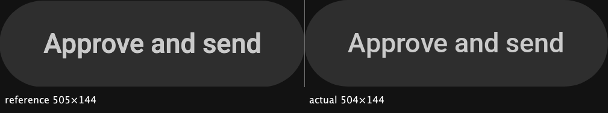

### variant-disabled-size-md

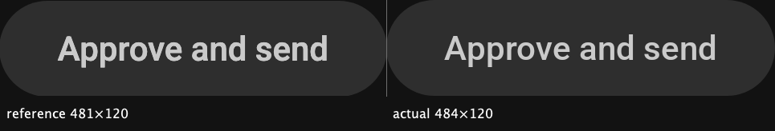

### variant-disabled-size-sm

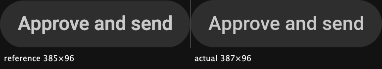

### variant-error-size-lg

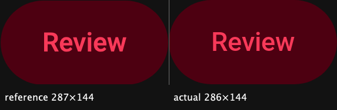

### variant-error-size-md

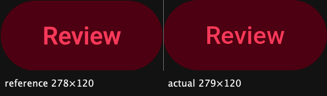

### variant-error-size-sm

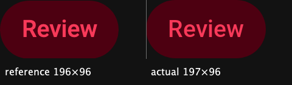

### variant-errorstrong-size-lg

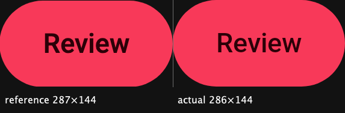

### variant-errorstrong-size-md

### variant-errorstrong-size-sm

### variant-filled-size-lg

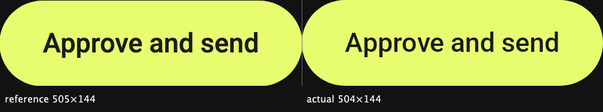

### variant-filled-size-md

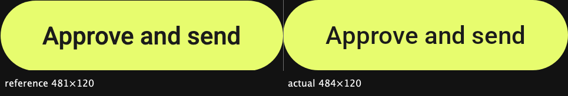

### variant-filled-size-sm

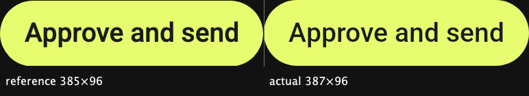

### variant-neutral-size-lg

### variant-neutral-size-md

### variant-neutral-size-sm

### variant-tertiary-size-lg

### variant-tertiary-size-md

### variant-tertiary-size-sm

### variant-tonal-size-lg

### variant-tonal-size-md

### variant-tonal-size-sm

## check-row

### state-checked

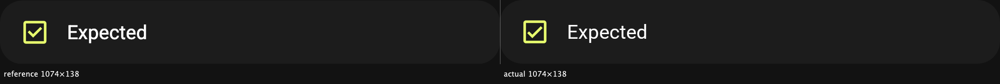

### state-unchecked-label-warning-ack

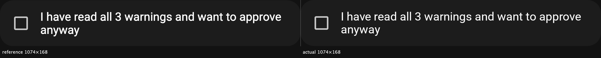

### state-unchecked

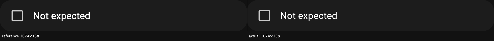

## env-chip

### env-production

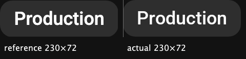

### env-sandbox-short

### env-sandbox

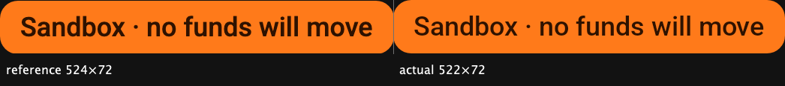

## fab

### variant-filled-icon-add

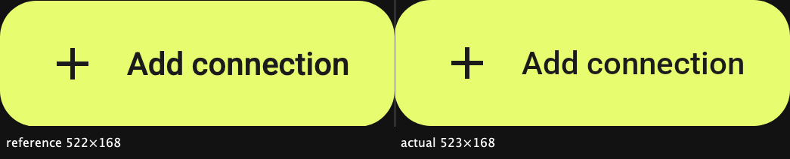

### variant-filled-width-full

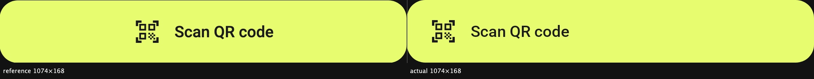

## network-chip

### network-devnet

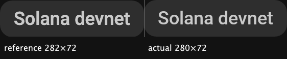

### network-mainnet

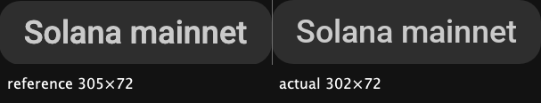

## radio-row

### state-off

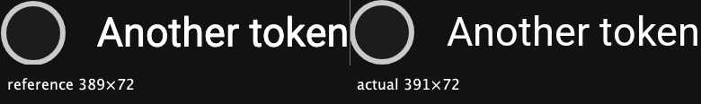

### state-on

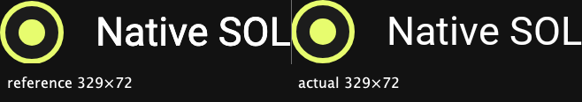

## scope-chip

### from-connection

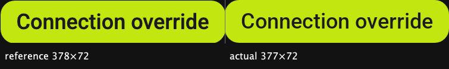

### from-global

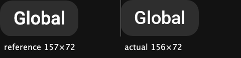

### from-none

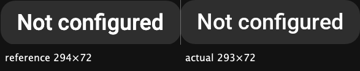

## signal-label

### origin-signal-ontile

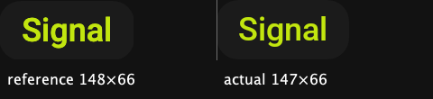

### origin-signal

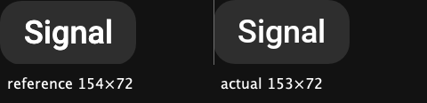

## source-avatar

### src-hermes-box

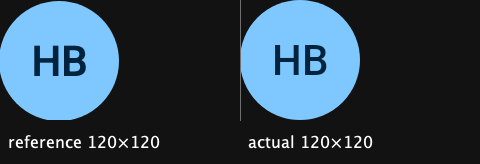

### src-runner-node

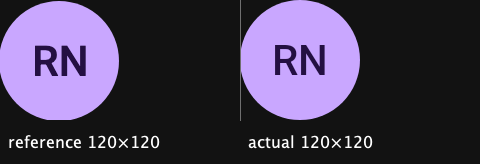

### src-studio-mac

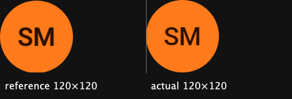

## source-chip

### src-feed-size-13-longest

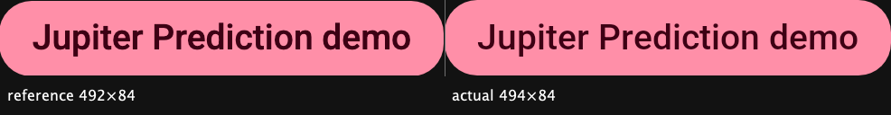

### src-feed-size-13

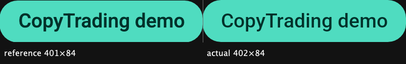

### src-hermes-box

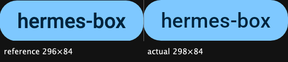

### src-runner-node

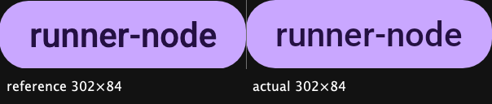

### src-studio-mac

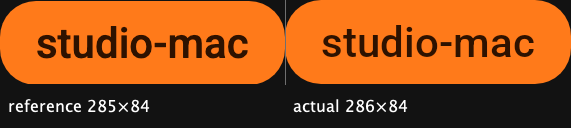

### truncating-at-120px

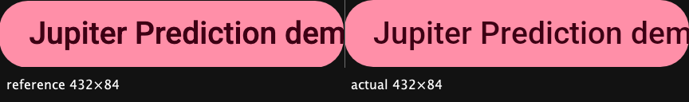

## switch-row

### state-off

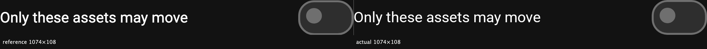

### state-on

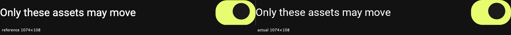

## verdict-pill

### verdict-ok-ontile

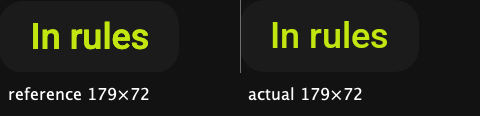

### verdict-ok

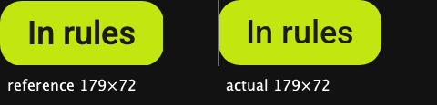

### verdict-warning-count-3

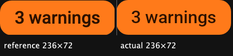

### verdict-warning

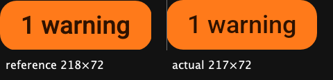
