# SEE-118 visual review

Each component image is the design reference on the left and the Roborazzi capture on the right,
both at 3×. The 22 images below are the complete generated-variant evidence set for SEE-118. The
last image is the additional 390dp four-item navigation assembly required by the ticket; the
component guide has no generated whole-bar reference to place beside it.

## Final difference list

- Padding, radius, font weight, line height, fixed dimensions, and token-backed colours: no
  material differences after the final pass. Natural text-height captures differ by at most two
  image pixels at 3× because Chrome and Android crop different font rasterization bounds.
- Long values: both the base58 address and UUID wrap across two lines; the UUID's label also wraps
  at its space, matching the flex-shrink reference.
- Icons: geometry, size, tone, and placement match. Chrome's Material Symbols outlines and
  Compose's bundled Material Icons Outlined paths have small glyph-shape differences.
- Ticket precedence: the filter reference predates SEE-118 and shows the medium Clear atom.
  SEE-118 explicitly requires `size = Sm`, so the captured Android button is intentionally smaller.
  No component-local styling was added to conceal that contract difference.

## fact-row

### value-full-address

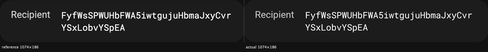

### value-longest-wraps

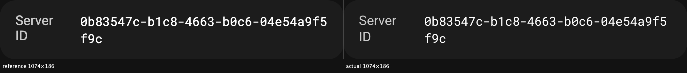

### value-mono

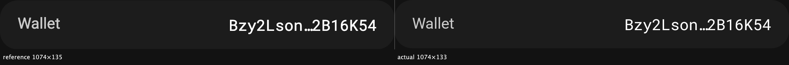

### value-short

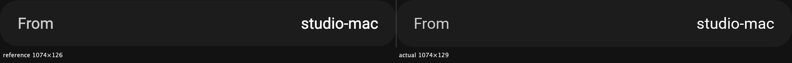

## daily-row

### state-nolimit-scope-global

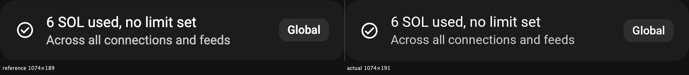

### state-over-scope-connection

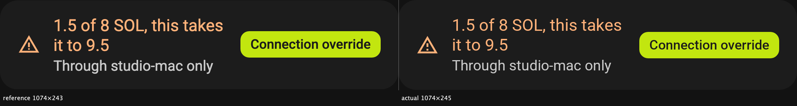

### state-within-scope-global

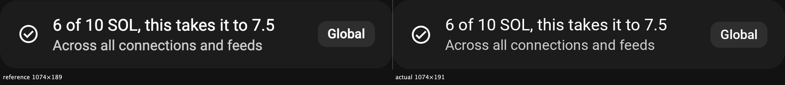

## segmented

### count-2-mode

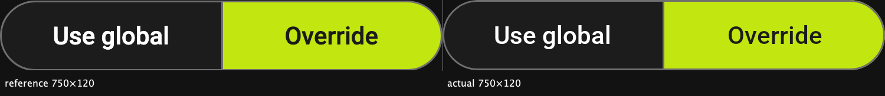

### count-2-selected-0

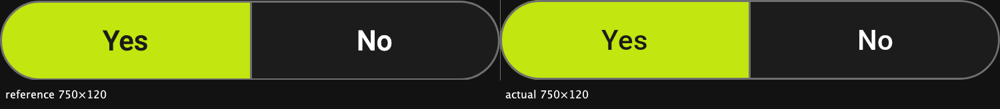

### count-3-selected-1

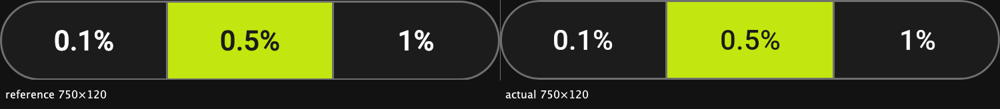

## tab-bar

### selected-pending

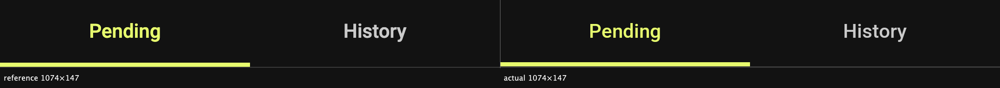

## nav-item

### state-rest

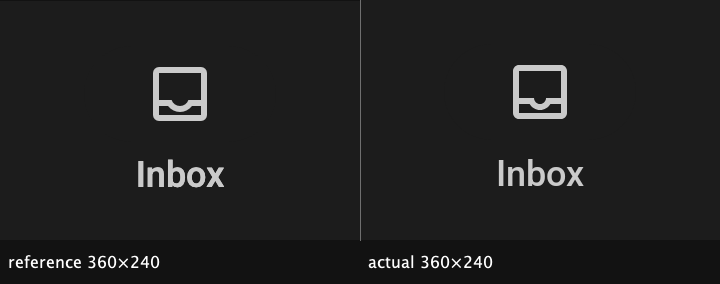

### state-selected

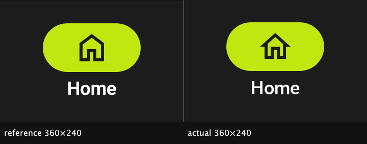

## section-header

### trailing-button

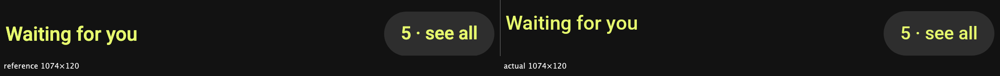

### trailing-none

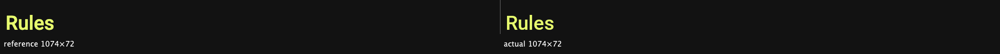

## text-field

### state-error

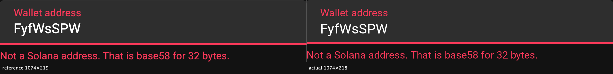

### state-rest

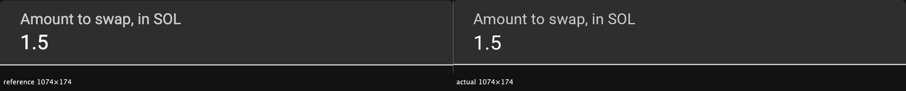

## notice-card

### sandbox-card

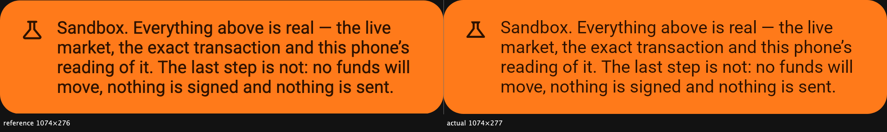

### stale-card

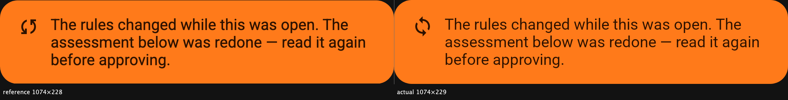

## empty-state

### screen-inbox

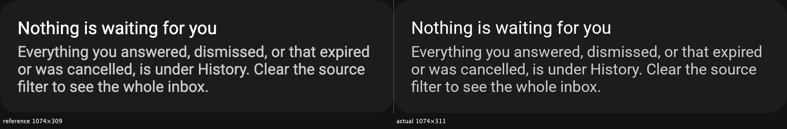

### screen-rules

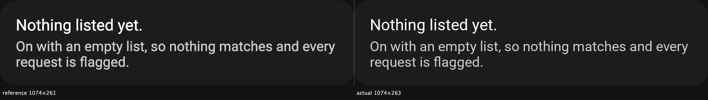

## filter-bar

### src-studio-mac

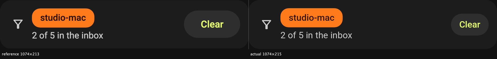

## Assembled navigation bar

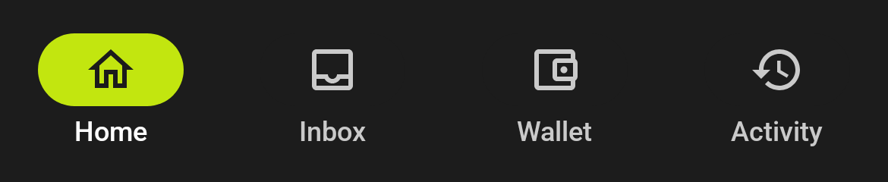
