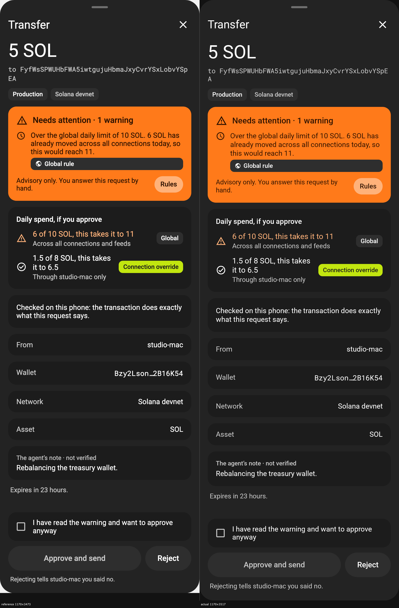
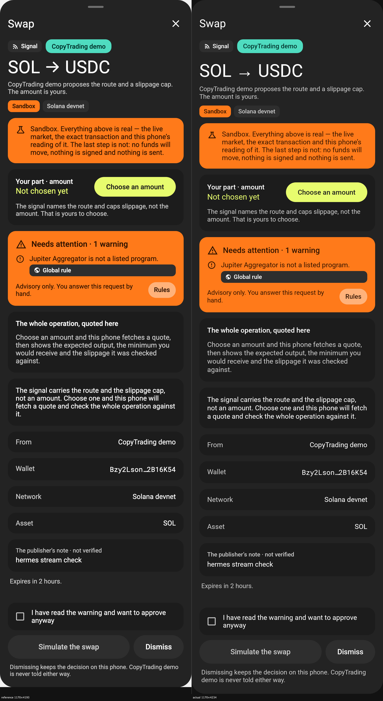
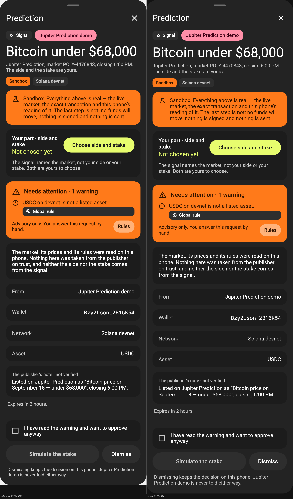
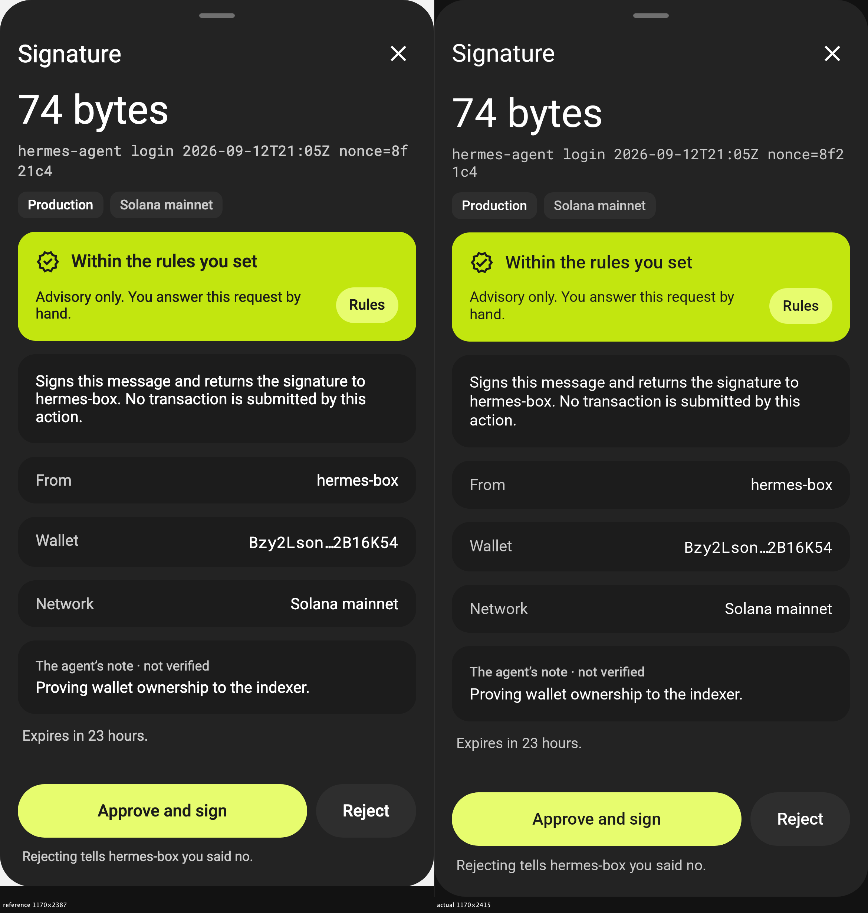
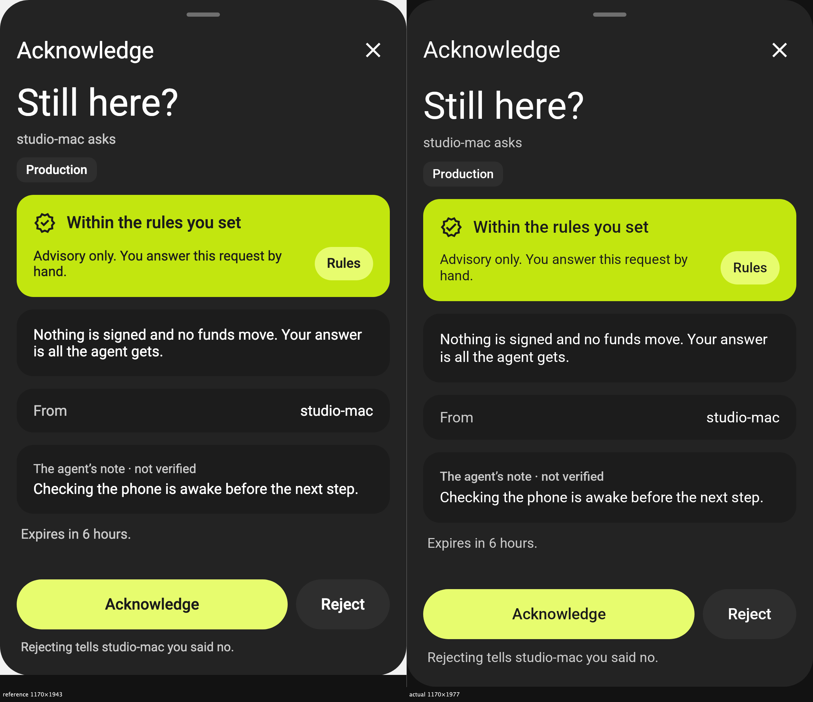

# SEE-120 visual review

Each image places the canonical unrolled design reference on the left and the Roborazzi capture on
the right. The ticket's `review*.png` names refer to fixed phone scenes; the design navigation
contract maps the required full-height, no-internal-scroll evidence to the five `sheet-*.png`
references used here.

## Final difference list

- None.

All five fixtures use the same `ReviewSheet` composable. The labelled footer on each pair retains
the source and Android natural-crop dimensions so the rendering provenance remains visible.

## Transfer

## Swap

## Prediction

## Signature

## Acknowledge

