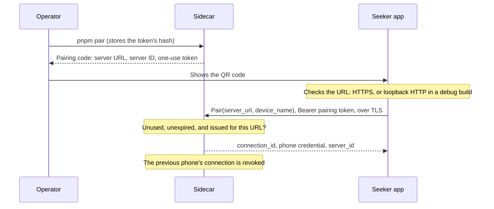

# Security

How the sidecar tells the agent from the phone, how a phone pairs, and how a phone reaches a self-hosted sidecar safely. The wire format is in [`docs/protocol.md`](protocol.md#pairing), and the operator's commands are in [`docs/development/sidecar.md`](development/sidecar.md#pairing-a-phone).

## Roles and credentials

Each credential opens one role, and the sidecar accepts it in one place only:

| Credential | Held by | Issued by | Accepted by | The sidecar keeps |
| --- | --- | --- | --- | --- |
| `MCP_TOKEN` | The agent | The operator, in `.env` | `/mcp` | The value, in `.env` |
| Pairing token | Whoever sees the pairing code | `pnpm pair`: one use, 10 minutes by default | `PairingService.Pair` | Its SHA-256 hash |
| Phone credential (`phone_token`) | The paired phone | The `Pair` response, once | `RequestService`, and `PairingService.RevokeConnection` for its own connection | Its SHA-256 hash |
| `PHONE_TOKEN` | The Stage 1 live-test screen | The operator, in `.env` | `LiveCommandService` only | The value, in `.env` |

- **Only the paired phone can prepare, review, and answer requests.** The agent's token is refused on every phone RPC, and the phone-side tokens are refused on `/mcp`. No MCP tool pairs, prepares, submits a result, or revokes. The full matrix is in [`docs/protocol.md`](protocol.md#roles), and `sidecar/src/pairing/roles.test.ts` tries every credential against every RPC and MCP method.
- **`PHONE_TOKEN` is the Stage 1 development exception, and it stays with the live diagnostic.** It can watch and acknowledge display-only live commands, and nothing else. It can't pair, and `RequestService` refuses it.
- **The phone credential exists only on the phone.** The sidecar returns it once, in the `Pair` response, and stores only its hash. The database, its backups, and the log can't give it away.
- **Pairing tokens and phone credentials are 32 random bytes,** written as 43 base64url characters. Because they're random, a single SHA-256 is enough to store them. A slow password hash only helps with guessable secrets.
- **Tokens travel only in `Authorization: Bearer <token>`,** never in a URL or a log line. The one exception is the pairing code, because showing it is how pairing works.

### The operator's account

Anyone who can run `pnpm pair` or write the sidecar's database acts as the operator. They could pair a phone of their own, which would revoke the owner's. So an agent must never run as the sidecar's user or have access to its files. Connect it over MCP only, as [`docs/integrations/hermes.md`](integrations/hermes.md) does, including when Hermes runs on another machine.

## Pairing



1. The operator runs `pnpm pair` on the sidecar's machine. It issues a pairing token and prints the pairing code, as a QR code and as text. The code holds the server URL (`SIDECAR_PUBLIC_URL`), the sidecar's lasting ID, and the token.
2. The phone reads the code. It accepts only an HTTPS URL, or plain HTTP on loopback in a debug build, and it checks the server's certificate and host name the normal way.
3. The phone calls `Pair` at that URL, with the token as its bearer credential and the URL in `server_url`.
4. The sidecar checks the token, and creates a new connection with a new credential.

Pairing doesn't involve the wallet. Wallet authorization is a separate step, from Stage 3 on. The owner's walkthrough is [`docs/guides/pairing.md`](guides/pairing.md), and what the phone stores is under [local storage and recovery](#local-storage-and-recovery).

Pairing tokens are:

- **One use.** A token that paired once is refused after that.
- **Short-lived.** A token works strictly before its expiry, 10 minutes after it was issued by default. `PAIRING_TOKEN_TTL_SECONDS` sets 1 to 60 minutes.
- **The newest one only.** Issuing a code voids every unused one issued before it.
- **Bound to their URL.** `Pair` must carry the URL from the code, compared after normalization. A different URL gets `INVALID_PARAMETERS`, and the token stays usable, so a phone that reached the sidecar by another address fails without using up the code.
- **Refused the same way, whatever the reason.** An unknown, expired, used, or missing token gets `UNAUTHENTICATED` with one message, so the answer doesn't tell a guesser which tokens exist.
- **Stored as hashes,** with their URL and times. The code on the operator's screen is the only copy of the token.

### A code never redirects an existing connection

- **Pairing always creates a new connection,** with a new ID and a new credential. The sidecar never changes an existing connection's URL, ID, or credential, and the new connection can't see the old one's requests.
- **The phone does the same.** A scanned code is always a new pairing. It never changes the URL of a connection the phone already has, even when its `server` ID matches. So a code that points at another host can't take over an existing connection or its credential. The phone sends each credential only to the URL it paired with. Before pairing, the app shows the code's server URL and ID for the owner to confirm, and notes a server it already knows.
- **The server ID is how the phone recognizes a sidecar.** It stays the same across restarts and pairings, so the phone can tell the owner that a new code comes from a sidecar it already knows, possibly at a new address.

## One active phone per sidecar

A sidecar has one paired phone at a time. A phone can pair with several sidecars (SAW-012).

- **Pairing a new phone revokes the previous one.** `pnpm pair` says which phone the code would replace.
- **Revocation takes effect at once:**
  - The credential stops working, and the phone's next call gets `UNAUTHENTICATED`.
  - The connection's PENDING requests are CANCELLED, with the detail "The phone's connection was revoked." A request that's already past its deadline expires instead, since expiry comes first.
  - Requests the owner already approved keep their states, and agents can still read every request.
  - Until the next pairing, creating a request fails with `NOT_PAIRED`.
- **The phone revokes itself with `RevokeConnection`,** for example when the owner removes the connection.
- **The operator revokes with `pnpm pair revoke`,** for example when the phone is lost. `pnpm pair status` shows the paired phone. Neither command prints a credential.
- **To re-pair,** run `pnpm pair` again. An old credential never works again.
- **Upgrading from SAW-010:** migration 2 revokes the stand-in connection that SAW-010 created with the database, and cancels its PENDING requests. Pair the phone after upgrading.

## Transport security

- **The sidecar listens on loopback only,** over plain HTTP. `SIDECAR_HOST` can't be anything else.
- **A phone on another network reaches it through a trusted TLS endpoint** on the same machine. The endpoint ends TLS with a certificate the phone already trusts, and forwards to the loopback port. The app keeps Android's normal certificate and host name checks, with no certificate pinning and no trust-all.
- **`SIDECAR_PUBLIC_URL` is the URL that pairing codes carry.** It must be `https://`, with one exception: `http://` on `127.0.0.1`, `localhost`, or `[::1]`, for development over `adb reverse`. That's the default, and it's the Stage 1 loopback exception. The debug build allows cleartext to `127.0.0.1` and `localhost` only, and release builds allow none. The URL can have a path, but no user name, password, query, or fragment.
- **The endpoint forwards everything, `/mcp` included.** `/mcp` still refuses a public host name unless `MCP_ALLOWED_HOSTS` lists it, and it always needs `MCP_TOKEN`.
- **Stage 7 adds the Docker gateway,** with TLS and optional OAuth.

### A trusted endpoint for this stage's remote test

Either of these works, and the sidecar's configuration stays the same apart from `SIDECAR_PUBLIC_URL`.

**Tailscale Serve,** when the phone and the Mac are on the same tailnet:

1. In the tailnet's admin console, turn on MagicDNS and HTTPS certificates.
2. On the Mac, run `tailscale serve --bg http://127.0.0.1:8080`. Tailscale gets a Let's Encrypt certificate for the Mac's `ts.net` name, and forwards HTTPS to the sidecar. `tailscale serve status` prints the URL.
3. In `.env`, set `SIDECAR_PUBLIC_URL=https://<machine>.<tailnet>.ts.net`, then run `pnpm pair`.
4. To stop serving, run `tailscale serve --https=443 off`.

Only devices on the tailnet can reach this endpoint.

**Caddy,** on a machine with a public DNS name and ports 80 and 443 open: run `caddy reverse-proxy --from vault.example.com --to 127.0.0.1:8080`. Caddy gets a certificate automatically and forwards to the sidecar. Then set `SIDECAR_PUBLIC_URL=https://vault.example.com`.

Don't use a self-signed certificate. The phone rightly refuses it, and the only way around that is weakening its checks.

`sidecar/src/pairing/tls.test.ts` runs a TLS endpoint in front of the sidecar and pairs through it. Pairing works with a trusted certificate. An untrusted certificate, or one for another host name, fails before the token is sent, and the token stays usable.

## Local storage and recovery

What the phone keeps for each connection (SAW-012), and what happens when it's lost.

| What | Where | Protection |
| --- | --- | --- |
| Metadata: the name, the server URL and ID, the device name sent at pairing, when it paired, the last refresh, and any revocation | `filesDir/connections/<connection ID>.json`, one file per connection, written atomically | App-private storage |
| The phone credential | `noBackupFilesDir/credentials/<connection ID>`, one file per connection | AES-256-GCM under an Android Keystore key |
| The pairing token | The app's memory, until pairing ends or the owner leaves the screen | Never written to disk or to saved instance state |

- **The credential key lives in the Android Keystore** (`seekervault.credentials.v1`), created on first use. Its material never leaves the Keystore, so it can't be exported, backed up, or moved to another device. It protects credentials; it isn't a wallet key.
- **Each credential file is bound to its connection.** The connection ID is the cipher's associated data, so a file copied under another connection's name doesn't decrypt. One file holds `1 || IV length || IV || ciphertext and tag`, and every write uses a fresh IV.
- **Connections are keyed by the connection ID** that the sidecar assigned. The app accepts a `PairResponse` only if the ID is a lowercase UUID (it names the files), the credential has the format of one, and the server ID matches the code's. Removing a connection deletes its credential file first, then its metadata, and touches no other connection. A refresh counts only requests whose reference names the connection, whatever the sidecar sends.
- **Nothing is backed up or transferred.** The manifest sets `allowBackup="false"`. `data_extraction_rules.xml` excludes every domain from cloud backup and from device-to-device transfer, including `root`, which holds `no_backup/`. From Stage 3 on, Mobile Wallet Adapter authorization material is stored and excluded the same way. `StageBoundaryTest` checks the rules.
- **The app logs nothing about connections,** and its screens show the URL, the IDs, and the status, never the credential or the token.
- **A credential the sidecar rejects is deleted.** When a refresh gets `UNAUTHENTICATED`, the app marks the connection revoked, deletes its credential, and never sends it again.

| What happened | What the phone shows | What to do |
| --- | --- | --- |
| A new phone, a reinstall, or cleared app data | No connections | Pair with each sidecar again. That revokes the old phone's connection. |
| A lost or stolen phone | — | Run `pnpm pair revoke` on each sidecar. |
| The Keystore lost the key, or a file is damaged | "This phone no longer has the credential…" | Pair again, and remove the old connection. |
| The sidecar revoked the phone, another phone paired, or its database was reset | "The server no longer accepts this phone…" | Pair again, and remove the old connection. |
| The sidecar moved to a new address | The old connection can't reach it | Pair again with a code for the new address. The app never moves a credential to a new host. |

## Logs and diagnostics

- **No token reaches the log.** Pairing logs connection IDs and error codes only:

  ```text
  [sidecar] phone paired: connection de03846e-d435-4705-b2e3-ec67da539f12; revoked connection 5d3c8f0e-2b7a-4c1d-9e6f-0a1b2c3d4e5f
  [sidecar] rejected Pair: UNAUTHENTICATED
  [sidecar] rejected ListPending: missing, wrong, or revoked phone credential
  [sidecar] connection de03846e-d435-4705-b2e3-ec67da539f12 revoked by the phone; 2 pending requests cancelled
  ```

- **`pnpm pair status` and `pnpm pair revoke` print no secret.** They name the connection, its device name, and when it paired.
- **`pnpm pair` prints the pairing code,** because that's how pairing works. Show it only to the phone, and clear the terminal afterwards. Never paste it into a chat, an issue, or a log. An unused code stops working when it expires, or when the next one is issued.
- **The test agent removes `MCP_TOKEN` and `PHONE_TOKEN` from all its output;** see [`test-agent/README.md`](../test-agent/README.md).

`roles.test.ts` and `cli.test.ts` check that no token or credential appears in the sidecar's log or in the CLI's status and revoke output.
