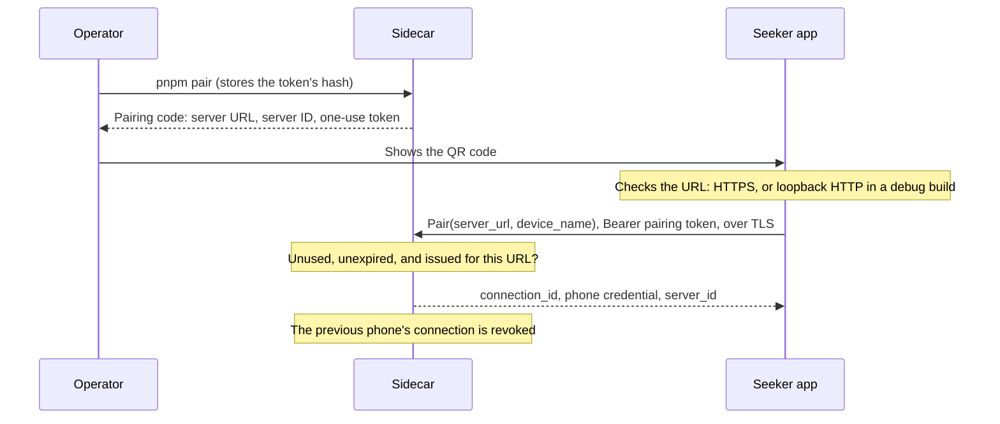

# Security

How the sidecar tells the agent from the phone, how a phone pairs, and how a phone reaches a self-hosted sidecar safely. The wire format is in [`docs/protocol.md`](protocol.md#pairing), and the operator's commands are in [`docs/development/sidecar.md`](development/sidecar.md#pairing-a-phone).

## Roles and credentials

Each credential opens one role, and the sidecar accepts it in one place only:

| Credential | Held by | Issued by | Accepted by | The sidecar keeps |
| --- | --- | --- | --- | --- |
| `MCP_TOKEN` | The agent | The operator, in `.env` | `/mcp` | The value, in `.env` |
| OAuth access token (optional, SAW-036) | A hosted MCP client | The operator's own authorization server, for a person who authorized that client | `/mcp` | Nothing: it is validated and discarded |
| Pairing token | Whoever sees the pairing code | `pnpm pair`: one use, 10 minutes by default | `PairingService.Pair` | Its SHA-256 hash |
| Phone credential (`phone_token`) | The paired phone | The `Pair` response, once | `RequestService`, `UpdateService`, and authenticated `PairingService` operations for its own connection | Its SHA-256 hash |
| `PHONE_TOKEN` | The Stage 1 live-test screen | The operator, in `.env` | `LiveCommandService` only | The value, in `.env` |

- **Only the paired phone can prepare, review, and answer requests or register an FCM target.** The agent's token is refused on every phone RPC, and the phone-side tokens are refused on `/mcp`. No MCP tool pairs, prepares, submits a result, registers a target, or revokes. The full matrix is in [`docs/protocol.md`](protocol.md#roles), and `sidecar/src/pairing/roles.test.ts` tries every credential against every RPC and MCP method.
- **An access token is an agent's credential and no more.** When `MCP_OAUTH_ISSUER` is configured, `/mcp` also accepts a token issued by that authorization server for this deployment. It opens `/mcp` and nothing else — the same refusals as `MCP_TOKEN` apply to every phone RPC — and it authorizes asking, never answering: a request still waits for the owner's hand on the wallet. See [The authorization boundary](#the-authorization-boundary-saw-036).
- **`PHONE_TOKEN` is the Stage 1 development exception, and it stays with the live diagnostic.** It can watch and acknowledge display-only live commands, and nothing else. It can't pair, and `RequestService` refuses it.
- **The phone credential exists only on the phone.** The sidecar returns it once, in the `Pair` response, and stores only its hash. The database, its backups, and the log can't give it away.
- **Pairing tokens and phone credentials are 32 random bytes,** written as 43 base64url characters. Because they're random, a single SHA-256 is enough to store them. A slow password hash only helps with guessable secrets.
- **Tokens travel only in `Authorization: Bearer <token>`,** never in a URL or a log line. The one exception is the pairing code, because showing it is how pairing works.

The shared gateway has its own, separately routed roles:

| Credential | Held by | Accepted by | Grant |
| --- | --- | --- | --- |
| Publisher credential | An independent backend | Publisher listener | That server's feed documents, manifests, invitations and private requests |
| Invitation capability | The person opening a temporary link/QR | Client listener, until expiry or redemption | Preview and one explicit-confirmation redemption; no wallet or request authority |
| Device credential | SAC, after redemption | Client listener | One binding's manifest, private requests, declared results and revocation |

Publisher and device credentials travel only in bearer headers and are stored as SHA-256 hashes.
The invitation capability is the deliberate URL exception: short-lived and single-use, omitted from
application errors, and excluded from proxy access logs. It never grants signing or execution.

### The operator's account

Anyone who can run `pnpm pair` or write the sidecar's database acts as the operator. They could pair a phone of their own, which would revoke the owner's. So an agent must never run as the sidecar's user or have access to its files. Connect it over MCP only, as [`docs/integrations/hermes.md`](integrations/hermes.md) does, including when Hermes runs on another machine.

## Pairing



1. The operator runs `pnpm pair` on the sidecar's machine. It issues a pairing token and prints the pairing code, as a QR code and as text. The code holds the server URL (`SIDECAR_PUBLIC_URL`), the sidecar's lasting ID, and the token.
2. The phone reads the code. It accepts only an HTTPS URL, or plain HTTP on loopback in a debug build, and it checks the server's certificate and host name the normal way.
3. The phone calls `Pair` at that URL, with the token as its bearer credential and the URL in `server_url`.
4. The sidecar checks the token, and creates a new connection with a new credential.

Pairing doesn't involve the wallet. Wallet authorization is a separate step, from Stage 3 on. The owner's walkthrough is [`docs/guides/pairing.md`](guides/pairing.md), and what the phone stores is under [local storage and recovery](#local-storage-and-recovery).

Pairing tokens are:

- **One use.** A token that paired once is refused after that.
- **Short-lived.** A token works strictly before its expiry, 10 minutes after it was issued by default. `PAIRING_TOKEN_TTL_SECONDS` sets 1 to 60 minutes.
- **The newest one only.** Issuing a code voids every unused one issued before it.
- **Bound to their URL.** `Pair` must carry the URL from the code, compared after normalization. A different URL gets `INVALID_PARAMETERS`, and the token stays usable, so a phone that reached the sidecar by another address fails without using up the code.
- **Refused the same way, whatever the reason.** An unknown, expired, used, or missing token gets `UNAUTHENTICATED` with one message, so the answer doesn't tell a guesser which tokens exist.
- **Stored as hashes,** with their URL and times. The code on the operator's screen is the only copy of the token.

### A code never redirects an existing connection

- **Pairing always creates a new connection,** with a new ID and a new credential. The sidecar never changes an existing connection's URL, ID, or credential, and the new connection can't see the old one's requests.
- **The phone does the same.** A scanned code is always a new pairing. It never changes the URL of a connection the phone already has, even when its `server` ID matches. So a code that points at another host can't take over an existing connection or its credential. The phone sends each credential only to the URL it paired with. Before pairing, the app shows the code's server URL and ID for the owner to confirm, and notes a server it already knows.
- **The server ID is how the phone recognizes a sidecar.** It stays the same across restarts and pairings, so the phone can tell the owner that a new code comes from a sidecar it already knows, possibly at a new address.

### A manifest never redirects one either (SEE-88)

From Stage 7.1 a server also *describes* itself, and the same rule holds: a description confirms
what the phone already has, and can never change it
([`wiki/server-manifests.md`](wiki/server-manifests.md)).

- **The identity has to be the one the connection trusts.** A manifest naming another server's ID
  is refused, so no server can hand a connection over to a different one.
- **The origin has to be the one the connection already uses** — the paired server URL, character
  for character, or the gateway a feed was added through. A manifest naming another origin is
  refused, and the credential keeps going exactly where it did.
- **The mode cannot change.** A direct, gateway-feed or gateway-private connection can never become
  another mode. A missing mode is refused rather than guessed.
- **A publisher may name only its own channel** (`server/<its own ID>`), so a manifest cannot claim
  another publisher's audience.
- **A refusal is recorded, not acted on.** The connection stays as it was and keeps working as it
  always did; what changes is that nothing from that server can be executed, because a server whose
  own description this phone would not accept is not one to act for.
- **A manifest can ask for nothing.** There is no field in it for a permission, a policy, a wallet
  endpoint, or anything loadable, and a stage-boundary check reads the protocol file and fails if
  the field set changes.

### A proposal is common, and a decision about it is not (SEE-89)

A publisher's feed carries proposals: one document, received identically by everyone subscribed.
What each owner does about one is theirs, and it stays on their phone
([`wiki/shared-proposals.md`](wiki/shared-proposals.md)).

- **Nothing about the owner goes out.** For a `gateway_feed` connection the phone calls no
  `PublishWallet`, no `PrepareRequest` and no `SubmitResult`, and uploads no outcome through generic
  sync. All of those already require `Connection.usable`, which requires the direct mode, so a feed
  is excluded from every one of them at once rather than in each of them separately.
- **A subscription is all the gateway learns.** It is told which channel this phone is interested
  in. It is not told the owner's address, the quantity they chose, whether they went ahead, or what
  came of it — and the publisher is never contacted at all.
- **A proposal cannot describe a subscriber.** There is no field in it for an address, a chosen
  quantity, or anything prepared for someone to sign, and a stage-boundary check reads the protocol
  file and fails if the field set changes.
- **One owner's action is invisible to the others.** There is no per-subscriber state on the
  publishing server, so dismissing or executing here changes nothing about the same proposal
  anywhere else, and nothing marks a publication "completed" on anyone's behalf.
- **A publisher cannot make the phone act twice.** One execution per proposal identity is written
  before the wallet is opened and is never replaced — not after a failure, and not because the
  publisher republished at a new revision. Terms that changed under an unchanged revision are a
  contradiction, and the phone stops executing from that proposal until a higher revision says
  something new.
- **The owner's own record stays.** What this phone executed is kept in Activity, with the proposal
  revision, the plugin, the cluster and the parameters they chose — on the phone, and nowhere else.
  It outlives the feed being removed.

### The public broadcast path holds no reader (SEE-90, SEE-91, SEE-92)

The shared gateway in [`broadcast/`](../broadcast) is what a publisher publishes to and every
subscribed phone reads from ([`wiki/broadcast-gateway.md`](wiki/broadcast-gateway.md)). It is a
third party in the middle of the stage's one public relationship, so what it is unable to do matters
more than what it does.

- **The public tables have nowhere to put anything about a subscriber.** A publisher, its credential
  hashes, its manifest, its proposals, its channel's sequence, and the outbox contain no reader,
  address, chosen quantity, decision, signature or history. Go boundary tests read the schema and
  public contracts and fail if those appear in the feed path.
- **A document cannot be smuggled through it.** Every publication is rebuilt from the fields that
  were validated rather than stored as it arrived, so a protobuf field the gateway does not
  understand is dropped instead of relayed to every phone on the channel. Over JSON the same attempt
  is refused outright: the codec is strict, and a field the contract does not have is an error.
- **There is no public-feed endpoint that takes a result.** `FeedService` is read-only; a publication
  or result sent to its listener answers 404 even with a valid credential.
- **It cannot point a phone anywhere but at itself.** A published feed or gateway-private manifest
  must name this gateway's own origin; a `direct` manifest carries a URL, and the gateway refuses to
  hold one. The phone applies the same origin rule, so neither side depends on the other getting it
  right.
- **Listening says which channels and nothing about who (SEE-91).** A stream is opened with a
  ticket the gateway mints: an anonymous subject, an expiry, and the channels. No device
  identifier, no address, no session, nothing derived from any of them — and the gateway writes no
  record of having minted one, so a gateway that has been fanning out for a year still knows
  nothing about its subscribers. A Go test pins the claim set, so adding one is a deliberate act
  with an argument attached.
- **The broker is configured so that a listener can only listen.** One unidirectional transport, so
  a connection has no commands to send at all; every publish, history and presence permission off;
  presence and join/leave off, so who is listening is not collected anywhere; every other transport
  disabled; and the broker's own usage statistics turned off, because a service that exists so a
  developer's server never learns who subscribed to it should not report its own shape either. Its
  API port and its Redis are on an internal network with no route out of the deployment; the single
  public path is the one procedure a listener consumes.
- **The broker holds a cache, not a record.** A bounded history per channel — 256 publications or an
  hour — in a Redis that is deliberately not persisted, evicting the oldest first. Everything in it
  can be rebuilt from the gateway, so losing it costs a listener one snapshot. What that history
  holds is the same public documents the channel broadcast.
- **A publisher's grant is one server.** The credential says which server the caller publishes as;
  the document's own claim is checked against that, never the other way round. A channel is
  `server/<server_id>`, so a publisher cannot address another's audience, and a withdrawal names no
  channel at all.
- **A credential is never stored and never logged.** Only its SHA-256 is kept, as the sidecar keeps
  a phone's (SAW-011). It is shown once, by a local tool with no network surface; rotation is two
  steps so it needs no outage; and a refusal says nothing about whether what was presented used to
  work. Caddy redacts `Authorization` in front, and a test publishes with a credential and requires
  it to appear in no log line.
- **A hint says that a feed changed and nothing else (SEE-92).** What goes to a feed's public topic
  is two constant fields — a kind and a version — with no proposal, no revision, no sequence and no
  publisher in it, and nothing that could be about one subscriber, because a topic message is the
  same for everyone who receives it. Which feed changed is the topic it arrived on, which is a
  routing field rather than payload, exactly as a device target is on the private path (SAW-056). A
  Go test reads the message the relay builds and fails on anything else in it.
- **Nobody keeps a list of who subscribed.** Topic membership is Firebase's. The gateway names a
  topic when it is asked and is never told whether anyone joined it — asking leaves no row and no
  log line, and a test reads the database afterwards to prove it — and the phone keeps no list on
  disk either: its subscriptions are derived from the connections the owner has, every time. A topic
  name is public and proves nothing; what it admits someone to is the news that a broadcast changed.
- **The push credential is the deployment's, never a publisher's.** It is a file mounted read-only
  into the gateway's container alone, read once at startup, and no part of it reaches an answer, an
  error or a log line — a test fails if a message from the push endpoint, the access token or the
  key appears in one. A publisher cannot name a topic either: a topic is derived from the channel in
  a notice the gateway wrote itself, from the server ID the credential resolved to, so revoking a
  publisher's credential stops its hints because it stops its publications.
- **It calls nobody it serves.** No publisher is ever contacted — which is the point of the mode
  rather than a detail of it, because a publisher that could be reached could be told which phones
  are interested in it — and no phone, chain or provider either. Two packages may call out at all
  and a boundary test fails if a third acquires an HTTP client: the broker beside it (SEE-91) and,
  when one is configured, the push endpoint (SEE-92). Neither carries an address of its own — both
  take one from the operator — and the image's CA bundle exists for the second of them, added in
  SEE-92 with the reason written beside the line that copies it.
- **Reading writes nothing down.** No session, no subscription record, no count of who read what: a
  test reads the database after several reads and requires every row count to be unchanged. What the
  gateway learns from a read is which channel someone asked about.

### A private gateway binding is minimal and explicit (SEE-109)

The private adapter deliberately does keep one association, because routing a request to one
confirmed device is its purpose: authenticated `server_id`, that server's opaque `user_ref`, a
random connection ID and the hash of the credential SAC received once. It is not a central SAC
account, does not join identities across servers, and contains no wallet, authorization token,
amount, prepared transaction or activity history.

- Creating, viewing, resolving or opening an invitation writes no binding. Only the owner's
  confirmation calls redemption, and invitation consumption plus binding creation is one SQLite
  transaction.
- A fresh invitation creates a new `(server_id, user_ref, connection_id)` binding and cannot
  silently replace another. Requests must name that exact connection ID as well as the user
  reference; revoking one binding leaves sibling devices active.
- A private request must use SEE-108's private audience and `RETURN_TO_ORIGIN`; it is pinned to the
  exact binding the authenticated server named. Another binding cannot inherit it.
- The returned record is limited to declared owner inputs and the terminal outcome. Connecting does
  not select a wallet or authorize policy, approval, signing or execution; SAC repeats every one of
  those gates per request.
- The server credential never enters a link, QR or browser. The temporary invitation capability is
  redacted from logs; the device credential is returned once and is hashed at rest.

The wire flow and storage boundary are in [`wiki/gateway-pairing.md`](wiki/gateway-pairing.md).

### A publisher template holds no subscriber either (SEE-95)

The template in [`publisher/`](../publisher) is the other new server in this stage, and it is the
one a stranger runs: a developer's or a trader's own process, publishing signals everybody
subscribed will read ([`wiki/copytrading-template.md`](wiki/copytrading-template.md)). What matters
about it is the same thing that matters about the gateway — not what it does, but what it has no way
to do.

- **It has nowhere to put anything about a subscriber.** Six tables: the deployment's own stamp, its
  manifest's revision, its signals, the idempotency keys callers created them with, and — for the
  template that discovers its own (SEE-96) — the *provider's* markets it is tracking and what its
  last cycle did. No address, no chosen amount, no side, no decision, no signature, no outcome — and
  a test reads the **live** schema rather than the source and fails if a column for any of it
  appears.
- **Nothing about one can be sent to it.** Its API has no such field, and the decoder refuses a
  field the contract does not have rather than dropping it, so a caller that believes otherwise is
  told that there is no field for it. A term is refused the same way: a kind rejects a term it does
  not know, so `wallet` or `amount` cannot arrive disguised as one. Both halves are tested with
  every word.
- **It never learns that a phone exists.** It reads no feed — and the way that is true is that no
  feed client is compiled for the module at all ([`buf.gen.publisher.yaml`](../buf.gen.publisher.yaml)
  generates the publisher API and the two documents, and nothing else), so there is no code in it
  that could ask who is subscribed even if somebody wanted to.
- **And it was checked by looking, not only by arguing.** SEE-98's integration run publishes from
  both templates, reads both feeds from two subscribers, answers an agent's private request on the
  same phone, and then searches every file the gateway and both publishers wrote — the databases and
  every write-ahead log beside them — plus every log line and every request the subscribers sent, for
  the owner's address, the message and the signature. Nothing is found, and the same search over the
  owner's own sidecar finds all three, which is what makes the first result evidence rather than a
  search that does not work ([`docs/testing/see-98.md`](testing/see-98.md)).
- **It delivers nothing.** No Firebase credential, no broker, no per-phone rows, no streams:
  delivery is the gateway's, and a boundary test reads this module's source and fails if any of
  those names appears in code.
- **It publishes to one address, and its operator chose it.** No endpoint is compiled in; a
  boundary test allows a loopback default and an example in a message, and nothing else. A
  publication is never redirected either, because a redirect is an instruction from the network
  about where this publisher's documents — and its credential — go.
- **Its two credentials are told apart and neither is ever logged.** The gateway's credential says
  which server it publishes as; its own API token says who may publish through it. Both must be
  usable rather than compared, so both are configuration and both may be a mounted file instead;
  neither reaches a log line, and a boundary test drives a series of calls, refusals included, and
  fails if either appears in one.
- **Its own API token is the whole grant, and that is stated rather than implied.** One token,
  checked in constant time, on every route but the health probe — which says `{"status":"ok"}` and
  nothing else, so a publisher's settings, its pending count and its environment all stay behind
  the token. The API binds loopback by default, and the internet-facing overlay carries a warning:
  TLS keeps a token off the wire, and nothing makes holding one safer.
- **Sandbox and production cannot be mixed by accident.** The environment has no default, it is the
  single value in the published manifest, and it is stamped into the database: opening a production
  file with a sandbox configuration is refused at startup, as is opening another publisher's file.
  The way this gets confused is a copied compose file pointed at a volume that already exists, which
  is why the check is in the file rather than in the argument.

### A template that discovers its own signals reads nothing about anybody (SEE-96)

The Prediction template is the second one, and it is the first server in this stage that reaches out
to somebody else's API on its own schedule
([`wiki/prediction-template.md`](wiki/prediction-template.md)). That is a new surface, so it is worth
saying exactly how small it is.

- **What it asks the provider is public, and is not about a person.** Two endpoints: which markets
  exist, and what one market currently is. The provider's endpoints for orders, positions, history
  and profiles are not in the module — a boundary test allows the provider's package to be imported
  by four files and its host to appear in one, and fails otherwise. The owner's phone places the
  order, and this template never learns that one was placed.
- **Nobody may write a signal through it.** Its proposals are the reconciler's, so `POST
  /v1/signals`, `PUT /v1/signals/{id}` and `POST /v1/signals/{id}/cancel` answer 403 and store
  nothing, and the front door does not forward them either. A caller's signal would be undone by the
  next cycle, and the 403 says where the filters are instead.
- **The provider's key is a third credential, and it is the easiest to leak.** Unlike the other two
  it is *sent to somebody else's service*, which puts it next to a URL, inside a transport error's
  text and in whatever a client library logs. So it goes in one `x-api-key` header, transport errors
  are reported with the URL stripped out, and a test presents a key, runs a cycle, and searches every
  answer the API gives and the whole log for it.
- **Nothing a publisher chose is put on a phone's screen.** The document carries the provider's
  market and event identifiers — which is what lets the phone look the market up itself — and the
  link to the provider's page stays in this template's own row. A URL a publisher chose, rendered on
  a phone, is the thing the manifest rules exist to prevent, and a test searches a published document
  for `http` and for the provider's domain.
- **Provider text cannot make a document the phone would refuse.** A market title arrives from
  somebody else, so the note is folded to one printable line and truncated on a character boundary
  before anything is published: a title with a newline in it would otherwise become a signal the
  gateway refuses and nobody ever sees.
- **An outage cannot withdraw anybody's proposal.** A provider that is unreachable, rate limiting or
  refusing this deployment's key ends nothing at all: the cycle is recorded as partial and the
  proposals stand. Only the provider's own answer — closed, cancelled, settled, or no such market —
  withdraws one, and a table of every case is tested.
- **There is no opinion in it.** No model, no probability of its own, no ranking but by close time,
  and no term a side could be published in: a term the kind does not know is refused, so `side`,
  `is_yes`, `confidence` and `recommendation` cannot be published at all.

### Nothing can quietly promote a demonstration to real money (SEE-97)

Sandbox exists so that the whole path can be watched without anybody's funds, and that is only
worth having if getting *out* of it is an act somebody performed on purpose
([`wiki/environments.md`](wiki/environments.md)).

- **The promise is not the document's to change.** A manifest says which environments a server
  serves; the phone records which one the connection keeps, and only the owner changes that. The
  gateway refuses a manifest that changes the environments a server ID already published
  (`other_environment`), and a manifest that stops naming the one a connection keeps makes that
  server unsupported — readable, executing nothing — rather than moving the connection to the other
  one.
- **It is checked where every other execution rule is checked.** The environment is pinned in the
  `ExecutionBinding` before the wallet is opened and compared with the connection's own inside the
  wallet's single lock, beside the preparation's expiry and the wallet selection. A mode switch that
  lands while an approval is in flight is refused there; it cannot land between the check and the
  signature, because there is no gap.
- **A rehearsal cannot reach a wallet, structurally.** The sandbox branch of an approval is
  lexically outside `withWallet`, so there is no session in scope to sign with — not a flag beside
  one. Two tests assert it from opposite directions: the wallet's fake adapter records nothing in
  sandbox, and a source-level check keeps `signAndSendTransactions` in the one file that has always
  held it.
- **Nothing about a simulation is fabricated.** No signature, so no explorer link; no fill, no
  position, no profit. A simulated record is labelled as one in Activity, keeps the promise it was
  bound under beside the cluster, and counts nothing against a daily threshold the owner set on real
  money — for the same reason devnet play money never does.
- **A rehearsal spends the proposal.** One execution per proposal per device, whatever came of it,
  exactly as a decline in the wallet does. The alternative is a record that can hold two executions,
  and a phone deciding which of them counted.
- **The private workflow is untouched.** A direct connection is production by construction, and the
  invariant is stated where a connection is built rather than checked where one is used: an agent
  waiting for a signature can be told no, but it cannot be handed a simulation, and this app will not
  invent one for it.

## One active phone per sidecar

A sidecar has one paired phone at a time. A phone can pair with several sidecars (SAW-012).

- **Pairing a new phone revokes the previous one.** `pnpm pair` says which phone the code would replace.
- **Revocation takes effect at once:**
  - The credential stops working, and the phone's next call gets `UNAUTHENTICATED`.
  - The connection's PENDING requests are CANCELLED, with the detail "The phone's connection was revoked." A request that's already past its deadline expires instead, since expiry comes first.
  - Requests the owner already approved keep their states, and agents can still read every request.
  - Until the next pairing, creating a request fails with `NOT_PAIRED`.
- **The phone revokes itself with `RevokeConnection`,** for example when the owner removes the connection.
- **The operator revokes with `pnpm pair revoke`,** for example when the phone is lost. `pnpm pair status` shows the paired phone. Neither command prints a credential.
- **To re-pair,** run `pnpm pair` again. An old credential never works again.
- **An FCM target is connection-owned (SAW-055).** Only that connection's phone credential can set
  it. Registration rotation replaces it atomically; a stale invalidation compare-clears nothing.
  Replacement or either revocation path deletes it in the same transaction, before the old
  credential can make another registration call.
- **An invalidation carries no authority (SAW-056).** Its exact app-visible data is the fixed kind
  `request_invalidation` and version `1`. It contains no connection or request identifier,
  credential, policy, assessment, agent prose, message bytes, transaction, authorization,
  approval, signature, amount, recipient, or program. Android rejects any additional field and
  uses a valid hint only to schedule authenticated Sync from its own stored connection records.
- **Push is not a second state writer (SAW-057).** The Firebase callback performs no sidecar fetch.
  Its empty-input WorkManager handoff reaches the same per-connection synchronization coordinator
  used by foreground streams, Refresh, and periodic recovery. Duplicate delivery is coalesced, a
  healthy foreground stream stays active, and missing delivery only postpones observation until a
  Stage 5.2 path runs.
- **A notification is a route, never authority (SAW-058).** It is built locally only after
  authenticated Sync and shows generic text with secret lock-screen visibility. Its immutable
  explicit intent carries the two opaque IDs needed to find one connection/request, not request
  content, policy data, credentials, or an authorization. A tap validates both IDs and fetches the
  paired sidecar again before it can show answer controls. Loading, stale, removed, revoked, and
  unreachable states have no such controls. A tap chooses or creates no answer, opens no wallet,
  and approves or signs nothing; its Sync may retry only a result the owner already stored, exactly
  like every other Stage 5.2 Sync. Denying `POST_NOTIFICATIONS` suppresses the alert and changes no
  synchronization path.
- **Upgrading from SAW-010:** migration 2 revokes the stand-in connection that SAW-010 created with the database, and cancels its PENDING requests. Pair the phone after upgrading.

## Transport security

- **The sidecar listens on loopback only.** `SIDECAR_HOST` can't be anything else. It uses plain HTTP by default; setting both TLS identity paths starts the production secure listener instead.
- **Production updates terminate TLS at the sidecar's HTTP/2 listener.** `SIDECAR_TLS_CERT_PATH` and `SIDECAR_TLS_KEY_PATH` name its PEM identity, and `SIDECAR_PUBLIC_URL` must be HTTPS. The certificate is publicly trusted and matches the public host. The listener negotiates `h2` for gRPC and `http/1.1` for existing clients. A pass-through or gRPC-aware proxy may expose the loopback listener only if HTTP/2 reaches it intact.
- **Loopback development may use a separate cleartext HTTP/2 port.** `SIDECAR_UPDATE_PORT` is for `adb reverse` on the same machine, never for a LAN or public listener. It cannot be combined with the TLS identity.
- **The app keeps Android's normal certificate and host name checks,** with no certificate pinning, custom CA, or trust-all.
- **`SIDECAR_PUBLIC_URL` is the URL that pairing codes carry.** It must be `https://`, with one exception: `http://` on `127.0.0.1`, `localhost`, or `[::1]`, for development over `adb reverse`. That's the default, and it's the Stage 1 loopback exception. The debug build allows cleartext to `127.0.0.1` and `localhost` only, and release builds allow none. The URL can have a path, but no user name, password, query, or fragment.
- **The secure listener preserves every existing route, `/mcp` included.** `/mcp` still refuses a public host name unless `MCP_ALLOWED_HOSTS` lists it, and it always needs `MCP_TOKEN`. The paired phone credential opens production updates; every other role is refused.
- **The Stage 7 gateway terminates TLS in front of the sidecar,** with a certificate it obtains and renews itself for a domain the operator owns. It adds no authentication and removes none, so every boundary below is still the sidecar's own. The optional OAuth profile (SAW-036) changes nothing about that: it is the sidecar, as the MCP server, that validates an access token.

### The gateway (SAW-035)

This is the deployment's reverse proxy in front of one owner's sidecar, and not the shared broadcast
gateway of SEE-90 above: different service, different operator, different directory
([`broadcast/README.md`](../broadcast/README.md)).

[`gateway/Caddyfile`](../gateway/Caddyfile) and [`gateway/Caddyfile.public`](../gateway/Caddyfile.public) are two configurations, not one with a switch: the first is plain HTTP on a loopback address for local work, and the second is the internet-facing one, reached through [`gateway/compose.public.yaml`](../gateway/compose.public.yaml). Making a deployment public is a different command, so loopback HTTP cannot become the public default by omission.

- **Only named endpoints exist on the public interface.** `/mcp` and the phone's pairing, request, and update services are forwarded. `/healthz`, the Stage 1 `LiveCommandService` diagnostic, and every other path are refused at the gateway and never reach the sidecar. A request for a host the deployment does not serve is closed rather than answered.
- **The health endpoint is the operator's.** In the public configuration it binds the network namespace's loopback address, so Compose cannot publish it to the host at all: the health check and the test agent reach it, nothing outside does.
- **Credentials pass through untouched.** The gateway never inserts an `Authorization` header and never strips one, so each service still takes only its own credential ([roles](protocol.md#roles)). It does not rewrite `Host` either, which is what keeps `/mcp`'s DNS-rebinding check real; the public deployment puts its own domain in `MCP_ALLOWED_HOSTS` instead.
- **Requests are bounded before they reach the sidecar.** Each route caps a request body at 64 KiB, the same limit the sidecar enforces itself, so an oversized body is refused one hop earlier.
- **No credential reaches the access log.** Caddy redacts `Authorization`, `Cookie`, `Set-Cookie`, and `Proxy-Authorization` unless `log_credentials` is turned on, and it is not turned on in either file. Turning it on would put every agent token, phone credential, and pairing token into the log at once. Pairing codes never travel as a URL or a header — they are shown to the phone and sent in a request body, which is not logged.
- **The admin API is off.** `admin off` in both files means Caddy opens no configuration port for anything to reconfigure it through.
- **The live update stream is not carried.** `Subscribe` is gRPC over HTTP/2 and terminates at the sidecar's own TLS listener. Behind this gateway the sidecar speaks HTTP/1.1, no update endpoint is configured, and pairing therefore advertises none: nothing is promised that the endpoint cannot deliver.

### The authorization boundary (SAW-036)

An optional profile lets a hosted MCP client reach `/mcp` on a person's authorization instead of a shared token ([`docs/integrations/claude.md`](integrations/claude.md)). It is off unless `MCP_OAUTH_ISSUER` is set, and when it is off the sidecar advertises no authorization at all — the metadata document below answers 404.

- **The sidecar is a resource server, and only that.** It publishes protected-resource metadata (RFC 9728) and validates the tokens that arrive. It issues none: there is no authorization endpoint, no token endpoint, no client registration, no consent screen, and no client secret anywhere in this repository. The authorization server is a product the operator already runs or signs up for, and the only thing read from it is public keys.
- **A token is accepted only if it was issued for this deployment.** The `aud` claim must carry this deployment's canonical MCP URI (`MCP_OAUTH_RESOURCE`, by default `https://<domain>/mcp`), the `iss` claim must equal `MCP_OAUTH_ISSUER` exactly, the signature must verify against the authorization server's published keys, and `exp` must not have passed. A token that another resource server would accept opens nothing here. This is the check that the MCP specification exists to insist on.
- **Only asymmetric signatures.** `RS*`, `PS*`, `ES*`, and `EdDSA` are accepted; a shared secret is not an algorithm this endpoint honours, and `none` never was. Opaque tokens are refused with an error that says so: there is no introspection call, so nothing is asked of the authorization server at request time.
- **A token is never passed on.** It authorizes the MCP call and stops there. Nothing downstream ever sees it, and the sidecar has no upstream API to present it to.
- **Scopes are a refusal, not a capability.** `MCP_OAUTH_SCOPE` names what a token must carry; a valid token without it is refused with `403` and `insufficient_scope`, which is how a client learns what to ask for. A scope grants nothing on its own — the tools an access token reaches are exactly the tools `MCP_TOKEN` reaches.
- **There is no second way in.** While OAuth is on, `MCP_TOKEN` opens `/mcp` only under a loopback `Host`: that is the stack's own private endpoint inside the container's network namespace, which Compose cannot publish, and the public gateway closes any connection claiming a host it does not serve. A hosted client cannot fall back to it, and neither can anyone else.
- **Revocation is bounded by the token's lifetime.** A signed token is not checked against the authorization server on each call, so revoking a grant stops the *next* token rather than the current one. Short access-token lifetimes are the answer, and removing `MCP_OAUTH_ISSUER` refuses every access token at once.
- **The discovery document is public on purpose.** A client reads it before it has any credential. It names the authorization server, this resource, and the scope — no owner, no request, no connection, and no token.

### Trusted endpoints

For production updates, configure the sidecar's TLS identity as shown in [`docs/development/sidecar.md`](development/sidecar.md#production-update-listener), then expose that secure loopback socket with a TLS pass-through or gRPC-aware HTTP/2 route. A proxy that speaks HTTP/1.1 to the sidecar can carry the old unary APIs but cannot carry the bidirectional `Subscribe` call. Never treat polling or a server-only stream as a transport fallback.

The following older examples remain suitable for the Stage 1 diagnostic and unary pairing/manual-refresh path. Do not assume they carry the production update stream unless their configuration is separately proven to preserve HTTP/2 to the secure sidecar listener.

**Tailscale Serve,** when the phone and the Mac are on the same tailnet:

1. In the tailnet's admin console, turn on MagicDNS and HTTPS certificates.
2. On the Mac, run `tailscale serve --bg http://127.0.0.1:8080`. Tailscale gets a Let's Encrypt certificate for the Mac's `ts.net` name, and forwards HTTPS to the sidecar. `tailscale serve status` prints the URL.
3. In `.env`, set `SIDECAR_PUBLIC_URL=https://<machine>.<tailnet>.ts.net`, then run `pnpm pair`.
4. To stop serving, run `tailscale serve --https=443 off`.

Only devices on the tailnet can reach this endpoint.

**Caddy,** on a machine with a public DNS name and ports 80 and 443 open. The configured form of this is the Stage 7 stack: `docker compose -f compose.yaml -f compose.public.yaml up -d --build`, described in [self-hosting](guides/self-hosting.md#going-public-tls-dns-and-ports). Outside that stack the one-liner `caddy reverse-proxy --from vault.example.com --to 127.0.0.1:8080` does the same job for the unary path, with none of the endpoint separation above. Either way, set `SIDECAR_PUBLIC_URL=https://vault.example.com`.

Don't use a self-signed certificate. The phone rightly refuses it, and the only way around that is weakening its checks. The automated production-listener test trusts a throwaway local certificate only inside the test process; no such trust configuration ships.

`sidecar/src/pairing/tls.test.ts` covers legacy unary proxying and certificate refusal. `sidecar/src/updates/service.test.ts` drives gRPC over negotiated HTTP/2 into the actual secure sidecar listener while also proving its health, authenticated MCP, pairing, and RequestService HTTP/1 calls still work.

## Local storage and recovery

SAW-055 stores no Firebase registration target on the phone. The current value exists in Firebase
Messaging and in process memory only long enough to publish it through each connection's normal
authenticated client. The sidecar must later address a send, so its SQLite connection row keeps
the opaque target in recoverable form rather than hashing it. It is private deployment data: no
read API returns it, no MCP tool exposes it, and validation, errors, diagnostic representations,
and logs never repeat it. Revocation deletes it. It is not a bearer credential and grants no phone
API, request, policy, wallet, approval, signing, or sending authority.

SAW-056 stores no FCM payload. `SeekerVaultMessagingService` compares the in-memory data map to two
fixed strings, then discards it. The unique WorkManager request has empty input and loads sidecar
URLs and Keystore-encrypted phone credentials through `ConnectionRepository` only when it performs
the existing unary Sync. A push cannot select a request or connection and cannot reach approval or
wallet code. The sidecar's Firebase routing envelope necessarily names the current FID, but that
value is not app-visible payload data and is never logged.

The SAW-051 foreground owner receives neither a token nor a wallet handle. `SynchronizationRepository` retrieves a connection credential only for the authenticated discovery, Sync, or Subscribe call and hands the lifecycle owner a generation-scoped stream interface. The stream closes on real background, removal, revocation, or cancellation; rotation and navigation do not replace it. Authentication failure revokes locally, version/configuration failures remain distinct from an outage, and a late response from a closed generation is inert. Stream status is runtime-only and is never substituted for the separately stored last successful Sync.

SAW-052's WorkManager request contains no URL, token, cursor, request, owner decision, or wallet data. A worker-only process reloads metadata from `filesDir` and decrypts a credential from `noBackupFilesDir` only inside `ConnectionRepository`, immediately before the same authenticated unary Sync calls. Its authority is identical to the shared repository's: observe server state, retry an already-recorded result, and reconcile an existing Activity record. It cannot prepare, approve, create a decision, open a wallet, sign, send, or replay a transaction. Authentication failure deletes the credential for that connection; transient unreachability uses WorkManager backoff without logging a secret.

What the phone keeps for each connection (SAW-012), and what happens when it's lost.

| What | Where | Protection |
| --- | --- | --- |
| Metadata: the name, the server URL and ID, the device name sent at pairing, when it paired, the last refresh, and any revocation | `filesDir/connections/<connection ID>.json`, one file per connection, written atomically | App-private storage |
| The phone credential | `noBackupFilesDir/credentials/<connection ID>`, one file per connection | AES-256-GCM under an Android Keystore key |
| Minimal server update state (SAW-050): validated endpoint capability, request/status bytes and revisions, bounded removal markers, cursor/instance, Activity rotation position, and last successful Sync | `filesDir/sync/<connection ID>.json`, one atomic versioned document per connection | App-private storage; it contains no credential, wallet authorization, policy, assessment, local answer, or signed transaction |
| The pairing token | The app's memory, until pairing ends or the owner leaves the screen | Never written to disk or to saved instance state |
| The current FCM direct-send target (SAW-055) | Firebase Messaging and application memory while it is being published | Never written by the app to disk, backup, saved instance state, or a log |
| The fixed FCM invalidation data (SAW-056) | Firebase callback memory until exact validation | Never written to app storage or WorkManager input; discarded before authenticated Sync |
| The owner's answers, each with the request it answered (SAW-013), and for an approved transfer the version, content hash, and exact bytes they approved (SAW-021) | `filesDir/results/<connection ID>/<request ID>.json`, one file per answer. A settled answer is kept for a week, and one that's waiting to be sent is kept until it's settled. | App-private storage; an answer holds no secret, and an approved transaction is unsigned bytes the sidecar built |
| The wallet session (SAW-015, SEE-84): the wallet the owner selected — its address, network, label, and when they chose it — together with the wallet's authorization token for that account, as one record | `noBackupFilesDir/wallet/wallet-session`, one file, written atomically | AES-256-GCM under the same Android Keystore key, with its own associated data. The address is public and is published to every paired sidecar; the token is not, and never leaves the phone |
| The owner's own record of what this phone did (SAW-023): who asked, the terms they reviewed, the network, the outcome, and the signature | `filesDir/activity/<connection ID>/<request ID>.json`, one file per request, written atomically. Nothing prunes it. | App-private storage; it holds public addresses, amounts, and outcomes, and no credential, key, or transaction bytes |

- **The credential key lives in the Android Keystore** (`seekervault.credentials.v1`), created on first use. Its material never leaves the Keystore, so it can't be exported, backed up, or moved to another device. It protects credentials; it isn't a wallet key.
- **Each credential file is bound to its connection.** The connection ID is the cipher's associated data, so a file copied under another connection's name doesn't decrypt. One file holds `1 || IV length || IV || ciphertext and tag`, and every write uses a fresh IV.
- **The wallet's selection and its authorization are one record (SEE-84).** They used to be two files, each written atomically on its own but not as a pair, so an interruption between them could leave this phone holding a token that belonged to another account. One sealed record makes that impossible: an interrupted replacement leaves the record that was there, whole, and a record whose account and network aren't the selection the app is holding is never signed or sent with. A phone that still has the two older files reads them once, writes them back as one record, and deletes them; half of that pair is refused rather than half-restored. The selection moved into `noBackupFilesDir` with the token it belongs to: it is public, but it is that token's own record.
- **Server cache state is replaceable; owner state is not.** All snapshot pages and buffered later events commit with their cursor in one atomic write. An interrupted write retains the preceding complete file; a damaged or future-version file loses only replaceable server cache and forces a full Sync. Snapshot absence and explicit removal can clear pending cache, never an answer, reviewed transaction, signature, policy, or Activity record.
- **Deletion wins every race.** Removing or revoking a connection cancels its in-flight sync, deletes its cache, and invalidates its local epoch before network cleanup. A late response and an older stream generation cannot recreate it. Activity remains because it is the owner's history; a revoked connection's undelivered results become undeliverable through the existing result path.
- **Connections are keyed by the connection ID** that the sidecar assigned. The app accepts a `PairResponse` only if the ID is a lowercase UUID (it names the files), the credential has the format of one, and the server ID matches the code's. Removing a connection deletes its credential file first, then its metadata, and touches no other connection. A refresh counts only requests whose reference names the connection, whatever the sidecar sends.
- **Nothing is backed up or transferred.** The manifest sets `allowBackup="false"`. `data_extraction_rules.xml` excludes every domain from cloud backup and from device-to-device transfer, including `root`, which holds `no_backup/`. The Mobile Wallet Adapter authorization (SAW-015) is stored and excluded the same way. `StageBoundaryTest` checks the rules.
- **The app logs nothing about connections,** and its screens show the URL, the IDs, and the status, never the credential or the token.
- **An answer is written before it's sent,** so a crash or a lost response can't lose it. It goes only to the sidecar the request came from, keyed by both IDs, because two sidecars can use the same request ID. Removing a connection deletes its answers.
- **A credential the sidecar rejects is deleted.** When either update Sync or legacy refresh gets `UNAUTHENTICATED`, the app marks the connection revoked, deletes its credential and update cache, and never sends it again.
- **The record outlives the answer, on purpose.** An answer is what the sidecar is owed, and it goes when it has been settled for a week or when its connection is removed. A record of what was spent is the owner's, and removing the agent that asked for a payment doesn't erase the payment. Nothing else deletes a record: the owner clears the history themselves, from the Activity screen, and that is the only way one goes.
- **A record is written only for something that happened.** An approved transfer the sidecar never accepted opened no wallet and moved nothing, so it is removed rather than recorded (SAW-021).
- **The history holds nothing a record shouldn't.** Public addresses, base units, a cluster, an outcome, and a signature. Not the approved transaction's bytes, not a credential, not a wallet authorization. A history that can't be read says so rather than reading as an empty one.

| What happened | What the phone shows | What to do |
| --- | --- | --- |
| A new phone, a reinstall, or cleared app data | No connections | Pair with each sidecar again. That revokes the old phone's connection. |
| A lost or stolen phone | — | Run `pnpm pair revoke` on each sidecar. |
| The Keystore lost the key, or a file is damaged | "This phone no longer has the credential…" | Pair again, and remove the old connection. |
| The sidecar revoked the phone, another phone paired, or its database was reset | "The server no longer accepts this phone…" | Pair again, and remove the old connection. |
| The sidecar moved to a new address | The old connection can't reach it | Pair again with a code for the new address. The app never moves a credential to a new host. |

## The wallet

The owner's wallet belongs to the wallet app, not to Seeker Agent Connect (SAW-015; [`docs/guides/wallet-setup.md`](guides/wallet-setup.md)).

- **No key, seed phrase, or recovery material ever reaches this app or a sidecar.** The app asks the installed wallet through Mobile Wallet Adapter and learns two things: the public address the owner picked, and an authorization token for talking to that wallet again.
- **The authorization token is a secret and stays on the phone.** It is encrypted under the Keystore key, kept out of backups, never logged, and never sent to a sidecar. `WalletRepositoryTest` and `WalletActivityTest` check that it reaches no server.
- **A replacement takes the old one's place.** The wallet reauthorizes this app whenever it is opened, and may hand back another token; the phone stores that one in place of the old, under the same key and in the same file, and keeps the selection exactly as it was. It never opens the wallet a second time to learn it, and an authorization the wallet refuses is still forgotten rather than replaced.
- **The address is not a secret.** It's a public key, and the phone publishes it, with the network, to every connection so that agents can read it (`vault_get_address`). The sidecar logs it, the same way it logs connection IDs.
- **A sidecar with no binding says so.** `vault_get_address` fails with `WALLET_NOT_CONNECTED`; no address is generated, and no wallet is created anywhere.
- **Changing the wallet invalidates what no longer fits.** Publishing another wallet or network cancels the connection's PENDING wallet requests, so nothing queued for the old wallet can still be approved. Disconnecting publishes "no wallet" and cancels them the same way.
- **The wallet still decides.** The app asks; the wallet prompts the owner and can refuse. A refusal changes nothing on the phone.

### Approving a transfer (SAW-021)

The wallet signs **and sends** a transfer, so the rules around it are tighter than around a message ([`docs/architecture.md`](architecture.md#approval-binding), [`docs/guides/transfers.md`](guides/transfers.md)).

- **Only a transaction this phone read whole can be approved.** A preparation whose inspection came back anything but `Verified` has no Approve button, and the check is made again when one is tapped. This is input validation, not a policy verdict, and the two never trade places: validation settles what is executable, before any policy is consulted, and a policy adds only reasons for the owner to read ([`docs/policy.md`](policy.md#precedence)). No rule can make an unverified preparation approvable, and a malformed one is never relabelled as an advisory warning.
- **The sidecar is the commit point.** The approval, naming the version and content hash, is sent first; the wallet is opened only once the sidecar accepts it. An approval the sidecar refuses, or that never left the phone, is deleted there: nothing was approved, and the owner reviews a fresh preparation.
- **An approval nobody answered is kept, not guessed at.** A dropped connection or a lost response is not a refusal: the sidecar may hold the request as PROCESSING, and only the phone can ever settle that. So the approval stays on the phone, marked as unanswered, and the next delivery *reads* the request rather than sending the approval again. Still PENDING means it never arrived, and the approval is dropped; PROCESSING means it did, and since the wallet is opened only for an approval the sidecar answered, the sidecar is told that nothing was signed and nothing was sent, so the request ends instead of waiting for a wallet forever.
- **The window is checked again at the wallet, not only at the sidecar.** The sidecar refuses an approval with less than 15 seconds of its blockhash window left, but acceptance and the wallet call are different moments: one wallet interaction runs at a time, and the wait for that lock can outlast the window. The phone takes the lock first, checks the window, commits the approval, and checks the window once more immediately before `signAndSendTransactions`. A transaction that can no longer land is never put in front of the wallet — before the commit the owner simply reviews a fresh preparation, and after it the sidecar is told that nothing was sent.
- **The wallet is handed the stored bytes.** They are written to disk before it opens, so a sidecar that rebuilt the transaction in between cannot substitute one, and a rotation or a restart cannot change what is signed.
- **One wallet interaction at a time,** and one per approval. What the wallet did is stored before it is sent, and every retry reaches a sidecar, never a wallet.
- **An outcome nobody knows is reported as UNKNOWN.** A wallet that reports it signed but did not submit, a session that ended without an answer, or an app killed while the wallet had the transaction all leave it unknown rather than failed. A signed transaction can still land, and the phone never asks again.

### The record, and the one address outside the phone (SAW-023)

- **The explorer is a link the owner follows, not a request this app makes.** A record of a sent transfer offers the public explorer on its own cluster; tapping it hands the address to whatever app opens links. The app opens no connection to it, and has no chain endpoint of any kind. `StageBoundaryTest` proves it from the sources: the address is written in one file, that file holds no HTTP client, and the app's HTTP clients exist only in the two sidecar transports and the one client they share.
- **A signature is never presented as more than it is.** A message signature and a transaction ID are both 64 bytes. Which one a record holds comes from the kind of request, never from the signature itself, so a signed message gets no explorer link and the screen says in words that it moved nothing and is on no network.
- **A transfer's cluster is part of the record, always.** The same signature on another cluster is another transaction, or nothing. A record with no cluster gets no link rather than a guessed one.

### Confirming a transfer (SAW-022)

Whether a sent transaction succeeded is read from the chain, and only by the sidecar ([`docs/protocol.md`](protocol.md#confirmation)).

- **The endpoint must be serving the request's own cluster.** Before a signature status, a transaction, a block height, or an expiry is read as evidence, the sidecar compares the endpoint's genesis hash with the network the request is bound to — the same check a preparation makes. This matters at a restart: the database outlives the process and `SOLANA_RPC_URL` does not, and on another cluster the signature is missing and the block height is somebody else's, which together look exactly like "it expired and nothing was spent". A mismatched or unknown cluster settles nothing — not FAILED, not CONFIRMED, not anything — and the confirmation says which cluster the endpoint was pointed at.
- **A result is checked against the approved bytes.** Before a transfer is reported CONFIRMED, the sidecar fetches the transaction the chain holds under the reported signature and compares its message with the exact `PreparedTransaction` the approval named. A signature naming anything else settles nothing, and is disclosed as not matching rather than reported either way.
- **The trust is named.** The whole answer rests on one configured endpoint. `Outcome.confirmation.endpoint`, the agent's `checked_with`, and the phone's "Checked with …" line all carry its **host only**: `SOLANA_RPC_URL` can hold an API key, so the URL never reaches a log, an error, or a stored record.
- **A check can settle a request or leave it alone, and nothing else.** It opens no wallet, signs nothing, sends nothing, and never moves a request backward or back to PENDING. A request that has finished is left as it is, whatever a later look says.
- **Silence is not evidence.** An endpoint that timed out, refused, or has no status yet changes nothing. Only the approved transaction's blockhash window closing, together with a search of the ledger that still finds nothing, is taken as proof that it never landed.
- **Nothing builds a replacement.** Not the sidecar, not the phone, not on a chain failure, an expiry, or an unaccountable signature. Another attempt is a new request the owner approves by hand.

### Signing a message (SAW-016)

- **Nothing reaches the wallet before the owner approves.** The app opens the wallet only after they tap **Approve and sign** on the request, and only for the wallet and network shown on that screen. `InboxViewModelTest` checks that no wallet call happens otherwise.
- **Nor before the sidecar has taken the approval.** The approval goes first, and the wallet is opened only once the sidecar has accepted it — the point where the request is PROCESSING there. An approval still sitting on this phone, because the server couldn't be reached, may belong to a request that has since been cancelled or expired, so no wallet is opened for it: it is sent again by itself, and an approval with no wallet answer is reported as a failure rather than left open.
- **The approval names what was reviewed.** It carries the SHA-256 of the exact message bytes, and the sidecar refuses any other hash. A wallet or network that changed in the meantime stops the approval instead of signing something the owner didn't see.
- **The sidecar verifies, and never signs.** It checks the signature against the request's wallet and its own copy of the message before it accepts it, and refuses anything else with `INVALID_PARAMETERS`. It holds no key, and `stage-boundary.test.ts` keeps signing APIs out of its sources.
- **The phone verifies too, before it believes the wallet.** <a id="verifying-a-signature"></a>The wallet is another app, and 64 bytes are not a signature until they verify: `wallet/Ed25519.kt` checks the wallet's answer against the selected wallet's own key and the exact bytes that were asked for, and an answer that doesn't verify is a failure to sign, reported once. Without that check, a wallet that answered with anything at all would be believed here and refused there for ever — the first outcome stored for an approval stands, so the same invalid signature would be sent again and again with the request left PROCESSING. The check is written out rather than taken from the platform (`Signature.getInstance("Ed25519")` arrives in API 33 and this app supports 31), it holds no key and makes no signature, and `Ed25519Test` holds it to the JDK's own verifier.
- **What leaves the phone is public.** The signature and the address that made it; the wallet's authorization token is not part of any submission. A signature moves no funds and sends nothing on chain.
- **Nothing signed is left in doubt.** A signature the phone never received doesn't exist anywhere, so the request is reported as failed rather than uncertain.

| What happened | What the phone shows | What to do |
| --- | --- | --- |
| No wallet app is installed | "No wallet app answered…" | Install or set up a wallet that supports Mobile Wallet Adapter, such as Seed Vault Wallet. |
| The wallet refused the stored authorization | "The wallet no longer accepts this app's authorization." | Connect again; the phone has already forgotten the old authorization. |
| The wallet doesn't serve the chosen network | "The wallet doesn't serve this network." | Pick a network the wallet offers. |
| A sidecar couldn't be told | "Couldn't tell N connection(s)…" | Tap "Tell them again" once it's reachable. |

## Inspecting a transfer

The sidecar builds the transaction, and the phone decides whether it is the one the owner was asked
to approve. Those are two different machines and two different pieces of code on purpose: an
agent's description, and a sidecar's description, are both claims. The bytes are the thing.

**What the phone establishes from the bytes alone (SAW-020).** It decodes the transaction the wallet
would sign and reads out of it: the fee payer, every account that must sign, each instruction's
program and payload, the amount in base units, the recipient, the mint, whether a token account is
created, and any compute-budget price. It then checks all of that against the stored request, which
never changes, and against the wallet the owner selected. Nothing the sidecar says about its own
transaction is consulted, and the agent's note is rendered apart from the facts and labelled as
unverified.

**It reads nothing from a chain, and says what that costs.** The phone has no RPC endpoint of any
kind (`StageBoundaryTest` proves it from the sources), so every claim below is either read out of the
bytes or enforced by a program on chain when the transaction runs. Nothing rests on the sidecar's
word.

- **Where SOL goes is in the instruction.** The System `Transfer` names the receiving account
  outright, so the owner's own address is the fact.
- **Where tokens go is in the instruction; whose that account is, is not.** An address alone
  establishes nothing about ownership. A classic SPL token account's authority can be changed with
  `SetAuthority` after its address was derived, so an account that still derives from the recipient
  and the mint may belong to somebody else entirely by the time the transfer runs. Deriving the
  address and comparing it is necessary, and it is not sufficient.
- **So the transaction has to make the chain check it.** Every token transfer the sidecar builds
  carries the associated-account `CreateIdempotent` instruction, whether or not the account exists.
  That program re-derives the address, reads the account, and fails the whole transaction unless its
  owner and its mint are the recipient's. The phone requires that instruction — for this recipient,
  this mint, this account, paid by this wallet — before it will name a recipient at all. Without it
  the review reports that nothing establishes who would receive the tokens, and the preparation is
  **not approvable**.
- **`TransferChecked` carries the decimals, and the token program enforces them.** A wrong value
  makes the transaction fail on chain, so reading the amount with them is safe.
- **No name is ever shown.** A token appears as its mint address and its base units. There is no
  ticker, so there is no ticker to fake — in the request, in the note, or anywhere else.

**What RPC trust this requires.** None, on the phone's side. The sidecar reads a chain to build the
transaction, and its readings are convenience, not evidence: the mint's decimals are re-enforced by
the token program, the destination's ownership is re-enforced by the associated-account program, the
network by the genesis-hash check before the build, and the amount, recipient, payer, and signer set
by the bytes the phone read itself. A sidecar that lies about any of them produces a transaction that
either fails the phone's inspection or fails on chain. What a dishonest or misconfigured endpoint can
still do is refuse to build, build against a cluster it misreports the genesis hash for, or misstate
the fee and rent estimate — which is why those two are shown under the server's name and apart from
the facts.

**What it will not do.**

- **An instruction it cannot read is never treated as harmless.** The transaction is reported as not
  fully read, it is not approvable, and the screen says how much of it was covered.
- **A program a transfer may legitimately use is not a permission for every instruction it
  offers.** `Approve` and `SetAuthority` belong to the same token program as `TransferChecked`, and
  hand an account to somebody else. An instruction from a program that can move value and that the
  phone does not read makes the preparation invalid, not merely uncovered.
- **Anything it cannot account for byte for byte is refused.** Bytes left over at the end, a length
  spelled two ways, an instruction index outside the account list, or an address lookup table all
  end the review. A partly-read transaction is not a reviewed one.
- **A transaction that already carries a signature is refused.** A wallet is handed something
  unsigned.

**The limits, stated plainly.**

- **It proves what the transaction does, not what it is worth.** The phone has no prices, and a mint
  address is not a reputation. That an agent asked for a real token, at a sane amount, to a
  recipient the owner meant, is the owner's judgement to make.
- **The network fee is the sidecar's estimate.** A fee depends on the network at the time and cannot
  be read out of a transaction, so it is shown under the server's name and apart from the facts.
- **The network is checked against the wallet, not against the bytes.** A transaction does not say
  which cluster it is for. The phone checks that the request's network is the one the owner selected
  their wallet for; the sidecar separately refuses to build, and refuses to settle, against an
  endpoint whose genesis hash is another cluster's ([transfers](protocol.md#transfers-saw-019),
  [confirmation](protocol.md#confirmation)).
- **Only the supported shapes are covered.** Anything else is reported as unread, which is the
  honest answer, rather than as safe.

**Why the parser is the app's own.** The Mobile Wallet Adapter client already brings a Solana SDK and
a crypto provider onto the app's classpath, so this is not about dependency count. A general-purpose
decoder's job is to read what it can; this parser's job is to refuse everything it cannot fully
account for, which is a different contract. It is about 150 lines, it cannot sign and cannot reach a
network, and it is checked against transactions the sidecar really builds
([`docs/testing/transaction-fixtures.md`](testing/transaction-fixtures.md)).
`StageBoundaryTest` fails if a source file starts importing an SDK decoder instead.

## Inspecting a swap (SEE-93)

A swap is built by a provider rather than by the owner's own sidecar, and a swap transaction is not
a shape anyone could read whole. So the review is narrower than a transfer's on purpose, and what it
covers is stated rather than implied ([`wiki/jupiter-swap.md`](wiki/jupiter-swap.md)).

**The bytes have to be readable at all.** The phone reaches no chain, and a versioned Solana message
loads most of its accounts from an address lookup table — which cannot be resolved offline. The
plugin therefore asks the provider for a legacy transaction, whose every account is in the message,
and refuses one that needs a table anyway. The provider will happily say what its tables contain,
and that is precisely the thing this document has refused everywhere else: a builder's account of
its own bytes is not evidence about them.

**What is established, out of the instructions:** nothing is signed yet, the owner's wallet pays and
nothing else signs, there is exactly one routing instruction and the owner authorizes it, the input
leaves the owner's own token account for the mint the publisher named in exactly the amount the
owner entered, the output arrives in the owner's own token account for the mint the publisher named,
the floor the instruction will enforce is the one the offer stated, nobody takes a share, and every
other instruction is one of the five a swap has a reason for — wrapping SOL into the owner's own
account, crediting it, closing it back to the owner, creating the owner's own token account, and
setting the fee the owner pays to be picked up.

**What is not established: the route plan.** Inside the routing instruction is a list of the pools
the aggregator will hop through, in a different encoding for each of the hundred-odd venues it
supports. It is not read. That is a real limit and it is not a gap in the review, because the route
plan cannot change any of the things above: the program takes the input from that account, puts the
output in that account, and fails the whole transaction unless the output is at least the quoted
amount less the slippage the owner chose. **The phone verifies the bound; the chain enforces it.**
The worst case the owner agrees to is the worst case they were shown.

**The destination differs from a transfer's, and so does the proof.** In a transfer the recipient is
an address somebody else named, so a derived address establishes nothing on its own and the
transaction is made to have the chain confirm it ([above](#inspecting-a-transfer)). In a swap the
destination is derived from the owner's own key and the publisher's mint — there is no third party's
claim to check. An owner who had previously handed their own token account to somebody else did so
with their own earlier signature, and that is not something this review can undo.

**And a direct-mode swap request is still not executable.** Nothing in core prepares a swap, so a
`SwapAction` from an agent establishes nothing and can never be `ALLOWED` — bundling the plugin
changed nothing about that.

## Resolving a lookup table (SEE-94)

Everything above rests on one thing: the phone reads the bytes it is asked to sign and needs nobody's
account of them. A versioned Solana message breaks that, because it carries only some of its
accounts and names the rest by index into tables stored on the chain. Until those tables are read,
an instruction's account indexes are numbers with no meaning, and a review of such a transaction
cannot say whose accounts it touches.

One provider gives no alternative: a prediction order arrives only in that shape
([`wiki/jupiter-prediction.md`](wiki/jupiter-prediction.md#why-the-phone-reads-the-chain)). So the
app now has **a read-only chain endpoint**, for that one purpose, and this is what it does and does
not mean.

**What is checked**, in `solana/AddressLookupTables.kt`: the table's account is owned by the address
lookup table program and its state discriminator says it is an initialized table; its header is the
length it must be and what follows is a whole number of addresses; it has not been deactivated,
because the runtime will stop loading from one that has; every index the message takes from it
exists; and the account list is rebuilt in the runtime's own order — the static accounts, then every
table's writable indexes in the order the message names the tables, then every table's readonly
ones. Any other order resolves each instruction to the wrong addresses, silently, which is the worst
way for a review to be wrong, so the order has its own test.

**What resolving does not establish.** It says which accounts the runtime will use. It says nothing
whatever about whether they are the right ones, so every check that made a swap approvable still
has to pass afterwards — the payer, the signatures, the owner's own token accounts, the amounts, the
absence of anything else. Resolution is a precondition for the review, not a substitute for it.

**What it costs.** A review that resolves a lookup table is only as accurate as the endpoint that
served the table. This app does not call that trustless and does not call it offline verification:

- the endpoint is **the application's or its host's**, never a publisher's — nothing in a manifest,
  a proposal, or a provider's answer can set it, because an endpoint chosen by the thing being
  reviewed is not a second opinion;
- it is **empty by default**, so a checkout reaches no cluster and a build that wants prediction
  orders configures one deliberately (`-Pseekervault.solanaRpc=…`);
- the component has **one method** and it is a read: no send, no simulate, no subscribe, no
  signature lookup, no balance query — not because those are unreachable over the same wire, but
  because a component with one method cannot grow a second use by accident, and a boundary test
  holds it there;
- and **a table that cannot be fetched or validated blocks signing**, with the reason on screen.
  There is no parameter-only review and no blind signature anywhere in that path.

## Inspecting a prediction order (SEE-94)

Once the accounts are resolved, an order is reviewed as strictly as a swap, with two differences
worth stating.

**The provider co-signs.** An order arrives with two signature slots and the protocol's own already
filled, so "nothing else signs" would be the wrong rule. The rule is: exactly one signature is still
missing, it is the owner's, and the owner is the fee payer. Both ways of breaking that are refused.

**What is established, out of the instructions:** the owner pays and the order is theirs; it buys
rather than sells; it buys **the side the owner picked**, read from the instruction's own byte and
not from the provider's answer; it is for the market the provider answered about; the contracts, the
per-contract ceiling, the cost and the slippage are the ones quoted; the stake leaves the owner's
own token account for the provider's own token and the contracts land in the order's own account;
the funding swap takes no more of the owner's deposit token than they staked and puts it in the very
account the order spends from; and every other instruction is one of the small set an order may
contain, each about the owner's own accounts.

**What is out of reach, and named as such:** the provider's market hash is not a plain digest of the
market identifier — md5, sha1, sha256 and blake2s were each checked against a real pair — so the
market is cross-checked between the answer and the bytes rather than proved from the identifier.
What narrows that gap is that the market was read from the provider first, and its identity, event
and source all had to agree with the signal before an order was requested.

**And the app stops at submission.** No fill, no position, no settlement, no payout, no profit or
loss: "order submitted" means the wallet reported that it signed and sent a transaction, and the
screen says as much beneath the links. An answer the phone never received is recorded as unresolved,
never as a failure, and a possibly dispatched order is never repeated.

## Verification versus advisory rules

Two different things on the review screen look, at a glance, like the same kind of judgement. They are not, and the difference is the one the whole design rests on.

| | Input validation | The owner's rules |
| --- | --- | --- |
| What it is about | Whether the bytes are the transaction the request asked for | Whether the request is what the owner expected this agent to ask for |
| Where it comes from | The transaction's own bytes, read by this phone ([above](#inspecting-a-transfer)) | A file on this phone that the owner wrote ([`policy.md`](policy.md)) |
| What it can do | Take the Approve button away entirely | Add reasons to read |
| Who can overrule it | Nobody | The owner, deliberately |
| When it runs | First, always | Second, on what passed |

**A rule can never make something executable.** A preparation that is malformed, that disagrees with its request, or that this phone could not account for whole has no Approve button, and there is no tick that brings one back. `ALLOWED` next to it changes nothing at all: it is a statement about parameters, made about a transaction the phone already refused to put in front of a wallet.

**A malformed preparation is never relabelled as an advisory warning.** The two live in separate blocks on the screen, with their own words, and the block that says why there is no button is the input-validation one. Calling a byte mismatch "outside your rules" would offer the owner a way past it that does not exist, and would teach them that the refusals they cannot overrule are the same kind of thing as the warnings they can.

**A rule can never make something stricter, either.** `UNDER_RESTRICTIONS` leaves a request exactly as executable as it was. There is no `BLOCKED`, and no setting that makes the app turn a request down on its own.

**Neither one approves.** `ALLOWED` means the parameters matched what the owner wrote down. The owner still approves by hand in the app, and their wallet asks them again.

The review reloads the global rules, connection overrides, and Activity from disk when it opens, after each preparation, on foreground return, and immediately before an affirmative answer. Warning consent is bound to the applicable effective rules, both scoped daily results, independently established facts, and exact preparation — not merely to words that may happen to render the same. A global edit, local reset, or affected record from any connection therefore clears it. For a transfer the last read happens after waiting for the wallet-interaction lock, and any difference stops before either the sidecar or wallet is asked.

The assessment the owner read is kept with their own record of what they did, as stable source/scope/status codes ([`policy.md`](policy.md#the-stored-snapshot)). It contains no rule or counter value, and older snapshots without the additive metadata remain readable. The rules never reach the sidecar, and neither does the assessment: no RPC carries one, and `StageBoundaryTest` holds the files that speak to a sidecar to having never heard of a policy.

## Logs and diagnostics

- **No token reaches the log.** Pairing logs connection IDs and error codes only:

  ```text
  [sidecar] phone paired: connection de03846e-d435-4705-b2e3-ec67da539f12; revoked connection 5d3c8f0e-2b7a-4c1d-9e6f-0a1b2c3d4e5f
  [sidecar] rejected Pair: UNAUTHENTICATED
  [sidecar] connection de03846e-d435-4705-b2e3-ec67da539f12 FCM registration updated
  [sidecar] rejected ListPending: missing, wrong, or revoked phone credential
  [sidecar] connection de03846e-d435-4705-b2e3-ec67da539f12 revoked by the phone; 2 pending requests cancelled
  ```

- **`pnpm pair status` and `pnpm pair revoke` print no secret.** They name the connection, its device name, and when it paired. The phone chooses its own name, so control, format, and line separator characters in it print escaped, as `\u{…}`. A name can't start a line of its own or send the terminal an escape sequence.
- **`pnpm pair` prints the pairing code,** because that's how pairing works. Show it only to the phone, and clear the terminal afterwards. Never paste it into a chat, an issue, or a log. An unused code stops working when it expires, or when the next one is issued.
- **The test agent removes `MCP_TOKEN` and `PHONE_TOKEN` from all its output;** see [`test-agent/README.md`](../test-agent/README.md).

`roles.test.ts` and `cli.test.ts` check that no bearer credential or FCM target appears in the sidecar's log or in the CLI's status and revoke output.
