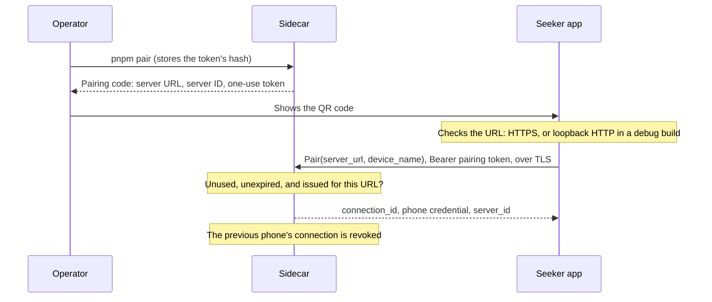

# Security

How the sidecar tells the agent from the phone, how a phone pairs, and how a phone reaches a self-hosted sidecar safely. The wire format is in [`docs/protocol.md`](protocol.md#pairing), and the operator's commands are in [`docs/development/sidecar.md`](development/sidecar.md#pairing-a-phone).

## Roles and credentials

Each credential opens one role, and the sidecar accepts it in one place only:

| Credential | Held by | Issued by | Accepted by | The sidecar keeps |
| --- | --- | --- | --- | --- |
| `MCP_TOKEN` | The agent | The operator, in `.env` | `/mcp` | The value, in `.env` |
| Pairing token | Whoever sees the pairing code | `pnpm pair`: one use, 10 minutes by default | `PairingService.Pair` | Its SHA-256 hash |
| Phone credential (`phone_token`) | The paired phone | The `Pair` response, once | `RequestService`, and `PairingService.RevokeConnection` for its own connection | Its SHA-256 hash |
| `PHONE_TOKEN` | The Stage 1 live-test screen | The operator, in `.env` | `LiveCommandService` only | The value, in `.env` |

- **Only the paired phone can prepare, review, and answer requests.** The agent's token is refused on every phone RPC, and the phone-side tokens are refused on `/mcp`. No MCP tool pairs, prepares, submits a result, or revokes. The full matrix is in [`docs/protocol.md`](protocol.md#roles), and `sidecar/src/pairing/roles.test.ts` tries every credential against every RPC and MCP method.
- **`PHONE_TOKEN` is the Stage 1 development exception, and it stays with the live diagnostic.** It can watch and acknowledge display-only live commands, and nothing else. It can't pair, and `RequestService` refuses it.
- **The phone credential exists only on the phone.** The sidecar returns it once, in the `Pair` response, and stores only its hash. The database, its backups, and the log can't give it away.
- **Pairing tokens and phone credentials are 32 random bytes,** written as 43 base64url characters. Because they're random, a single SHA-256 is enough to store them. A slow password hash only helps with guessable secrets.
- **Tokens travel only in `Authorization: Bearer <token>`,** never in a URL or a log line. The one exception is the pairing code, because showing it is how pairing works.

### The operator's account

Anyone who can run `pnpm pair` or write the sidecar's database acts as the operator. They could pair a phone of their own, which would revoke the owner's. So an agent must never run as the sidecar's user or have access to its files. Connect it over MCP only, as [`docs/integrations/hermes.md`](integrations/hermes.md) does, including when Hermes runs on another machine.

## Pairing



1. The operator runs `pnpm pair` on the sidecar's machine. It issues a pairing token and prints the pairing code, as a QR code and as text. The code holds the server URL (`SIDECAR_PUBLIC_URL`), the sidecar's lasting ID, and the token.
2. The phone reads the code. It accepts only an HTTPS URL, or plain HTTP on loopback in a debug build, and it checks the server's certificate and host name the normal way.
3. The phone calls `Pair` at that URL, with the token as its bearer credential and the URL in `server_url`.
4. The sidecar checks the token, and creates a new connection with a new credential.

Pairing doesn't involve the wallet. Wallet authorization is a separate step, from Stage 3 on. The owner's walkthrough is [`docs/guides/pairing.md`](guides/pairing.md), and what the phone stores is under [local storage and recovery](#local-storage-and-recovery).

Pairing tokens are:

- **One use.** A token that paired once is refused after that.
- **Short-lived.** A token works strictly before its expiry, 10 minutes after it was issued by default. `PAIRING_TOKEN_TTL_SECONDS` sets 1 to 60 minutes.
- **The newest one only.** Issuing a code voids every unused one issued before it.
- **Bound to their URL.** `Pair` must carry the URL from the code, compared after normalization. A different URL gets `INVALID_PARAMETERS`, and the token stays usable, so a phone that reached the sidecar by another address fails without using up the code.
- **Refused the same way, whatever the reason.** An unknown, expired, used, or missing token gets `UNAUTHENTICATED` with one message, so the answer doesn't tell a guesser which tokens exist.
- **Stored as hashes,** with their URL and times. The code on the operator's screen is the only copy of the token.

### A code never redirects an existing connection

- **Pairing always creates a new connection,** with a new ID and a new credential. The sidecar never changes an existing connection's URL, ID, or credential, and the new connection can't see the old one's requests.
- **The phone does the same.** A scanned code is always a new pairing. It never changes the URL of a connection the phone already has, even when its `server` ID matches. So a code that points at another host can't take over an existing connection or its credential. The phone sends each credential only to the URL it paired with. Before pairing, the app shows the code's server URL and ID for the owner to confirm, and notes a server it already knows.
- **The server ID is how the phone recognizes a sidecar.** It stays the same across restarts and pairings, so the phone can tell the owner that a new code comes from a sidecar it already knows, possibly at a new address.

## One active phone per sidecar

A sidecar has one paired phone at a time. A phone can pair with several sidecars (SAW-012).

- **Pairing a new phone revokes the previous one.** `pnpm pair` says which phone the code would replace.
- **Revocation takes effect at once:**
  - The credential stops working, and the phone's next call gets `UNAUTHENTICATED`.
  - The connection's PENDING requests are CANCELLED, with the detail "The phone's connection was revoked." A request that's already past its deadline expires instead, since expiry comes first.
  - Requests the owner already approved keep their states, and agents can still read every request.
  - Until the next pairing, creating a request fails with `NOT_PAIRED`.
- **The phone revokes itself with `RevokeConnection`,** for example when the owner removes the connection.
- **The operator revokes with `pnpm pair revoke`,** for example when the phone is lost. `pnpm pair status` shows the paired phone. Neither command prints a credential.
- **To re-pair,** run `pnpm pair` again. An old credential never works again.
- **Upgrading from SAW-010:** migration 2 revokes the stand-in connection that SAW-010 created with the database, and cancels its PENDING requests. Pair the phone after upgrading.

## Transport security

- **The sidecar listens on loopback only,** over plain HTTP. `SIDECAR_HOST` can't be anything else.
- **A phone on another network reaches it through a trusted TLS endpoint** on the same machine. The endpoint ends TLS with a certificate the phone already trusts, and forwards to the loopback port. The app keeps Android's normal certificate and host name checks, with no certificate pinning and no trust-all.
- **`SIDECAR_PUBLIC_URL` is the URL that pairing codes carry.** It must be `https://`, with one exception: `http://` on `127.0.0.1`, `localhost`, or `[::1]`, for development over `adb reverse`. That's the default, and it's the Stage 1 loopback exception. The debug build allows cleartext to `127.0.0.1` and `localhost` only, and release builds allow none. The URL can have a path, but no user name, password, query, or fragment.
- **The endpoint forwards everything, `/mcp` included.** `/mcp` still refuses a public host name unless `MCP_ALLOWED_HOSTS` lists it, and it always needs `MCP_TOKEN`.
- **Stage 7 adds the Docker gateway,** with TLS and optional OAuth.

### A trusted endpoint for this stage's remote test

Either of these works, and the sidecar's configuration stays the same apart from `SIDECAR_PUBLIC_URL`.

**Tailscale Serve,** when the phone and the Mac are on the same tailnet:

1. In the tailnet's admin console, turn on MagicDNS and HTTPS certificates.
2. On the Mac, run `tailscale serve --bg http://127.0.0.1:8080`. Tailscale gets a Let's Encrypt certificate for the Mac's `ts.net` name, and forwards HTTPS to the sidecar. `tailscale serve status` prints the URL.
3. In `.env`, set `SIDECAR_PUBLIC_URL=https://<machine>.<tailnet>.ts.net`, then run `pnpm pair`.
4. To stop serving, run `tailscale serve --https=443 off`.

Only devices on the tailnet can reach this endpoint.

**Caddy,** on a machine with a public DNS name and ports 80 and 443 open: run `caddy reverse-proxy --from vault.example.com --to 127.0.0.1:8080`. Caddy gets a certificate automatically and forwards to the sidecar. Then set `SIDECAR_PUBLIC_URL=https://vault.example.com`.

Don't use a self-signed certificate. The phone rightly refuses it, and the only way around that is weakening its checks.

`sidecar/src/pairing/tls.test.ts` runs a TLS endpoint in front of the sidecar and pairs through it. Pairing works with a trusted certificate. An untrusted certificate, or one for another host name, fails before the token is sent, and the token stays usable.

## Local storage and recovery

What the phone keeps for each connection (SAW-012), and what happens when it's lost.

| What | Where | Protection |
| --- | --- | --- |
| Metadata: the name, the server URL and ID, the device name sent at pairing, when it paired, the last refresh, and any revocation | `filesDir/connections/<connection ID>.json`, one file per connection, written atomically | App-private storage |
| The phone credential | `noBackupFilesDir/credentials/<connection ID>`, one file per connection | AES-256-GCM under an Android Keystore key |
| The pairing token | The app's memory, until pairing ends or the owner leaves the screen | Never written to disk or to saved instance state |
| The owner's answers, each with the request it answered (SAW-013), and for an approved transfer the version, content hash, and exact bytes they approved (SAW-021) | `filesDir/results/<connection ID>/<request ID>.json`, one file per answer. A settled answer is kept for a week, and one that's waiting to be sent is kept until it's settled. | App-private storage; an answer holds no secret, and an approved transaction is unsigned bytes the sidecar built |
| The wallet the owner selected: its address, network, label, and when they chose it (SAW-015) | `filesDir/wallet/wallet.json` | App-private storage; a public address holds no secret, and it's published to every paired sidecar |
| The wallet's authorization token for this app (SAW-015) | `noBackupFilesDir/wallet/wallet-authorization` | AES-256-GCM under the same Android Keystore key, with its own associated data |
| The owner's own record of what this phone did (SAW-023): who asked, the terms they reviewed, the network, the outcome, and the signature | `filesDir/activity/<connection ID>/<request ID>.json`, one file per request, written atomically. Nothing prunes it. | App-private storage; it holds public addresses, amounts, and outcomes, and no credential, key, or transaction bytes |

- **The credential key lives in the Android Keystore** (`seekervault.credentials.v1`), created on first use. Its material never leaves the Keystore, so it can't be exported, backed up, or moved to another device. It protects credentials; it isn't a wallet key.
- **Each credential file is bound to its connection.** The connection ID is the cipher's associated data, so a file copied under another connection's name doesn't decrypt. One file holds `1 || IV length || IV || ciphertext and tag`, and every write uses a fresh IV.
- **Connections are keyed by the connection ID** that the sidecar assigned. The app accepts a `PairResponse` only if the ID is a lowercase UUID (it names the files), the credential has the format of one, and the server ID matches the code's. Removing a connection deletes its credential file first, then its metadata, and touches no other connection. A refresh counts only requests whose reference names the connection, whatever the sidecar sends.
- **Nothing is backed up or transferred.** The manifest sets `allowBackup="false"`. `data_extraction_rules.xml` excludes every domain from cloud backup and from device-to-device transfer, including `root`, which holds `no_backup/`. The Mobile Wallet Adapter authorization (SAW-015) is stored and excluded the same way. `StageBoundaryTest` checks the rules.
- **The app logs nothing about connections,** and its screens show the URL, the IDs, and the status, never the credential or the token.
- **An answer is written before it's sent,** so a crash or a lost response can't lose it. It goes only to the sidecar the request came from, keyed by both IDs, because two sidecars can use the same request ID. Removing a connection deletes its answers.
- **A credential the sidecar rejects is deleted.** When a refresh gets `UNAUTHENTICATED`, the app marks the connection revoked, deletes its credential, and never sends it again.
- **The record outlives the answer, on purpose.** An answer is what the sidecar is owed, and it goes when it has been settled for a week or when its connection is removed. A record of what was spent is the owner's, and removing the agent that asked for a payment doesn't erase the payment. Nothing else deletes a record: the owner clears the history themselves, from the Activity screen, and that is the only way one goes.
- **A record is written only for something that happened.** An approved transfer the sidecar never accepted opened no wallet and moved nothing, so it is removed rather than recorded (SAW-021).
- **The history holds nothing a record shouldn't.** Public addresses, base units, a cluster, an outcome, and a signature. Not the approved transaction's bytes, not a credential, not a wallet authorization. A history that can't be read says so rather than reading as an empty one.

| What happened | What the phone shows | What to do |
| --- | --- | --- |
| A new phone, a reinstall, or cleared app data | No connections | Pair with each sidecar again. That revokes the old phone's connection. |
| A lost or stolen phone | — | Run `pnpm pair revoke` on each sidecar. |
| The Keystore lost the key, or a file is damaged | "This phone no longer has the credential…" | Pair again, and remove the old connection. |
| The sidecar revoked the phone, another phone paired, or its database was reset | "The server no longer accepts this phone…" | Pair again, and remove the old connection. |
| The sidecar moved to a new address | The old connection can't reach it | Pair again with a code for the new address. The app never moves a credential to a new host. |

## The wallet

The owner's wallet belongs to the wallet app, not to seeker-vault (SAW-015; [`docs/guides/wallet-setup.md`](guides/wallet-setup.md)).

- **No key, seed phrase, or recovery material ever reaches this app or a sidecar.** The app asks the installed wallet through Mobile Wallet Adapter and learns two things: the public address the owner picked, and an authorization token for talking to that wallet again.
- **The authorization token is a secret and stays on the phone.** It is encrypted under the Keystore key, kept out of backups, never logged, and never sent to a sidecar. `WalletRepositoryTest` and `WalletActivityTest` check that it reaches no server.
- **A replacement takes the old one's place.** The wallet reauthorizes this app whenever it is opened, and may hand back another token; the phone stores that one in place of the old, under the same key and in the same file, and keeps the selection exactly as it was. It never opens the wallet a second time to learn it, and an authorization the wallet refuses is still forgotten rather than replaced.
- **The address is not a secret.** It's a public key, and the phone publishes it, with the network, to every connection so that agents can read it (`vault_get_address`). The sidecar logs it, the same way it logs connection IDs.
- **A sidecar with no binding says so.** `vault_get_address` fails with `WALLET_NOT_CONNECTED`; no address is generated, and no wallet is created anywhere.
- **Changing the wallet invalidates what no longer fits.** Publishing another wallet or network cancels the connection's PENDING wallet requests, so nothing queued for the old wallet can still be approved. Disconnecting publishes "no wallet" and cancels them the same way.
- **The wallet still decides.** The app asks; the wallet prompts the owner and can refuse. A refusal changes nothing on the phone.

### Approving a transfer (SAW-021)

The wallet signs **and sends** a transfer, so the rules around it are tighter than around a message ([`docs/architecture.md`](architecture.md#approval-binding), [`docs/guides/transfers.md`](guides/transfers.md)).

- **Only a transaction this phone read whole can be approved.** A preparation whose inspection came back anything but `Verified` has no Approve button, and the check is made again when one is tapped. This is input validation, not a policy verdict, and the two never trade places: validation settles what is executable, before any policy is consulted, and a policy adds only reasons for the owner to read ([`docs/policy.md`](policy.md#precedence)). No rule can make an unverified preparation approvable, and a malformed one is never relabelled as an advisory warning.
- **The sidecar is the commit point.** The approval, naming the version and content hash, is sent first; the wallet is opened only once the sidecar accepts it. An approval the sidecar refuses, or that never left the phone, is deleted there: nothing was approved, and the owner reviews a fresh preparation.
- **An approval nobody answered is kept, not guessed at.** A dropped connection or a lost response is not a refusal: the sidecar may hold the request as PROCESSING, and only the phone can ever settle that. So the approval stays on the phone, marked as unanswered, and the next delivery *reads* the request rather than sending the approval again. Still PENDING means it never arrived, and the approval is dropped; PROCESSING means it did, and since the wallet is opened only for an approval the sidecar answered, the sidecar is told that nothing was signed and nothing was sent, so the request ends instead of waiting for a wallet forever.
- **The window is checked again at the wallet, not only at the sidecar.** The sidecar refuses an approval with less than 15 seconds of its blockhash window left, but acceptance and the wallet call are different moments: one wallet interaction runs at a time, and the wait for that lock can outlast the window. The phone takes the lock first, checks the window, commits the approval, and checks the window once more immediately before `signAndSendTransactions`. A transaction that can no longer land is never put in front of the wallet — before the commit the owner simply reviews a fresh preparation, and after it the sidecar is told that nothing was sent.
- **The wallet is handed the stored bytes.** They are written to disk before it opens, so a sidecar that rebuilt the transaction in between cannot substitute one, and a rotation or a restart cannot change what is signed.
- **One wallet interaction at a time,** and one per approval. What the wallet did is stored before it is sent, and every retry reaches a sidecar, never a wallet.
- **An outcome nobody knows is reported as UNKNOWN.** A wallet that reports it signed but did not submit, a session that ended without an answer, or an app killed while the wallet had the transaction all leave it unknown rather than failed. A signed transaction can still land, and the phone never asks again.

### The record, and the one address outside the phone (SAW-023)

- **The explorer is a link the owner follows, not a request this app makes.** A record of a sent transfer offers the public explorer on its own cluster; tapping it hands the address to whatever app opens links. The app opens no connection to it, and has no chain endpoint of any kind. `StageBoundaryTest` proves it from the sources: the address is written in one file, that file holds no HTTP client, and the app's HTTP clients exist only in the two sidecar transports and the one client they share.
- **A signature is never presented as more than it is.** A message signature and a transaction ID are both 64 bytes. Which one a record holds comes from the kind of request, never from the signature itself, so a signed message gets no explorer link and the screen says in words that it moved nothing and is on no network.
- **A transfer's cluster is part of the record, always.** The same signature on another cluster is another transaction, or nothing. A record with no cluster gets no link rather than a guessed one.

### Confirming a transfer (SAW-022)

Whether a sent transaction succeeded is read from the chain, and only by the sidecar ([`docs/protocol.md`](protocol.md#confirmation)).

- **The endpoint must be serving the request's own cluster.** Before a signature status, a transaction, a block height, or an expiry is read as evidence, the sidecar compares the endpoint's genesis hash with the network the request is bound to — the same check a preparation makes. This matters at a restart: the database outlives the process and `SOLANA_RPC_URL` does not, and on another cluster the signature is missing and the block height is somebody else's, which together look exactly like "it expired and nothing was spent". A mismatched or unknown cluster settles nothing — not FAILED, not CONFIRMED, not anything — and the confirmation says which cluster the endpoint was pointed at.
- **A result is checked against the approved bytes.** Before a transfer is reported CONFIRMED, the sidecar fetches the transaction the chain holds under the reported signature and compares its message with the exact `PreparedTransaction` the approval named. A signature naming anything else settles nothing, and is disclosed as not matching rather than reported either way.
- **The trust is named.** The whole answer rests on one configured endpoint. `Outcome.confirmation.endpoint`, the agent's `checked_with`, and the phone's "Checked with …" line all carry its **host only**: `SOLANA_RPC_URL` can hold an API key, so the URL never reaches a log, an error, or a stored record.
- **A check can settle a request or leave it alone, and nothing else.** It opens no wallet, signs nothing, sends nothing, and never moves a request backward or back to PENDING. A request that has finished is left as it is, whatever a later look says.
- **Silence is not evidence.** An endpoint that timed out, refused, or has no status yet changes nothing. Only the approved transaction's blockhash window closing, together with a search of the ledger that still finds nothing, is taken as proof that it never landed.
- **Nothing builds a replacement.** Not the sidecar, not the phone, not on a chain failure, an expiry, or an unaccountable signature. Another attempt is a new request the owner approves by hand.

### Signing a message (SAW-016)

- **Nothing reaches the wallet before the owner approves.** The app opens the wallet only after they tap **Approve and sign** on the request, and only for the wallet and network shown on that screen. `InboxViewModelTest` checks that no wallet call happens otherwise.
- **Nor before the sidecar has taken the approval.** The approval goes first, and the wallet is opened only once the sidecar has accepted it — the point where the request is PROCESSING there. An approval still sitting on this phone, because the server couldn't be reached, may belong to a request that has since been cancelled or expired, so no wallet is opened for it: it is sent again by itself, and an approval with no wallet answer is reported as a failure rather than left open.
- **The approval names what was reviewed.** It carries the SHA-256 of the exact message bytes, and the sidecar refuses any other hash. A wallet or network that changed in the meantime stops the approval instead of signing something the owner didn't see.
- **The sidecar verifies, and never signs.** It checks the signature against the request's wallet and its own copy of the message before it accepts it, and refuses anything else with `INVALID_PARAMETERS`. It holds no key, and `stage-boundary.test.ts` keeps signing APIs out of its sources.
- **The phone verifies too, before it believes the wallet.** <a id="verifying-a-signature"></a>The wallet is another app, and 64 bytes are not a signature until they verify: `wallet/Ed25519.kt` checks the wallet's answer against the selected wallet's own key and the exact bytes that were asked for, and an answer that doesn't verify is a failure to sign, reported once. Without that check, a wallet that answered with anything at all would be believed here and refused there for ever — the first outcome stored for an approval stands, so the same invalid signature would be sent again and again with the request left PROCESSING. The check is written out rather than taken from the platform (`Signature.getInstance("Ed25519")` arrives in API 33 and this app supports 31), it holds no key and makes no signature, and `Ed25519Test` holds it to the JDK's own verifier.
- **What leaves the phone is public.** The signature and the address that made it; the wallet's authorization token is not part of any submission. A signature moves no funds and sends nothing on chain.
- **Nothing signed is left in doubt.** A signature the phone never received doesn't exist anywhere, so the request is reported as failed rather than uncertain.

| What happened | What the phone shows | What to do |
| --- | --- | --- |
| No wallet app is installed | "No wallet app answered…" | Install or set up a wallet that supports Mobile Wallet Adapter, such as Seed Vault Wallet. |
| The wallet refused the stored authorization | "The wallet no longer accepts this app's authorization." | Connect again; the phone has already forgotten the old authorization. |
| The wallet doesn't serve the chosen network | "The wallet doesn't serve this network." | Pick a network the wallet offers. |
| A sidecar couldn't be told | "Couldn't tell N connection(s)…" | Tap "Tell them again" once it's reachable. |

## Inspecting a transfer

The sidecar builds the transaction, and the phone decides whether it is the one the owner was asked
to approve. Those are two different machines and two different pieces of code on purpose: an
agent's description, and a sidecar's description, are both claims. The bytes are the thing.

**What the phone establishes from the bytes alone (SAW-020).** It decodes the transaction the wallet
would sign and reads out of it: the fee payer, every account that must sign, each instruction's
program and payload, the amount in base units, the recipient, the mint, whether a token account is
created, and any compute-budget price. It then checks all of that against the stored request, which
never changes, and against the wallet the owner selected. Nothing the sidecar says about its own
transaction is consulted, and the agent's note is rendered apart from the facts and labelled as
unverified.

**It reads nothing from a chain, and says what that costs.** The phone has no RPC endpoint of any
kind (`StageBoundaryTest` proves it from the sources), so every claim below is either read out of the
bytes or enforced by a program on chain when the transaction runs. Nothing rests on the sidecar's
word.

- **Where SOL goes is in the instruction.** The System `Transfer` names the receiving account
  outright, so the owner's own address is the fact.
- **Where tokens go is in the instruction; whose that account is, is not.** An address alone
  establishes nothing about ownership. A classic SPL token account's authority can be changed with
  `SetAuthority` after its address was derived, so an account that still derives from the recipient
  and the mint may belong to somebody else entirely by the time the transfer runs. Deriving the
  address and comparing it is necessary, and it is not sufficient.
- **So the transaction has to make the chain check it.** Every token transfer the sidecar builds
  carries the associated-account `CreateIdempotent` instruction, whether or not the account exists.
  That program re-derives the address, reads the account, and fails the whole transaction unless its
  owner and its mint are the recipient's. The phone requires that instruction — for this recipient,
  this mint, this account, paid by this wallet — before it will name a recipient at all. Without it
  the review reports that nothing establishes who would receive the tokens, and the preparation is
  **not approvable**.
- **`TransferChecked` carries the decimals, and the token program enforces them.** A wrong value
  makes the transaction fail on chain, so reading the amount with them is safe.
- **No name is ever shown.** A token appears as its mint address and its base units. There is no
  ticker, so there is no ticker to fake — in the request, in the note, or anywhere else.

**What RPC trust this requires.** None, on the phone's side. The sidecar reads a chain to build the
transaction, and its readings are convenience, not evidence: the mint's decimals are re-enforced by
the token program, the destination's ownership is re-enforced by the associated-account program, the
network by the genesis-hash check before the build, and the amount, recipient, payer, and signer set
by the bytes the phone read itself. A sidecar that lies about any of them produces a transaction that
either fails the phone's inspection or fails on chain. What a dishonest or misconfigured endpoint can
still do is refuse to build, build against a cluster it misreports the genesis hash for, or misstate
the fee and rent estimate — which is why those two are shown under the server's name and apart from
the facts.

**What it will not do.**

- **An instruction it cannot read is never treated as harmless.** The transaction is reported as not
  fully read, it is not approvable, and the screen says how much of it was covered.
- **A program a transfer may legitimately use is not a permission for every instruction it
  offers.** `Approve` and `SetAuthority` belong to the same token program as `TransferChecked`, and
  hand an account to somebody else. An instruction from a program that can move value and that the
  phone does not read makes the preparation invalid, not merely uncovered.
- **Anything it cannot account for byte for byte is refused.** Bytes left over at the end, a length
  spelled two ways, an instruction index outside the account list, or an address lookup table all
  end the review. A partly-read transaction is not a reviewed one.
- **A transaction that already carries a signature is refused.** A wallet is handed something
  unsigned.

**The limits, stated plainly.**

- **It proves what the transaction does, not what it is worth.** The phone has no prices, and a mint
  address is not a reputation. That an agent asked for a real token, at a sane amount, to a
  recipient the owner meant, is the owner's judgement to make.
- **The network fee is the sidecar's estimate.** A fee depends on the network at the time and cannot
  be read out of a transaction, so it is shown under the server's name and apart from the facts.
- **The network is checked against the wallet, not against the bytes.** A transaction does not say
  which cluster it is for. The phone checks that the request's network is the one the owner selected
  their wallet for; the sidecar separately refuses to build, and refuses to settle, against an
  endpoint whose genesis hash is another cluster's ([transfers](protocol.md#transfers-saw-019),
  [confirmation](protocol.md#confirmation)).
- **Only the supported shapes are covered.** Anything else is reported as unread, which is the
  honest answer, rather than as safe.

**Why the parser is the app's own.** The Mobile Wallet Adapter client already brings a Solana SDK and
a crypto provider onto the app's classpath, so this is not about dependency count. A general-purpose
decoder's job is to read what it can; this parser's job is to refuse everything it cannot fully
account for, which is a different contract. It is about 150 lines, it cannot sign and cannot reach a
network, and it is checked against transactions the sidecar really builds
([`docs/testing/transaction-fixtures.md`](testing/transaction-fixtures.md)).
`StageBoundaryTest` fails if a source file starts importing an SDK decoder instead.

## Verification versus advisory rules

Two different things on the review screen look, at a glance, like the same kind of judgement. They are not, and the difference is the one the whole design rests on.

| | Input validation | The owner's rules |
| --- | --- | --- |
| What it is about | Whether the bytes are the transaction the request asked for | Whether the request is what the owner expected this agent to ask for |
| Where it comes from | The transaction's own bytes, read by this phone ([above](#inspecting-a-transfer)) | A file on this phone that the owner wrote ([`policy.md`](policy.md)) |
| What it can do | Take the Approve button away entirely | Add reasons to read |
| Who can overrule it | Nobody | The owner, deliberately |
| When it runs | First, always | Second, on what passed |

**A rule can never make something executable.** A preparation that is malformed, that disagrees with its request, or that this phone could not account for whole has no Approve button, and there is no tick that brings one back. `ALLOWED` next to it changes nothing at all: it is a statement about parameters, made about a transaction the phone already refused to put in front of a wallet.

**A malformed preparation is never relabelled as an advisory warning.** The two live in separate blocks on the screen, with their own words, and the block that says why there is no button is the input-validation one. Calling a byte mismatch "outside your rules" would offer the owner a way past it that does not exist, and would teach them that the refusals they cannot overrule are the same kind of thing as the warnings they can.

**A rule can never make something stricter, either.** `UNDER_RESTRICTIONS` leaves a request exactly as executable as it was. There is no `BLOCKED`, and no setting that makes the app turn a request down on its own.

**Neither one approves.** `ALLOWED` means the parameters matched what the owner wrote down. The owner still approves by hand in the app, and their wallet asks them again.

**And no gesture answers for something nobody has read.** The Requests list answers under a finger (SEE-57), and the two directions are not equal: a left swipe rejects anything, a right swipe acknowledges an acknowledgement — which moves nothing and signs nothing — and a right swipe on a transfer or a message *opens the review* rather than approving. A transfer has no transaction until the review asks for one, so there is nothing a list could hand a wallet; a message's bytes are not on the row. The rule the review exists to keep — that only a transaction this phone read whole is ever put in front of a wallet — is not one a shortcut may step around.

The assessment the owner read is kept with their own record of what they did, as codes ([`policy.md`](policy.md#the-stored-snapshot)). The rules never reach the sidecar, and neither does the assessment: no RPC carries one, and `StageBoundaryTest` holds the files that speak to a sidecar to having never heard of a policy.

## Logs and diagnostics

- **No token reaches the log.** Pairing logs connection IDs and error codes only:

  ```text
  [sidecar] phone paired: connection de03846e-d435-4705-b2e3-ec67da539f12; revoked connection 5d3c8f0e-2b7a-4c1d-9e6f-0a1b2c3d4e5f
  [sidecar] rejected Pair: UNAUTHENTICATED
  [sidecar] rejected ListPending: missing, wrong, or revoked phone credential
  [sidecar] connection de03846e-d435-4705-b2e3-ec67da539f12 revoked by the phone; 2 pending requests cancelled
  ```

- **`pnpm pair status` and `pnpm pair revoke` print no secret.** They name the connection, its device name, and when it paired. The phone chooses its own name, so control, format, and line separator characters in it print escaped, as `\u{…}`. A name can't start a line of its own or send the terminal an escape sequence.
- **`pnpm pair` prints the pairing code,** because that's how pairing works. Show it only to the phone, and clear the terminal afterwards. Never paste it into a chat, an issue, or a log. An unused code stops working when it expires, or when the next one is issued.
- **The test agent removes `MCP_TOKEN` and `PHONE_TOKEN` from all its output;** see [`test-agent/README.md`](../test-agent/README.md).

`roles.test.ts` and `cli.test.ts` check that no token or credential appears in the sidecar's log or in the CLI's status and revoke output.
