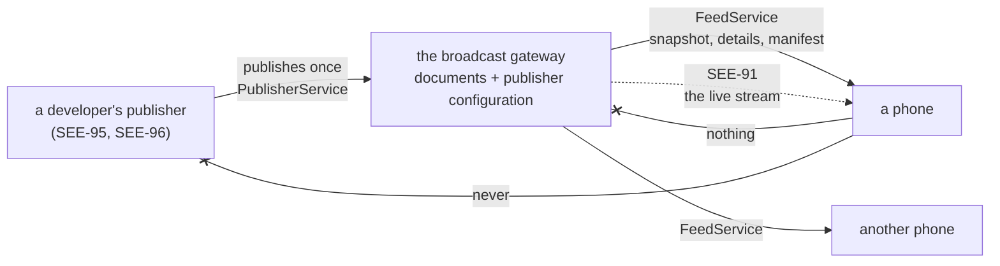

# The broadcast gateway (SEE-90)

SEE-88 made the kind of server part of a connection's record, and left `FeedGateway` as the seam a
publisher's manifest arrives through. SEE-89 added the document a publisher broadcasts, and left
`ProposalFeed` as the seam it arrives through. Both said the same thing: the gateway is SEE-90.

This is it: a Go service in [`broadcast/`](../../broadcast), with a publisher API a developer's
server calls once per thing it wants to say, and a read-only client API every subscribed phone reads
from.

**It is not `gateway/`.** That directory is one owner's private deployment — Caddy in front of their
own sidecar (SAW-035), run by the owner, serving one paired phone. This is a shared service, run by
whoever hosts the broadcast, serving everyone. Where the two could be confused this page says
"broadcast gateway" and "reverse proxy".

## What it is for

A publisher has one thing to say and no idea who is listening. Without something in the middle it
would have to keep a connection to every phone, learn which ones exist, and be reachable whenever
any of them woke up; and a phone would have to trust a developer's server with the fact that it is
interested. The gateway removes all of that from both sides:



The publisher never learns that a phone exists. The phone never contacts the publisher. And what
each owner decides — the parameters they chose, whether they went ahead, what came of it — never
leaves the device that decided it (SEE-89). The gateway is the only party in the middle, and the
most it knows is which channel someone asked about.

## The two APIs

Separate services, on separate listeners, with separate credentials — one of which does not exist.

| | The publisher API | The client API |
| --- | --- | --- |
| Contract | [`publish.proto`](../../proto/seekervault/gateway/v1/publish.proto) | [`feed.proto`](../../proto/seekervault/gateway/v1/feed.proto) |
| Who calls it | A developer's server | Every subscribed phone |
| Credential | A bearer credential, scoped to one server | None: a feed is a broadcast |
| What it can do | Publish a manifest, publish a proposal, withdraw one | Read a manifest, a page of the feed, one proposal |
| Where it listens | `BROADCAST_PUBLISHER_ADDRESS` | `BROADCAST_READ_ADDRESS` |
| Generated for | Go only | Go, Kotlin and TypeScript |

Two sockets rather than one service with a check per method, because the separation then survives
things that are not code: a deployment can keep the publisher API off the internet entirely, and a
routing mistake in front of the read port answers 404 rather than accepting a write. A boundary test
holds both directions of that
([`boundary_test.go`](../../broadcast/internal/gateway/boundary_test.go)).

The phone's half of it is stronger still: `buf.gen.yaml` excludes `publish.proto` from the Kotlin
and TypeScript output, so there is no publisher client in the app because none is compiled for the
app.

## What a publisher may say

Everything in a document is the publisher's own, and three things are not up to it. The rules are in
[`internal/rules`](../../broadcast/internal/rules), as pure functions, and each is the phone's own
rule applied one hop earlier — `proposals/ProposalValidation.kt` and `servers/ManifestValidation.kt`
apply the same ones to the same documents, because neither side trusts the other.

**Its own server, and its own channel.** The credential says which server the caller publishes as,
and every document is checked against that rather than against what the document claims. A channel
is `server/<server_id>` for the document's own server, so a publisher cannot name another's;
`CancelProposal` has no channel field at all, because there is nothing for it to say.

**A feed, never a direct server.** A published manifest must be `CONNECTION_MODE_GATEWAY_FEED`
naming this gateway's own origin. A direct manifest carries a URL, and relaying one would let a
publisher hand every subscribed phone an address of its choosing. The phone would refuse it — its
own check is that the origin must equal the one it paired with — but the gateway does not rely on
that: it refuses to hold one.

**A revision it can order.** Zero is never published, and neither is anything above 2⁶³−1: the phone
reads a revision into a signed 64-bit integer and refuses one it cannot compare, so a publisher
learns about the limit here rather than by watching every phone ignore its proposal.

Everything else is bounded the way the contract says: at most 32 named terms of at most 512 bytes, a
note of at most 1024, a name of at most 64, at most 16 plugin requirements, an explicit environment,
and times that agree with each other.

### What cannot pass through

The gateway **rebuilds every document from the fields it validated** rather than storing what
arrived. That is what makes an unknown field unable to reach a subscriber: protobuf keeps what it
cannot parse, and a field 99 carrying an address would otherwise be relayed to every phone on the
channel and written to disk on the way. A test publishes exactly that and checks the bytes that come
back out.

Over JSON the answer is louder: the codec is strict, so a field the contract does not have is
refused rather than ignored. A client that believed the gateway kept execution records would get 200
and silence from the permissive default, and would go on believing it.

## A revision is the idempotency key

A publisher's revision is its promise about its content, so it is the only key a retry needs:

| A publication arrives | The gateway |
| --- | --- |
| at a new identity | stores it, and notifies |
| at the revision it holds, with the same content | answers `unchanged`. Nothing is written, and nothing is notified: a retry is not an event |
| at the revision it holds, with different content | refuses it as a conflict, and says which revision it holds |
| at a lower revision | refuses it as stale. A retry that arrives late must not restore terms the publisher has moved past |
| at a higher revision | stores it, and notifies |
| with a creation time that moved | refuses it: that is a different proposal under the same ID |
| for a proposal that was withdrawn | refuses it. A withdrawal is final |

That last one matters downstream rather than here. A phone keeps its record of a proposal it acted
on for ever, and must never be shown the same identity as something open again (SEE-89) — so a
publisher with something else to propose publishes another proposal, which is another identity.

**Withdrawing** takes an ID and a revision rather than a document, so a publisher that no longer
holds what it published can still withdraw it. The gateway keeps every other field exactly as
published and writes two: the status, and the update time, because the withdrawal happened here.
That update time is the only field of a proposal the gateway ever writes, and nothing orders by it —
ordering is the revision's job on both sides.

## Persist first, fan out second

A publication is two things that must not be one: the document is committed, and then subscribers
are told. There is no way to make that atomic — one is a database transaction, the other is a
message to another system — so the only question is which failure a crash between them leaves.

The gateway commits the notice **in the same transaction as the document**
([`internal/store`](../../broadcast/internal/store)), and a drainer sends it
([`internal/dispatch`](../../broadcast/internal/dispatch)). So:

- a crash before the commit leaves nothing: the publication was never accepted;
- a crash after it leaves a notice that has not gone out, which the next start finds and sends;
- a fan-out that fails is kept and retried with backoff, never dropped.

Which makes delivery **at-least-once**, and says so rather than implying otherwise. A subscriber may
be told twice about the same document; the phone's apply path is idempotent and revision-ordered
precisely because delivery is not trustworthy about repetition (SEE-89). What cannot happen is a
second *logical* proposal: identity is (channel, proposal ID), and a repeat is the same document
arriving again.

Two publications that have not gone out yet **collapse into the later one**. What a subscriber wants
is the document as it stands, not the story of how it got there — the same coalescing the private
workflow's push invalidations already do under one collapse key (SAW-056). A notice is deleted only
if the revision it was sent at is still the current one, so a publication that lands mid-flight is
sent afterwards rather than silently swallowed.

**This build fans out to a log line.** Centrifugo and Redis are SEE-91, and `dispatch.Dispatcher` is
the seam they fill; the machinery that makes a crash harmless is exercised either way, and nothing
pretends a subscriber heard anything.

## Reading a feed

Three unary reads, and all of them derive their answer from the store at the moment they are asked.
No session, no subscription record, no count of who read what — a test reads the database after
several reads and requires every row count to be unchanged.

**Version-aware.** `GetServerManifest` takes the revision the caller holds and answers `unchanged`
rather than re-sending the document; `ListProposals` takes the snapshot sequence the caller holds
and answers `unchanged` when the channel has not moved. Both are in the contract rather than in an
HTTP header, because a proxy deciding how long a feed stays current would be a second opinion about
what a publisher is proposing, and the phone would have no way to tell it was reading one. Read
answers carry `Cache-Control: no-store`.

### The snapshot boundary

A page is ordered by proposal ID, and a walk continues after the last ID it returned. An offset would
skip or repeat documents as the feed moved, and a sequence would move a document between pages every
time it was republished; an identity does not change for as long as the proposal exists.

Every page of one walk reports the same `snapshot_sequence`: the channel's count of accepted
publications when the walk began. What a completed walk holds is therefore exactly this, and it is
the documented boundary:

- every proposal that existed at that sequence and still exists at the end of the walk, **some
  possibly at a newer revision** than they had then;
- plus any published during the walk that sort after the page the walk had reached.

It is not a transaction, and nothing is lost by that. A phone applies a document only over an older
revision of itself, so a page set from mixed moments converges; anything missed is picked up by the
next read. It is also what lets SEE-91 join a snapshot to a stream: buffer the events that arrive
during a walk, apply them after it, and the result is the current state whichever order they landed
in.

**A reconnecting client needs no live stream.** A full walk is the recovery path, and the sequence
tells it whether it needed one.

### Retention

A proposal is served until its own expiry plus the retention window (`BROADCAST_RETENTION_HOURS`,
a week by default), and then the gateway stops keeping it.

Expiry is the one clock everybody agrees on, so it is the one retention uses — including for a
withdrawn proposal, which keeps its own expiry and stays readable until then. That is deliberate: a
phone that was switched off for two days should learn that a proposal was **withdrawn** rather than
simply failing to find it, because "the publisher took this back" and "something went wrong" are
different things to show an owner.

Nothing on a phone is deleted by retention. A proposal a phone holds is the phone's until the owner
removes the feed (SEE-89); retention is only about how long the gateway keeps answering for one.

## Registering a publisher

There is no administrative API, no account system and no invitation flow. Registering a publisher is
the one act that grants the ability to publish, and it has no network surface at all: the operator
runs [`broadcastctl`](../../broadcast/cmd/broadcastctl) on the host that holds the database, and the
gateway itself has no method that could add a publisher however a request were authenticated.

```sh
docker compose run --rm ctl register --server 3f1b2c4d-5e6f-4a7b-8c9d-0e1f2a3b4c5d --label "copy trading"
docker compose run --rm ctl rotate --server 3f1b2c4d-5e6f-4a7b-8c9d-0e1f2a3b4c5d
docker compose run --rm ctl revoke --credential d7baec00
```

A credential is 32 random bytes, shown once, and stored only as its SHA-256 — the same thing the
sidecar does with a phone's credential (SAW-011). Losing one means rotating it, not recovering it.
Rotation is two steps so it needs no outage: add the new credential, deploy it, revoke the old one,
and both work in between. Revoking every credential leaves the publisher registered and unable to
publish, because its documents are not a reason to forget it; `forget` is the separate, louder act
that removes a publisher and everything it published.

The answer to an unauthenticated call says nothing about which way it failed. No credential, a
credential that was never issued, and a revoked one all get the same refusal: a caller learns that it
may not publish, and never whether the thing it presented used to work.

## Rate limits and bounds

A token bucket per caller, with the clock injected so the behaviour is a test rather than a wait:
per publisher for publications, per address for reads. A limiter remembers at most 16384 callers and
forgets the ones that have gone quiet; when it is full and none has, it refuses — a gateway would
rather be briefly unavailable to a new caller than spend its memory on whoever asks for the most of
it.

The read limit is a backstop. A reverse proxy sees a client before the gateway does and is where a
serious limit belongs; in the deployment this ships with, Caddy is on the same host, so the gateway
counts the address Caddy forwards — trusted only because the connection came from loopback, which a
remote client cannot arrange.

Requests are bounded at 64 KiB, the same limit the sidecar and its proxy already enforce, and a page
at 200 proposals with a channel bound of 200 open at once. Nothing is evicted to make room: a
publisher at its bound is refused a new proposal and can still update and withdraw what it has,
which is how it gets back under it.

## Where it is kept

SQLite, one file, one process ([`internal/store/store.go`](../../broadcast/internal/store/store.go)).

The store has one hard requirement — a publication and its notice must commit together — and a
single-file transactional database does that with nothing to operate. The driver is pure Go, so the
image carries no libc and the tests need no service. The load is bounded documents at human rates;
Postgres would be a second thing to run, back up and reason about, and if a deployment ever outgrows
one process the documents here are the authority either way: Centrifugo's and Redis's history
(SEE-91) is a recovery cache, never a source of truth.

Six tables: a publisher, its credential hashes, its manifest, its proposals, the channel's sequence,
and the outbox. **There is no table, and no column, for a subscriber** — no address, no chosen
quantity, no decision, nothing signed — and a boundary test reads the schema and fails if one
appears. The gateway cannot lose a user's financial history because it never has one.

## What this build does and does not do

- **It serves the whole API**, and its own tests drive it over a real listener with the generated
  clients against a real database file.
- **It fans out to a log line.** Centrifugo and Redis are SEE-91.
- **No phone talks to it yet.** The Android client for `FeedGateway` and `ProposalFeed` is SEE-91's,
  which is where a real stream and real unary reads over TLS are proven. What this task proves
  instead is that the documents it serves are the documents the phone's own validators accept: the
  cross-runtime fixtures in `proto/fixtures/seekervault/gateway/v1` are checked against the running
  gateway by [`fixtures_test.go`](../../broadcast/internal/gateway/fixtures_test.go) and against the
  phone's rules by `GatewayProtocolFixturesTest`.
- **Nothing was run in Docker.** No daemon is reachable on the machine these checks ran on, so the
  compose and Caddy configurations were validated statically and the binaries were run natively
  (`docs/changelog/2026-09-17.md`).
- Not a user-account platform, not an execution-result database, not an order processor, not a
  message broker of its own, and no financial endpoint of any kind.
