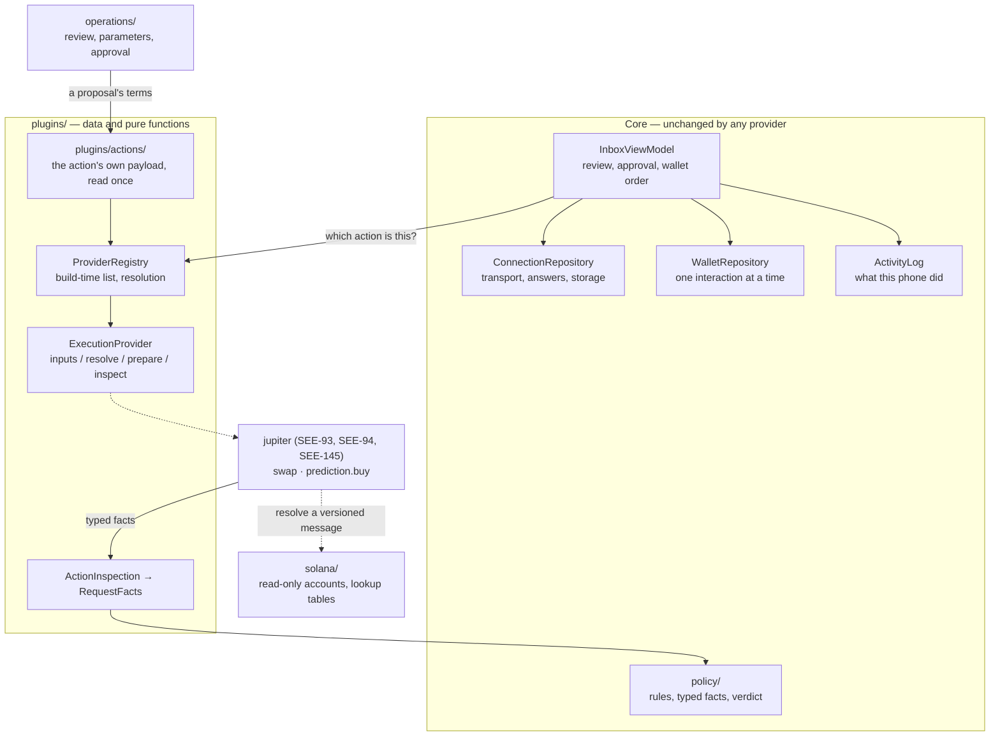

# The bundled-provider boundary and the SDK boundary (SEE-86, SEE-93, SEE-94, SEE-145)

This page is the short architecture document SEE-86 asks for: what boundary exists in the app **now**, and what a later SDK extraction (SEE-102) would still have to do. It is not a description of an SDK, because there isn't one.

Stage 7.1 adds two kinds of action the app doesn't know how to do by itself — a Jupiter swap (SEE-93) and a Jupiter prediction order (SEE-94) — and two server templates that publish proposals for them. The app is the working product and stays the working product. What SEE-86 adds is one place those actions can be plugged into, so writing them changes no transport, no policy, no wallet and no storage code.

**SEE-145 changed what that place is a boundary between.** Until then a bundled plugin was named `jupiter.swap`, which said *what the owner wants to do* and *who prepares it* in one string with a dot in the middle. It is now a **Solana execution-provider** boundary: an action is provider-neutral and versioned, an execution provider is named separately and explicitly, and core knows about the first and nothing about the second. [`execution-providers.md`](execution-providers.md) is the full extension contract — the interface method by method, resolution and every way it refuses, the compatibility table, the two numbers called contract, and what writing a provider involves. **Read that one first if you are adding a provider.** This page is what the boundary is *for*, and what an extraction would still have to cut apart.

## What an execution provider is

A provider owns three things, and nothing else:

| It owns | It does not own |
| --- | --- |
| The parameters an operation leaves to the person using it | How they are presented |
| Where the execution data comes from, and the exact bytes that would be signed | Whether those bytes are approved |
| Reading those bytes back as typed facts | What the owner's rules make of those facts |

Everything else stays exactly where it already is: the owner's rules in [`policy/`](../../android/app/src/main/java/io/github/brrenat/seekervault/policy), their manual approval and the one-at-a-time wallet interaction in [`InboxViewModel`](../../android/app/src/main/java/io/github/brrenat/seekervault/inbox/InboxViewModel.kt) and [`WalletRepository`](../../android/app/src/main/java/io/github/brrenat/seekervault/wallet/WalletRepository.kt), the local record in [`activity/`](../../android/app/src/main/java/io/github/brrenat/seekervault/activity), and the transports in `connections/`, `sync/`, `live/` and `push/`.

One thing that used to be the plugin's is now core's: **reading the publisher's terms**. The `swap` and `prediction.buy` payload schemas belong to the action rather than to whoever executes it, so they live in [`plugins/actions/`](../../android/app/src/main/java/io/github/brrenat/seekervault/plugins/actions) and core reads them once, before any provider is consulted. A publisher is a stranger, and every provider of an action has to refuse the same malformed document in the same way.

## The boundary as it stands

- **[`ExecutionProvider`](../../android/app/src/main/java/io/github/brrenat/seekervault/plugins/ExecutionProvider.kt)** declares a `ProviderCapabilities`: a stable `ExecutionProviderId`, the contract version it was written against, one `ActionCapability` per action it serves — the schema versions it reads, the Solana clusters it serves them on, the assets it takes and the limits it sets — the `PluginEnvironment`s it serves them in, whether it answers status queries, and the bundled-plugin names it answers to. Its behaviours are `inputs`, `resolve`, `prepare`, `inspect`, `destinations` and `status`.
- **An `ActionOperation` is the whole of what a provider is handed:** the connection ID, the action and the schema version its payload was read as, its own identity, the environment, the network the wallet is selected for, the typed payload, either a request or nothing, and the wallet the owner selected — a public address and a network. No credential, no wallet authorization token, no transport handle, no approval, and no way to send anything. A `StageBoundaryTest` check reads the package's imports against an exact list and fails if a wallet interaction, a store, an HTTP client or an approval appears in it.
- **[`ProviderRegistry`](../../android/app/src/main/java/io/github/brrenat/seekervault/plugins/ProviderRegistry.kt)** is the build's own list. A provider is **named**, never chosen: `resolve` answers `Supported`, or `Unsupported` with one of seven reasons — `NoProvider`, `ContractUnsupported`, `ActionUnsupported`, `SchemaUnsupported`, `NetworkUnsupported`, `EnvironmentUnsupported`, `AssetUnsupported`. There is no routing between providers, no fallback, and no "the only one that serves swap": null means refused. Nothing is downloaded, and there is no case in which a provider is fetched.
- **Actions are named at the protocol's own level.** Core says `swap` and `prediction.buy`; a provider claims them. That Jupiter is what makes a swap work is the provider's business, which is why `connections/`, `sync/`, `live/`, `push/`, `policy/`, `transactions/` and `activity/` contain no provider's name — another `StageBoundaryTest` check fails if one appears.
- **`resolve` is a read, and it is the only one before preparing.** It fetches what the provider currently says about the action — a market's state, constraints as they stand now — and returns the fields with whatever it established beside them. Nothing is ordered, nothing is bound, and a provider with nothing live to say keeps what `inputs` already returned and answers immediately.
- **Preparing can fail, and says why.** A provider reaches its own API, and reaching one fails: unreachable, rate-limited, no route, an answer that cannot be used. It raises a `PluginFailure` with a stable code, its own string resource and the provider's own words when it gave any — because there is no approximate preparation to fall back on.
- **The environment is core's too (SEE-97).** A provider declares which `PluginEnvironment`s it can serve, and is handed the one in force, but it does not read it to decide anything: it prepares identically in sandbox and in production, because whether the bytes are signed is core's business — core holds the wallet — in exactly the way which cluster they are for is. A rehearsal of something other than the real thing would demonstrate nothing, and a provider enforcing it would be a second place for the answer to be wrong. **An environment is not a network, and neither is derived from the other**: which clusters a provider serves is `ActionCapability.networks`, and the two are separate refusals ([`docs/wiki/environments.md`](environments.md)).
- **Typed facts, and no borrowed verdicts.** A provider reports what it read as an [`InspectedAction`](../../android/app/src/main/java/io/github/brrenat/seekervault/plugins/ActionInspection.kt): a payer, an amount in base units, a mint, a recipient, the programs called, and how many of the instructions it actually read. Coverage is derived from those two counts rather than stated, so a provider can't claim it read bytes it didn't finish. The chain is core's: a rule is about the network the owner's wallet is selected for, and a provider's own idea of which network its bytes are on is never consulted.
- **Somewhere to continue, when there is one.** `destinations(operation)` is how a provider says where
  an operation carries on outside the app — a market on its own platform, say — built from
  something the provider validated and never from a publisher's prose. A destination that does not
  exist is not invented: a venue with no address for a position gets no position link (SEE-94).
  It is defaulted, because most operations have nowhere to send anybody.
- **A status query nothing polls.** `status(operation, reference)` exists, defaults to `ActionStatus.Unsupported`, and is called by nothing in this app. Jupiter answers `Unsupported` because it has no read that would turn "submitted" into "filled" without guessing. There is no fill monitoring, no positions screen and no settlement here, and SEE-145 deliberately added none: the method exists so a provider that genuinely can answer has somewhere to say so.
- **Identifiers for the record.** `ActionInspection.references` carries what an operation's provider
  named for it, as stable keys and public values, and core puts them in the owner's Activity record
  without reading any of them. No URL is ever among them: a link kept on disk is a link something
  else could have written.
- **Labelled values, for reading and never for evaluating.** An operation establishes things no rule has a field for: the least a swap will pay out, what a transaction costs to be picked up. A provider puts those in `ActionInspection.details` as a string resource and a formatted value, and core shows them in order without knowing what any of them mean. Nothing in there reaches `RequestFacts`, so no provider can make a rule pass by saying something reassuring.
- **An unserved action establishes nothing.** No provider, no preparation, or bytes that couldn't be read all map to [`RequestFacts.unread`](../../android/app/src/main/java/io/github/brrenat/seekervault/policy/RequestFacts.kt): value moves, nothing is verified, and the verdict can never be `ALLOWED`. A missing provider is a gap in the review, never a byte that turned out to be fine. Rules written for a transfer are not inherited by an operation they were never applied to — `ActionFactsTest` asserts both halves of that: the same generous rules give `UNDER_RESTRICTIONS` with nothing read, and `ALLOWED` once every byte is.

## What contract 2 means, and the other number called contract

`PROVIDER_CONTRACT` is **2**, and SEE-145 is the first raise there has ever been. Contract 1 was the plugin boundary SEE-86 landed and SEE-93, SEE-94 and SEE-97 settled: a plugin declared a `PluginId`, a set of operations and a set of environments, and was called through `parameters`, `prepare`, `inspect` and `destinations`. Every one of those is different now:

- the identity is a **provider** rather than a provider-and-action, and an action carries a schema version beside it;
- capabilities carry networks, accepted assets and limits, which a descriptor had no way to say;
- `parameters` became `inputs`, with a new suspending `resolve` beside it for what the venue says *now*;
- what is handed over is an `ActionOperation` carrying a **typed payload** core already read, rather than a bag of publisher strings for the plugin to parse itself;
- `status` exists.

A contract-1 plugin cannot be called through any of that, which is exactly what a contract change means. `SUPPORTED_PROVIDER_CONTRACTS` names the versions this build calls, and a provider outside it is reported as unsupported rather than adapted.

**The other number did not move, and that is not a coincidence.** What a *server manifest* names for `jupiter.swap` and `jupiter.prediction` is still **1**, and it is a different number about a different agreement: what a publisher may put in a proposal and what a client will do with it. None of that changed — SEE-145 restructured the code inside the APK, which is not the server's business — so every published manifest still resolves unchanged, and SEE-95's CopyTrading template ([`copytrading-template.md`](copytrading-template.md)) and SEE-96's Prediction template ([`prediction-template.md`](prediction-template.md)) keep publishing `1..1`. That number is `LegacyCapability.contract` in the compatibility table, and it is what `serverSupport` matches a manifest's `min_contract..max_contract` range against ([`execution-providers.md`](execution-providers.md#two-numbers-are-called-contract)).

One thing was deliberately *not* changed when the number went up: `inspect` is still not a suspending function. A prediction order has to read the chain before it can be reviewed, which would have been the obvious reason to make it one — and instead the reading happens in `prepare`, where a provider is already allowed to reach a network, and `inspect` returns what that reading found. So the boundary keeps its plainest promise: **an inspection reads bytes, and never a network** (SEE-94).

## What has not changed

- **The wire.** No proto field was added. A provider reaches the phone through the existing `ActionCapability.plugin_id` compatibility claim, and the provider-neutral versioned action through the existing `capability_id` and `capability_version` SEE-108 already defined ([`common-requests.md`](common-requests.md)).
- **The names published before SEE-145.** `jupiter.swap` and `jupiter.prediction` are **looked up, never split on their dot**, in one explicit table and nowhere else. Both spellings of the prediction action are accepted, and the phone re-emits the legacy one, so a client that only knows the old vocabulary reads what it always read.
- **The app's own actions are still the app's.** An acknowledgement, a message signature and a transfer never reach the registry. `InboxViewModel` routes them exactly as before, and a registered provider is not asked about them — `InboxViewModelTest` holds that.
- **A direct-mode swap request is still not executable.** Bundling Jupiter changed nothing for an `ActionRequest`: core prepares no swap, so `actionFacts` still establishes nothing and the verdict can never be `ALLOWED`. Stage 6's server-side swap path was not resurrected, and SEE-93 says explicitly that it must not be.
- **No storage format, proto, or screen was redesigned**, so the app starts on the same persisted data and no migration discards anything. `ProposalStore` stays at version 3 and writes the action and the provider *beside* the legacy operation and plugin names, so a row this build writes is still readable by one that only knows version 3 — which refuses any other number before it reads a field.
- **No limit was lifted.** The app still holds no key, builds no transaction of its own, reaches no chain except for the one read a prediction order needs, and opens no wallet without the owner's hand on it.

## Selecting providers at build time

`ProviderRegistry.of(...)` is the selection, and the list is named where the app is composed: [`SeekerVaultApplication.providers`](../../android/app/src/main/java/io/github/brrenat/seekervault/SeekerVaultApplication.kt). `BundledProvidersTest` holds that list to exactly what is meant to ship, so adding to it has to be a deliberate edit that fails there first.

SEE-86 kept a `bundled()` in the registry itself, and SEE-93 removed it for a plain reason: it could only ever list providers that need nothing to be constructed, and the first real one needs an HTTP client. `plugins/` holds no client and reaches no transport, so the list moved to where every other dependency in this app is already named. An app that wanted a different set replaces that one property, which is what the tests do — `AlternateProviderTest` registers a second provider beside Jupiter and drives it through the real review, rules, binding, wallet and record path without a line of core dispatch knowing it exists.

Because the list is compiled in, a manifest that names a plugin (SEE-88) can only be matched against what the build already has. There is no dynamic load path to secure, because there is no dynamic load path.

## How a host app would get an entry point — documented, not built

This is the shape a later extraction would take. **None of it exists yet**, and SEE-86 implements no part of it; the floating button and menu entry are SEE-104, and the packaging is SEE-102.

- **One Activity, one navigation graph.** The app's review, connection, rules, wallet and activity screens hang off `MainActivity`'s single graph, and the wallet needs an `Activity` anyway: Mobile Wallet Adapter runs from an `ActivityResultSender` that `MainActivity` registers in `onCreate` and clears in `onDestroy`. A host app would launch that one Activity at a named destination rather than embedding the screens, which keeps the wallet's activity requirement and the app's own lifecycle handling in one place.
- **The composition root is already the seam.** `SeekerVaultApplication` builds every repository, store and registry as a settable property, which is how the tests replace the gateway, the wallet adapter, the Firebase client and now the provider list. An extraction would turn those properties into one configuration object rather than inventing new injection.
- **Four things would have to be cut apart**, and [`docs/development/android.md`](../development/android.md#wallet-capabilities-and-where-an-sdk-boundary-would-fall-see-84) already names them from SEE-84's side: the wallet API, the Android Mobile Wallet Adapter integration, the server request and approval workflow, and the app's UI. Stage 7.1 does none of that cutting.
- **What is genuinely unfinished for an SDK:** the package identity is the app's own (`io.github.brrenat.seekervault`, compatibility name `seeker-vault`) and would have to become a library's; the string resources, theme and components are the app's; storage paths are fixed under the app's own `filesDir`/`noBackupFilesDir`; and nothing is versioned for external consumers. SEE-102 owns all of it.

## Where the rules for this live

- The extension contract in full, and how to add a provider: [`execution-providers.md`](execution-providers.md).
- The provider written against all of this: [`jupiter-swap.md`](jupiter-swap.md) and [`jupiter-prediction.md`](jupiter-prediction.md), with its API in [`integrations/jupiter.md`](../integrations/jupiter.md).
- Stage boundary and what the guards hold: [`AGENTS.md`](../../AGENTS.md#stage-boundaries), enforced by [`StageBoundaryTest`](../../android/app/src/test/java/io/github/brrenat/seekervault/StageBoundaryTest.kt).
- What a policy is applied to: [`policy.md`](../policy.md#what-is-evaluated).
- Why validation is judged before a rule, and never softened by one: [`security.md`](../security.md#verification-versus-advisory-rules).
- Approval binding, and the order an approval and a wallet call happen in: [`architecture.md`](../architecture.md#approval-binding).
