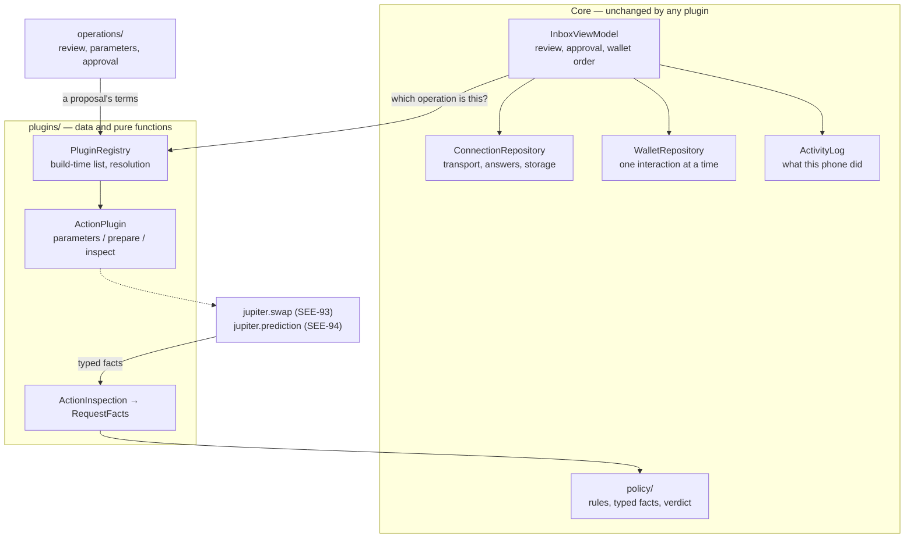

# Client plugins and the SDK boundary (SEE-86, SEE-93)

This page is the short architecture document SEE-86 asks for: what boundary exists in the app **now**, and what a later SDK extraction (SEE-102) would still have to do. It is not a description of an SDK, because there isn't one.

Stage 7.1 adds two kinds of action the app doesn't know how to do by itself — a Jupiter swap (SEE-93) and a Jupiter prediction submission (SEE-94) — and two server templates that publish proposals for them. The app is the working product and stays the working product. What SEE-86 adds is one place those actions can be plugged into, so writing them changes no transport, no policy, no wallet and no storage code.

**SEE-93 is the first thing written against it**, which is the test of whether the boundary was worth having: `jupiter.swap` reaches one provider of its own and takes everything else from what it is handed. What it needed that SEE-86 had not settled is set out under [what contract 1 means](#what-contract-1-means) — a definition rather than a change, because nothing had ever been written against it before.

## What a client plugin is

A plugin owns three things, and nothing else:

| It owns | It does not own |
| --- | --- |
| The parameters an operation leaves to the person using it | How they are presented |
| Where the execution data comes from, and the exact bytes that would be signed | Whether those bytes are approved |
| Reading those bytes back as typed facts | What the owner's rules make of those facts |

Everything else stays exactly where it already is: the owner's rules in [`policy/`](../../android/app/src/main/java/io/github/brrenat/seekervault/policy), their manual approval and the one-at-a-time wallet interaction in [`InboxViewModel`](../../android/app/src/main/java/io/github/brrenat/seekervault/inbox/InboxViewModel.kt) and [`WalletRepository`](../../android/app/src/main/java/io/github/brrenat/seekervault/wallet/WalletRepository.kt), the local record in [`activity/`](../../android/app/src/main/java/io/github/brrenat/seekervault/activity), and the transports in `connections/`, `sync/`, `live/` and `push/`.

## The boundary as it stands

- **[`ActionPlugin`](../../android/app/src/main/java/io/github/brrenat/seekervault/plugins/ActionPlugin.kt)** declares a stable `PluginId`, the contract version it was written against, the `OperationId`s it serves, and the `PluginEnvironment`s it serves them in. Its three behaviours are `parameters`, `prepare` and `inspect`.
- **An `ActionSubject` is the whole of what a plugin is handed:** the connection ID, the operation, the environment, either a request or a broadcast proposal's terms, and the wallet the owner selected — a public address and a network. No credential, no wallet authorization token, no transport handle, no approval, and no way to send anything. A `StageBoundaryTest` check reads the package's imports against an exact list and fails if a wallet interaction, a store, an HTTP client or an approval appears in it.
- **[`PluginRegistry`](../../android/app/src/main/java/io/github/brrenat/seekervault/plugins/PluginRegistry.kt)** is the build's own list. Resolution answers `Supported`, or `Unsupported` with one of three reasons: this build carries no plugin for the operation, it carries one written against another version of the boundary, or it carries one that doesn't serve this environment. Nothing is downloaded, and there is no fourth case in which a plugin is fetched.
- **Operations are named at the protocol's own level.** Core says `swap`; a plugin claims `swap`. That Jupiter is what makes a swap work is the plugin's business, which is why `connections/`, `sync/`, `live/`, `push/`, `policy/`, `transactions/` and `activity/` contain no provider's name — another `StageBoundaryTest` check fails if one appears.
- **Preparing can fail, and says why.** A plugin reaches a provider, and reaching a provider fails: unreachable, rate-limited, no route, an answer that cannot be used, an environment that does not execute. It raises a `PluginFailure` with a stable code, its own string resource and the provider's own words when it gave any — because there is no approximate preparation to fall back on.
- **Typed facts, and no borrowed verdicts.** A plugin reports what it read as an [`InspectedAction`](../../android/app/src/main/java/io/github/brrenat/seekervault/plugins/ActionInspection.kt): a payer, an amount in base units, a mint, a recipient, the programs called, and how many of the instructions it actually read. Coverage is derived from those two counts rather than stated, so a plugin can't claim it read bytes it didn't finish. The chain is core's: a rule is about the network the owner's wallet is selected for, and a plugin's own idea of which network its bytes are on is never consulted.
- **Labelled values, for reading and never for evaluating.** An operation establishes things no rule has a field for: the least a swap will pay out, what a transaction costs to be picked up. A plugin puts those in `ActionInspection.details` as a string resource and a formatted value, and core shows them in order without knowing what any of them mean. Nothing in there reaches `RequestFacts`, so no plugin can make a rule pass by saying something reassuring.
- **An unserved operation establishes nothing.** No plugin, no preparation, or bytes that couldn't be read all map to [`RequestFacts.unread`](../../android/app/src/main/java/io/github/brrenat/seekervault/policy/RequestFacts.kt): value moves, nothing is verified, and the verdict can never be `ALLOWED`. A missing plugin is a gap in the review, never a byte that turned out to be fine. Rules written for a transfer are not inherited by an operation they were never applied to — `PluginFactsTest` asserts both halves of that: the same generous rules give `UNDER_RESTRICTIONS` with nothing read, and `ALLOWED` once every byte is.

## What contract 1 means

SEE-86 landed the boundary before anything was written against it; SEE-93 is the first thing written against it. So what `PLUGIN_CONTRACT = 1` *means* was settled there rather than changed there, and the number stayed 1 on purpose:

- a subject may carry a broadcast proposal's **terms** instead of a request, because a proposal is addressed to nobody and has no `ActionRequest` — handing a plugin an empty one would be a request that isn't one;
- `inspect` is given the owner's **choice**, core's own copy: the question is "do these bytes do what *the owner* chose", so a plugin that asked its provider for something else is caught by the app rather than trusted about it;
- `prepare` may raise a `PluginFailure`;
- a `ParameterForm` may carry the reason there is nothing to collect, so a document the plugin cannot read is told apart from an operation with no parameters.

Nothing outside Stage 7.1 could be affected by that: the app had never carried a plugin, no publisher exists yet (SEE-95, SEE-96), and the manifests that require `jupiter.swap` at `1..1` are this stage's own fixtures. **The next change to `ActionPlugin` after a publisher exists raises the number.**

## What has not changed

- **The app's own actions are still the app's.** An acknowledgement, a message signature and a transfer never reach the registry. `InboxViewModel` routes them exactly as before, and a registered plugin is not asked about them — `InboxViewModelTest` holds that.
- **A direct-mode swap request is still not executable.** Bundling `jupiter.swap` changed nothing for an `ActionRequest`: core prepares no swap, so `pluginFacts` still establishes nothing and the verdict can never be `ALLOWED`. Stage 6's server-side swap path was not resurrected, and SEE-93 says explicitly that it must not be.
- **No storage format, proto, or screen was redesigned**, so the app starts on the same persisted data and no migration discards anything. The approved v4 presentation is used as it stands; the two screens SEE-93 adds are the shape Pending requests and Request details already established.
- **No limit was lifted.** The app still holds no key, builds no transaction of its own, reaches no chain, and opens no wallet without the owner's hand on it.

## Selecting plugins at build time

`PluginRegistry.of(...)` is the selection, and the list is named where the app is composed: [`SeekerVaultApplication.plugins`](../../android/app/src/main/java/io/github/brrenat/seekervault/SeekerVaultApplication.kt).

SEE-86 kept a `bundled()` in `PluginRegistry` itself, and SEE-93 removed it for a plain reason: it could only ever list plugins that need nothing to be constructed, and the first real one needs an HTTP client. `plugins/` holds no client and reaches no transport, so the list moved to where every other dependency in this app is already named. An app that wanted a different set replaces that one property, which is what the tests do.

Because the list is compiled in, a manifest that names a plugin (SEE-88) can only be matched against what the build already has. There is no dynamic load path to secure, because there is no dynamic load path.

## How a host app would get an entry point — documented, not built

This is the shape a later extraction would take. **None of it exists yet**, and SEE-86 implements no part of it; the floating button and menu entry are SEE-104, and the packaging is SEE-102.

- **One Activity, one navigation graph.** The app's review, connection, rules, wallet and activity screens hang off `MainActivity`'s single graph, and the wallet needs an `Activity` anyway: Mobile Wallet Adapter runs from an `ActivityResultSender` that `MainActivity` registers in `onCreate` and clears in `onDestroy`. A host app would launch that one Activity at a named destination rather than embedding the screens, which keeps the wallet's activity requirement and the app's own lifecycle handling in one place.
- **The composition root is already the seam.** `SeekerVaultApplication` builds every repository, store and registry as a settable property, which is how the tests replace the gateway, the wallet adapter, the Firebase client and now the plugin list. An extraction would turn those properties into one configuration object rather than inventing new injection.
- **Four things would have to be cut apart**, and [`docs/development/android.md`](../development/android.md#wallet-capabilities-and-where-an-sdk-boundary-would-fall-see-84) already names them from SEE-84's side: the wallet API, the Android Mobile Wallet Adapter integration, the server request and approval workflow, and the app's UI. Stage 7.1 does none of that cutting.
- **What is genuinely unfinished for an SDK:** the package identity is the app's own (`io.github.brrenat.seekervault`, compatibility name `seeker-vault`) and would have to become a library's; the string resources, theme and components are the app's; storage paths are fixed under the app's own `filesDir`/`noBackupFilesDir`; and nothing is versioned for external consumers. SEE-102 owns all of it.

## Where the rules for this live

- The first plugin written against all of this: [`jupiter-swap.md`](jupiter-swap.md), and its provider in [`integrations/jupiter.md`](../integrations/jupiter.md).
- Stage boundary and what the guards hold: [`AGENTS.md`](../../AGENTS.md#stage-boundaries), enforced by [`StageBoundaryTest`](../../android/app/src/test/java/io/github/brrenat/seekervault/StageBoundaryTest.kt).
- What a policy is applied to: [`policy.md`](../policy.md#what-is-evaluated).
- Why validation is judged before a rule, and never softened by one: [`security.md`](../security.md#verification-versus-advisory-rules).
- Approval binding, and the order an approval and a wallet call happen in: [`architecture.md`](../architecture.md#approval-binding).
