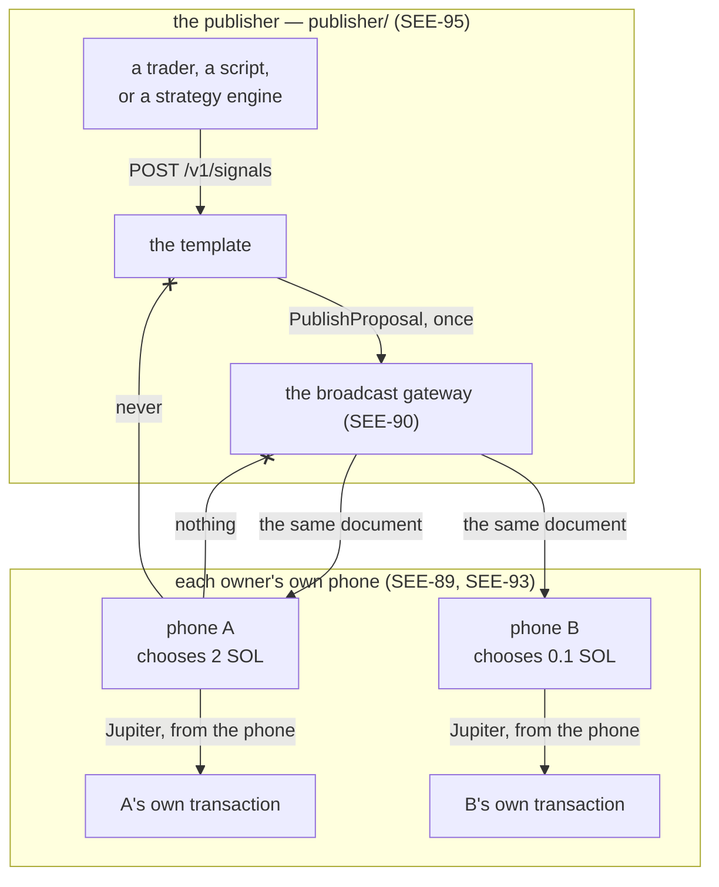

# The CopyTrading publisher template (SEE-95)

SEE-88 gave a server a way to say what it is. SEE-89 gave it a document to broadcast. SEE-90 built
the gateway that carries one. SEE-93 gave the phone a plugin that can execute one. Every one of
them named the thing that would write the documents: the publisher templates.

This is the first of them: a Go service in [`publisher/`](../../publisher), run by a developer or a
trader, which publishes trader-authored spot-swap signals and stops there. To deploy one rather than
understand it, follow [`docs/guides/server-development.md`](../guides/server-development.md).

**"CopyTrading" here means user-approved trader signals.** There is no wallet monitoring in it, no
copy detection, no unattended execution, no exchange account and no leverage. A signal is a
statement — *this is what I propose, on these terms, until this instant* — and every owner decides
for themselves, with their own amount, on their own phone.

## Three servers, and why this is the third

| | `sidecar/` (Node) | `broadcast/` (Go) | **`publisher/` (Go)** |
| --- | --- | --- | --- |
| Whose it is | the owner's own | whoever hosts the broadcast | **a developer's or a trader's** |
| Who calls it | one paired phone | publishers, and every phone | **whoever writes the signals** |
| What it holds | requests, results, a wallet binding | publications, publisher grants | **its own signals, and what the gateway confirmed** |
| Knows a subscriber | yes — the one it is paired with | no | **no; there is nobody to know** |
| Speaks MCP | optionally (SEE-87) | never | **never** |

It is a separate Go module rather than a command inside `broadcast/`, because the gateway's
operator and a publisher are different people: a template that compiled against the gateway's store
would be a template nobody could copy out. What the two share is the protocol in
[`proto/`](../../proto) and nothing else — and where that risks drift, a test reads the gateway's
own source rather than trusting a comment
([`contract_test.go`](../../publisher/internal/signals/contract_test.go)).

**One module, two templates.** SEE-96 is the prediction template, so what is not about swaps — the
configuration, the store, the outbox, the API and the CLI — is the module's core, and the swap
signal is one `signals.Kind` that `cmd/copytrading` registers. The seam exists because the second
kind is already specified, not on speculation.

## Where publication ends, and execution begins

This is the whole shape of the stage in one path, and the line in the middle of it is the point:

Publication ends at the arrow into the gateway. Everything below it is each owner's own, and none of
it comes back: not the amount they chose, not the slippage they settled on, not whether they
approved, not the signature, not the outcome. The publisher does not learn that phone A exists.

A worked example, end to end, with nothing left out:

1. **The gateway's operator registers the publisher.** `broadcastctl register --server <uuid>`
   prints one credential, once. That is the only act that grants the ability to publish, and it has
   no network surface at all.
2. **The template starts** with that credential, the gateway's origin, its own API token and an
   environment (`production` or `sandbox`). It publishes its manifest — `protocol_version` 1, mode
   `gateway_feed`, `required_plugins: [jupiter.swap 1..1]`, one environment, its channel — and
   prints the one line a subscriber needs:
   `seekervault://feed?v=1&gateway=…&server=…`. That reference carries no secret, so it can go in a
   README or a QR code.
3. **The trader publishes a signal**, through the CLI or with `curl`:
   `{"expires_at": "…", "note": "trimming SOL into USDC on the bounce", "terms": {"input_mint":
   "So111…112", "input_decimals": "9", "output_mint": "EPjF…Dt1v", "output_decimals": "6",
   "max_slippage_bps": "50"}}`. The template validates it by the phone's own rules, mints a
   proposal ID and revision 1, stores it, and publishes it once.
4. **Two owners add the feed** by scanning or pasting the reference. Each phone reads the manifest,
   checks that it carries `jupiter.swap` within a contract range the build supports, and starts
   reading the channel. Both read the identical document.
5. **Each owner chooses their own amount.** One stakes 2 SOL, the other 0.1 SOL, each at or below
   the publisher's slippage ceiling. Neither choice exists anywhere but on the phone that made it.
6. **Each phone prepares its own swap** through Jupiter, reads the transaction it was handed, and
   shows what the bytes actually say (SEE-93). The publisher's note is shown as the publisher's
   words, apart from everything the phone established for itself.
7. **Each owner approves on their own device**, through Mobile Wallet Adapter and Seed Vault, and
   the record of what happened stays there.
8. **The trader learns none of that.** If they withdraw the signal, phones stop executing new ones
   from it — and the owner who already executed keeps their record, because what happened happened
   and a publisher cannot unsay it.

## What a signal says

The terms are the contract in
[`docs/protocol.md`](../protocol.md#a-swap-signals-terms-see-93), and this template is the first
thing to write them. Two of the rules are the whole shape of a signal:

- **An asset is a mint, never a ticker.** "BTC" names a dozen things on Solana and nothing off it,
  so a term here is an exact base58 32-byte mint address. A symbol, if one is given, is a label the
  phone shows as the publisher's word beside the mint, never instead of it. There is deliberately
  no way to publish "buy Bitcoin".
- **Direction is the pair, and the pair is ordered.** The input mint is spent and the output mint is
  received. There is no side field, because a field that could disagree with the pair eventually
  would; a publisher that means the other way round publishes the other pair.

**The amount is not in it**, and neither is a wallet, a slippage somebody settled on, a decision or
a result. The API refuses a field it does not have rather than dropping it — the same strict
decoding the gateway uses — so a caller that believes this template keeps execution records is told
that it does not, rather than answered 200 and quietly ignored.

A term the kind does not know is refused too, which is stricter than the phone: the phone ignores an
extra term, because a publisher may say more than a plugin reads, but a template that *minted* one
would be publishing a word nothing will ever read — and the usual cause is a misspelling of one that
matters.

## The document is its own outbox

A signal row carries two revisions: the one the signal is at, and the one the gateway has confirmed
it holds. Anything where the first is above the second is work to do, and that is the whole of the
queue — there is no second table to keep in step with the first, so there is no state in which a
signal exists and its publication does not.

That is what makes every retry safe. The revision and the content are settled in the store *before*
the first call, so a retried publication is the identical document at the identical revision, and
the gateway answers `UNCHANGED`: nothing is written there and nobody is notified. A template that
was killed mid-publish republishes the same document rather than inventing a second one, because the
next start finds the same two numbers.

Three consequences worth stating on their own:

- **A restart is not an event.** The manifest's revision counts settings changes, not starts: the
  same settings produce the same fingerprint, so the same revision is republished and every phone
  keeps the manifest it has.
- **An update that changes nothing publishes nothing.** The revision moves only when the content
  does, so a strategy engine may re-post its current view every minute without waking a single
  phone.
- **A withdrawal is a transition, not a document.** It sends an ID and a revision, so a template
  that was redeployed can still withdraw what it no longer holds — and a withdrawal of something
  that was never published is recognized as nothing to withdraw rather than retried for ever.

## Idempotency, from the caller's side

`Idempotency-Key` is **required** on a create. A bot that retries a create has no other way to be
safe: the call may well have succeeded and the answer been lost, and without a key this template
cannot tell that second call from a second signal.

- The same key with the same statement answers 200 with the signal the first call created, and
  nothing is published twice.
- The same key with a *different* statement is 409. Two different statements cannot be one signal,
  and answering 200 with the first would hide the second for ever.
- A different key with identical content is a second signal, deliberately: the key is what says
  "this is the same statement", and content cannot say it — a trader may well publish the same pair
  twice in a day.

What the key is compared against is the *validated* statement rather than the bytes that arrived, so
two calls differing only in whitespace, key order or how a number was spelled are the same request.

Nothing else takes a key. An update carries the whole statement and is settled by its fingerprint; a
withdrawal and a retry are idempotent by what they are.

## When the gateway is not there

A signal is stored before it is submitted, so an unreachable gateway is not a failed signal:

| What happened | The answer | What then |
| --- | --- | --- |
| The gateway holds it | 201 (or 200 for a replay) | Nothing to do |
| The gateway cannot be reached, is restarting, or is rate-limiting | **202**, `"publication":"pending"`, with the next attempt's time | The drainer keeps trying, doubling from a second to a minute |
| The gateway refused it in a way retrying cannot change | **502**, `"publication":"refused"`, with the gateway's own problem code | An operator fixes the cause and asks: `POST /v1/signals/<id>/retry` |

The split is the gateway's own grouping, read from this side: `unavailable`, `internal` and a rate
limit will accept the same document later; `unauthenticated`, `permission_denied`,
`invalid_argument` and `failed_precondition` will say the same words for ever, and a template that
kept asking would be a template nobody could debug.

**A refused signal is never retried on a timer**, and that is deliberate: a restart loop must not
become a publication loop. The manifest is the one exception — a start is a deliberate act, so it
clears the manifest's refusal and tries once, because a publisher whose manifest is not there is a
publisher nobody can subscribe to at all.

## Sandbox and production are separate deployments

The environment is one setting with no default, it is the single value in the manifest's
`environments`, and **the database is stamped with it**. Opening a production file with a sandbox
configuration is refused at startup, as is opening another publisher's file — because the way these
get mixed up is not a typo in an argument, it is a copied compose file pointed at a volume that
already exists.

What sandbox means for a *publisher* is a declaration rather than a behaviour: this template signs
nothing and executes nothing, so what changes is what every subscribed phone does when its owner
approves — the same live signal, the same review, the same bytes, and then no wallet and no
signature (SEE-97, [environments.md](environments.md)). One deployment serves one environment; two
environments are two deployments, with their own server IDs, credentials and databases, and the
gateway refuses a manifest that tries to change the environments a server ID already published.

The shipped `.env.example` is a sandbox, so that copying it and running it demonstrates the whole
path without anybody's money. Production is a deliberate edit of that line; the code itself still
has no default, so a deployment that says nothing does not start.

## The API is the one path in

Everything a caller can do is nine JSON endpoints, and the CLI in
[`cmd/publishctl`](../../publisher/cmd/publishctl) is a client of them with no privileged access of
its own — which is what keeps validation, identity, revisions and publication in one place.
[`docs/integrations/signal-api.md`](../integrations/signal-api.md) is the contract.

One token guards all of it, presented as `Authorization: Bearer <token>`, compared in constant time,
required on everything but `/healthz`. It is the whole of the grant — a caller holding it can say
anything this publisher can say, to everybody subscribed — which is why it has a floor under its
length, why the API binds loopback by default, and why the internet-facing overlay carries a warning
rather than being the default. TLS keeps the token off the wire; nothing makes holding one safer.

## Where it is kept

One SQLite file, four tables: the deployment's stamp, the manifest's revision and fingerprint, the
signals, and the idempotency keys. `signal` has a column for every part of the document a subscriber
reads and for what the gateway has confirmed about it, and for nothing else.

**There is no column for an address, an amount somebody chose, a decision, or anything signed** —
and a test reads the live schema rather than the source and fails if one appears. There are no FCM
tokens and no per-phone rows of any kind either: delivery is the gateway's (SEE-91, SEE-92), and
this template submits one document and is done. Another test reads the module's own source and fails
if Firebase, a broker, a feed client or MCP turns up in it.

A publisher cannot lose a subscriber's financial history, because it never has one.

## What this build does and does not do

It does: publish a versioned manifest and a channel's signals; accept, update and withdraw a swap
signal through an authenticated API or a CLI, with stable idempotency keys; validate by the phone's
own rules before anything is broadcast; retry a lost publication with the identical document, across
a restart; report honestly what has and has not been published; and keep sandbox and production
apart in the file as well as in the manifest.

It does not: monitor a wallet, detect anybody's trades, execute anything, hold a key, sign anything,
read the feed it publishes to, learn who is subscribed, collect a decision or a result, deliver
anything to a phone, or offer an administrative web interface. Its own automated checks are
[`publisher/`](../../publisher)'s tests, including one that runs the **real** gateway as a separate
process; the half that needs two phones is the owner's device run
([`docs/testing/stage-7-1.md`](../testing/stage-7-1.md)).
