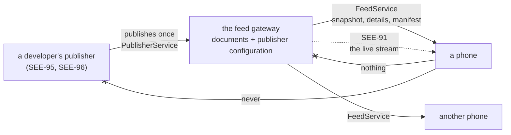

# The feed gateway (SEE-90, SEE-91, SEE-92)

SEE-88 made the kind of server part of a connection's record, and left `FeedGateway` as the seam a
publisher's manifest arrives through. SEE-89 added the document a publisher broadcasts, and left
`ProposalFeed` as the seam it arrives through. Both said the same thing: the gateway is SEE-90.

This is it: a Go service in [`feed-gateway/`](../../feed-gateway), with an authenticated publisher API
and a read-only public-feed API. SEE-130 retired its former invitation/device API. This page is why
the public gateway is shaped the way it is;
[`docs/guides/server-development.md`](../guides/server-development.md) is what a developer does with
it, in order.

**It is not `gateway/`.** That directory is one owner's private deployment — Caddy in front of their
own sidecar (SAW-035), run by the owner, serving one paired phone. This is a shared service, run by
whoever hosts the broadcast, serving everyone. Where the two could be confused this page says
"feed gateway" and "reverse proxy".

## What it is for

A publisher has one thing to say and no idea who is listening. Without something in the middle it
would have to keep a connection to every phone, learn which ones exist, and be reachable whenever
any of them woke up; and a phone would have to trust a developer's server with the fact that it is
interested. The gateway removes all of that from both sides:



The publisher never learns that a phone exists. The phone never contacts the publisher. And what
each owner decides — the parameters they chose, whether they went ahead, what came of it — never
leaves the device that decided it (SEE-89). The gateway is the only party in the middle, and the
most it knows is which channel someone asked about.

## The two APIs

Separate services, on separate listeners, with credentials matched to each role:

| | Publisher API | Public-feed API |
| --- | --- | --- |
| Contract | [`publish.proto`](../../proto/seekervault/gateway/v1/publish.proto) | [`feed.proto`](../../proto/seekervault/gateway/v1/feed.proto) |
| Who calls it | A developer's backend | Every feed subscriber |
| Credential | Bearer credential scoped to one server | None: a feed is a broadcast |
| What it can do | Publish and cancel feed documents | Read public manifests and feed requests |
| Where it listens | `BROADCAST_PUBLISHER_ADDRESS` | `BROADCAST_READ_ADDRESS` |

Two sockets rather than one service with a check per method make the separation survive routing
mistakes. The publisher listener has no subscriber operation and the public read listener has no
mutation. A boundary test holds both directions of that separation and requires every retired RPC
and onboarding path to return 404
([`boundary_test.go`](../../feed-gateway/internal/gateway/boundary_test.go)).

SAC has no publisher service client. It is generated only for the public-feed contract it calls.

## What a publisher may say

Everything in a document is the publisher's own, and three things are not up to it. The rules are in
[`internal/rules`](../../feed-gateway/internal/rules), as pure functions, and each is the phone's own
rule applied one hop earlier — `proposals/ProposalValidation.kt` and `servers/ManifestValidation.kt`
apply the same ones to the same documents, because neither side trusts the other.

**Its own server, and its own channel.** The credential says which server the caller publishes as,
and every document is checked against that rather than against what the document claims. A channel
is `server/<server_id>` for the document's own server, so a publisher cannot name another's;
`CancelProposal` has no channel field at all, because there is nothing for it to say.

**A gateway feed, never a direct server.** A published manifest must be
`CONNECTION_MODE_GATEWAY_FEED`, name this gateway's own origin, and name the caller's own channel.
A direct manifest carries a URL, and
relaying one would let a server hand phones an address of its choosing. The phone would refuse it,
but the gateway does not rely on that: it refuses to hold one.

**A revision it can order.** Zero is never published, and neither is anything above 2⁶³−1: the phone
reads a revision into a signed 64-bit integer and refuses one it cannot compare, so a publisher
learns about the limit here rather than by watching every phone ignore its proposal.

Everything else is bounded the way the contract says: at most 32 named terms of at most 512 bytes, a
note of at most 1024, a name of at most 64, at most 16 plugin requirements, an explicit environment,
and times that agree with each other.

**An environment that does not move (SEE-97).** A higher revision may change anything a publisher
may change — the plugins it needs, the name it calls itself — but not the environments it serves
(`other_environment`). A promise a higher revision can raise is not a promise: every subscribed
phone caches a manifest by revision, so one document would move all of them from a demonstration to
real money without anybody looking at it. A second environment is a second deployment, with its own
server ID, credential and database, which is the same rule the publisher's own database stamp keeps
at its end ([environments.md](environments.md)).

### What cannot pass through

The gateway **rebuilds every document from the fields it validated** rather than storing what
arrived. That is what makes an unknown field unable to reach a subscriber: protobuf keeps what it
cannot parse, and a field 99 carrying an address would otherwise be relayed to every phone on the
channel and written to disk on the way. A test publishes exactly that and checks the bytes that come
back out.

Over JSON the answer is louder: the codec is strict, so a field the contract does not have is
refused rather than ignored. A client that believed the gateway kept execution records would get 200
and silence from the permissive default, and would go on believing it.

## A revision is the idempotency key

A publisher's revision is its promise about its content, so it is the only key a retry needs:

| A publication arrives | The gateway |
| --- | --- |
| at a new identity | stores it, and notifies |
| at the revision it holds, with the same content | answers `unchanged`. Nothing is written, and nothing is notified: a retry is not an event |
| at the revision it holds, with different content | refuses it as a conflict, and says which revision it holds |
| at a lower revision | refuses it as stale. A retry that arrives late must not restore terms the publisher has moved past |
| at a higher revision | stores it, and notifies |
| with a creation time that moved | refuses it: that is a different proposal under the same ID |
| for a proposal that was withdrawn | refuses it. A withdrawal is final |

That last one matters downstream rather than here. A phone keeps its record of a proposal it acted
on for ever, and must never be shown the same identity as something open again (SEE-89) — so a
publisher with something else to propose publishes another proposal, which is another identity.

**Withdrawing** takes an ID and a revision rather than a document, so a publisher that no longer
holds what it published can still withdraw it. The gateway keeps every other field exactly as
published and writes two: the status, and the update time, because the withdrawal happened here.
That update time is the only field of a proposal the gateway ever writes, and nothing orders by it —
ordering is the revision's job on both sides.

## Persist first, fan out second

A publication is two things that must not be one: the document is committed, and then subscribers
are told. There is no way to make that atomic — one is a database transaction, the other is a
message to another system — so the only question is which failure a crash between them leaves.

The gateway commits the notice **in the same transaction as the document**
([`internal/storage`](../../feed-gateway/internal/storage)), and a drainer sends it
([`internal/dispatch`](../../feed-gateway/internal/dispatch)). So:

- a crash before the commit leaves nothing: the publication was never accepted;
- a crash after it leaves a notice that has not gone out, which the next start finds and sends;
- a fan-out that fails is kept and retried with backoff, never dropped.

Which makes delivery **at-least-once**, and says so rather than implying otherwise. A subscriber may
be told twice about the same document; the phone's apply path is idempotent and revision-ordered
precisely because delivery is not trustworthy about repetition (SEE-89). What cannot happen is a
second *logical* proposal: identity is (channel, proposal ID), and a repeat is the same document
arriving again.

Two publications that have not gone out yet **collapse into the later one**. What a subscriber wants
is the document as it stands, not the story of how it got there — the same coalescing the private
workflow's push invalidations already do under one collapse key (SAW-056). A notice is deleted only
if the revision it was sent at is still the current one, so a publication that lands mid-flight is
sent afterwards rather than silently swallowed.

**What it fans out to** is whatever implements `dispatch.Dispatcher`. Since SEE-91 that is
Centrifugo ([the stream](#the-stream)), and since SEE-92 the push relay beside it
([the push relay](#the-push-relay)) — a deployment may configure either, both or neither, and one
that configures neither keeps the dispatcher that writes a log line. Every guarantee above holds in
all four cases. The two are not equals in one respect: the broker carries the document and may
defer a notice, while the relay carries a hint and never does.

## The stream

A phone that is being looked at should not have to poll a feed to find out that a proposal moved.
So a publication is fanned out as well as stored: the gateway commits the document, and a broker
delivers it to the phones listening.

**Centrifugo v6.9.6, with Redis 8** as the engine, and both pinned
(`docs/development/toolchain.md`). Redis is what makes two broker nodes one broker — a publication
accepted by either reaches the clients attached to both — and where the bounded recovery cache
lives. It is a cache and never the authority: the documents are the gateway's, in its own database.

### The transport, and what it cannot do

The phone listens over Centrifugo's **unidirectional gRPC** transport: one call, a request up,
publications down, and nothing up again. Everything below was established by running the pinned
release rather than read off a page, because the design turns on it.

- **A listener cannot subscribe itself.** The connect request has a `subs` map that looks like a
  subscription request and is not one: the broker reads only a *recovery position* from it, and
  takes the channels from the connection token. A request naming channels there is answered with a
  connection and no subscriptions at all.
- **So the gateway grants the channels.** `FeedService.GetStreamTicket` takes the channels a phone
  holds feed references for and answers with a short-lived ticket admitting a listener to the ones
  this gateway hosts. The ticket is the whole subscription: adding or removing a feed means a new
  ticket and a new stream, which is why the phone debounces that (`feeds/ForegroundFeedManager`).
- **The ticket says which channels and nothing about who.** Its subject is empty — an anonymous
  connection, which is what a broadcast's listener is — and there is no device identifier, no
  address and no session in it. The gateway keeps no record of having minted one. A Go test pins the
  claim set, so adding one is a deliberate act with an argument attached.
- **A token-granted channel bypasses the anonymous-subscribe permission**, so the broker's own
  `allow_subscribe_for_anonymous` stays off, no bidirectional transport is enabled, and the ticket
  is the only way in. `channel_regex` would not help here — it constrains client-initiated
  subscriptions, which this transport does not have — so it is not configured, and the ticket's own
  validation against registered publishers is the bound that exists.
- **There are no application-level pings.** The connect answer carries a ping interval and the
  pinned release does not honour it on this transport: an idle stream is silent for as long as it is
  idle. Liveness is therefore HTTP/2's, through OkHttp's protocol pings, rather than a heartbeat the
  application invents.
- **The disconnect code carries the retry policy, and the `reconnect` field beside it does not.** A
  graceful shutdown arrives as `3001` with `reconnect: false`, which is plainly something to come
  back from. The documented rule is the range: `3500`–`3505` are terminal, everything below
  reconnects, and `3005` (expired) and `3014` (state invalidated) reconnect with a fresh ticket.
- **Payloads are binary, and the consequence is written down here.** A publication carries a
  serialized `seekervault.gateway.v1.FeedEvent` in the API's `b64data` field. protobuf-lite on
  Android cannot parse protojson at all, so JSON was never an option for the phone — and the price
  is that the broker's **JSON history API cannot render these channels** (it answers 500 on binary
  payloads). `POST /api/history` with `"limit": 0` still answers the channel's epoch and offset,
  which is the supported way to ask whether a channel has advanced.

### The envelope

`FeedEvent` is ours rather than the broker's: a channel sequence and a `oneof` of the manifest or
the proposal, rebuilt by the gateway from the fields it validated. A phone parses one type and runs
what is inside through the same validators a read goes through (SEE-88, SEE-89) — **the stream is a
faster way to learn something, never a more trusted one.** An event of a kind a client does not know
is not read as an empty document: it reads the snapshot instead, because an event it could not
understand still means the channel moved.

Two counters travel alongside each other and are never compared:

| | what it is | what it is for |
| --- | --- | --- |
| `FeedEvent.sequence` | the gateway's count of accepted publications on the channel | the snapshot boundary a walk reports |
| the broker's `offset` and `epoch` | a position in the broker's own bounded history | asking for what was missed, once, at connect time |

And neither of them decides which document wins: the revision does, on both sides.

### Recovery, and what happens when it cannot be proven

Recovery happens **once, at the moment the stream opens**, because that is the only moment a
unidirectional client can ask for anything. The phone sends the cursor it holds per channel; the
broker answers, per channel, whether it replayed everything that was missed.

- `recovered: true` — continuity is proven. The missed documents arrive as ordinary events right
  after the opening, and nothing is read from the gateway.
- anything else — continuity is not proven, and the phone reads the **authoritative snapshot**. The
  reasons are kept apart because they mean different things: nothing held, an epoch that changed
  (the history was replaced, so an offset in it means nothing), further behind than the broker keeps
  or will replay at once (`history_size`, `history_ttl`,
  `client.recovery_max_publication_limit`), a channel that is not recoverable, or a channel the
  stream opened without.

A successful recovery echoes the *requested* offset in the subscribe answer, so the new cursor is
the offset of the last document actually applied — not that field. A phone that read its position
from there would go backwards on every reconnect.

### Joining the snapshot to the stream

The order is: open the stream, then read what could not be proven, applying everything as it
arrives. There is **no buffer between them, and none is needed**: both paths apply through the
phone's revision-ordered idempotent apply (SEE-89), which refuses a document that is not newer than
what is held. A page from the middle of a walk and an event that arrives during that walk converge
whichever order they land in — so "could a publication fall into a gap?" is answered by the
documents themselves rather than by the client being careful.

What the sequence is for, then, is the next time: a completed walk's boundary is stored, and a
gateway that has not moved since answers it with one small `unchanged`.

### Bounds, and what each one protects

| bound | value | what it is for |
| --- | --- | --- |
| channels per ticket | 32 (`BROADCAST_MAX_CHANNELS`) | what one listener may cost the broker to honour |
| channels per connection | 32 (`client.channel_limit`) | the same rule at the broker's end |
| ticket lifetime | 60 minutes (`BROADCAST_TICKET_MINUTES`) | a bound on a grant; expiry is an ordinary reconnect |
| recovery cache | 256 publications or 1 hour per channel | how far behind a listener can be and still be caught up |
| replay in one go | 300 publications (`recovery_max_publication_limit`) | past it recovery fails rather than truncating |
| queued bytes per connection | 64 KiB (`client.queue_max_size`) | the broker closes a client whose queue grows past it |
| document size | 64 KiB | one publication, at both ends |

Two honest notes about the last two. The queue bound protects the **broker**: a client that stops
reading its socket is buffered by the transport's own flow-control window first, and a non-reading
gRPC client was measured surviving several megabytes with the queue set to 256 KiB — which is why
the shipped number is 64 KiB instead. And it does not protect a **phone** that falls behind: our
client keeps reading the stream however slowly the application consumes it, so what bounds a slow
phone is the gateway's publish rate limit per publisher, not the broker's queue. What was verified
either way is that a listener which cannot keep up does not hold up the listeners beside it. Both
measurements are in [`docs/testing/stage-7-1.md`](../testing/stage-7-1.md).

**Each listener still costs a connection** on a broker node. Redis makes the nodes interchangeable,
not free.

**Every bound in that table was driven under load for SEE-99**, and two of them turned out to be the
ones that decide a deployment's shape. The queue bound behaves exactly as described above — a
listener that stops reading is closed as `slow` once there is enough traffic to fill the window in
front of it, and the listeners beside it lose nothing. The one that surprised: the **read rate limit
is per address**, and a deployment behind a proxy counts a phone by its forwarded address, so four
hundred phones behind one office address share one bucket and most of them cannot get a stream
ticket at all. The measurements, the topology and what stopped the climb are in
[`docs/testing/see-99.md`](../testing/see-99.md), and `pnpm test:load` is how to run them again.

### Deployment

The broker's API port, its Redis and the gateway's own two listeners are on an internal compose
network with no route out of the deployment. The single public path is one gRPC procedure:

```
/centrifugal.centrifugo.unistream.CentrifugoUniStream/Consume
```

Caddy forwards exactly that, as h2c, to the broker — on **the gateway's own origin**, which is the
only address a phone ever learns and the one a published manifest has to name (SEE-88). A ticket
names no host for that reason: SEE-90 refused to relay a redirection, and a ticket that carried an
address would have reintroduced one.

To run a second broker node, add a service with the same configuration and give the proxy both
upstreams (`reverse_proxy h2c://centrifugo:11000 h2c://centrifugo-b:11000`). Nothing else changes:
Redis is what makes the two one broker, and a phone connected to either receives the same
publications. That property is tested against two real nodes in
`feeds/CentrifugoStreamIntegrationTest`.

Two secrets live in `.env`, shared by the gateway and the broker: the API key the gateway publishes
with, and the HMAC key a ticket is signed with. Rotating them restarts two services and ends every
listener's stream; each one reconnects, asks for a new ticket, and carries on.

## The push relay

The stream reaches a phone that is being looked at. A phone in a pocket, with the app not running,
is reached by one message through Firebase — and by as little of one as a message can be.

**What is sent, in full:**

```json
{ "kind": "feed_invalidation", "version": "1" }
```

That is the whole payload. No proposal, no revision, no sequence, no publisher, and nothing that
identifies a subscriber — a topic message is the same for everyone who receives it, so there is
nothing in it that could be about one of them. **Which feed changed is the topic it arrived on**,
which is a routing field rather than payload: the same line SAW-056 drew for the private path's own
invalidations, where the target is how a message finds a device and never something the device
reads.

The phone matches that map whole. A message with a third field in it, or a version it does not
know, is ignored rather than partly trusted — and then nothing acts on it directly anyway: a hint
schedules one bounded read of the feeds this phone holds, over the gateway's unary API, through the
same validators a snapshot goes through (`sync/FeedSynchronization.kt`). A forged, replayed or
delayed hint can therefore cause a read and nothing else.

### The topic, and why the gateway names it

`feed.<environment>.<server_id>`, derived from the channel in a committed publication.

The phone does **not** derive it. It asks (`FeedService.GetFeedTopics`), because a name that both
sides worked out for themselves would be a mismatch that shows up as silence rather than as an
error — the relay sends, Firebase delivers, and the phone is subscribed to something else. It is a
separate method from the stream ticket on purpose: a deployment may relay without streaming or
stream without relaying, and a phone asking about one must not be answered about the other. A
gateway that relays nothing answers `NO_PUSH`, which the phone reads the way it reads `NO_STREAM`.

The environment is the deployment's own setting, and it is in the name so that one Firebase project
can serve a sandbox deployment and a production one without a sandbox publication waking a
production subscriber. It is not SEE-97's environment model: nothing here decides what a server
promises when the owner approves, and the two words happening to be the same is a coincidence of
vocabulary ([environments.md](environments.md#two-other-things-called-environment)).

**A topic is public and grants nothing.** What it admits someone to is the news that a broadcast
changed, and the broadcast is readable by anyone who holds its reference. It is not proof of access
to anything, and nothing in this build treats it as one.

### What a publisher is never given

The credential, and any way to choose a topic.

The Firebase service account belongs to the deployment. It is a file mounted read-only into the
gateway's container and nothing else (`deploy/feed/compose.push.yaml`), read once at startup, and no
part of it appears in an answer, an error or a log line. A publisher publishes to the gateway, as it
always did, and the gateway is what holds this — which is the whole reason the relay is here rather
than in each publisher's own deployment.

A topic is derived from the channel in a notice, and a notice is written by the gateway inside the
transaction that stored the document, from the server ID the credential resolved to. There is no
field anywhere a publisher could put a topic in, and a publication claiming another publisher's
channel is refused at the door (`GATEWAY_PROBLEM_FOREIGN_CHANNEL`). Revoking a publisher's
credential therefore stops its hints, because it stops its publications.

### Bounds, and what a hint is not

| Bound | Value | What it protects |
| --- | --- | --- |
| Hints per topic | 0.1/s, burst 5 (`BROADCAST_PUSH_RATE`, `BROADCAST_PUSH_BURST`) | Every subscriber's battery. Above it a hint is **dropped**, not queued |
| Collapse key | one, for every feed | A phone that was offline wakes once and reads every feed it holds |
| Time to live | 5 minutes | A hint older than that has been overtaken by the read the owner's next glance runs |
| Priority | high for a proposal, normal for settings | A proposal can expire while nobody is looking; a settings change cannot |

Two honest notes:

- **It is not a delivery guarantee, and not a schedule.** Firebase decides when a topic message
  arrives, Android decides when a background job runs, and a force-stopped app receives nothing at
  all until the owner opens it again (`docs/guides/firebase.md`). What the app relies on instead is
  the foreground stream and the read it runs when it comes back.
- **A dropped hint loses no document.** The publication is stored, the stream carried it, and the
  next hint — or the owner's next glance — reads the whole feed. What is lost is a wake-up, and the
  quota's whole purpose is to lose some of them.

The relay never fails a notice. A hint that could defer the outbox would mean the broker
re-publishing documents it had already delivered for as long as somebody else's service was down,
so every failure here is logged and swallowed: the outbox's meaning stays "the document was fanned
out".

### Membership

Firebase owns it. The phone subscribes when the owner adds a feed and unsubscribes when they remove
one, and **nothing anywhere keeps a list**: not in the gateway (it is never told whether anybody
joined), and not on the phone's disk (the connection list is the truth, and the subscriptions are
derived from it every time).

That leaves one gap and it is the honest one to leave: a feed removed while the app was not running
leaves a subscription behind. The cure is the hint itself — one that arrives on a topic no feed
wants is unsubscribed from, so a stale subscription removes itself the first time it costs anything
(`push/FeedTopicManager.kt`).

## Reading a feed

The unary reads all derive their answer from the store at the moment they are asked.
No session, no subscription record, no count of who read what — a test reads the database after
several reads and requires every row count to be unchanged.

**Version-aware.** `GetServerManifest` takes the revision the caller holds and answers `unchanged`
rather than re-sending the document; primary `ListRequests` (and compatibility `ListProposals`)
takes the snapshot sequence the caller holds
and answers `unchanged` when the channel has not moved. Both are in the contract rather than in an
HTTP header, because a proxy deciding how long a feed stays current would be a second opinion about
what a publisher is proposing, and the phone would have no way to tell it was reading one. Read
answers carry `Cache-Control: no-store`.

### The snapshot boundary

A page is ordered by proposal ID, and a walk continues after the last ID it returned. An offset would
skip or repeat documents as the feed moved, and a sequence would move a document between pages every
time it was republished; an identity does not change for as long as the proposal exists.

Every page of one walk reports the same `snapshot_sequence`: the channel's count of accepted
publications when the walk began. What a completed walk holds is therefore exactly this, and it is
the documented boundary:

- every proposal that existed at that sequence and still exists at the end of the walk, **some
  possibly at a newer revision** than they had then;
- plus any published during the walk that sort after the page the walk had reached.

It is not a transaction, and nothing is lost by that. A phone applies a document only over an older
revision of itself, so a page set from mixed moments converges; anything missed is picked up by the
next read. It is also what lets SEE-91 join a snapshot to a stream: buffer the events that arrive
during a walk, apply them after it, and the result is the current state whichever order they landed
in.

**A reconnecting client needs no live stream.** A full walk is the recovery path, and the sequence
tells it whether it needed one.

### Retention

A proposal is served until its own expiry plus the retention window (`BROADCAST_RETENTION_HOURS`,
a week by default), and then the gateway stops keeping it.

Expiry is the one clock everybody agrees on, so it is the one retention uses — including for a
withdrawn proposal, which keeps its own expiry and stays readable until then. That is deliberate: a
phone that was switched off for two days should learn that a proposal was **withdrawn** rather than
simply failing to find it, because "the publisher took this back" and "something went wrong" are
different things to show an owner.

Nothing on a phone is deleted by retention. A proposal a phone holds is the phone's until the owner
removes the feed (SEE-89); retention is only about how long the gateway keeps answering for one.

## Registering a publisher

There is no administrative API, no account system and no invitation flow. Registering a publisher is
the one act that grants the ability to publish, and it has no network surface at all: the operator
runs [`feed-gatewayctl`](../../feed-gateway/cmd/feed-gatewayctl) on the host that holds the database, and the
gateway itself has no method that could add a publisher however a request were authenticated.

```sh
docker compose run --rm ctl register --server 3f1b2c4d-5e6f-4a7b-8c9d-0e1f2a3b4c5d --label "copy trading"
docker compose run --rm ctl rotate --server 3f1b2c4d-5e6f-4a7b-8c9d-0e1f2a3b4c5d
docker compose run --rm ctl revoke --credential d7baec00
```

A credential is 32 random bytes, shown once, and stored only as its SHA-256 — the same thing the
sidecar does with a phone's credential (SAW-011). Losing one means rotating it, not recovering it.
Rotation is two steps so it needs no outage: add the new credential, deploy it, revoke the old one,
and both work in between. Revoking every credential leaves the publisher registered and unable to
publish, because its documents are not a reason to forget it; `forget` is the separate, louder act
that removes a publisher and everything it published.

The answer to an unauthenticated call says nothing about which way it failed. No credential, a
credential that was never issued, and a revoked one all get the same refusal: a caller learns that it
may not publish, and never whether the thing it presented used to work.

## Rate limits and bounds

A token bucket per caller, with the clock injected so the behaviour is a test rather than a wait:
per publisher for publications, per address for reads. A limiter remembers at most 16384 callers and
forgets the ones that have gone quiet; when it is full and none has, it refuses — a gateway would
rather be briefly unavailable to a new caller than spend its memory on whoever asks for the most of
it.

The read limit is a backstop. A reverse proxy sees a client before the gateway does and is where a
serious limit belongs; in the deployment this ships with, Caddy is on the same host, so the gateway
counts the address Caddy forwards — trusted only because the connection came from loopback, which a
remote client cannot arrange.

Requests are bounded at 64 KiB, the same limit the sidecar and its proxy already enforce, and a page
at 200 proposals with a channel bound of 200 open at once. Nothing is evicted to make room: a
publisher at its bound is refused a new proposal and can still update and withdraw what it has,
which is how it gets back under it.

## Where it is kept

SQLite, one local file, one process
([`internal/storage/sqlite/store.go`](../../feed-gateway/internal/storage/sqlite/store.go)). Business
and delivery code depend on the focused interfaces in
[`internal/storage`](../../feed-gateway/internal/storage), while the SQLite package alone owns SQL,
schema migration, and transaction mechanics. That seam makes the dependency explicit; it does not
make the current file remotely deployable.

The store has one hard requirement — a publication and its notice must commit together — and a
single-file transactional database does that with nothing to operate. The driver is pure Go, so the
image carries no libc and the tests need no service. The load is bounded documents at human rates;
Postgres would be a second thing to run, back up and reason about, and if a deployment ever outgrows
one process the documents here are the authority either way: Centrifugo's and Redis's history
(SEE-91) is a recovery cache, never a source of truth.

The file must stay on local storage, not NFS or another network filesystem. A future remote SQL
implementation requires a new adapter, an explicit distributed consistency design, and an operator
data migration; changing a connection string is not a supported deployment mode.

Six tables: a publisher, its credential hashes, its manifest, its proposals, the channel's sequence,
and the outbox. **There is no table, and no column, for a subscriber** — no address, no chosen
quantity, no decision, nothing signed — and a boundary test reads the schema and fails if one
appears. The gateway cannot lose a user's financial history because it never has one.

### Migration and rollback

Schema version 3 is a one-way retirement of gateway-private routing. Opening a version-2 file runs
one transaction that removes manifests with the former numeric mode 3, then drops
`private_request`, `invitation`, and `device_binding` in foreign-key order, and finally stamps the
new version. Public publisher rows and credential hashes, feed manifest/proposal bytes and
revisions, channel sequences, and pending outbox notices remain unchanged. Reopening version 3 is
idempotent; a binary whose schema is older refuses a newer file rather than guessing.

Before upgrading, stop writers and back up the SQLite volume using the deployment's documented
volume backup procedure. Record the application commit with the backup. To roll back, stop the new
gateway, restore the complete version-2 database backup, then start the old binary. Do not run the
old binary against the migrated file, and do not reconstruct removed credentials or bindings from
logs. `TestVersionTwoMigrationRetiresOnlyPrivateStateAndIsIdempotent` verifies the migration fixture
and `TestAFileFromALaterVersionIsRefused` pins the rollback guard.

## What this build does and does not do

- **It serves the whole API**, and its own tests drive it over a real listener with the generated
  clients against a real database file.
- **It fans out to a real broker**, and the phone listens to it: the pair is tested against two
  Centrifugo nodes and a real Redis in `feeds/CentrifugoStreamIntegrationTest`, and the phone's own
  client and adapter are tested against real gRPC framing over TLS and HTTP/2 in
  `feeds/UniStreamInteropTest`. A deployment with no broker configured is a supported deployment: it
  answers every read and says once that there is no stream.
- **The cross-runtime fixtures cover the stream too.** `FeedEvent/settings`, `FeedEvent/proposal`
  and `FeedEvent/withdrawn` are taken from the gateway's own outbox by
  [`fixtures_test.go`](../../feed-gateway/internal/gateway/fixtures_test.go) and read back through the
  phone's validators by `GatewayProtocolFixturesTest`.
- **It relays hints through Firebase**, and the phone subscribes to them: what is sent is pinned by
  the relay's own tests, that Firebase accepts it is an opt-in test against a real project
  (`internal/relay/firebase_test.go`), and that a phone actually receives one is the device run in
  [`docs/testing/stage-7-1.md`](../testing/stage-7-1.md). A deployment with no relay is a supported
  deployment: it says once that no hints are sent here.
- **No screen lists a feed yet.** The listener applies what arrives through the repositories, the
  proposal alert opens the feed it is on, and the plugins that read a proposal's terms are SEE-93
  and SEE-94.
- **It has been measured under load, and the report says where it stopped** (SEE-99). `pnpm
  test:load` drives this gateway, the pinned broker and real Redis with synthetic publishers and
  simulated phones whose client makes the app's own reconnect and continuity decisions; it drains a
  node, kills one, stops Redis, restarts the gateway, stalls a fifth of the listeners, floods a
  publisher, tries three ways into another publisher's channel, cuts every stream at once, and
  climbs toward ten thousand listeners. [`docs/testing/see-99.md`](../testing/see-99.md) is the
  report and [`docs/development/load.md`](../development/load.md) is the command. What it does not
  measure is stated there rather than implied: the proxy hop, a real phone, a real network, and
  anything about how long a push takes to arrive.
- **Nothing was run in Docker.** No daemon is reachable on the machine these checks ran on, so the
  compose and Caddy configurations were validated statically and every binary — the gateway, the
  broker, Redis — was run natively instead (`docs/changelog/2026-09-17.md`).
- Not a user-account platform, not an execution-result database, not an order processor, not a
  message broker of its own, and no financial endpoint of any kind.
