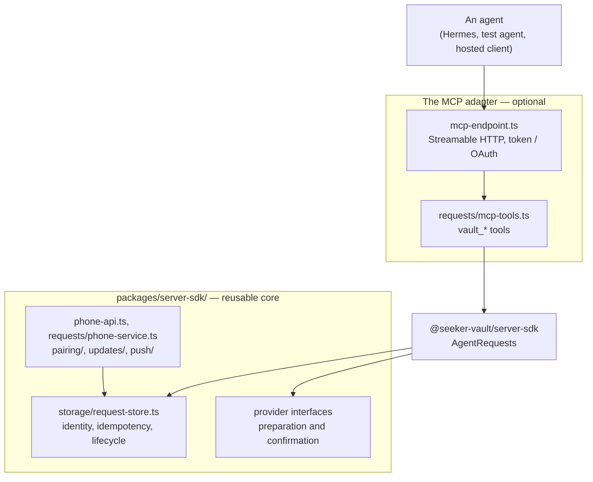

# The MCP adapter, and what it is not (SEE-87)

The Node application now packaged in `servers/mcp-server/` used to *be* its MCP endpoint: `MCP_TOKEN` was required to start, `/mcp` was always mounted, and the agent tools reached the request store, the transaction preparer and the confirmation tracker directly. SEE-87 makes MCP one **optional adapter** over a core that stands without it.

Nothing about the existing private agent workflow changed. A deployment that has never heard of `MCP_ENABLED` serves exactly what it served before, with the same tool names, the same contracts, the same errors, and the same result delivery.

## Two different kinds of server, and why the distinction matters

Stage 7.1 introduces Go components that publish shared proposals. They are not MCP servers, and they are not this sidecar.

| | **Node private-server adapter** (`servers/mcp-server/`) | **Go broadcast publisher templates** (SEE-95, SEE-96) |
| --- | --- | --- |
| What it is | The owner's own server, for their own agents | A developer's server, publishing to an audience |
| Who it talks to | One paired phone, over an authenticated credential | The shared gateway (SEE-90, SEE-91), once per proposal |
| How a request arrives | An agent calls an MCP tool on `/mcp` | The server submits a proposal to its own channel |
| Who sees it | Only the owner who paired | Every subscriber of that channel |
| Does it need MCP? | Only if `MCP_ENABLED` is on | **No.** Neither template speaks MCP, and neither needs to |
| Does it hold the connection? | Yes — the phone calls it directly (`direct` mode) | No — the gateway handles connections and fan-out (`gateway_feed`) |
| What it stores about the user | The request, its lifecycle, one FCM target | Nothing: no wallet, no amount, no decision, no outcome |

The two coexist. A phone can run a `direct` connection to a private sidecar and a `gateway_feed` connection to a broadcast publisher at the same time, and a private request is never converted into a broadcast one. `docs/architecture.md` has the whole picture.

**A developer writing a publisher template does not need Node, MCP, or this sidecar.** That is what making MCP optional is for: so "you need a server" stops meaning "you need to speak MCP".

## The boundary between the host and SDK



`AgentRequests` is exported from the package root and names the whole of what an adapter may ask
for. It is a short list on purpose: store, read, cancel and observe a request; answer an idempotent
retry; read the owner's wallet binding; and, only when the host supplied providers, check an asset
or observe what became of a submitted transaction.

What it deliberately does **not** do:

- **It decides nothing.** Idempotency, parameter validation, the lifecycle's allowed transitions, the pending limit, and result handling stay in `RequestStore`, `requests/lifecycle.ts` and `requests/action.ts`. An adapter cannot reach around them or relax them, and the `RequestFailure` it sees is the one the core raised — which is what keeps the agent-facing error codes the same whichever adapter is asking.
- **It authenticates nobody.** A credential belongs to the adapter that accepts it. `/mcp`'s token and OAuth checks live in `mcp-endpoint.ts` and nowhere else, and the phone's credential is still the only thing that reaches `RequestService`.
- **It exposes no store.** The explicitly opened SDK instance owns one database and one request
  engine; the adapter receives only the public facade, with no raw connection, credential or cache.
- **It is not a way in.** Exposing a new adapter means writing one, compiling it in, and giving it its own authentication. Nothing here loads code or accepts an adapter at runtime.

`servers/mcp-server/src/stage-boundary.test.ts` and `servers/mcp-server/src/sdk-boundary.test.ts` hold this: adapter files
may not name `RequestStore`, `TransactionPreparer` or `ConfirmationTracker`; production host files
may import only `@seeker-vault/server-sdk` or its documented `./protocol` export; nothing but
`server.ts` may compose the endpoint; and no second store/lifecycle implementation exists there.

## Turning it off

```bash
MCP_ENABLED=false pnpm dev:mcp-server
# or, for the portable deployment, set MCP_ENABLED=false in deploy/mcp/.env
```

- `/mcp` answers **404**, and so do both `/.well-known/oauth-protected-resource` paths. Not served rather than locked: a 401 would suggest that some credential would open one.
- **No MCP setting is required.** A leftover `MCP_TOKEN`, `MCP_ALLOWED_HOSTS` or `MCP_DEMO_TOOLS` is ignored, and the startup log names which ones — turning the adapter off should not force an operator to delete a token they may want back, but nothing is allowed to do nothing quietly.
- `MCP_OAUTH_*` is **refused** as a configuration error. The other settings can outlive the adapter; this one contradicts it, because the profile publishes a public promise: metadata telling a client where to authorize for an endpoint that would not exist.
- A broken switch (`MCP_ENABLED=off`) is a configuration error and leaves the adapter **on**, so a typo can never silently remove the endpoint.

What is unchanged, and covered by tests in both modes: pairing and its one-use code, the phone credential and what it may reach, the request store and every request's identity, the lifecycle and its transitions, `PrepareRequest`/`SubmitResult`, production updates, FCM registration and invalidations, the Stage 1 diagnostic and its own token, `/healthz`, startup, and shutdown.

With this particular host, turning the adapter off leaves no configured request producer, so its
phone sees an empty inbox. An independent TypeScript backend can instead embed the same SDK and call
the public request API directly; that needs no MCP endpoint.

## What this is not

- Not a new protocol, and not a replacement for MCP. The tools, their names, their arguments and their results are exactly as they were (`docs/protocol.md`, `docs/development/mcp-server.md#the-mcp-tools`).
- Not a plugin marketplace, and not a runtime extension point. Compare `docs/wiki/client-plugins.md`, which is the *phone's* plugin boundary for actions — a different boundary, on a different side, for a different purpose.
- Not a rewrite of the Node sidecar in Go, and not a migration of private agent traffic to the shared gateway. Both are explicitly out of scope.
- Not a new mandatory service: the switch changes the adapter inside the same direct server. The
  canonical container remains the single-service `deploy/mcp/compose.yaml` project; its optional
  `deploy/ingress/direct/` edge is separately managed and the feed gateway is unrelated.
