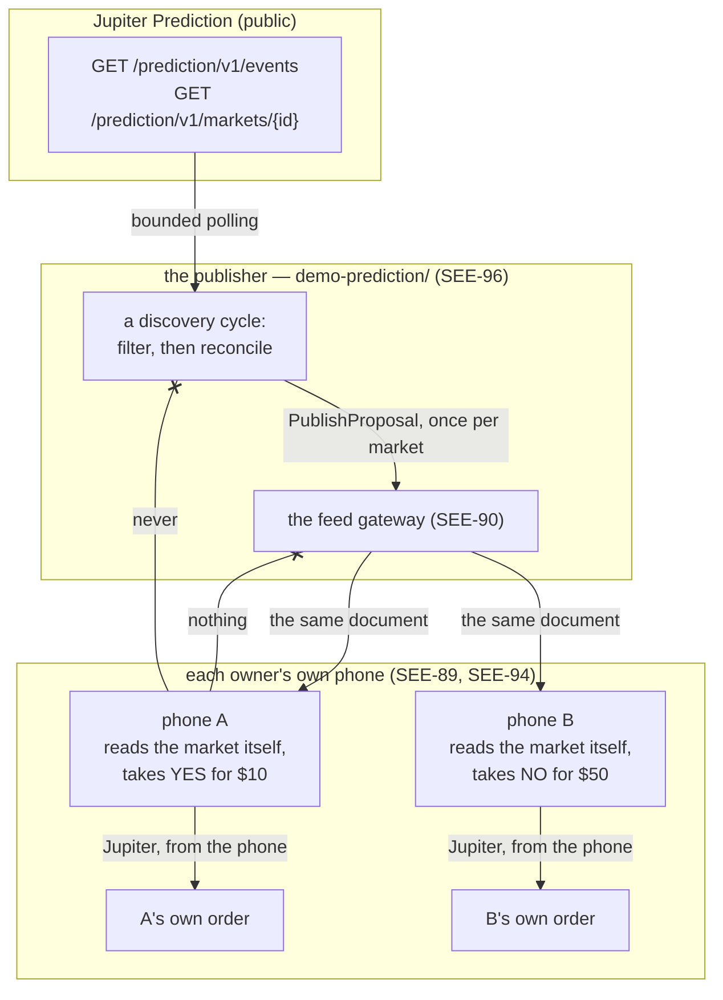

# The Prediction publisher template (SEE-96)

The second publisher template, built on the same shared library as the first: a Go service in
[`demo-prediction/`](../../demo-prediction) that **discovers** Jupiter Prediction markets, applies
the filters its operator configured, and publishes one proposal per market that matches. Every
subscribed phone reads the same document; each owner then chooses a side and a stake on their own
device and places the order through the bundled `jupiter.prediction` plugin (SEE-94). To deploy one
rather than understand it, follow
[`docs/guides/server-development.md`](../guides/server-development.md).

**There is no model in it.** No YES/NO recommendation, no probability of its own, no personalised
selection, no order placed on the server, no position watched, no settlement and no payout. A signal
says *this market exists, it is open until this instant, and I am following it*. Which way to go, and
for how much, is the owner's judgement — made against the market's own state as their phone reads it
at the moment they look.

## One library, two templates

|  | `cmd/copytrading` (SEE-95) | **`cmd/prediction` (SEE-96)** |
| --- | --- | --- |
| Kind | `signals.Swap` → `jupiter.swap` | **`signals.Prediction` → `jupiter.prediction`** |
| Who writes the signals | a trader, a script, a strategy engine | **the template itself, from a provider's listing** |
| Its API | create, update, cancel, read | **read only for callers; the three writing endpoints answer 403. Operators may `GET /v1/discovery/markets` and `POST /v1/discovery/select` (SEE-138)** |
| Reads anything outside | no | **yes: the provider's public listing** |
| Holds | signals, and what the gateway confirmed | **the same, plus the markets it is tracking** |

`cmd/prediction-admin` (SEE-138) is a password-gated HTML client of that API: it lists the signals
already on the feed, searches the provider listing with typed filters, and asks discovery to publish
a named market. Callers still cannot `POST /v1/requests`. Side and stake stay on the phone.

Everything else is shared, and deliberately: the configuration, the store, the outbox, the drainer,
the manifest and the API are [`publisher-support/`](../../publisher-support), a source library that
is deployed nowhere itself, and a template is a `main` — in its own Go module, in its own image
since SEE-134 — that registers one kind and says who writes its signals. Neither can be turned into
the other by configuration, and each module's own boundary test fails if its main stops saying
which it is ([`demo-prediction`](../../demo-prediction/internal/boundary/boundary_test.go),
[`demo-copytrading`](../../demo-copytrading/internal/boundary/boundary_test.go)).

## Where publication ends, and execution begins



Publication ends at the arrow into the gateway. The template never learns that phone A exists, which
side it took, what it staked, whether it approved, or what became of the position — and it has
nowhere to put any of that if it were told (see [security.md](../security.md)).

The two arrows out of the provider are the only things this template reads, and both are public
information: which markets exist, and what one market currently is. The provider's own endpoints for
orders, positions, history and profiles are not in this module at all.

## What a signal says

The terms are `jupiter.prediction`'s, in
[`PredictionTerms.kt`](../../android/app/src/main/java/io/github/brrenat/seekervault/jupiter/PredictionTerms.kt)
and [`prediction.go`](../../publisher-support/signals/prediction.go), and the contract is in
[protocol.md](../protocol.md#a-prediction-markets-terms-see-94):

| Term | What this template publishes |
| --- | --- |
| `market_id` | the provider's own identifier, exactly as it spelled it |
| `event_id` | the event the market belongs to, which the plugin cross-checks |
| `provider` | the venue (`polymarket`, `kalshi`, `bisonfi`), cross-checked the same way |
| `deposit_mint` | the token a stake is deposited in: JupUSD or USDC, and nothing else |
| `deposit_decimals` | its own decimals, which cannot change and are therefore not a claim |
| `deposit_symbol` | a label the phone shows beside the mint, never instead of it |
| `least_deposit` | never below the provider's own five-dollar minimum, whatever an operator set |
| `most_deposit` | the publisher's ceiling, or absent for none |

**There is no side, and no field that could carry an opinion.** A term this kind does not know is
refused rather than carried, so `side`, `is_yes`, `confidence` and `recommendation` cannot be
published even by a modified deployment without changing the kind — and the phone would ignore them
if they were.

The **note** is the publisher's own prose, shown as theirs. This template writes one line of it
itself: where the market came from, what the provider calls it, when it closes, and that the market's
own state is read on the owner's phone. An operator's `PREDICTION_NOTE` goes above that. Nothing
volatile is in it — no price, no volume, no implied probability — because a note that moved with the
price would move the document, and wake every subscribed phone, every time the price moved.

## The filters, and what they mean

Two filters are the provider's own parameters, because they decide which events its listing returns
at all. Everything else is applied here, to the records that came back, and only to fields those
records carry.

| Setting | Where it is applied | Exactly what it means |
| --- | --- | --- |
| `PREDICTION_SOURCE` | the provider (`provider=`) | the venue whose markets it aggregates: `polymarket` (default), `kalshi`, `bisonfi` |
| `PREDICTION_CATEGORIES` | the provider (`category=`) | one listing walk per bucket; empty means one walk with no bucket. `all` matches every bucket |
| `PREDICTION_FILTER` | the provider (`filter=`) | its own named filters: `new` (created in the last 24 hours), `live` (begun), `trending` (recent trade activity), `upcoming` (not begun) |
| `PREDICTION_TAGS` | here | the event's own tags, compared **whole** and case-insensitively. A tag is a token the provider assigns (`nfl`, `fed-rates`), so half of one is not a match. Any one matching is enough |
| `PREDICTION_KEYWORDS` | here | a **case-insensitive substring** of the event's title, bucket, subcategory and tags together with the market's own title. Any one matching is enough. A substring deliberately: `eth` finds "Ethereum", and it also finds "Bethesda" |
| `PREDICTION_STATE` | here | `open` (default): only markets the provider would take an order for. `any`: also closed, cancelled and settled ones — **sandbox only** |
| `PREDICTION_LEAST_CLOSE_IN_MINUTES` / `PREDICTION_MOST_CLOSE_IN_MINUTES` | here | the market's own close time has to be that far away, inclusive at both edges. A market with **no** close time cannot be judged against a window, so it is skipped whenever one is set |
| `PREDICTION_MOST_OPEN` | here | how many proposals to hold open at once. When more markets match, the ones published are the ones **closing soonest** |

Three rules are not filters and are not configurable, because a market that broke one is a market no
phone could act on:

- the market's identifier has to be one the phone can read (a bounded token, never a URL);
- the event has to be one the provider still lists as active;
- the terms have to satisfy the kind — which is where a deployment naming a deposit token the
  provider does not take is caught, once, with the term named in the log.

Every market a cycle considered and did not publish is **counted by reason**, and the counts are in
the cycle: `GET /v1/discovery` answers "my filters match nothing and I do not know which one did it"
without reading a log.

```console
$ publishctl discovery | jq '.last_cycle.skipped_because'
{
  "closes_too_late": 41,
  "no_keyword": 96,
  "not_tradeable": 12
}
```

## Reconciliation: what keeps a proposal in step with its market

A cycle reads the listing, then asks about the markets it is tracking that the listing did not carry.

| What the source says | What happens to the proposal |
| --- | --- |
| the market is in the listing and unchanged | nothing at all: no revision, no publication, no phone woken |
| its close time, title or bucket moved | the statement moves, the revision moves once, and every subscriber re-reads it |
| a matching market is not tracked yet | a proposal is published for it, unless the ceiling is reached |
| it is **missing from the listing** | it is asked about directly, and only the answer decides |
| …and the provider says closed, cancelled or settled | the proposal is withdrawn |
| …and the provider has no such market | the proposal is withdrawn |
| …and the provider says it is still open | **nothing happens.** It left a filter, not the market |
| …and the provider cannot be reached | **nothing happens**, and the cycle is recorded as partial |
| the market closed and later re-opened | a **new** proposal, at the next generation |

**Absence is not closure.** A market missing from a filtered listing may have closed, or may simply
have stopped trending, moved out of the close-time window, or fallen off the pages a cycle read. A
template that withdrew on absence would take back statements for reasons no subscriber can see, and a
`trending` market that drifts in and out would publish and withdraw itself for ever.

**A filter is discovery, not withdrawal.** A market that no longer matches but is still open keeps
its proposal until the source itself ends it, or until it expires.

**An outage withdraws nothing.** This is the rule the direct check exists for: if the provider is
down, rate limiting, or refusing this deployment's key, nothing is concluded about any market. The
cycle is `partial`, it says which problem it ran into, and the next one tries again.

**A withdrawal is final.** A phone that acted on a proposal keeps its own record either way, so a
re-opened market gets a new proposal rather than a revived one. The market row's *generation* is what
makes that new proposal's idempotency key different from the withdrawn one's.

## Nothing is announced twice

Three things together, and each of them is a different failure it prevents:

- **The expiry is the market's own close time**, never `now + something`. An expiry derived from the
  clock would change on every cycle, which would move the revision, which would wake every phone
  every few minutes. For a market the provider gives no close time at all, the expiry is counted from
  when this template *first saw* it — which is stored, and therefore just as stable.
- **The idempotency key is derived**, `market:<venue>:<id>:<generation>`. A cycle interrupted between
  reading the listing and storing a signal leaves nothing behind, and the next cycle derives the same
  key: a market cannot become two proposals, whatever happened in between. The schema says the same
  thing a second way — the market row's proposal is `UNIQUE`.
- **The document is its own outbox.** Every signal carries the revision it is at and the revision the
  gateway has confirmed; a retry sends identical bytes, which the gateway answers `UNCHANGED`. A
  restart finds the same two numbers and the same markets, and publishes nothing new.

## The source links are kept, and never published

The document carries the provider's market and event identifiers, which is what lets the phone look
the market up for itself. The link to the provider's own page is kept in the template's own row and
shown in its own API — and nowhere else.

That is not fussiness: a URL a publisher chose, arriving on somebody's phone, is exactly what the
manifest rules exist to prevent ([server-manifests.md](server-manifests.md)). The phone reads the
market from the provider it already trusts for this plugin, at the moment the owner looks, so a link
in the document would add nothing it could believe.

## The API is read-only, and says so

This template's signals are its own, so `POST /v1/requests`, `PUT /v1/requests/{id}` and
`POST /v1/requests/{id}/cancel` answer **403 `written_by_discovery`** with a sentence pointing at the
filters. A caller's signal would be undone by the next cycle, and "my signal disappeared three days
later" is a worse answer than "no".

What it does serve:

| Endpoint | What it is for |
| --- | --- |
| `GET /v1/status` | who this publisher is, whether anything is unpublished, and the last cycle |
| `GET /v1/manifest` | the manifest and the feed reference, as published |
| `GET /v1/requests`, `GET /v1/requests/{id}` | the common requests, and what the gateway confirmed |
| `GET /v1/discovery` | the filters in force, the last cycle, and every market tracked with its source link |
| `POST /v1/discovery/poll` | run a cycle **now** rather than at the next interval |
| `POST /v1/requests/{id}/retry` | try a refused publication again — an operator's, not an author's |

`publishctl` is the same client it always was: `status`, `list`, `show`, `retry`, plus `discovery`
and `poll`. Its `create`, `update` and `cancel` get the 403, which is the honest answer.

## Polling, because there is nothing to subscribe to

The provider's prediction API is REST. Its published schema has no stream, no webhook and no
subscription of any kind; the only "live" things in it are a `live` listing filter and score
endpoints for sports events. That was checked against the published OpenAPI document on 2026-09-17,
and it is why this template polls — with bounds rather than enthusiasm:

| | Default | Why |
| --- | --- | --- |
| `PREDICTION_POLL_SECONDS` | 300 | a market's close time moves rarely; a person reads a feed rarely |
| `PREDICTION_PAGE_SIZE` | 25 | the provider answers up to 100 per call and refuses more |
| `PREDICTION_MOST_PAGES` | 4 | one hundred events per bucket per cycle |
| `PREDICTION_MOST_CHECKS` | 20 | the direct checks are a round robin, oldest first |
| `PREDICTION_CALL_GAP_MS` | 2100 | the keyless allowance is one call every two seconds |

The gap is enforced in the provider client rather than in its callers, because the way to exceed an
allowance is to have two places that each think they are the only one calling. A rate limit is
treated as an answer: the walk stops, the cycle is partial, and the next one starts again.

**The provider's API is in beta**, by its own documentation ("subject to breaking changes"). What
that means here is that a field this template cannot read is a market it skips, with a line in the
log naming it — never a crash, and never a proposal built from half an answer. The shapes it is
written against are committed as real captured answers in
[`demo-prediction/internal/jupiter/testdata`](../../demo-prediction/internal/jupiter/testdata), and
an opt-in test reads the live provider to notice when they change
([development/demos.md](../development/demos.md)).

## Sandbox and production

The environment is the publisher's half of the configuration and works exactly as it does for the
other template: one deployment serves one environment, and the database is stamped with it, so a
copied compose file pointed at an existing volume is refused at startup. A sandbox deployment
discovers the same live markets from the same provider — nothing about a publisher is simulated,
because nothing about a publisher executes anything. What changes is what a phone does with what it
publishes (SEE-97, [environments.md](environments.md)), and `demo-prediction/.env.example` is a
sandbox for that reason.

One filter has a rule about it attached: **`PREDICTION_STATE=any` is refused in production.**
Publishing markets the provider will not take an order for is a deliberate sandbox exercise — the
phone reads the market itself and refuses a closed one, whichever environment it is in — and the way
it reaches production is a copied `.env`.

## A complete example

The gateway's operator registers this publisher and gives its owner a credential. Then, in
`demo-prediction/`:

```console
$ cp .env.example .env
$ $EDITOR .env
```

```dotenv
PUBLISHER_SERVER_ID=3f1b2c4d-5e6f-4a7b-8c9d-0e1f2a3b4c5d
PUBLISHER_GATEWAY_URL=https://feeds.example.com
PUBLISHER_ENVIRONMENT=sandbox
BROADCAST_CREDENTIAL=…                # what the gateway's operator printed once
PUBLISHER_API_TOKEN=…                 # openssl rand -base64 32
PUBLISHER_DISPLAY_NAME=Macro markets

PREDICTION_CATEGORIES=economics,crypto
PREDICTION_KEYWORDS=fed,cpi,bitcoin
PREDICTION_MOST_CLOSE_IN_MINUTES=20160   # a fortnight
PREDICTION_MOST_OPEN=10
PREDICTION_NOTE=Markets I follow. Not advice.
```

```console
$ docker compose up -d --build
$ docker compose logs -f prediction
{"msg":"publishing as this server","channel":"server/3f1b2c4d-…","markets":0,"pending":0}
{"msg":"looking for markets","provider":"https://lite-api.jup.ag","filters":{…}}
seekervault://feed?v=1&gateway=https%3A%2F%2Ffeeds.example.com&server=3f1b2c4d-…
{"msg":"the manifest is published","revision":1,"status":"stored"}
{"msg":"a market is published","market":"POLY-2589813","signal":"1a2b3c4d-…"}
{"msg":"a discovery cycle finished","cycle":1,"outcome":"ok","considered":149,"matched":7,"created":7}
```

That `seekervault://feed?…` line is the reference. It carries no secret — a feed is a broadcast, and
holding a reference grants nothing — so it can go in a README, a QR code or a message. Each owner
adds it, approves the connection on their own phone, and the feed appears.

From here the two phones do the same thing and share nothing:

1. Both see **the same proposal**: a market, an event, a deposit token, a floor, a ceiling and a
   note.
2. Each phone asks **the provider itself** what that market currently is — open or not, what the two
   sides cost, what the rules say, when it settles — and shows that beside the publisher's words.
3. Each owner picks a side and an amount, on their own device, and approves it there.
4. Each phone builds its own order through `jupiter.prediction`, signs it with its own key, and
   submits it itself (SEE-94).

Nothing in steps 2 to 4 reaches this template or the gateway. What the publisher knows, for ever, is
what it published.

When the source ends the market, the next cycle notices — from the listing or from the direct check
— and withdraws the proposal. Phones that already acted keep their own records; nothing new is
executed from a cancelled proposal.

## What this build does and does not do

It publishes discovered markets and stops. There is, deliberately:

- **no recommendation**: no model, no probability of its own, no ranking by anything but close time,
  and no field a side could be published in;
- **no order placement, no fills, no positions, no settlement, no payouts** — every one of those is
  an owner's own phone talking to the provider, and this template has no endpoint for any of them;
- **no personalisation**: every subscriber gets byte-identical documents, because the template does
  not know who they are;
- **no wallet, no amount, no decision, no execution result and no Firebase credential**, in the
  store, in the API or in the configuration;
- **no second path in**: the reconciler and the store are the only writers, and the API cannot be
  talked into being one.

Related: [copytrading-template.md](copytrading-template.md) ·
[jupiter-prediction.md](jupiter-prediction.md) · [feed-gateway.md](feed-gateway.md) ·
[integrations/jupiter.md](../integrations/jupiter.md) ·
[integrations/signal-api.md](../integrations/signal-api.md) ·
[development/demos.md](../development/demos.md)
